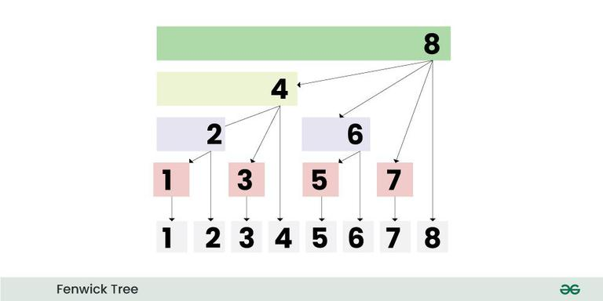

# Fenwick Tree (Binary Indexed Tree) for Competitive Programming
Fenwick Tree or Binary Indexed Tree is a data structure used to calculate range queries along with updating the elements of the array, such that each query or update takes logarithmic time complexity. It is used to calculate prefix sums or running total of values up to any [[index]].

Whenever we have range queries along with updating the elements of the array such that the number of range queries are comparable to the number of updates in the array, then we can perform both of these operations in logarithmic time using Fenwick Trees.

Let 's say, we are given an array of size N and Q queries of two types:

- Type 1, where we are given two integers L and R and we need to calculate the sum of elements in range L to R.
- Type 2, where we are given two integers I and X and we need to update the element at [[index]] I to X.

Now, we can solve the question using the following approaches:

- Brute Force: For every query of Type 1, we run a loop from L to R and calculate the sum and whenever we encounter a query of type 2, we simply update the element at that [[index]]. Each Type 2 operation is done in O(1) time but each Type 1 operation can take O(N) time in worst case. So, the overall time complexity will be O(Q * N), which is very costly. This approach is only beneficial when the number of updates are very large as compared to the number of range queries.
- Precomputation Techniques: We can maintain a 2-D matrix of size N*N and store the range sum of every possible range in the matrix. Now, every query of type 1 can be done in O(1) time but every type 2 query can take O(N*N) time in worst case. So, the overall time complexity will be O(Q * N * N), which is also very costly. This approach is only beneficial when the number of updates are very less as compared to the number of range queries.
- Fenwick Trees or Binary Indexed Trees(BIT): Using Fenwick trees, we can guarantee a log(N) time for both the type of queries. So, the time complexity will be O(q * log(N)). This approach is beneficial if the number of range queries and updates are comparable to each other.

Note: We can also use [[segment-tree|Segment Tree]] and solve both updates and range queries in logarithmic time but its faster to implement Fenwick trees as compared to Segment trees as Fenwick trees are easy to build and query and require very less time to code. Also, Fenwick Tree require less space as compared to [[segment-tree|Segment Tree]].

## Idea behind Fenwick Trees:



Consider Fenwick tree as an array F[] with 1-based indexing, such that every [[index]] of array stores Partial Sum of range. For simplicity, assume the size of F[] to be 16. Now, if we have queries to calculate the range sum in an array. So, for any [[index]] i, F[i] will store the sum of values from [[index]] j+1 to i, such that j = i - (rightmost set bit of i). Refer to the below table to understand the range of values:

| Value of i | Binary Representation | Rightmost set bit of i | Value of j | Partial Sum Range [start, end] |
| --- | --- | --- | --- | --- |
| 0 | 0000 | 0000 | 0000 | - |
| 1 | 0001 | 0001 | 0000 | [1, 1] |
| 2 | 0010 | 0010 | 0000 | [1, 2] |
| 3 | 0011 | 0001 | 0010 | [3, 3] |
| 4 | 0100 | 0100 | 0000 | [1, 4] |
| 5 | 0101 | 0001 | 0100 | [5, 5] |
| 6 | 0110 | 0010 | 0100 | [5, 6] |
| 7 | 0111 | 0001 | 0110 | [7, 7] |
| 8 | 1000 | 1000 | 0000 | [1, 8] |
| 9 | 1001 | 0001 | 1000 | [9, 9] |
| 10 | 1010 | 0010 | 1000 | [9, 10] |
| 11 | 1011 | 0001 | 1010 | [11, 11] |
| 12 | 1100 | 0100 | 1000 | [9, 12] |
| 13 | 1101 | 0001 | 1100 | [13, 13] |
| 14 | 1110 | 0010 | 1100 | [13, 14] |
| 15 | 1111 | 0001 | 1110 | [15, 15] |

Value of i

Binary Representation

Rightmost set bit of i

Value of j

Partial Sum Range [start, end]

0000

0000

0000

0001

0001

0000

[1, 1]

0010

0010

0000

[1, 2]

0011

0001

0010

[3, 3]

0100

0100

0000

[1, 4]

0101

0001

0100

[5, 5]

0110

0010

0100

[5, 6]

0111

0001

0110

[7, 7]

1000

1000

0000

[1, 8]

1001

0001

1000

[9, 9]

1010

0010

1000

[9, 10]

1011

0001

1010

[11, 11]

1100

0100

1000

[9, 12]

1101

0001

1100

[13, 13]

1110

0010

1100

[13, 14]

1111

0001

1110

[15, 15]

So, from the above table we can see that each [[index]] of Fenwick tree F[] stores the sum of range. Now, if we need to calculate the prefix sum till 7th element, then instead of iterating from 1 to 7 and calculating the sum, we can take the sum of F[7] + F[6] + F[4]. Similarly, to calculate the prefix sum till 13th element, we can take the sum of F[13] + F[12] + F[8] to get the prefix sum. So, in other words if we want to calculate the prefix sum till ith element, we can add elements of array F[] present at indices which are obtained by removing the last set bit of i, one by one.

> Prefix Sum till 7th element = F[7] + F[6] + F[4],7 --remove right most set bit --> 6 --remove right most set bit --> 4 --remove right most set bit --> 0Prefix Sum till 13th element = F[13] + F[12] + F[8],13 --remove right most set bit --> 12 --remove right most set bit --> 8 --remove right most set bit --> 0

Prefix Sum till 7th element = F[7] + F[6] + F[4],7 --remove right most set bit --> 6 --remove right most set bit --> 4 --remove right most set bit --> 0

Prefix Sum till 13th element = F[13] + F[12] + F[8],13 --remove right most set bit --> 12 --remove right most set bit --> 8 --remove right most set bit --> 0

Now, in order to calculate the range sum of [L, R], we can simply subtract the prefix sum till [L-1] from prefix sum till R.

## Fenwick Tree Implementation for Range Queries and Updates:

Since, we are storing Partial Sums of range in the Fenwick Tree F[], then updating an element at [[index]] i in the original array should reflect in all those indices of F[] which have [[index]] i in their partial sum range. For eg: if we want to update the element at [[index]] 5 in the original array, then it should reflect in F[5], F[6] and F[8] because F[5] stores the partial sum of range [5, 5], F[6] stores the partial sum of range [5, 6] and F[8] stores the partial sum of range [1, 8] and 5 lies in the range of all of them.

> Add X to 5th [[index]], means adding X to F[5], F[6] and F[8],5 --add right most set bit --> 6 --add right most set bit --> 8 -- add right most set bit --> 16 (out of range)Add X to 9th [[index]], means adding X to F[9], F[10] and F[12],9 --add right most set bit --> 10 --add right most set bit --> 12 --add right most set bit --> 16 (out of range)

Add X to 5th [[index]], means adding X to F[5], F[6] and F[8],5 --add right most set bit --> 6 --add right most set bit --> 8 -- add right most set bit --> 16 (out of range)

Add X to 9th [[index]], means adding X to F[9], F[10] and F[12],9 --add right most set bit --> 10 --add right most set bit --> 12 --add right most set bit --> 16 (out of range)

In both of the above operations, we need to add or subtract the right most set bit. We can use the following formula to find the right most set bit,

> Right most set bit of X = (X & (2's complement of X)) = (X & (-X)), where & is the Bitwise AND operator

Right most set bit of X = (X & (2's complement of X)) = (X & (-X)), where & is the Bitwise AND operator

Implementation:

```
# include <bits/stdc++.h>
using namespace std;

// Method to calculate prefix sum till index idx
int sum(int idx, vector<int>& F)
{
    int runningSum = 0;
    // Summing up all the partial sums
    while (idx > 0) {
        runningSum += F[idx];
        int rightMostSetBit = (idx & (-idx));
        idx -= rightMostSetBit;
    }
    return runningSum;
}

// Method to update the array by adding X to index idx
void add(int idx, int X, vector<int>& F)
{
    while (idx < F.size()) {
        F[idx] += X;
        int rightMostSetBit = (idx & (-idx));
        idx += rightMostSetBit;
    }
}

// Method to calculate range sum from index l to r
int rangeQuery(int l, int r, vector<int>& F)
{
    return sum(r, F) - sum(l - 1, F);
}

int main()
{
    int n = 5;

    // 1 - based indexing
    vector<int> arr{ -1e9, 1, 2, 3, 4, 5 };
    // Initially all the values of Fenwick tree are 0
    vector<int> F(n + 1, 0);

    // Build the fenwick tree
    for (int i = 1; i <= n; i++) {
        add(i, arr[i], F);
    }

    // query the sum from index 1 to 3
    cout << rangeQuery(1, 3, F) << "\n";
    // query the sum from index 2 to 5
    cout << rangeQuery(2, 5, F) << "\n";

    // Update element at index i to X
    int i = 3;
    int X = 7;
    // We have passed X - arr[i] to the add method, because
    // add method simply adds a number at a particular index
    // so if we need to update the element, we need to pass
    // the difference between the ith element and X to add
    // method
    add(i, X - arr[i], F);

    // query the sum from index 1 to 3
    cout << rangeQuery(1, 3, F) << "\n";
    // query the sum from 2 to 5
    cout << rangeQuery(2, 5, F) << "\n";

    return 0;
}

```

```
import java.util.*;

public class FenwickTree {

    // Method to calculate prefix sum till index idx
    static int sum(int idx, List<Integer> F) {
        int runningSum = 0;
        // Summing up all the partial sums
        while (idx > 0) {
            runningSum += F.get(idx);
            int rightMostSetBit = (idx & (-idx));
            idx -= rightMostSetBit;
        }
        return runningSum;
    }

    // Method to update the array by adding X to index idx
    static void add(int idx, int X, List<Integer> F) {
        while (idx < F.size()) {
            F.set(idx, F.get(idx) + X);
            int rightMostSetBit = (idx & (-idx));
            idx += rightMostSetBit;
        }
    }

    // Method to calculate range sum from index l to r
    static int rangeQuery(int l, int r, List<Integer> F) {
        return sum(r, F) - sum(l - 1, F);
    }

    public static void main(String[] args) {
        int n = 5;

        // 1 - based indexing
        List<Integer> arr = Arrays.asList(-1000000000, 1, 2, 3, 4, 5);
        // Initially all the values of Fenwick tree are 0
        List<Integer> F = new ArrayList<>(Collections.nCopies(n + 1, 0));

        // Build the fenwick tree
        for (int i = 1; i <= n; i++) {
            add(i, arr.get(i), F);
        }

        // query the sum from index 1 to 3
        System.out.println(rangeQuery(1, 3, F));
        // query the sum from index 2 to 5
        System.out.println(rangeQuery(2, 5, F));

        // Update element at index i to X
        int i = 3;
        int X = 7;
        // We have passed X - arr[i] to the add method because
        // the add method simply adds a number at a particular index.
        // If we need to update the element, we need to pass
        // the difference between the ith element and X to the add
        // method.
        add(i, X - arr.get(i), F);

        // query the sum from index 1 to 3
        System.out.println(rangeQuery(1, 3, F));
        // query the sum from 2 to 5
        System.out.println(rangeQuery(2, 5, F));
    }
}

```

```
def sum(idx, F):
    running_sum = 0
    while idx > 0:
        running_sum += F[idx]
        right_most_set_bit = (idx & -idx)
        idx -= right_most_set_bit
    return running_sum

def add(idx, X, F):
    while idx < len(F):
        F[idx] += X
        right_most_set_bit = (idx & -idx)
        idx += right_most_set_bit

def range_query(l, r, F):
    return sum(r, F) - sum(l - 1, F)

def main():
    n = 5

    # 1-based indexing
    arr = [-1e9, 1, 2, 3, 4, 5]
    # Initially, all the values of Fenwick tree are 0
    F = [0] * (n + 1)

    # Build the Fenwick tree
    for i in range(1, n + 1):
        add(i, arr[i], F)

    # Query the sum from index 1 to 3
    print(range_query(1, 3, F))
    # Query the sum from index 2 to 5
    print(range_query(2, 5, F))

    # Update element at index i to X
    i = 3
    X = 7
    # We have passed X - arr[i] to the add method because
    # the add method simply adds a number at a particular index.
    # If we need to update the element, we need to pass
    # the difference between the ith element and X to the add
    # method.
    add(i, X - arr[i], F)

    # Query the sum from index 1 to 3
    print(range_query(1, 3, F))
    # Query the sum from 2 to 5
    print(range_query(2, 5, F))

if __name__ == "__main__":
    main()

```

```
using System;
using System.Collections.Generic;

class FenwickTree
{
    // Method to calculate prefix sum till index idx
    static int Sum(int idx, List<int> F)
    {
        int runningSum = 0;
        // Summing up all the partial sums
        while (idx > 0)
        {
            runningSum += F[idx];
            int rightMostSetBit = (idx & (-idx));
            idx -= rightMostSetBit;
        }
        return runningSum;
    }

    // Method to update the array by adding X to index idx
    static void Add(int idx, int X, List<int> F)
    {
        while (idx < F.Count)
        {
            F[idx] += X;
            int rightMostSetBit = (idx & (-idx));
            idx += rightMostSetBit;
        }
    }

    // Method to calculate range sum from index l to r
    static int RangeQuery(int l, int r, List<int> F)
    {
        return Sum(r, F) - Sum(l - 1, F);
    }

    static void Main()
    {
        int n = 5;

        // 1 - based indexing
        List<int> arr = new List<int> { int.MinValue, 1, 2, 3, 4, 5 };
        // Initially all the values of Fenwick tree are 0
        List<int> F = new List<int>(new int[n + 1]);

        // Build the Fenwick tree
        for (int i = 1; i <= n; i++)
        {
            Add(i, arr[i], F);
        }

        // Query the sum from index 1 to 3
        Console.WriteLine("Query 1: " + RangeQuery(1, 3, F));
        // Query the sum from index 2 to 5
        Console.WriteLine("Query 2: " + RangeQuery(2, 5, F));

        // Update element at index i to X
        int updateIndex = 3;
        int updateValue = 7;
        // We have passed X - arr[i] to the Add method because
        // Add method simply adds a number at a particular index
        // so if we need to update the element, we need to pass
        // the difference between the ith element and X to Add
        // method
        Add(updateIndex, updateValue - arr[updateIndex], F);

        // Query the sum from index 1 to 3
        Console.WriteLine("Query 3: " + RangeQuery(1, 3, F));
        // Query the sum from index 2 to 5
        Console.WriteLine("Query 4: " + RangeQuery(2, 5, F));
    }
}
//This code is contributed by Kishan

```

```
// Method to calculate prefix sum till index idx
function sum(idx, F) {
    let runningSum = 0;
    // Summing up all the partial sums
    while (idx > 0) {
        runningSum += F[idx];
        let rightMostSetBit = idx & -idx;
        idx -= rightMostSetBit;
    }
    return runningSum;
}

// Method to update the array by adding X to index idx
function add(idx, X, F) {
    while (idx < F.length) {
        F[idx] += X;
        let rightMostSetBit = idx & -idx;
        idx += rightMostSetBit;
    }
}

// Method to calculate range sum from index l to r
function rangeQuery(l, r, F) {
    return sum(r, F) - sum(l - 1, F);
}

function main() {
    let n = 5;

    // 1 - based indexing
    let arr = [-1e9, 1, 2, 3, 4, 5];
    // Initially all the values of Fenwick tree are 0
    let F = new Array(n + 1).fill(0);

    // Build the fenwick tree
    for (let i = 1; i <= n; i++) {
        add(i, arr[i], F);
    }

    // query the sum from index 1 to 3
    console.log(rangeQuery(1, 3, F));
    // query the sum from index 2 to 5
    console.log(rangeQuery(2, 5, F));

    // Update element at index i to X
    let indexToUpdate = 3;
    let X = 7;
    // We have passed X - arr[indexToUpdate] to the add method because
    // add method simply adds a number at a particular index
    // so if we need to update the element, we need to pass
    // the difference between the indexToUpdate element and X to add
    // method
    add(indexToUpdate, X - arr[indexToUpdate], F);

    // query the sum from index 1 to 3
    console.log(rangeQuery(1, 3, F));
    // query the sum from 2 to 5
    console.log(rangeQuery(2, 5, F));
}

main();

```

```
6
14
10
18

```

## Building the Fenwick Tree in Linear Time Complexity:

In the above approach, we are building the Fenwick tree by calling the add() method for all the elements so the overall complexity to build the tree becomes O(N * logN). We can further reduce the time to build the Fenwick tree from O(N * logN) to O(N). Note that for every [[index]] i, we are adding a[i] to F[i], F[i + (i & (-i))] and so on. Also, later in the loop we have to add a[i + (i & (-i))] to all these indices again (except [[index]] i). So, instead of doing the operation repeatedly, we can combine them in one operation for every [[index]]. For every [[index]] i, we can simply add a[i] to F[i] and add F[i] to F[i + (i & (-i))]. Adding F[i] to F[i + (i & (-i))] will work same as adding a[i] to F[i + (i & (-i))] and all other indices.

`void buildTree(vector<int> &arr, vector<int> &F, int n)
{
    for(int i=1; i<=n; i++)
    {
        F[i] += arr[i];
        if(i + (i & -i) <= n)
            F[i + (i & -i)] += F[i];
    }
}
`

```
void buildTree(vector<int> &arr, vector<int> &F, int n)
{
    for(int i=1; i<=n; i++)
    {
        F[i] += arr[i];
        if(i + (i & -i) <= n)
            F[i + (i & -i)] += F[i];
    }
}

```

## Fenwick Tree (Binary Indexed Tree) for multi-dimensional arrays:

For 2-D arrays, we can use the same idea as 1-D array. Here, instead of storing Partial Sums of range [l to r], we store the Partial Sum of submatrix [l1 to r1][l2 to r2]. Refer this article to explore further about 2-D Fenwick Tree.

Similarly, for 3-D array, we can store the Partial Sum of submatrix[l1 to r1][l2 to r2][l3 to r3]. Refer this article to explore further about 3-D Fenwick Tree.

## Use Cases of Fenwick Tree for Competitive Programming:

A Fenwick tree can support the following range operations:

1. Point Update and Range Query
2. Range Update and Point Query
3. Range Update and Range Query

### 1. Point Update and Range Query

In this type of query, we are required to find running values over a range [L, R] but the updates are limited to a single index. We have already covered this in the above implementation.

### 2. Range Update and Point Query

In this type of query, we are required to update values over a range [L, R] but the queries are limited to a single index. In this case, we perform the range updates and point queries in opposite manner as we did in Point Update and Range Query. We can update a range [L, R] with value X by making 2 point updates add(L, X) and add (R+1, -X), and if we want to query an element at index idx, we can simply take the prefix sum till idx to get our answer.

```
# include <bits/stdc++.h>
using namespace std;

// Method to calculate prefix sum till [[index]] idx
int sum(int idx, vector<int>& F)
{
    int runningSum = 0;
    // Summing up all the partial sums
    while (idx > 0) {
        runningSum += F[idx];
        int rightMostSetBit = (idx & (-idx));
        idx -= rightMostSetBit;
    }
    return runningSum;
}

// Method to update the array by adding X to [[index]] idx
void add(int idx, int X, vector<int>& F)
{
    while (idx < F.size()) {
        F[idx] += X;
        int rightMostSetBit = (idx & (-idx));
        idx += rightMostSetBit;
    }
}

// Method to fetch element at index idx
int pointQuery(int idx, vector<int>& F)
{
    return sum(idx, F);
}

// Add X to all elements in range [l, r]
void rangeUpdate(int l, int r, int X, vector<int> &F) {
    add(l, X, F);
    add(r + 1, -X, F);
}

int main()
{
    int n = 5;

    // 1 - based indexing
    vector<int> arr{ -1e9, 1, 2, 3, 4, 5 };

    // Initially all the values of Fenwick tree are 0
    vector<int> F(n + 1, 0);

    // Build the fenwick tree
    for (int i = 1; i <= n; i++) {
        rangeUpdate(i, i, arr[i], F);
    }

    // fetch the element at index 2
    cout << pointQuery(2, F) << "\n";
    // fetch the element at index 4
    cout << pointQuery(4, F) << "\n";

    // Add X to all the elements from l to r
    int l = 2, r = 4;
    int X = 7;

    rangeUpdate(l, r, X, F);

    // fetch the element at index 2
    cout << pointQuery(2, F) << "\n";
    // fetch the element at index 4
    cout << pointQuery(4, F) << "\n";

    return 0;
}

```

```
import java.util.Arrays;

public class FenwickTree {
    // Method to calculate prefix sum till index idx
    static int sum(int idx, int[] F) {
        int runningSum = 0;
        // Summing up all the partial sums
        while (idx > 0) {
            runningSum += F[idx];
            int rightMostSetBit = (idx & -idx);
            idx -= rightMostSetBit;
        }
        return runningSum;
    }

    // Method to update the array by adding X to [[index]] idx
    static void add(int idx, int X, int[] F) {
        while (idx < F.length) {
            F[idx] += X;
            int rightMostSetBit = (idx & -idx);
            idx += rightMostSetBit;
        }
    }

    // Method to fetch element at index idx
    static int pointQuery(int idx, int[] F) {
        return sum(idx, F);
    }

    // Add X to all elements in range [l, r]
    static void rangeUpdate(int l, int r, int X, int[] F) {
        add(l, X, F);
        add(r + 1, -X, F);
    }

    public static void main(String[] args) {
        int n = 5;

        // 1 - based indexing
        int[] arr = {-1_000_000_000, 1, 2, 3, 4, 5};

        // Initially all the values of Fenwick tree are 0
        int[] F = new int[n + 1];

        // Build the fenwick tree
        for (int i = 1; i <= n; i++) {
            rangeUpdate(i, i, arr[i], F);
        }

        // fetch the element at index 2
        System.out.println(pointQuery(2, F));
        // fetch the element at index 4
        System.out.println(pointQuery(4, F));

        // Add X to all the elements from l to r
        int l = 2, r = 4;
        int X = 7;

        rangeUpdate(l, r, X, F);

        // fetch the element at index 2
        System.out.println(pointQuery(2, F));
        // fetch the element at index 4
        System.out.println(pointQuery(4, F));
    }
}

```

```
def sum(idx, F):
    running_sum = 0
    while idx > 0:
        running_sum += F[idx]
        right_most_set_bit = (idx & -idx)
        idx -= right_most_set_bit
    return running_sum

def add(idx, X, F):
    while idx < len(F):
        F[idx] += X
        right_most_set_bit = (idx & -idx)
        idx += right_most_set_bit

def point_query(idx, F):
    return sum(idx, F)

def range_update(l, r, X, F):
    # Add X to the element at index l
    add(l, X, F)
    # Subtract X from the element at index (r + 1)
    add(r + 1, -X, F)

if __name__ == "__main__":
    n = 5
    arr = [-1e9, 1, 2, 3, 4, 5]

    # Initially, all the values of the Fenwick tree are 0
    F = [0] * (n + 1)

    # Build the Fenwick tree by performing range updates
    for i in range(1, n + 1):
        range_update(i, i, arr[i], F)

    # Fetch the element at index 2 using point query
    print("Element at index 2:", point_query(2, F))
    # Fetch the element at index 4 using point query
    print("Element at index 4:", point_query(4, F))

    # Add X to all the elements from index l to r
    l, r, X = 2, 4, 7
    range_update(l, r, X, F)

    # Fetch the updated element at index 2
    print("Updated element at index 2:", point_query(2, F))
    # Fetch the updated element at index 4
    print("Updated element at index 4:", point_query(4, F))

```

```
using System;

class FenwickTree
{
    // Method to calculate prefix sum till index idx
    static int Sum(int idx, int[] F)
    {
        int runningSum = 0;
        // Summing up all the partial sums
        while (idx > 0)
        {
            runningSum += F[idx];
            int rightMostSetBit = (idx & (-idx));
            idx -= rightMostSetBit;
        }
        return runningSum;
    }

    // Method to update the array by adding X to [[index]] idx
    static void Add(int idx, int X, int[] F)
    {
        while (idx < F.Length)
        {
            F[idx] += X;
            int rightMostSetBit = (idx & (-idx));
            idx += rightMostSetBit;
        }
    }

    // Method to fetch element at index idx
    static int PointQuery(int idx, int[] F)
    {
        return Sum(idx, F);
    }

    // Add X to all elements in range [l, r]
    static void RangeUpdate(int l, int r, int X, int[] F)
    {
        Add(l, X, F);
        Add(r + 1, -X, F);
    }

    static void Main()
    {
        int n = 5;

        // 1 - based indexing
        int[] arr = { -1000000000, 1, 2, 3, 4, 5 };

        // Initially all the values of Fenwick tree are 0
        int[] F = new int[n + 1];

        // Build the fenwick tree
        for (int i = 1; i <= n; i++)
        {
            RangeUpdate(i, i, arr[i], F);
        }

        // Fetch the element at index 2
        Console.WriteLine(PointQuery(2, F));
        // Fetch the element at index 4
        Console.WriteLine(PointQuery(4, F));

        // Add X to all the elements from l to r
        int l = 2, r = 4;
        int X = 7;

        RangeUpdate(l, r, X, F);

        // Fetch the element at index 2
        Console.WriteLine(PointQuery(2, F));
        // Fetch the element at index 4
        Console.WriteLine(PointQuery(4, F));
    }
}

```

```
// Function to calculate prefix sum till index idx
function sum(idx, F) {
    let runningSum = 0;
    // Summing up all the partial sums
    while (idx > 0) {
        runningSum += F[idx];
        let rightMostSetBit = (idx & -idx);
        idx -= rightMostSetBit;
    }
    return runningSum;
}

// Function to update the array by adding X to [[index]] idx
function add(idx, X, F) {
    while (idx < F.length) {
        F[idx] += X;
        let rightMostSetBit = (idx & -idx);
        idx += rightMostSetBit;
    }
}

// Function to fetch element at index idx
function pointQuery(idx, F) {
    return sum(idx, F);
}

// Function to add X to all elements in range [l, r]
function rangeUpdate(l, r, X, F) {
    add(l, X, F);
    add(r + 1, -X, F);
}

// Main function
function main() {
    let n = 5;

    // 1 - based indexing
    let arr = [-1_000_000_000, 1, 2, 3, 4, 5];

    // Initially all the values of Fenwick tree are 0
    let F = new Array(n + 1).fill(0);

    // Build the Fenwick tree
    for (let i = 1; i <= n; i++) {
        rangeUpdate(i, i, arr[i], F);
    }

    // fetch the element at index 2
    console.log(pointQuery(2, F));
    // fetch the element at index 4
    console.log(pointQuery(4, F));

    // Add X to all the elements from l to r
    let l = 2, r = 4;
    let X = 7;
    rangeUpdate(l, r, X, F);

    // fetch the element at index 2
    console.log(pointQuery(2, F));
    // fetch the element at index 4
    console.log(pointQuery(4, F));
}

// Call the main function
main();

```

```
2
4
9
11

```

### 3. Range Update and Range Query:

In this type of query, we are required to find running values and handle updates over range [L, R]. To handle range updates and range queries, we need to maintain two Fenwick trees, say F1[] and F2[].

#### 3.1 Handling Range Updates:

Initially, all the elements in arr[], F1[] and F2[] are zero. Now, if we want to increment a range [L, R] by a value X then we can use the same approach as we did in Range Update and Point Query. So, we can call add(F1, L, X) and add(F1, R+1, -X). But, after this we will also call add(F2, L, X * (L - 1)) and add(F2, R, -X * R). The reason behind calling these two additional calls will be clear when we will explore about handling Range Queries. So, whenever we need to add X to a range [L, R], we will do the following:

> add(F1, L, X)add(F1, R + 1, -X)add(F2, L, X * (L - 1))add(F2, R, -X * R)

add(F1, L, X)add(F1, R + 1, -X)add(F2, L, X * (L - 1))add(F2, R, -X * R)

Now, if we try to calculate prefix sum till any [[index]] i in F1[], that is sum(F1, 0, i), we will have one of the following cases:

- If i < L, then the prior increment will have no effect on it, so sum(F1, 0, i) = 0
- If L <= i <= R, then the prior increment will add X at index i, so sum(F1, 0, i) = X
- If i > R, then the prior increment will have no effect on it, so sum(F1, 0, i) = 0

Now, if we try to calculate prefix sum till any [[index]] i in F2[], that is sum(F2, 0, i), we will have one of the following cases:

- If i < L, then the prior increment will have no effect on it, so sum(F2, 0, i) = 0
- If L <= i <= R, then the prior increment will add X * (L - 1), so sum(F2, 0, i) = X * (L - 1)
- If i > R, then the prior increment will add X * (L - 1) + (-X * R), so sum(F2, 0, i) = X * (L - 1) - (X * R)

#### 3.2 Handling Range Queries:

Now, after incrementing the range [L, R] by a value X, we want to get the prefix sum till ith [[index]], then we will have one of the following cases:

- If i < L, then the prior increment will have no effect on the prefix sum till i, so sum[0, i] = 0
- If L <= i <= R, then the prefix sum till ith index will be equal to X * (i - L + 1), so sum[0, i] = (X * i) - (X * (L + 1))
- If R < i, then the prefix sum till ith index will be equal to X * (R - L + 1), so sum[0, i] = (X * R) - X * (L - 1)

So, if we observe carefully, for all the above 3 cases we can say that,

> sum[0, i] = (sum(F1, 0, i) * i) - sum(F2, 0, i)

sum[0, i] = (sum(F1, 0, i) * i) - sum(F2, 0, i)

This is why we made two additional calls while handing the range updates earlier as we wanted to have the additional terms to calculate the prefix sum till any [[index]] i. Since we can calculate the prefix sum till any [[index]], we can also calculate the range sum [L, R] by subtracting prefix sum till (L-1) from prefix sum till R.

Implementation of Range Update and Range Query using Fenwick Trees:

```
# include <bits/stdc++.h>
using namespace std;

// Method to calculate prefix sum till index idx
int sum(int idx, vector<int>& F)
{
    int runningSum = 0;
    // Summing up all the partial sums
    while (idx > 0) {
        runningSum += F[idx];
        int rightMostSetBit = (idx & (-idx));
        idx -= rightMostSetBit;
    }
    return runningSum;
}

// Method to update the array by adding X to index idx
void add(int idx, int X, vector<int>& F)
{
    while (idx < F.size()) {
        F[idx] += X;
        int rightMostSetBit = (idx & (-idx));
        idx += rightMostSetBit;
    }
}

// Method to calculate the prefix sum till ith index
int prefSum(int idx, vector<int> &F1, vector<int> &F2) {
    return sum(idx, F1) * idx - sum(idx, F2);
}

// Method to calculate sum of range [L, R]
int rangeQuery(int L, int R, vector<int>& F1, vector<int> &F2) {
    return prefSum(R, F1, F2) - prefSum(L - 1, F1, F2);
}

// Add X to all elements in range [l, r]
void rangeUpdate(int l, int r, int X, vector<int> &F1, vector<int> &F2) {
    add(l, X, F1);
    add(r + 1, -X, F1);
    add(l, X * (l - 1) , F2);
    add(r + 1, -(X * r), F2);
}

int main()
{
    int n = 5;

    // 1 - based indexing
    vector<int> arr{ -1e9, 1, 2, 3, 4, 5 };

    // Initially all the values of Fenwick trees are 0
    vector<int> F1(n + 1, 0), F2(n + 1, 0);

    // Build the fenwick tree
    for (int i = 1; i <= n; i++) {
        rangeUpdate(i, i, arr[i], F1, F2);
    }

    // Sum of elements from index 2 to 4
    cout << rangeQuery(2, 4, F1, F2) << "\n";
    // Sum of elements from index 1 to 5
    cout << rangeQuery(1, 5, F1, F2) << "\n";

    // Add X to all the elements from 2 to 4
    int l = 2, r = 4;
    int X = 7;

    rangeUpdate(l, r, X, F1, F2);

    // Sum of elements from index 2 to 4
    cout << rangeQuery(2, 4, F1, F2) << "\n";
    // Sum of elements from index 1 to 5
    cout << rangeQuery(1, 5, F1, F2) << "\n";

    return 0;
}

```

```
import java.util.*;

public class FenwickTree {

    // Method to calculate prefix sum till index idx
    static int sum(int idx, int[] F) {
        int runningSum = 0;
        // Summing up all the partial sums
        while (idx > 0) {
            runningSum += F[idx];
            int rightMostSetBit = (idx & (-idx));
            idx -= rightMostSetBit;
        }
        return runningSum;
    }

    // Method to update the array by adding X to index idx
    static void add(int idx, int X, int[] F) {
        while (idx < F.length) {
            F[idx] += X;
            int rightMostSetBit = (idx & (-idx));
            idx += rightMostSetBit;
        }
    }

    // Method to calculate the prefix sum till ith index
    static int prefSum(int idx, int[] F1, int[] F2) {
        return sum(idx, F1) * idx - sum(idx, F2);
    }

    // Method to calculate sum of range [L, R]
    static int rangeQuery(int L, int R, int[] F1, int[] F2) {
        return prefSum(R, F1, F2) - prefSum(L - 1, F1, F2);
    }

    // Add X to all elements in range [l, r]
    static void rangeUpdate(int l, int r, int X, int[] F1, int[] F2) {
        add(l, X, F1);
        add(r + 1, -X, F1);
        add(l, X * (l - 1), F2);
        add(r + 1, -(X * r), F2);
    }

    public static void main(String[] args) {
        int n = 5;

        // 1 - based indexing
        int[] arr = new int[]{Integer.MIN_VALUE, 1, 2, 3, 4, 5};

        // Initially all the values of Fenwick trees are 0
        int[] F1 = new int[n + 1];
        int[] F2 = new int[n + 1];

        // Build the fenwick tree
        for (int i = 1; i <= n; i++) {
            rangeUpdate(i, i, arr[i], F1, F2);
        }

        // Sum of elements from index 2 to 4
        System.out.println(rangeQuery(2, 4, F1, F2));
        // Sum of elements from index 1 to 5
        System.out.println(rangeQuery(1, 5, F1, F2));

        // Add X to all the elements from 2 to 4
        int l = 2, r = 4;
        int X = 7;

        rangeUpdate(l, r, X, F1, F2);

        // Sum of elements from index 2 to 4
        System.out.println(rangeQuery(2, 4, F1, F2));
        // Sum of elements from index 1 to 5
        System.out.println(rangeQuery(1, 5, F1, F2));
    }
}
//This code is contributed by Monu.

```

```
# Method to calculate prefix sum till index idx
def sum(idx, F):
    runningSum = 0
    # Summing up all the partial sums
    while idx > 0:
        runningSum += F[idx]
        rightMostSetBit = (idx & -idx)
        idx -= rightMostSetBit
    return runningSum

# Method to update the array by adding X to index idx
def add(idx, X, F):
    while idx < len(F):
        F[idx] += X
        rightMostSetBit = (idx & -idx)
        idx += rightMostSetBit

# Method to calculate the prefix sum till ith index
def prefSum(idx, F1, F2):
    return sum(idx, F1) * idx - sum(idx, F2)

# Method to calculate sum of range [L, R]
def rangeQuery(L, R, F1, F2):
    return prefSum(R, F1, F2) - prefSum(L - 1, F1, F2)

# Add X to all elements in range [l, r]
def rangeUpdate(l, r, X, F1, F2):
    add(l, X, F1)
    add(r + 1, -X, F1)
    add(l, X * (l - 1), F2)
    add(r + 1, -(X * r), F2)

if __name__ == "__main__":
    n = 5

    # 1 - based indexing
    arr = [-10**9, 1, 2, 3, 4, 5]

    # Initially all the values of Fenwick trees are 0
    F1 = [0] * (n + 1)
    F2 = [0] * (n + 1)

    # Build the fenwick tree
    for i in range(1, n + 1):
        rangeUpdate(i, i, arr[i], F1, F2)

    # Sum of elements from index 2 to 4
    print(rangeQuery(2, 4, F1, F2))
    # Sum of elements from index 1 to 5
    print(rangeQuery(1, 5, F1, F2))

    # Add X to all the elements from 2 to 4
    l, r = 2, 4
    X = 7
    rangeUpdate(l, r, X, F1, F2)

    # Sum of elements from index 2 to 4
    print(rangeQuery(2, 4, F1, F2))
    # Sum of elements from index 1 to 5
    print(rangeQuery(1, 5, F1, F2))
# this code is contributed by Monu.

```

```
using System;
using System.Collections.Generic;

public class FenwickTree {
    private List<int> F1, F2;

    public FenwickTree(int n) {
        F1 = new List<int>(new int[n + 1]);
        F2 = new List<int>(new int[n + 1]);
    }

    private int Sum(int idx, List<int> F) {
        int runningSum = 0;
        while (idx > 0) {
            runningSum += F[idx];
            idx -= idx & -idx;
        }
        return runningSum;
    }

    private void Add(int idx, int X, List<int> F) {
        while (idx < F.Count) {
            F[idx] += X;
            idx += idx & -idx;
        }
    }

    private int PrefSum(int idx, List<int> F1, List<int> F2) {
        return Sum(idx, F1) * idx - Sum(idx, F2);
    }

    public int RangeQuery(int L, int R) {
        return PrefSum(R, F1, F2) - PrefSum(L - 1, F1, F2);
    }

    public void RangeUpdate(int l, int r, int X) {
        Add(l, X, F1);
        Add(r + 1, -X, F1);
        Add(l, X * (l - 1), F2);
        Add(r + 1, -(X * r), F2);
    }
}

class MainClass {
    public static void Main(string[] args) {
        int n = 5;

        // 1-based indexing
        List<int> arr = new List<int> { -1000000000, 1, 2, 3, 4, 5 };

        FenwickTree fenwickTree = new FenwickTree(n);

        // Build the Fenwick tree
        for (int i = 1; i <= n; i++) {
            fenwickTree.RangeUpdate(i, i, arr[i]);
        }

        // Sum of elements from index 2 to 4
        Console.WriteLine(fenwickTree.RangeQuery(2, 4));
        // Sum of elements from index 1 to 5
        Console.WriteLine(fenwickTree.RangeQuery(1, 5));

        // Add X to all the elements from 2 to 4
        int l = 2, r = 4;
        int X = 7;

        fenwickTree.RangeUpdate(l, r, X);

        // Sum of elements from index 2 to 4
        Console.WriteLine(fenwickTree.RangeQuery(2, 4));
        // Sum of elements from index 1 to 5
        Console.WriteLine(fenwickTree.RangeQuery(1, 5));
    }
}
//This code is contributed by monu.

```

```
// Method to calculate prefix sum till index idx
function sum(idx, F) {
    let runningSum = 0;
    // Summing up all the partial sums
    while (idx > 0) {
        runningSum += F[idx];
        const rightMostSetBit = (idx & (-idx));
        idx -= rightMostSetBit;
    }
    return runningSum;
}

// Method to update the array by adding X to index idx
function add(idx, X, F) {
    while (idx < F.length) {
        F[idx] += X;
        const rightMostSetBit = (idx & (-idx));
        idx += rightMostSetBit;
    }
}

// Method to calculate the prefix sum till ith index
function prefSum(idx, F1, F2) {
    return sum(idx, F1) * idx - sum(idx, F2);
}

// Method to calculate sum of range [L, R]
function rangeQuery(L, R, F1, F2) {
    return prefSum(R, F1, F2) - prefSum(L - 1, F1, F2);
}

// Add X to all elements in range [l, r]
function rangeUpdate(l, r, X, F1, F2) {
    add(l, X, F1);
    add(r + 1, -X, F1);
    add(l, X * (l - 1), F2);
    add(r + 1, -(X * r), F2);
}

function main() {
    const n = 5;

    // 1 - based indexing
    const arr = [-1e9, 1, 2, 3, 4, 5];

    // Initially all the values of Fenwick trees are 0
    const F1 = new Array(n + 1).fill(0);
    const F2 = new Array(n + 1).fill(0);

    // Build the fenwick tree
    for (let i = 1; i <= n; i++) {
        rangeUpdate(i, i, arr[i], F1, F2);
    }

    // Sum of elements from index 2 to 4
    console.log(rangeQuery(2, 4, F1, F2));
    // Sum of elements from index 1 to 5
    console.log(rangeQuery(1, 5, F1, F2));

    // Add X to all the elements from 2 to 4
    const l = 2, r = 4;
    const X = 7;

    rangeUpdate(l, r, X, F1, F2);

    // Sum of elements from index 2 to 4
    console.log(rangeQuery(2, 4, F1, F2));
    // Sum of elements from index 1 to 5
    console.log(rangeQuery(1, 5, F1, F2));
}

main();
//This code is contributed by  Monu.

```

```
9
15
30
36

```

## Practice Problems on Fenwick Tree for Competitive Programming:

| Problem | Problem Link |
| --- | --- |
| Count Inversions | Practice Now |
| Easy Task | Practice Now |
| Array Partition | Practice Now |
| Range Minimum Query | Practice Now |
| Nitika and her queries | Practice Now |
| Maximum prefix sum for a given range | Practice Now |
| Smallest Subarray with given GCD | Practice Now |
| Element left after performing alternate OR & XOR operation | Practice Now |
| Easy Query | Practice Now |
| Akku and Arrays | Practice Now |
| Greater or Less | Practice Now |
| Sum and Update Queries on 3D Matrix in log(N) time | Practice Now |

Problem

Problem Link

Count Inversions

Practice Now

Easy Task

Practice Now

Array Partition

Practice Now

Range Minimum Query

Practice Now

Nitika and her queries

Practice Now

Maximum prefix sum for a given range

Practice Now

Smallest Subarray with given GCD

Practice Now

Element left after performing alternate OR & XOR operation

Practice Now

Easy Query

Practice Now

Akku and Arrays

Practice Now

Greater or Less

Practice Now

Sum and Update Queries on 3D Matrix in log(N) time

Practice Now