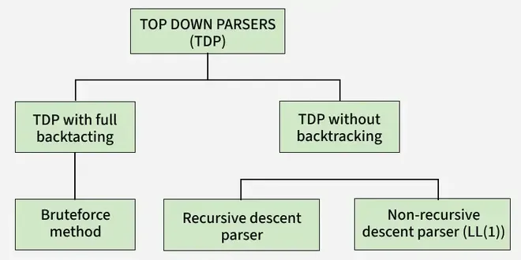

# Classification of Top Down Parsers
Top-down parsing is a method of syntax analysis that starts from the start symbol (root of the parse tree) and expands it step by step to match the input string. The parser builds the parse tree from top to bottom, following the leftmost derivation. It expands non-terminals into smaller components until the input string is completely matched.

Top-down parsers require grammars that are:

- Free from left recursion
- Free from ambiguity
- Free from common prefixes (after left factoring)

Top-down parsing is based on leftmost derivation, while bottom-up parsing uses reverse rightmost derivation.

## Classification of Top-Down Parsing

## Recursive Descent Parsing

Top-down technique that uses recursive functions to process each non-terminal in the grammar. Each non-terminal has a corresponding procedure.

Working steps:

- Start with a non-terminal.
- Choose one production rule.
- Try to match it with the input string.
- If it fails, try the next alternative.
- If one alternative matches completely, parsing is successful.

It may involve backtracking and is simple to implement.

## LL(1) Parser (Predictive or Table-Driven Parser)

LL(1) parsing is a predictive top-down parsing method that uses a parsing table and does not require backtracking.

Meaning of LL(1):

- First L: Scan input from Left to Right.
- Second L: Produce Leftmost derivation.
- 1: Use one lookahead symbol.

Rules for LL(1) Grammar:

- No left recursion
- No common prefixes (must apply left factoring)
- No ambiguity

LL(1) parsing is efficient and widely used in compilers because it makes decisions using one lookahead symbol.Read more about [[construction-of-ll1-parsing-table|Construction of LL(1) parsing table]].

### Important Notes

- If a grammar contains left factoring and is not properly rewritten, it cannot be LL(1). Example: S → aS | a
- If a grammar contains left recursion, it cannot be LL(1). Example: S → Sa | b
- If a grammar is ambiguous, it cannot be LL(1).
- Every regular grammar is not necessarily LL(1), because it may contain left recursion, left factoring, or ambiguity.