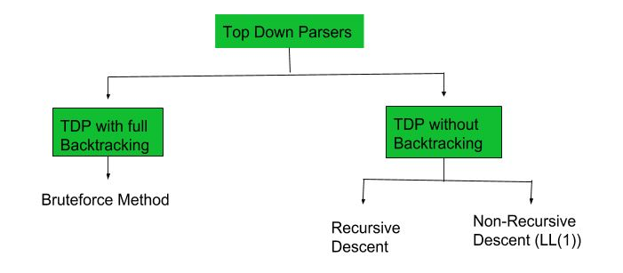
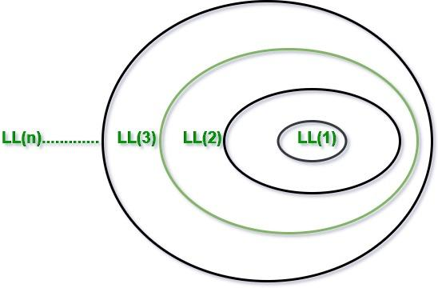

# Construction of LL(1) Parsing Table
Parsing is an essential part of computer science, especially in compilers and interpreters. From the various parsing techniques, LL(1) parsing is best. It uses a predictive, top-down approach. This allows efficient parsing without backtracking. This article will explore parsing and LL(1) parsing. It will cover its structure, how to build an LL(1) parsing table and its benefits.

## What is LL(1) Parsing?

Here the 1st L represents that the scanning of the Input will be done from the Left to Right manner and the second L shows that in this parsing technique, we are going to use the Left most Derivation Tree. And finally, the 1 represents the number of look-ahead, which means how many symbols you will see when you want to make a decision.



## Conditions for an LL(1) Grammar

To construct a working LL(1) parsing table, a grammar must satisfy these conditions:

- No Left Recursion: Avoid recursive definitions like A -> A + b.
- Unambiguous Grammar: Ensure each string can be derived in only one way.
- Left Factoring: Make the grammar deterministic, so the parser can proceed without guessing.

## Algorithm to Construct LL(1) Parsing Table

Step 1: First check all the essential conditions mentioned above and go to step 2.

Step 2: Calculate First() and Follow() for all non-terminals.

1. First(): If there is a variable, and from that variable, if we try to drive all the strings then the beginning Terminal Symbol is called the First.
2. Follow(): What is the Terminal Symbol which follows a variable in the process of derivation.

Step 3: For each production A --> α. (A tends to alpha)

1. Find First(α) and for each terminal in First(α), make entry A --> α in the table.
2. If First(α) contains ε (epsilon) as terminal, then find the Follow(A) and for each terminal in Follow(A), make entry A --> ε in the table.
3. If the First(α) contains ε and Follow(A) contains $ as terminal, then make entry A --> ε in the table for the $.

To construct the parsing table, we have two functions:

In the table, rows will contain the Non-Terminals and the column will contain the Terminal Symbols. All the Null Productions of the Grammars will go under the Follow elements and the remaining productions will lie under the elements of the First set.

Now, let's understand with an example.

Example 1: Consider the Grammar:

```
E --> TE'E' --> +TE' | ε                T --> FT'T' --> *FT' | εF --> id | (E)*ε denotes epsilon
```

Step 1: The grammar satisfies all properties in step 1.

Step 2: Calculate first() and follow().

Find their First and Follow sets:

|  | First | Follow |
| --- | --- | --- |
| E --> TE' | { id, ( } | { $, ) } |
| E' --> +TE'/ε | { +, ε } | { $, ) } |
| T --> FT' | { id, ( } | { +, $, ) } |
| T' --> *FT'/ε | { *, ε } | { +, $, ) } |
| F --> id/(E) | { id, ( } | { *, +, $, ) } |

First

Follow

{ id, ( }

{ $, ) }

{ +, ε }

{ $, ) }

{ id, ( }

{ +, $, ) }

{ *, ε }

{ +, $, ) }

{ id, ( }

{ *, +, $, ) }

Step 3: Make a parser table.

Now, the LL(1) Parsing Table is:

|  | id | + | * | ( | ) | $ |
| --- | --- | --- | --- | --- | --- | --- |
| E | E --> TE' |  |  | E --> TE' |  |  |
| E' |  | E' --> +TE' |  |  | E' --> ε | E' --> ε |
| T | T --> FT' |  |  | T --> FT' |  |  |
| T' |  | T' --> ε | T' --> *FT' |  | T' --> ε | T' --> ε |
| F | F --> id |  |  | F --> (E) |  |  |

E --> TE'

E --> TE'

E' --> +TE'

E' --> ε

E' --> ε

T --> FT'

T --> FT'

T' --> ε

T' --> *FT'

T' --> ε

T' --> ε

F --> id

F --> (E)

As you can see that all the null productions are put under the Follow set of that symbol and all the remaining productions lie under the First of that symbol.

Note: Every grammar is not feasible for LL(1) Parsing table. It may be possible that one cell may contain more than one production.

Let's see an example.

Example 2: Consider the Grammar

```
S --> A | aA --> a 
```

Step 1: The grammar does not satisfy all properties in step 1, as the grammar is ambiguous. Still, let's try to make the parser table and see what happens

Step 2: Calculating first() and follow()

Find their First and Follow sets:

|  | First | Follow |
| --- | --- | --- |
| S --> A/a | { a } | { $ } |
| A -->a | { a } | { $ } |

First

Follow

{ a }

{ $ }

{ a }

{ $ }

Step 3: Make a parser table. Parsing Table:

|  | a | $ |
| --- | --- | --- |
| S | S --> A, S --> a |  |
| A | A --> a |  |

S --> A, S --> a

A --> a

Here, we can see that there are two productions in the same cell. Hence, this grammar is not feasible for LL(1) Parser.

Trick - Above grammar is [[ambiguous-grammar|ambiguous grammar]]. So the grammar does not satisfy the essential conditions. So we can say that this grammar is not feasible for LL(1) Parser even without making the parse table.

Example 3: Consider the Grammar

```
S -> (L) | aL -> SL'L' -> )SL' | ε
```

Step1: The grammar satisfies all properties in step 1

Step 2: Calculating first() and follow()

|  | First | Follow |
| --- | --- | --- |
| S | ( , a | $, ) |
| L | ( , a | ) |
| L' | ), ε | ) |

( , a

$, )

( , a

), ε

Step 3: Making a parser table

Parsing Table:

|  | ( | ) | a | $ |
| --- | --- | --- | --- | --- |
| S | S -> (L) |  | S -> a |  |
| L | L -> SL' |  | L -> SL' |  |
| L' |  | L'->(SL'L'->ε |  |  |

S -> (L)

S -> a

L -> SL'

L -> SL'

L'->(SL'

L'->ε

Here, we can see that there are two productions in the same cell. Hence, this grammar is not feasible for LL(1) Parser. Although the grammar satisfies all the essential conditions in step 1, it is still not feasible for LL(1) Parser. We saw in example 2 that we must have these essential conditions and in example 3 we saw that those conditions are insufficient to be a LL(1) parser.

## Advantages of Construction of LL(1) Parsing Table

- Clear Decision-Making: With an LL(1) parsing table, the parser can decide what to do by looking at just one symbol ahead. This makes it easy to choose the right rule without confusion or guessing.
- Fast Parsing: Since there’s no need to go back and forth or guess the next step, LL(1) parsing is quick and efficient. This is useful for applications like compilers where speed is important.
- Easy to Spot Errors: The table helps identify errors right away. If the current symbol doesn’t match any rule in the table, the parser knows there’s an error and can handle it immediately.
- Simple to Implement: Once the table is set up, the parsing process is straightforward. You just follow the instructions in the table, making it easier to build and maintain.
- Good for Predictive Parsing: LL(1) parsing is often called “predictive parsing” because the table lets you predict the next steps based on the input. This makes it reliable for parsing programming languages and structured data.

