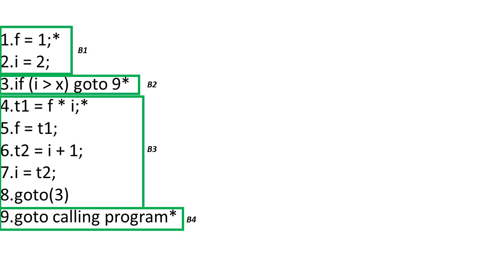
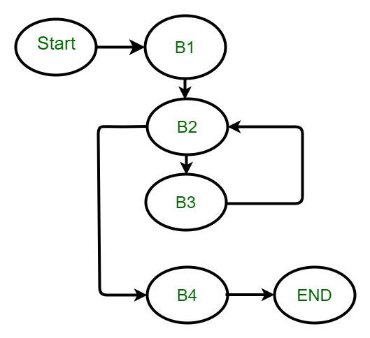

# Detection of a Loop in Three Address Code
Loop optimization is the phase after the Intermediate Code Generation. The main intention of this phase is to reduce the number of lines in a program. In any program majority of the time is spent actually inside the loop for an iterative program. In the case of the recursive program a block will be there and the majority of the time will present inside the block.

## Loop Optimization -

1. To apply loop optimization we must first detect loops.
2. For detecting loops we use Control Flow Analysis(CFA) using Program Flow Graph(PFG).
3. To find program flow graph we need to find Basic Block

## Basic Block -

Sequence of three address statements where control enters at the beginning and leaves only at the end without any jumps or halts.

### Finding the Basic Block -

A basic block is a sequence of consecutive statements with:

- Only one entry point
- Only one exit point

To find basic blocks, we must first identify leaders in the program. A basic block starts from a leader and ends just before the next leader.

Example:

If line 1 is a leader and line 15 is the next leader, then lines 1 to 14 form one basic block (line 15 is excluded).

### Identifying leader in a Basic Block -

A statement is considered a leader if:

- It is the first statement of the program.
- It is the target of a conditional or unconditional jump.
- It immediately follows a conditional or unconditional jump.

`fact(x)
{
    int f = 1;
    for (i = 2; i <= x; i++)
        f = f * i;
    return f;
}
`

```
fact(x)
{
    int f = 1;
    for (i = 2; i <= x; i++)
        f = f * i;
    return f;
}

```

`# Function to find factorial of a number
def fact(x):
    f = 1
    for i in range(2, x+1):
        f *= i
    return f
`

```
# Function to find factorial of a number
def fact(x):
    f = 1
    for i in range(2, x+1):
        f *= i
    return f

```

Three Address Code of the above C code:

1. f = 1;
2. i = 2;
3. if (i > x) goto 9
4. t1 = f * i;
5. f = t1;
6. t2 = i + 1;
7. i = t2;
8. goto(3)
9. goto calling program

Leader and Basic Block is as follows:



### Control Flow Analysis -

If control enters B1, it must flow to B2 (no alternative path).



In B2, control flow depends on the condition:

- If (i > x) is true, control jumps to B4.
- If (i > x) is false, control flows to B3.

`(i > x)`

`(i > x)`

After B3, control unconditionally jumps back to B2.

This creates a cycle between B2 and B3, which represents a loop.

B4 represents program exit or return to the calling program.

### Detection of a Loop in Three Address Code :

1. Increased complexity: Adding loop detection to the compiler can increase the complexity of the compiler code, making it harder to maintain and debug.
2. Performance overhead: Loop detection can require additional computation time, which can slow down the compilation process and increase the time required to generate the final code.
3. Limited benefit: Depending on the specific application, loop detection may not provide a significant benefit in terms of code optimization or performance. In some cases, it may be more efficient to focus on other optimizations that can provide greater benefits.
4. False positives: Loop detection algorithms may occasionally identify loops where none exist, which can lead to unnecessary optimization attempts or other errors in the generated code.
5. False negatives: Conversely, loop detection algorithms may occasionally miss loops that are present in the code, which can result in missed optimization opportunities and less efficient generated code.