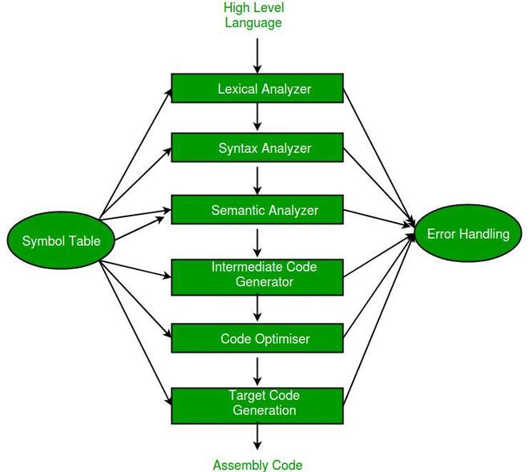
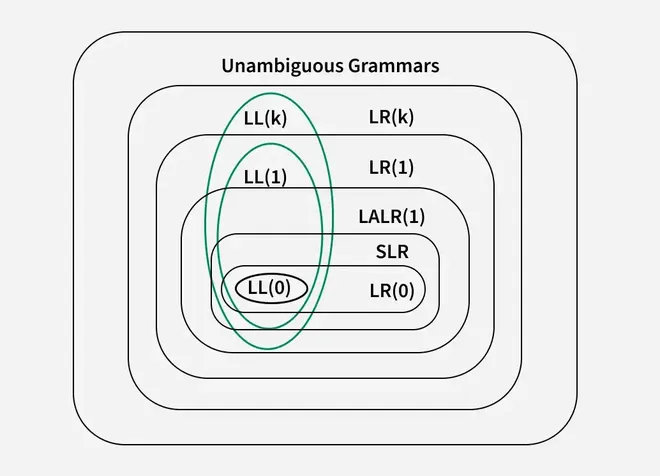
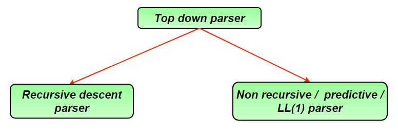

# Last Minute Notes - Compiler Design
Compiler design is the study of how to build a compiler, which is a program that translates high-level programming languages (like Python, C++, or Java) into machine code that a computer's hardware can execute directly. The focus is on how the translation happens, ensuring correctness and making the code efficient.

- Helps understand how programming languages work internally.
- Essential for building compilers, interpreters, IDEs, and language tools.
- Improves knowledge of program analysis and optimisation.

### Phases of a Compiler:

- Lexical Analysis: Tokenisation of source code into meaningful units (tokens).
- Syntax Analysis: Construction of a parse tree based on grammar rules.
- Semantic Analysis: Ensures correctness of meaning (e.g., type checking).
- Intermediate Code Generation: Produces an intermediate representation (IR) for optimisation and portability.
- Code Optimisation: Enhances the efficiency of the intermediate code.
- Code Generation: Translates optimised IR into target machine code.

Read more about Phases of Compiler, Here.



### Linking and Loading:

### Linking

- Linking is the process of combining multiple object files into a single executable file.
- It resolves symbolic references such as function calls and global variables.
- Performed by a linker after compilation.

Example: Linking connects a function call in one file to its actual definition in another file.

### Loading

- Loading is the process of placing the executable into main memory.
- It assigns actual memory addresses and prepares the program for execution.
- Performed by a loader before the CPU starts execution.

Read more about Difference Between Linker and Loader, Here.

## Lexical Analysis

Lexical analysis is the first phase of a compiler. It breaks the source code into small meaningful units called tokens.

### Key Functions:

- Tokenization: Converts the source code into tokens (e.g., keywords, identifiers, operators, literals). Example: int a = 5; → Tokens: int, a, =, 5, ;
- Removing Whitespaces and Comments: These are ignored during token generation.
- Error Detection: Identifies errors like invalid symbols or unknown characters in the source code.

`int a = 5;`

`int`

`a`

`=`

`5`

`;`

### Components:

- Lexical Analyzer (Lexer): Performs the actual tokenization.
- Symbol Table: Stores information about variables, functions, and other identifiers.

Output of Lexical Analysis: A sequence of tokens is sent to the next phase (Syntax Analysis).

### Token Categories in Lexical Analysis

Keywords:

- Reserved words with specific meaning in the language.
- Example: int, if, while, return.

`int`

`if`

`while`

`return`

Identifiers:

- Names given to variables, functions, arrays, etc.
- Example: x, count, _value.

`x`

`count`

`_value`

Literals (Constants):

- Fixed values in the code.
- Example: 10, 3.14, 'a', "hello".

`10`

`3.14`

`'a'`

`"hello"`

Operators:

- Symbols used to perform operations.
- Example: +, -, *, ==, &&.

`+`

`-`

`*`

`==`

`&&`

Punctuation (Delimiters):

- Symbols that structure the program.
- Example: ;, ,, (), {}.

`;`

`,`

`()`

`{}`

Special Symbols:

- Special-purpose symbols in some languages.
- Example: #, $.

`#`

`$`

Read more about [[introduction-of-lexical-analysis|Introduction of Lexical Analysis]] , Here.

## Syntax Analysis and Parsing

Syntax analysis is the second phase of a compiler. It checks whether the tokens generated by lexical analysis follow the rules of the programming language's grammar.

### Key Functions:

- Parse Tree Construction: Converts tokens into a hierarchical structure (parse tree) that represents the program’s syntactic structure.
- Grammar Validation: Ensures the code adheres to the grammar rules of the language (e.g., correct placement of operators, brackets).
- Error Detection: Identifies syntax errors like missing semicolons or unmatched parentheses.
- Input: Sequence of tokens from the lexical analyzer.
- Output: Parse tree or syntax errors.

### Types of Grammar Used:

- Context-Free Grammar (CFG): Used to define the syntax rules of programming languages.
- Production Rules: Defines how tokens can be combined (e.g., E → E + T | T).

`E → E + T | T`

Read more about Context Free Grammar, Here.

### Classification of CFG:

- [[ambiguous-grammar|Ambiguous Grammar]]: A grammar is ambiguous if a string can have more than one parse tree (multiple derivations).
- Unambiguous Grammar: A grammar is unambiguous if every string has exactly one parse tree.

### Syntax Tree and Parse Tree

| Feature | Parse Tree | Syntax Tree |
| --- | --- | --- |
| Purpose | Shows full derivation of a string | Shows semantic structure of code |
| Includes | All non-terminals and terminals | Only essential elements (reduces redundancy) |
| Use | Helps in syntactic analysis | Helps in semantic analysis and code generation |

### Parser



- A parser is a compiler component that performs syntax analysis.
- It checks whether input tokens follow the grammar rules of the language.
- Output: Parse tree or syntax errors.

### Classification of Parsers:

There are two types of parsers in compiler:

### 1. Top-Down Parsers

- Build the parse tree from root to leaves
- Parse input from left to right
- Use leftmost derivation

Types

- Recursive Descent Parser: Uses recursive functions for parsing
- LL Parser: Parses input left to right using leftmost derivation Example: LL(1) parser with one lookahead token

### 2. Bottom-Up Parsers

- Build the parse tree from leaves to root
- Parse input from left to right
- Use rightmost derivation in reverse

Types

- Operator Precedence Parser: Uses operator precedence and associativity
- LR Parser: Parses input left to right using rightmost derivation Examples: LR(0), SLR, CLR, LALR

Read more about Types of Parsers, Here.

### Top-Down Parser



- Builds the parse tree from root to leaves.
- Uses Leftmost Derivation (LMD).
- Predicts the next production based on input tokens.

### LL(1) Parser

An LL(1) parser is a top-down parser that reads input Left-to-right, constructs a Leftmost derivation, and uses 1 lookahead token to decide parsing actions.

### LL(1) Grammar Conditions

For a grammar A → α | β:

1. First(α) ∩ First(β) = ∅ → No overlap in first symbols.
2. If ϵ ∈ First(β), then Follow(A) ∩ First(α) = ∅ → Avoid ambiguity when ε-productions exist.

### Steps to Construct LL(1) Parsing Table:

1. Remove Left Recursion: Rewrite rules to eliminate left recursion.

2. Left Factoring: Remove common prefixes in grammar rules.

3. Find First and Follow Sets:

- First Set: First terminal symbol derivable from a non-terminal.
- Follow Set: Terminals that can appear immediately after a non-terminal in derivations.

4. Construct Parsing Table: Use the First and Follow sets to fill the table.

Read more about [[construction-of-ll1-parsing-table|Construction of LL(1) Parsing Table]], Here.

### First and Follow Sets Calculation

1. First Set: Contains terminals that can appear first in strings derived from a variable.

Rules to Calculate First Set:

- If X is a terminal, First(X) = {X}.
- If X → ε, include ε in First(X).
- If X → Y1 Y2...Yn, then:
- Add First(Y1) to First(X), excluding ε.
- If Y1 derives ε, check Y2, and so on.

`X`

`First(X) = {X}`

`X → ε`

`ε`

`First(X)`

`X → Y1 Y2...Yn`

`First(Y1)`

`First(X)`

`ε`

`Y1`

`ε`

`Y2`

2. Follow Set: Contains terminals that can appear immediately after a variable in input.

Rules to Calculate Follow Set

- Start symbol always has $ in its Follow set
- For a production A → αBβ, add First(β) (excluding ε) to Follow(B)
- If β → ε, add Follow(A) to Follow(B)
- If the production is A → αB, add Follow(A) to Follow(B)

`$`

`A → αBβ`

`First(β)`

`ε`

`Follow(B)`

`β → ε`

`Follow(A)`

`Follow(B)`

`A → αB`

`Follow(A)`

`Follow(B)`

Read more about [[first-and-follow-in-compiler-design|First and Follow in Compiler Design]], Here.

Example: Consider the Grammar:

> E --> TE'E' --> +TE' | ε T --> FT'T' --> *FT' | εF --> id | (E)*ε denotes epsilon

E --> TE'E' --> +TE' | ε T --> FT'T' --> *FT' | εF --> id | (E)*ε denotes epsilon

Step 1: The grammar satisfies all properties in step 1.

Step 2: Calculate first() and follow().

Find their First and Follow sets:

|  | First | Follow |
| --- | --- | --- |
| E –> TE’ | { id, ( } | { $, ) } |
| E’ –> +TE’/ε | { +, ε } | { $, ) } |
| T –> FT’ | { id, ( } | { +, $, ) } |
| T’ –> *FT’/ε | { *, ε } | { +, $, ) } |
| F –> id/(E) | { id, ( } | { *, +, $, ) } |

First

Follow

{ id, ( }

{ $, ) }

{ +, ε }

{ $, ) }

{ id, ( }

{ +, $, ) }

{ *, ε }

{ +, $, ) }

{ id, ( }

{ *, +, $, ) }

Step 3: Make a parser table.

Now, the LL(1) Parsing Table is:

|  | id | + | * | ( | ) | $ |
| --- | --- | --- | --- | --- | --- | --- |
| E | E –> TE’ |  |  | E –> TE’ |  |  |
| E’ |  | E’ –> +TE’ |  |  | E’ –> ε | E’ –> ε |
| T | T –> FT’ |  |  | T –> FT’ |  |  |
| T’ |  | T’ –> ε | T’ –> *FT’ |  | T’ –> ε | T’ –> ε |
| F | F –> id |  |  | F –> (E) |  |  |

E –> TE’

E –> TE’

E’ –> +TE’

E’ –> ε

E’ –> ε

T –> FT’

T –> FT’

T’ –> ε

T’ –> *FT’

T’ –> ε

T’ –> ε

F –> id

F –> (E)

### Recursive Descent Parser

- A Top-Down Parser that uses recursive functions to process input and build the parse tree.

Key Features:

1. Parsing Direction: Left-to-right on the input.
2. Derivation: Constructs Leftmost Derivation.
3. Implementation: Uses a set of mutually recursive functions, one for each non-terminal in the grammar.

Steps in Recursive Descent Parsing:

1. Start with the start symbol of the grammar.
2. For each non-terminal, call a corresponding recursive function.
3. For each terminal, match it with the input token.
4. Backtrack if there’s a mismatch (limited capability without modifications).

Read more about Recursive Descent Parser, Here.

### Bottom-Up Parser

- Constructs the parse tree from leaves to root.
- Starts with input symbols and gradually reduces them to the start symbol.

Operator Precedence Parser:

- A type of Bottom-Up Parser used for operator grammars only.
- Operator Grammar Conditions:No production’s RHS contains ε (epsilon).No two non-terminals appear adjacent on RHS.

1. No production’s RHS contains ε (epsilon).
2. No two non-terminals appear adjacent on RHS.

Operator Precedence Relation:

| Symbol | Meaning |
| --- | --- |
| a ⋗ b | Terminal a has higher precedence than b |
| a ⋖ b | Terminal a has lower precedence than b |
| a ≐ b | Terminals a and b have equal precedence |

`a ⋗ b`

`a`

`b`

`a ⋖ b`

`a`

`b`

`a ≐ b`

`a`

`b`

Read more about Operator Precedence Grammar and Parser, Here.

The operator precedence table for the grammar will be-

|  | + | x | id | $ |
| --- | --- | --- | --- | --- |
| + | ⋗ | ⋖ | ⋖ | ⋗ |
| x | ⋗ | ⋗ | ⋖ | ⋗ |
| id | ⋗ | ⋗ | — | ⋗ |
| $ | ⋖ | ⋖ | ⋖ | A |

Operator Precedence Parser Algorithm :

> 1. If the front of input $ and top of stack both have $, it's done else2. compare front of input b with ⋗ if b! = '⋗' then push b scan the next input symbol3. if b == '⋗' then pop till ⋖ and store it in a string S pop ⋖ also reduce the popped string if (top of stack) ⋖ (front of input) then push ⋖ S if (top of stack) ⋗ (front of input) then push S and goto 3

1. If the front of input $ and top of stack both have $, it's done else2. compare front of input b with ⋗ if b! = '⋗' then push b scan the next input symbol3. if b == '⋗' then pop till ⋖ and store it in a string S pop ⋖ also reduce the popped string if (top of stack) ⋖ (front of input) then push ⋖ S if (top of stack) ⋗ (front of input) then push S and goto 3

### Bottom-Up Parsing Actions

- Shift: Move next input symbol onto the stack.
- Reduce: Replace stack symbols matching a production RHS with the LHS non-terminal.
- Accept: Parsing successful when start symbol is reduced and input is fully consumed.

### Types of LR Parsers

LR(0) Parser

- Uses closure() and goto() functions to construct canonical LR(0) item sets
- May cause shift-reduce conflict when a state contains both shift and reduce items
- May cause reduce-reduce conflict when two reduce actions appear in the same state

`closure()`

`goto()`

SLR (Simple LR) Parser

- More powerful than LR(0) parser
- Shift-reduce conflict occurs if FOLLOW set intersects with lookahead
- Reduce-reduce conflict occurs when FOLLOW sets of left-hand side non-terminals intersect

CLR (Canonical LR) Parser

- Similar to SLR parser
- Reductions are placed only in FOLLOW of the left-hand side non-terminal
- More powerful and resolves more conflicts than SLR

LALR (Look-Ahead LR) Parser

- Constructed by merging CLR states with identical productions but different lookaheads
- More efficient than CLR parser
- Every LALR grammar is CLR, but not every CLR grammar is LALR

### Steps for LR Parsing Table Construction:

1. Augment the Grammar: Add a new production S' → S, where S is the start symbol.

`S' → S`

`S`

2. Construct Canonical LR(0) Items: Create item sets (closures and GOTO operations).

3. Compute Parsing Table:

- Action Table: Contains shift, reduce, accept, or error.
- Goto Table: Specifies transitions for non-terminals.

4. Conflict Checking: Ensure no shift/reduce or reduce/reduce conflicts.

Parsers Comparison : LR(0) ⊂ SLR ⊂ LALR ⊂ CLR LL(1) ⊂ LALR ⊂ CLR If number of states LR(0) = n1, number of states SLR = n2, number of states LALR = n3, number of states CLR = n4 then, n1 = n2 = n3 <= n4 .

Read more about LR Parser, Here.

## Syntax Directed Translation

Syntax Directed Translation (SDT) combines Context-Free Grammar (CFG) with semantic rules to assign meaning or perform actions during parsing

### Attributes in SDT

Inherited Attributes

- Depend on parent or sibling nodes
- Attribute values are passed from parent to child
- Example: In A → B {A.x = B.x + 2}, x is an inherited attribute

`A → B {A.x = B.x + 2}`

`x`

Synthesized Attributes

- Depend on child nodes
- Attribute values are passed from child to parent
- Example: In A → B {A.x = B.x + 2}, x is a synthesized attribute

`A → B {A.x = B.x + 2}`

`x`

### Syntax Directed Definitions (SDD)

L-Attributed Grammar: Attributes are either: Synthesized OR Restricted Inherited (from parent or left siblings only).

- Evaluation Order: Topological (In-Order traversal). Example: S → AB {A.x = S.x; B.x = f(A.x)}.

`S → AB {A.x = S.x; B.x = f(A.x)}`

S-Attributed Grammar: Only Synthesized Attributes are used.

- Evaluation Order: Reverse Rightmost Derivation (Bottom-Up). Example: E → E1 + T {E.val = E1.val + T.val}.

` E → E1 + T {E.val = E1.val + T.val}`

Read more about S-Attributed and L-Attributed in SDTs, Here.

### Attribute Examples:

1. Inherited Attributes Example:

> D → T L {L.in = T.type} T → int {T.type = int}L → id {AddType(id.entry, L.in)}

D → T L {L.in = T.type} T → int {T.type = int}L → id {AddType(id.entry, L.in)}

`D → T L {L.in = T.type} `

`T → int {T.type = int}`

`L → id {AddType(id.entry, L.in)}`

L.in is inherited, and T.type is synthesized.

`L.in`

`T.type`

2. Synthesized Attributes Example:

> E → E1 + T {E.val = E1.val + T.val}T → int {T.val = int}

E → E1 + T {E.val = E1.val + T.val}T → int {T.val = int}

`E → E1 + T {E.val = E1.val + T.val}`

`T → int {T.val = int}`

E.val and T.val are synthesized.

`E.val`

`T.val`

- Synthesized → Bottom-Up Evaluation.
- L-Attributed → Includes Synthesized + Restricted Inherited evaluated In-Order.

## Intermediate Code Generation and Optimization

### Three-Address Code (3AC):

- Code representation where each statement has at most 3 operands, including the LHS.
- Applications of 3AC:Operator precedence parsing is used.Intermediate code representation.Example: u = t - zv = u * ww = v + t Minimum variables required: Optimize the number of temporary variables for efficiency.

1. Operator precedence parsing is used.
2. Intermediate code representation.
3. Example: u = t - zv = u * ww = v + t Minimum variables required: Optimize the number of temporary variables for efficiency.

> u = t - zv = u * ww = v + t

u = t - zv = u * ww = v + t

`u = t - z`

`v = u * w`

`w = v + t`

Read more about 3AC, Here.

### Static Single Assignment (SSA) Code:

Static Single Assignment (SSA) Code

- Every variable in the code is assigned exactly once
- Each reassignment uses a new variable name
- Simplifies compiler optimizations
- Improves data-flow analysis
- Uses renamed variables such as x, p1, q1
- Widely used in modern compilers

`x`

`p1`

`q1`

> x = u - t y = x * u x = y + w y = t - z y= x * y

x = u - t y = x * u x = y + w y = t - z y= x * y

`x = u - t  `

`y = x * u  `

`x = y + w  `

`y = t - z  `

`y= x * y`

- Variables [u, t, v, w, z] are already assigned, so we can’t reuse them.

`[u, t, v, w, z]`

Equivalent SSA Code:

> x = u - t y = x * vp = y + w q = t - x r = p * q

x = u - t y = x * vp = y + w q = t - x r = p * q

`x = u - t  `

`y = x * v`

`p = y + w  `

`q = t - x  `

`r = p * q`

Total Variables: 10.

Read more about SSA, Here.

### Control Flow Graph (CFG):

Definition: CFG represents a program as nodes (basic blocks) and edges (control flow).

Basic Block:

- A basic block is a sequence of instructions with:
- One entry point (leader)

Steps to Identify Basic Blocks

1. Start with the first instruction of the program which is always the leader.
2. Mark every instruction that is the target of a branch (jump/loop) as a leader.
3. Mark every instruction immediately following a branch (conditional/unconditional) as a leader.
4. For each leader, gather all subsequent instructions until the next leader or program end.
5. End the block at the last instruction before a new leader, a branch, or a return.
6. Ensure no block contains internal branches (except its last instruction).
7. Represent each block as a node in a Control Flow Graph (CFG).
8. Connect blocks with edges based on jumps/fall-through execution.

Applications

- Detect independent code blocks
- Enable optimizations like dead code elimination, loop optimization, and instruction scheduling

### Code Optimization:

Objective: Reduce execution time and memory usage.

Techniques:

1. Constant Folding: Evaluate constant expressions at compile time. Example: x = 2 * 3 + y → x = 6 + y.

`x = 2 * 3 + y → x = 6 + y`

2. Copy Propagation: Replace redundant variables. Example: z = y + 2 → z = x + 2 (if x = y).

`z = y + 2 → z = x + 2`

`x = y`

3. Strength Reduction: Replace expensive operations with cheaper ones. Example: x = 2 * y → x = y + y.

`x = 2 * y → x = y + y`

4. Dead Code Elimination: Remove code that does not affect the output. Example: Remove if (false) { ... }.

`if (false) { ... }`

5. Common Subexpression Elimination: Eliminate repeated calculations using DAGs. Example:

```
x = (a + b) + (a + b) + c→ t1 = a + b→ x = t1 + t1 + c
```

6. Loop Optimization:

- Code Motion: Move invariant code outside loops.
- Induction Variable Elimination: Replace variables with simpler expressions.
- Loop Jamming: Combine multiple loops.
- Loop Unrolling: Reduce loop overhead by executing multiple iterations in a single iteration.

7. Peephole Optimization:

Analyze short sequences of code (peepholes) and replace them with faster alternatives. Applied to intermediate or target code.Following Optimizations can be used:

> Redundant instruction elimination Flow-of-control optimizations Algebraic simplifications Use of machine idioms

- Redundant instruction elimination
- Flow-of-control optimizations
- Algebraic simplifications
- Use of machine idioms

Read more about [[code-optimization-in-compiler-design|Code Optimization in Compiler Design]], Here.