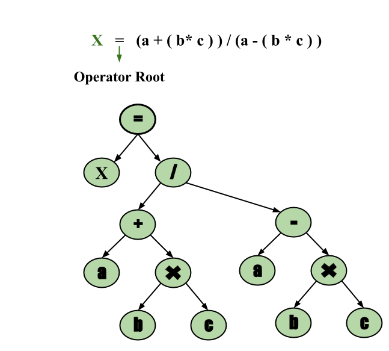
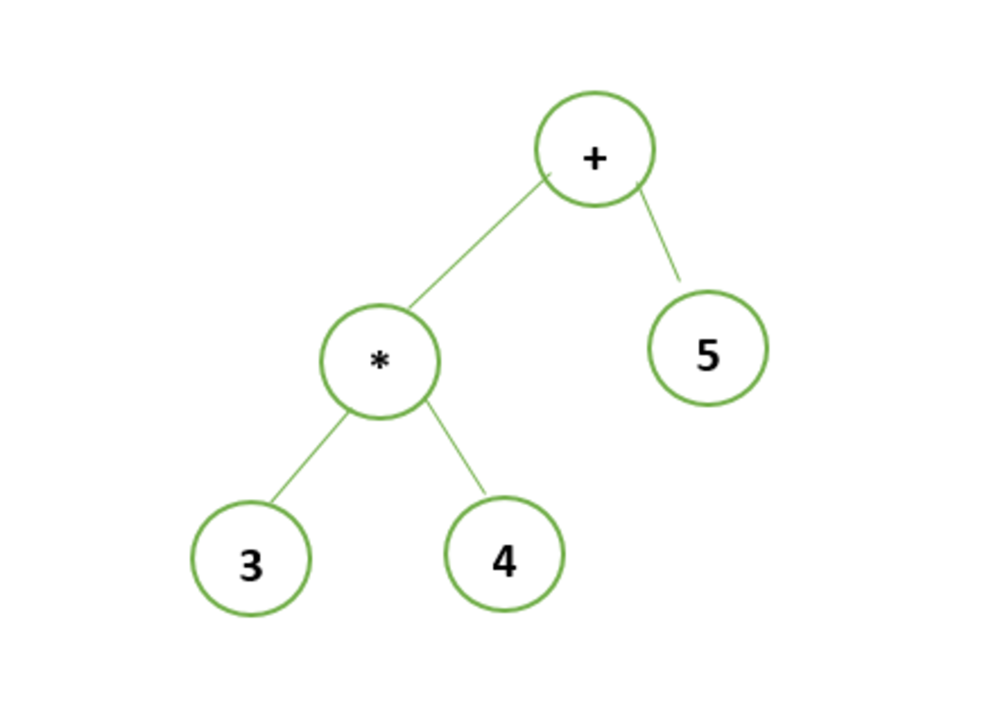

# Parse Tree and Syntax Tree
Parse Tree and Syntax tree are tree structures that represent the structure of a given input according to a formal grammar. They play an important role in understanding and verifying whether an input string aligns with the language defined by a grammar. These terms are often used interchangeably but the parse tree represents a detailed parsing process while the syntax tree often represents the final syntactic structure. Let's understand them in detail.

## Parse Tree

A parse tree is a tree structure that represents how a grammar is used to generate input strings. During parsing, the string is derived from the start symbol which serves as the root of the parse tree. The parse tree provides a visual representation of the symbols in the string which can be either terminals or non-terminals. They follow operator precedence, with the deepest sub-tree being traversed first. This means that the operator in the parent node has less precedence than the operator in the sub-tree.

In a Parse Tree for a Context-Free Grammar (CFG), G = (V, Σ, P, S), the following conditions must be satisfied:

- The root of the tree has the label S which is the start symbol.
- Each vertex (node) in the tree is labeled with either a variable (V), a terminal (Σ), or ε (representing the empty string).
- If a production rule A → C1, C2, ..., Cn exists, then C1, C2, ..., Cn are the children of the node labeled A.
- Leaf nodes of the parse tree represent terminals (Σ) and interior nodes represent variables (V).
- The label of an internal vertex (non-leaf node) is always a variable.
- If a vertex A has k children with labels A1, A2, ..., Ak, the production rule in the grammar is A → A1, A2, ..., Ak.

## Syntax Tree

A syntax tree displays the syntactic structure of a program and ignores unnecessary details present in a parse tree. It is a condensed form of the parse tree where operator and keyword nodes are moved to their parent and groups of individual productions are replaced by a single link.

- It is commonly used in compiler design to represent the structure of code during the compilation process.
- It is constructed by parsing the source code which involves breaking it down into components like tokens, variables, and statements.
- The nodes in a syntax tree correspond to various components of the source code, reflecting its grammatical structure.
- Syntax trees are used for tasks such as type checking, optimization, and code generation in compilers.
- They can also be used to represent the structure of other linguistic or logical structures such as natural language sentences or logical expressions.

## Example of Parse Tree and Syntax Tree

Let's consider the expression given below:

```
 3*4+5
```

To generate the parse tree for the expression, follow these steps:

- Start with the root node labeled E (Expression) which is the start symbol.
- Apply the production E → E + T because the expression contains the + operator, splitting it into E (left) and T (right).
- The left part of the expression, 3 * 4 is handled by the production T → T * F since multiplication has higher precedence than addition so it is evaluated first.
- The right part, 5 is given by T → F and F becomes Digit(5).
- 3 and 4 are labeled as Digit(3) and Digit(4) respectively under their respective F nodes.
- The tree ensures that multiplication is performed before addition following operator precedence.



Here is the Syntax tree for the expression, 3*4+5The root node is the + operator as addition is the outermost operation in the expression.

- The left child of + is the * operator which handles the multiplication of 3 and 4.
- The left and right child of * is 3 and 4 respectively while the right child of + is 5.



## Difference Between Parse Tree and Syntax Tree

| Parse Tree | Syntax Tree |
| --- | --- |
| Parse Tree is used as an intermediate representation during the compilation process. | Syntax Tree is used as the final representation for generating machine code or intermediate code. |
| More detailed and larger. | Simpler and more abstract. |
| It includes extra information like comments and whitespace. | It only includes necessary information for code generation. |
| It is primarily for the compiler and not meant for human readability. | It can be read and understood by humans, provides an abstract view of the source code. |

Parse Tree

Syntax Tree

Parse Tree is used as an intermediate representation during the compilation process.

Syntax Tree is used as the final representation for generating machine code or intermediate code.

More detailed and larger.

Simpler and more abstract.

It includes extra information like comments and whitespace.

It only includes necessary information for code generation.

It is primarily for the compiler and not meant for human readability.

It can be read and understood by humans, provides an abstract view of the source code.