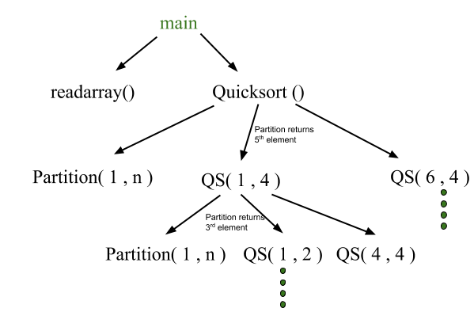
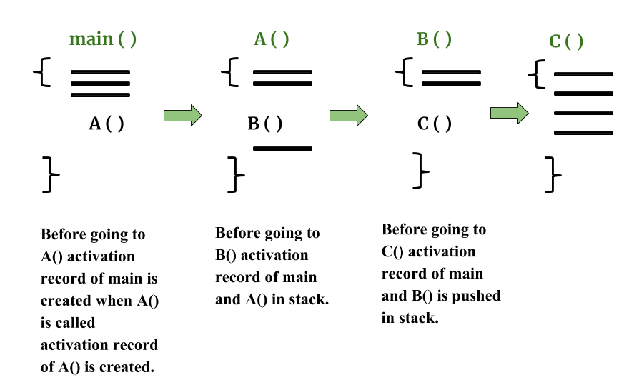
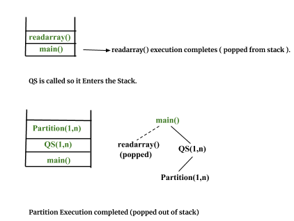
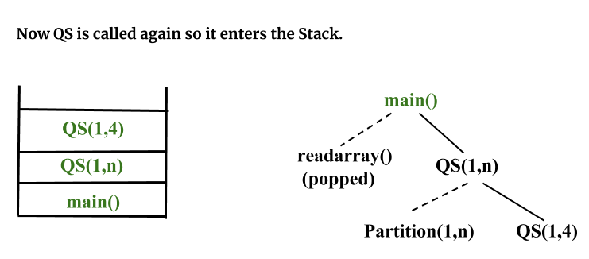
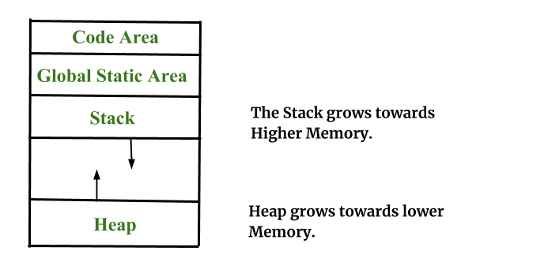

# Runtime Environments in Compiler Design
A runtime environment refers to the system that supports the execution of a compiled program. It connects the static program written in the source code with the dynamic actions performed during execution. The runtime environment manages memory, procedure calls, parameter passing, and other services required while the program runs.

Programs contain identifiers such as variables and procedures that must be mapped to actual memory locations during execution. The runtime environment maintains the state of the target machine and provides necessary services such as memory allocation, control flow management, and access to libraries.

## Activation Tree

Represents the sequence of procedure calls during program execution. Each execution of a procedure is called an activation. Activations may be non-overlapping(one procedure finishes before another begins), nested(procedure calls another before completing its execution), or recursive(if a new activation begins before the previous activation of the same procedure has finished) depending on how procedures call each other. Properties of activation trees are:-

- Each node represents an activation of a procedure.
- The root shows the activation of the main function.
- The node for procedure ‘x’ is the parent of node for procedure ‘y’ if and only if the control flows from procedure x to procedure y.

Example - Consider the following program of Quicksort

```
main() {

      Int n;
      readarray();
      quicksort(1,n);
}

quicksort(int m, int n) {

     Int i= partition(m,n);
     quicksort(m,i-1);
     quicksort(i+1,n);
}
```

The activation tree for this program will be:



First main function as the root then main calls readarray and quicksort. Quicksort in turn calls partition and quicksort again. The flow of control in a program corresponds to a pre-order depth-first traversal of the activation tree which starts at the root.

## Control Stack and Activation Records

Control stack or runtime stack is used to keep track of the active procedure activations i.e the procedures whose execution have not been completed. When a procedure is called, an activation record (stack frame) is pushed onto the stack. When the procedure finishes, the activation record is removed from the stack.

An activation record stores information required for a single procedure execution, including:

- Local variables
- Temporary values used during expression evaluation
- Machine status information before the procedure call
- Access link for accessing non-local variables
- Control link pointing to the caller’s activation record
- Return value
- Actual parameters passed to the procedure





Control stack for the above quicksort example:



## Subdivision of Runtime Memory

Runtime memory is divided into different regions to store program data during execution.

- Target code: compiled program instructions (fixed at compile time)
- Static data: global and static variables
- Stack: automatic variables and activation records
- Heap: dynamically allocated memory



## Storage Allocation Techniques

### Static Storage Allocation

Memory locations for variables are determined at compile time. Each variable is bound to the same memory location during all procedure activations.

- Memory is allocated once before execution begins
- Values of local variables can remain across procedure calls
- Does not support recursion
- Size of data must be known at compile time

Eg- FORTRAN was designed to permit static storage allocation.

### Stack Storage Allocation

Memory is managed using a stack structure where activation records are pushed and popped as procedures are called and completed.

- Each procedure activation receives fresh storage and Support recursion
- Efficient management of local variables and parameters

### Heap Storage Allocation

Memory can be allocated and deallocated at any time during program execution.

- Used for dynamic data structures such as linked lists and trees
- Supports recursion and dynamic memory usage

## Parameter Passing

Parameter passing is the mechanism used to transfer data between the calling procedure and the called procedure.

- Formal Parameter: Variables that take the information passed by the caller procedure are called formal parameters. These variables are declared in the definition of the called function.
- Actual Parameter: Variables whose values and functions are passed to the called function are called actual parameters. These variables are specified in the function call as arguments.

### Basic terminology

- R- value: The value of an expression is called its r-value. The value contained in a single variable also becomes an r-value if its appear on the right side of the assignment operator. R-value can always be assigned to some other variable.
- L-value: The location of the memory(address) where the expression is stored is known as the l-value of that expression. It always appears on the left side if the assignment operator.

## Parameter Passing Methods

### Call by Value

The value of the actual parameter is copied into the formal parameter. Changes inside the function do not affect the original variable.

C++ </p><pre><code class="language-cpp">#include <iostream> using namespace std; void swap(int a, int b) // call by value { int temp = a; a = b; b = temp; } int main() { int a = 10, b = 20; swap(a, b); cout << a << " " << b << endl; return 0; } </code></pre><p></p><h3 id="call-by-reference" style="text-align:left"><span>Call by Reference</span></h3><p dir="ltr"><span>The address of the actual parameter is passed to the function. Any modification inside the function affects the original variable.</span></p><gfg-tabs data-mode="light" data-run-ide="true"><gfg-tab slot="tab">C++</gfg-tab><gfg-panel data-code-lang="cpp" slot="panel"><pre><code class="language-cpp">#include <iostream> using namespace std; void swap(int& a, int& b) // call by reference { int temp = a; a = b; b = temp; } int main() { int a = 10, b = 20; swap(a, b); cout << a << " " << b << endl; return 0; } Call by Copy-RestoreValues are copied to the formal parameters during the call and copied back to the actual parameters when the function returns. C++ #include <iostream> using namespace std; void swap(int& a, int& b) { /* A hybrid between call-by-value and call-by-reference is copy-restore linkage (also known as copy in and copy out ,or value-result) */ int copy_a, copy_b; copy_a = a; // copy in phase copy_b = b; int temp = copy_a; // function proper copy_a = copy_b; copy_b = temp; a = copy_a; // copy out phase b = copy_b; } int main() { int a = 10, b = 20; swap(a, b); cout << a << " " << b << endl; return 0; } // code added by raunakraj232 Call by NameActual parameters are substituted for formal parameters in the function body and evaluated only when needed. This mechanism is mainly theoretical and not supported in most modern languages. C++ // Call by Name (conceptual – not supported in C++) // Its a (Conceptual / Pseudo-C++) Code #include <iostream> using namespace std; void swap(name int a, name int b) // call by name { int temp = a; a = b; b = temp; } int main() { int a = 10, b = 20; swap(a, b); // actual parameters are substituted by name cout << a << " " << b << endl; return 0; } AdvantagesImproves portability by providing an abstraction layer between the compiled program and the operating system.Manages system resources such as memory and CPU efficiently.Supports dynamic memory allocation during program execution.Can automatically free unused memory through garbage collection.Provides mechanisms for handling exceptions and runtime errors.DisadvantagesIntroduces performance overhead due to additional runtime processing.Some runtime environments may depend on specific platforms.Debugging can become more complex because of the abstraction layer.Compatibility issues may arise with certain operating systems or hardware.Different versions of runtime environments can create versioning problems.

```
</p><pre><code class="language-cpp">#include <iostream>
using namespace std;

void swap(int a, int b)   // call by value
{
    int temp = a;
    a = b;
    b = temp;
}

int main()
{
    int a = 10, b = 20;
    swap(a, b);
    cout << a << " " << b << endl;
    return 0;
}
</code></pre><p></p><h3 id="call-by-reference" style="text-align:left"><span>Call by Reference</span></h3><p dir="ltr"><span>The address of the actual parameter is passed to the function. Any modification inside the function affects the original variable.</span></p><gfg-tabs data-mode="light" data-run-ide="true"><gfg-tab slot="tab">C++</gfg-tab><gfg-panel data-code-lang="cpp" slot="panel"><pre><code class="language-cpp">#include <iostream>
using namespace std;

void swap(int& a, int& b)   // call by reference
{
    int temp = a;
    a = b;
    b = temp;
}

int main()
{
    int a = 10, b = 20;
    swap(a, b);
    cout << a << " " << b << endl;
    return 0;
}

```

### Call by Copy-Restore

Values are copied to the formal parameters during the call and copied back to the actual parameters when the function returns.

```
# include <iostream>
using namespace std;

void swap(int& a, int& b)
{
    /* A hybrid between call-by-value and call-by-reference
       is copy-restore linkage (also known as copy in and
       copy out ,or value-result) */

    int copy_a, copy_b;
    copy_a = a; // copy in phase
    copy_b = b;

    int temp = copy_a; // function proper
    copy_a = copy_b;
    copy_b = temp;

    a = copy_a; // copy out phase
    b = copy_b;
}

int main()
{
    int a = 10, b = 20;
    swap(a, b);
    cout << a << " " << b << endl;
    return 0;
}
// code added by raunakraj232

```

### Call by Name

Actual parameters are substituted for formal parameters in the function body and evaluated only when needed. This mechanism is mainly theoretical and not supported in most modern languages.

```
// Call by Name (conceptual – not supported in C++)
// Its a (Conceptual / Pseudo-C++) Code
# include <iostream>
using namespace std;

void swap(name int a, name int b)   // call by name
{
    int temp = a;
    a = b;
    b = temp;
}

int main()
{
    int a = 10, b = 20;
    swap(a, b);    // actual parameters are substituted by name
    cout << a << " " << b << endl;
    return 0;
}

```

### Advantages

Improves portability by providing an abstraction layer between the compiled program and the operating system.

Manages system resources such as memory and CPU efficiently.

Supports dynamic memory allocation during program execution.

Can automatically free unused memory through garbage collection.

Provides mechanisms for handling exceptions and runtime errors.

### Disadvantages

Introduces performance overhead due to additional runtime processing.

Some runtime environments may depend on specific platforms.

Debugging can become more complex because of the abstraction layer.

Compatibility issues may arise with certain operating systems or hardware.

Different versions of runtime environments can create versioning problems.