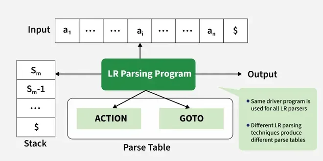
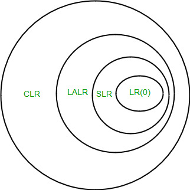
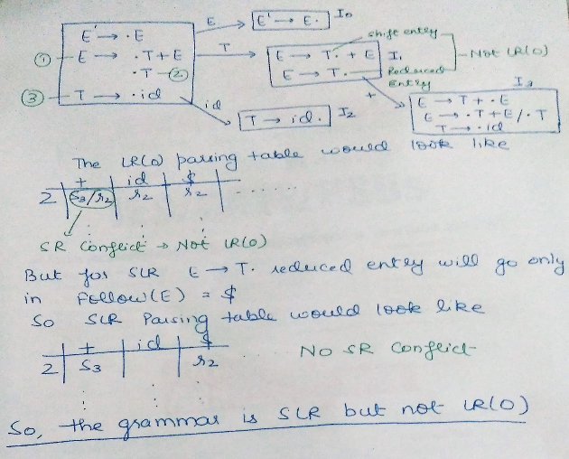
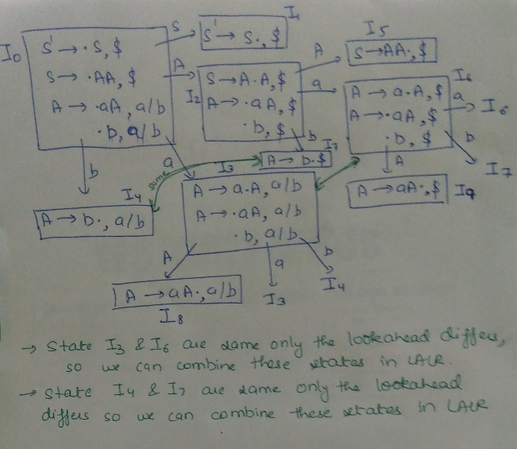
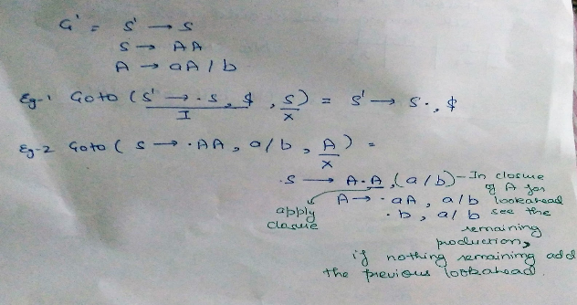

# SLR, CLR and LALR Parsers
Parsing is a fundamental process in compiler design that helps analyze and validate the syntax of programming languages. It converts a sequence of tokens into a structured format, often represented as a parse tree. Among various parsing techniques, LR parsers are widely used due to their efficiency and ability to handle a broad class of grammars.

LR parsers are a type of [[bottom-up-parsers|bottom-up parsers]] that construct the parse tree from the leaves (tokens) to the root (start symbol). They are deterministic and capable of handling context-free grammars (CFGs) efficiently. The three main types of LR parsers include:

- SLR (Simple LR) Parser – The most basic LR parser, using LR(0) items and FOLLOW sets for table construction.
- CLR (Canonical LR) Parser – A more powerful parser that utilizes LR(1) items to resolve conflicts and recognize a broader range of grammars.
- LALR (Look-Ahead LR) Parser – A memory-optimized version of CLR that merges states to reduce table size while maintaining most of its parsing power.

Each of these parsers differs in terms of complexity, power, and efficiency.



## Bottom-Up Parsing

Bottom-up parsing is a method used in compilers to analyze and understand code. It starts with the smallest parts of a program (tokens) and gradually builds up to form the complete structure (syntax tree).

In bottom-up parsing:

1. It reads the input from left to right.
2. It groups tokens into larger structures based on grammar rules.
3. It keeps combining these structures until it forms the final result (start symbol).

The most powerful [[bottom-up-parsers|bottom-up parsers]] are LR Parsers (used in programming languages like C and Java). Examples include:

- SLR (Simple LR) – Basic and easy to implement.
- CLR (Canonical LR) – More powerful but complex.
- LALR (Look-Ahead LR) – A mix of both, balancing power and efficiency.

Read more about Bottom-Up Parsing.



## SLR(1) Parsing

SLR(1) stands for Simple LR Parsing. It is similar to LR(0) Parsing because LR(0) parsing requires just the canonical items for the construction of a parsing table, The only thing that differentiates the LR(0) parser from the SLR parser is the possibility of a shift reduced conflict because we are entering reduce corresponding to all terminal states in the LR(0) parsing table. In LR(0) Parsing, the parser sometimes mistakenly reduces when it shouldn't, causing shift-reduce conflicts. SLR(1) fixes this issue by only allowing reduce operations in places where they match the FOLLOW set of the left-hand side (LHS) of the production rule. This means that SLR(1) uses FOLLOW sets to make better decisions, reducing conflicts.

### Constructing the SLR(1) parsing Table

> 1. Construct the collection of sets of LR(0) items for G′.2. For each state i of the CFSM, constructed from Ii: 1. If [A → α • aβ] ∈ Ii and GOTO(Ii, a) = Ij, ⇒ ACTION[i, a] ← “shift j”, ∀a ≠ $. 2. If [A → α •] ∈ Ii, A ≠ S′, ⇒ ACTION[i, a] ← “reduce A → α”, ∀a ∈ FOLLOW(A). 3. If [S′ → S • $] ∈ Ii, ⇒ ACTION[i, $] ← “accept”.3. For each state i: - If GOTO(Ii, A) = Ij, ⇒ GOTO[i, A] ← j.4. Set undefined entries in ACTION and GOTO to “error”.5. The initial state of the parser s₀ is CLOSURE([S′ → •S$]).

1. Construct the collection of sets of LR(0) items for G′.2. For each state i of the CFSM, constructed from Ii: 1. If [A → α • aβ] ∈ Ii and GOTO(Ii, a) = Ij, ⇒ ACTION[i, a] ← “shift j”, ∀a ≠ $. 2. If [A → α •] ∈ Ii, A ≠ S′, ⇒ ACTION[i, a] ← “reduce A → α”, ∀a ∈ FOLLOW(A). 3. If [S′ → S • $] ∈ Ii, ⇒ ACTION[i, $] ← “accept”.3. For each state i: - If GOTO(Ii, A) = Ij, ⇒ GOTO[i, A] ← j.4. Set undefined entries in ACTION and GOTO to “error”.5. The initial state of the parser s₀ is CLOSURE([S′ → •S$]).

- If in the parsing table we have multiple entries then it is said to be a conflict.

Example:

```
Consider the grammar E -> T+E | T                     T ->id    Augmented grammar - E’ -> E                E -> T+E | T                T -> id
```



Read more about SLR (1) Parsing.

## CLR(1) Parsing

CLR(1) Parsing, also called Canonical LR(1) Parsing, is a type of bottom-up parsing used in compilers to analyze the structure of programming languages. It is an advanced version of SLR(1) Parsing that eliminates conflicts by using look-ahead symbols. These symbols help the parser decide whether to shift or reduce based on what comes next in the input.

Unlike SLR(1), which relies on FOLLOW sets to make reduction decisions, CLR(1) associates a specific look-ahead symbol with each grammar rule. This allows the parser to differentiate between situations where a rule should be applied or postponed, making it more powerful and capable of handling a wider range of grammars.

CLR(1) Parsing works by constructing LR(1) items, which are similar to LR(0) items but include a look-ahead symbol. These items help in building a more accurate parsing table that reduces errors caused by shift-reduce or reduce-reduce conflicts. Because of this, CLR(1) parsing is much more precise than SLR(1), but it also has a drawback—it generates large parsing tables that require more memory and processing time.

### Constructing the LR(1) Parsing Table

> 1. Build lookahead into the DFA to begin with2. Construct the collection of sets of LR(1) items for G′.3. For each state i of the LR(1) machine, constructed from Ii: 1. If [A → α • aβ, b] ∈ Ii and GOTO₁(Ii, a) = Ij, ⇒ ACTION[i, a] ← “shift j”. 2. If [A → α •, a] ∈ Ii, A ≠ S′, ⇒ ACTION[i, a] ← “reduce A → α”. 3. If [S′ → S •, $] ∈ Ii, ⇒ ACTION[i, $] ← “accept”.4. For each state i: - If GOTO₁(Ii, A) = Ij, ⇒ GOTO[i, A] ← j.5. Set undefined entries in ACTION and GOTO to “error”.6. The initial state of the parser s₀ is CLOSURE₁([S′ → •S, $]).

1. Build lookahead into the DFA to begin with2. Construct the collection of sets of LR(1) items for G′.3. For each state i of the LR(1) machine, constructed from Ii: 1. If [A → α • aβ, b] ∈ Ii and GOTO₁(Ii, a) = Ij, ⇒ ACTION[i, a] ← “shift j”. 2. If [A → α •, a] ∈ Ii, A ≠ S′, ⇒ ACTION[i, a] ← “reduce A → α”. 3. If [S′ → S •, $] ∈ Ii, ⇒ ACTION[i, $] ← “accept”.4. For each state i: - If GOTO₁(Ii, A) = Ij, ⇒ GOTO[i, A] ← j.5. Set undefined entries in ACTION and GOTO to “error”.6. The initial state of the parser s₀ is CLOSURE₁([S′ → •S, $]).

| CLOSURE | GOTO |
| --- | --- |
|  |  |

CLOSURE

GOTO





Example:

```
Consider the following grammar     S -> AaAb | BbBa    A -> ?    B -> ?    Augmented grammar - S’ -> S                  S -> AaAb | BbBa                  A -> ?                  B -> ?    GOTO graph for this grammar will be - 
```


Read more about CLR(1) Parsing.

## LALR Parsing

LALR(1) (Look-Ahead LR) Parsing is an optimized version of CLR(1) (Canonical LR(1)) Parsing that reduces the size of the parsing table while maintaining most of its power. In CLR(1), the number of states can become very large because each state keeps look-ahead symbols separately. LALR(1) solves this problem by merging states that have the same LR(0) core items but different look-ahead symbols.

By merging similar states, LALR(1) reduces memory usage while keeping the parsing process efficient. However, in some cases, this merging can lead to shift-reduce or reduce-reduce conflicts, making LALR(1) slightly weaker than CLR(1). Despite this, it is widely used in practical compilers and parser generators like YACC and Bison because it offers a good balance between power and efficiency.

### Constructing the LALR(1) Parsing Table

> Construct the collection of sets of LR(1) items for G′.For each core present among the set of LR(1) items:Find all sets having the same core.Replace these sets with their union.Update the GOTO₁ function incrementally.For each state i of the LALR(1) machine, constructed from Ii:If [A → α • aβ, b] ∈ Ii and GOTO₁(Ii, a) = Ij, ⇒ ACTION[i, a] ← “shift j”.If [A → α •, a] ∈ Ii and A ≠ S′, ⇒ ACTION[i, a] ← “reduce A → α”.If [S′ → S •, $] ∈ Ii, ⇒ ACTION[i, $] ← “accept”.If GOTO₁(Ii, A) = Ij, ⇒ GOTO[i, A] ← j.Set undefined entries in ACTION and GOTO to “error”.The initial state of the parser s₀ is CLOSURE₁([S′ → •S, $]).

1. Construct the collection of sets of LR(1) items for G′.
2. For each core present among the set of LR(1) items:Find all sets having the same core.Replace these sets with their union.Update the GOTO₁ function incrementally.
3. For each state i of the LALR(1) machine, constructed from Ii:If [A → α • aβ, b] ∈ Ii and GOTO₁(Ii, a) = Ij, ⇒ ACTION[i, a] ← “shift j”.If [A → α •, a] ∈ Ii and A ≠ S′, ⇒ ACTION[i, a] ← “reduce A → α”.If [S′ → S •, $] ∈ Ii, ⇒ ACTION[i, $] ← “accept”.
4. If GOTO₁(Ii, A) = Ij, ⇒ GOTO[i, A] ← j.
5. Set undefined entries in ACTION and GOTO to “error”.
6. The initial state of the parser s₀ is CLOSURE₁([S′ → •S, $]).

- Find all sets having the same core.
- Replace these sets with their union.
- Update the GOTO₁ function incrementally.

1. If [A → α • aβ, b] ∈ Ii and GOTO₁(Ii, a) = Ij, ⇒ ACTION[i, a] ← “shift j”.
2. If [A → α •, a] ∈ Ii and A ≠ S′, ⇒ ACTION[i, a] ← “reduce A → α”.
3. If [S′ → S •, $] ∈ Ii, ⇒ ACTION[i, $] ← “accept”.

Example:

```
consider the grammar S ->AA                     A -> aA | b    Augmented grammar - S’ -> S                        S ->AA                        A -> aA | b
```


Read more about LALR(1) Parsing.

### SLR(1) v/s CLR(1) v/s LALR(1)

| Feature | SLR(1) Parser (Simple LR) | CLR(1) Parser (Canonical LR) | LALR(1) Parser (Look-Ahead LR) |
| --- | --- | --- | --- |
| Parsing Table Size | Smallest (fewer states) | Largest (most states) | Medium (states merged to reduce size) |
| Grammar Handling | Limited (only simple grammars) | Most powerful (handles almost all grammars) | Nearly as powerful as CLR but compact |
| Basis for Decisions | Uses FOLLOW sets for reductions | Uses look-ahead symbols to make precise decisions | Uses merged look-ahead symbols, similar to CLR but optimized |
| Conflicts (Shift-Reduce, Reduce-Reduce) | More conflicts due to reliance on FOLLOW sets | Least conflicts because of look-ahead symbols | May introduce reduce-reduce conflicts when merging states |
| Error Detection | Delayed (errors detected later) | Delayed (similar to SLR) | Similar to CLR, not always immediate |
| Time and Space Complexity | Low (fast but limited) | High (slow due to large tables but powerful) | Medium (optimized for efficiency) |
| Ease of Implementation | Easiest (simplest to build) | Most complex (large tables make it harder) | Easier than CLR but slightly more complex than SLR |
| Used In | Simple parsers and educational tools | Strong theoretical compilers (not widely used in practice) | Most real-world compilers (YACC, Bison, etc.) |