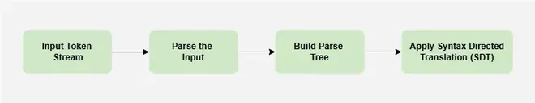
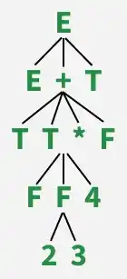
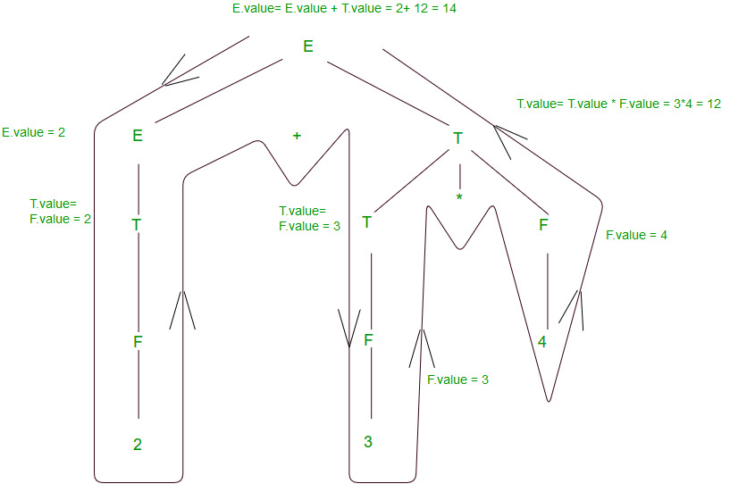

# Syntax Directed Translation in Compiler Design
Syntax-Directed Translation (SDT) is a method used in compiler design to convert source code into another form while analyzing its structure. It integrates syntax analysis (parsing) with semantic rules to produce intermediate code, machine code, or optimized instructions. Each grammar rule is linked with semantic actions that define how translation should occur. These actions help in tasks like evaluating expressions, checking types, generating code, and handling errors.

SDT ensures a systematic and structured way of translating programs, allowing information to be processed bottom-up or top-down through the parse tree. This makes translation efficient and accurate, ensuring that every part of the input program is correctly transformed into its executable form.



Key Elements:

1. Lexical values of nodes (such as variable names or numbers).
2. Constants used in computations.
3. Attributes associated with non-terminals that store intermediate results.

General Process

- First, a parse tree or syntax tree is constructed.
- Then, attribute values are computed by visiting the tree nodes in a specific order.
- In many cases, translation is performed directly during parsing without explicitly building the tree.

## Attributes

An attribute is any quantity associated with a programming construct in a parse tree. Help in carrying semantic information during the compilation process.

#### Examples of Attributes:

- Data types of variables
- Line numbers for error handling
- Instruction details for code generation

### Types of Attributes

Synthesized Attributes

- Defined by a semantic rule associated with the production at node N in the parse tree.
- Computed only using the attribute values of the children and the node itself.
- Mostly used in bottom-up evaluation.

Inherited Attributes

- Defined by a semantic rule associated with the parent production of node N.
- Computed using the attribute values of the parent, siblings, and the node itself.
- Used in top-down evaluation.

Read about Differences Between Synthesized and Inherited Attributes.

## Attribute Grammars

Special type of grammar used in compiler design to add extra information (attributes) to syntax rules. This helps in semantic analysis, such as type checking, variable classification, and ensuring correctness in programming languages.

Example of an Attribute Grammar

| Production Rule | Semantic Rule | Explanation |
| --- | --- | --- |
| D → T L | L.in := T.type | The type defined in T is passed to L. |
| T → int | T.type := integer | Assigns the data type integer to T. |
| T → real | T.type := real | Assigns the data type real to T. |
| L → L₁ , id | L₁.in := L.in addtype(id.entry, L.in) | Passes type information to L₁ and updates the symbol table with the identifier type. |
| L → id | addtype(id.entry, L.in) | Assigns the type information to the identifier id and stores it in the symbol table. |

`L.in := T.type`

`T.type := integer`

`T.type := real`

`L₁.in := L.in`

`addtype(id.entry, L.in)`

`addtype(id.entry, L.in)`

## Translation Rules

| Production Rule | Translation Action |
| --- | --- |
| E → E + T | { print('+') } |
| E → E - T | { print('-') } |
| E → T | — |
| T → 0 | { print('0') } |
| T → 1 | { print('1') } |
| … | … |
| T → 9 | { print('9') } |

`{ print('+') }`

`{ print('-') }`

`{ print('0') }`

`{ print('1') }`

`{ print('9') }`

Translation rules can be evaluated using Depth-First Search (DFS) traversal of the parse tree.When all attributes are synthesized, the attributes of child nodes are computed before the parent node, so evaluation can be done in one traversal. If other types of attributes are present, we may need to determine the proper order of traversal and possibly perform multiple passes on the parse tree. Evaluation is performed in a bottom-up and left-to-right manner to compute translation rules correctly.

### Grammar with Semantic Actions

```
E → E + T     { E.val = E.val + T.val }   (PR#1)E → T         { E.val = T.val }           (PR#2)T → T * F     { T.val = T.val * F.val }   (PR#3)T → F         { T.val = F.val }           (PR#4)F → INTLIT    { F.val = INTLIT.lexval }   (PR#5)
```

Each production rule has a semantic action in {} that defines how values are computed.

`{}`

- E, T, and F are non-terminals (expression components).
- INTLIT represents an integer literal (actual number).
- val is an attribute used to store computed values at each step.

### Let’s evaluate the expression: S = 2 + 3 * 4

Step 1: Build the Parse TreeThe parse tree for 2 + 3 * 4 is structured like this:

`2 + 3 * 4`



Step 2: Apply Translation Rules (Bottom-Up Evaluation)We evaluate the expression step by step in a bottom-up manner (from leaves to root)

F → 2 → F.val = 2F → 3 → F.val = 3F → 4 → F.val = 4T → F (T gets F's value) → T.val = 3T → T * F → T.val = 3 * 4 = 12E → T (E gets T's value) → E.val = 12E → E + T → E.val = 2 + 12 = 14

`F.val = 2`

`F.val = 3`

`F.val = 4`

`T.val = 3`

`T.val = 3 * 4 = 12`

`E.val = 12`

`E.val = 2 + 12 = 14`

Thus, the final computed value of 2 + 3 * 4 is 14.

`2 + 3 * 4`



### Advantages

1. Simple to design and implement – Translation rules are defined with grammar rules, making SDT easy to understand.
2. Clear modular structure – Translation logic is closely linked with grammar, which helps organize the compiler and simplifies modifications.
3. Efficient translation – Supports intermediate code generation and basic optimizations for efficient target code.

### Limitations

- Limited translation capability – Supports only a limited range of translation tasks compared to attribute grammars.
- Not suitable for complex translations – Difficult to express complicated translations using grammar-based actions.
- Weak error handling – Limited error recovery may lead to unclear error messages and harder debugging.