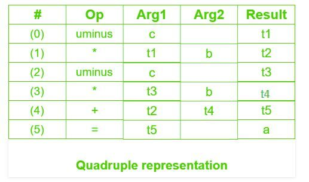

# Three address code in Compiler
Three-Address Code (TAC) is a widely used intermediate representation in compiler design that simplifies complex expressions by breaking them into a sequence of simple instructions. Each instruction contains at most three addresses—two operands and one result. The result of every operation is usually stored in a temporary variable generated by the compiler. This representation makes the order of operations explicit, which helps the compiler perform code optimization and simplifies the translation into machine code. Thus, three-address code acts as an intermediate step between high-level source code and low-level [[machine-instructions|machine instructions]] in the compilation process.

## Applications of Three-Address Code in Compilers

- Code Optimization: Three-address code is commonly used during the optimization phase of compilation. It allows the compiler to analyze the program structure and apply optimization techniques to improve performance
- Code generation: TAC serves as an intermediate representation during the code generation phase, allowing the compiler to produce efficient machine code for the target platform.
- Debugging: Because TAC is simpler and closer to the original source code than machine code, it can help developers trace program execution and identify errors.
- Language translation: TAC can be used as a common intermediate representation for translating programs from one programming language to another.

### General Representation

```
a = b
a = op b 
a = b op c 
```

Where a, b, or c represents operands like names, constants or compiler-generated temporaries and op represents the operator

Example-1: Convert the expression a * - (b + c) into three address codes.


Example 2,: Write three address codes for the following code

```
for(i = 1; i<=10; i++)
 {
  a[i] = x * 5;                                       
 } 
```

```
i = 1        # Initialize i
L1:          # Start of the loop
if i > 10 goto L2   # Check the loop condition
t1 = x * 5          # Compute x * 5 and store in t1
a[i] = t1           # Assign t1 to a[i]
i = i + 1           # Increment i
goto L1             # Go back to the start of the loop
L2:                 # End of the loop

```

## Implementation of Three Address Code

There are 3 representations of three address code namely

### 1. Quadruple:

- A quadruple is an intermediate code representation consisting of four fields:op, arg1, arg2, result.
- op represents the operator.
- arg1 and arg2 represent the operands.
- result stores the outcome of the operation.
- This representation makes it easy to rearrange code, which helps during global optimization.
- Temporary variable values can be quickly accessed using the symbol table, improving manageability.
- However, it often introduces a large number of temporary variables.
- Creating many temporaries can increase both time and space complexity of the compiler.

Example - Consider expression a = b * - c + b * - c. The three address code is:

```
t1 = uminus c   (Unary minus operation on c)
t2 = b * t1 
t3 = uminus c (Another unary minus operation on c)
t4 = b * t3 
t5 = t2 + t4 
a = t5  (Assignment of t5 to a)
```



### 2. Triples:

- This representation does not use extra temporary variables to store intermediate results.
- Instead of temporaries, it uses pointers to refer to the result of another triple whenever needed.
- It consists of three fields:op, arg1, arg2.
- Temporaries are implicit, which makes code rearrangement difficult.
- Code optimization becomes harder because moving one triple requires updating all other triples that refer to it.
- Using pointers allows direct access to symbol table entries, which helps in locating operands efficiently.

Example - Consider expression a = b * - c + b * - c


### 3. Indirect Triples

- This representation uses a pointer to a separate list that stores all references to computations.
- The actual triples remain unchanged, while the pointer list is updated when code is rearranged.
- It provides similar utility to quadruple representation but requires less storage space.
- Temporary values are implicit, like in triple representation.
- Code rearrangement becomes easier because only the pointer list needs to be modified, not the triples themselves.

Example - Consider expression a = b * - c + b * - c

Question - Write quadruple, triples and indirect triples for following expression : (x + y) * (y + z) + (x + y + z)


Explanation - The three address code is:

```
(1) t1 = x + y
(2) t2 = y + z
(3) t3 = t1 * t2
(4) t4 = t1 + z
(5) t5 = t3 + t4
```


## Process of Generating Three-Address Code

1. Source Code Parsing and Abstract Syntax Tree Generation.

- Lexical Analysis: source code is converted into tokens, keywords, identifiers, operators, literals, etc.
- Syntax Analysis: An Abstract Syntax Tree that would be the representation of the grammatical structure of the code.
- Semantic Analysis: Derivation of semantic errors type mismatches, undeclared variables, etc. and builds a symbol table.

2. TAC Instructions Generation

- Traversal of the Abstract Syntax Tree: visiting each of the nodes in the abstract syntax tree generates the proper TAC instructions.
- Use temporaries for intermediate computation.
- Three address form: Each instruction should have at most three operands, two source and one target.

3. Expression Evaluation

- Arithmetic Expressions: Complex expressions are broken into simpler operations; for example, the expression a + b * c in three-address code is written as: t1 = b * c; t2 = a + t1
- Logical Expressions: Translate the logical AND, OR and NOT operators into conditional jumps. Uses temporary registers.

4. Control Flow Constructs

- If Statements :Use conditional jumps.
- While Loops : Involve in unconditional jumps to the loop header and conditional jumps to exit.
- For Loops: Converted to equivalent while loops.
- Goto Statements: Unconditionally jump to the specified labels.

5. Procedure Calls

- Argument Passing : Arguments are pushed onto the stack
- Function Call: A jump is made to the function's entry point.
- Return Value: Stored in a temporary variable while popping the arguments off the stack..