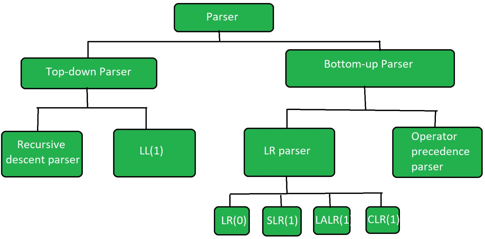

# Types of Parsers in Compiler Design
Compiler design has many functional modules one of them is the parser which takes the output of the lexical analyzer (often a set of tokens list) and builds a parse tree. The main responsibility of the parser is to confirm whether the generated language can produce the input string and helps in the analysis of syntax.

## What is a Parser?

The parser is one of the phases of the compiler which takes a token of string as input and converts it into the corresponding Intermediate Representation (IR) with the help of an existing grammar. The parser is also known as Syntax Analyzer.

## Types of Parsers

The parser is mainly classified into two categories.

1. Top-down Parser
2. Bottom-up Parser

## Top-Down Parser

Top-down parser is the parser that generates parse tree for the given input string with the help of grammar productions by expanding the non-terminals. It starts from the start symbol and ends down on the terminals. It uses left most derivation.

Further Top-down parser is classified into 2 types: 1) Recursive descent parser and 2) non-recursive descent parser.

1. Recursive descent parser is also known as the Brute force parser or the backtracking parser. It basically generates the parse tree by using brute force and backtracking techniques.
2. Non-recursive descent parser is also known as LL(1) parser or predictive parser or without backtracking parser or dynamic parser. It uses a parsing table to generate the parse tree instead of backtracking.

## Bottom-Up Parser

Bottom-up Parser is the parser that generates the parse tree for the given input string with the help of grammar productions by compressing the terminals. It starts from terminals and ends upon the start symbol. It uses the rightmost derivation in reverse order.

Bottom-up parser is classified into two types:

LR parser: This is a bottom-up parser that generates the parse tree for the given string by using unambiguous grammar. It follows the reverse of the rightmost derivation. LR parser is classified into four types:

- LR(0)
- SLR(1)
- LALR(1)
- CLR(1)

Operator precedence parser: Operator Precedence Parser generates the parse tree from given grammar and string but it has the condition that two consecutive non-terminals and epsilon will never appears on the right-hand side of any production. The operator precedence parsing technique is applied to Operator grammars.

## What is Operator Grammar?

An operator precedence grammar is a context-free grammar that has the property that no production has either:

- An empty on the right-hand side
- Two adjacent non-terminals in its right-hand side.

## Conclusion

Parser is one of the important phases in compiler design that takes a token of string as input and converts into the intermediate representation. If the programming code does not follow the rules, then the compiler will generate an error message and the compilation process will be stopped. Parser is classified into two types namely Top-down Parser and Bottom-up Parser. Based on the requirements and the goals of the programming language the appropriate parsing technique is used.