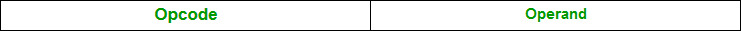
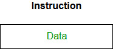
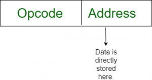
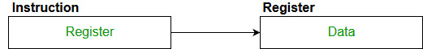
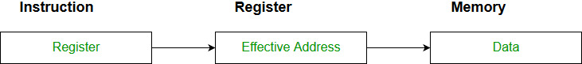
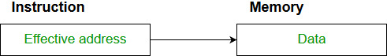

# Addressing Modes in 8086
Addressing modes are the techniques used by the CPU to identify where the data needed for an operation is stored. They provide rules for interpreting or modifying the address field in an instruction before accessing the operand.

Addressing modes for 8086 instructions are divided into two categories:

- Addressing modes for data
- Addressing modes for branch

The 8086 memory addressing modes provide flexible access to memory, allowing us to easily access variables, arrays, records, pointers, and other complex data types. The key to good assembly language programming is the proper use of memory addressing modes.

An assembly language program instruction consists of two parts

The memory address of an operand consists of two components:

## Key Concepts in 8086 Addressing

Starting address of memory segment.

Effective address or offset: An offset is determined by adding any combination of three address elements: displacement, base and [[index]].

- Displacement: It is an 8-bit or 16-bit immediate value given in the instruction.
- Base: Contents of base register, BX (Base Register) or BP (Base Pointer Register).
- [[index|Index]]: Content of [[index]] register SI (Source [[index|Index]] Register) or DI (Destination [[index|Index]] Register).

According to the different ways of specifying an operand by the 8086 microprocessor, different addressing modes are used by the 8086.

## Importance of Addressing Modes

- They allow flexibility in data handling, such as accessing arrays, records, or pointers.
- They support program control with techniques like loops, branches, and jumps.
- They enable efficient memory usage and program relocation during runtime.
- They reduce the complexity of programming by offering multiple ways to access data.

## Types of Addressing Modes in Computer Architecture

Addressing Modes used by 8086 microprocessor are discussed below:

### Implied mode

In implied addressing the operand is specified in the instruction itself. In this mode the data is 8 bits or 16 bits long and data is the part of instruction. Zero address instruction are designed with implied addressing mode.

> Example: CLC (used to reset Carry flag to 0)

Example: CLC (used to reset Carry flag to 0)

### Immediate addressing mode (symbol #)

In this mode data is present in address field of instruction .Designed like one address instruction format. Note: Limitation in the immediate mode is that the range of constants are restricted by size of address field.

> Example: MOV AL, 35H(move the data 35H into AL register)

Example: MOV AL, 35H(move the data 35H into AL register)

### Register mode

In register addressing the operand is placed in one of 8 bit or 16 bit general purpose registers. The data is in the register that is specified by the instruction. Here one register reference is required to access the data.

> Example: MOV AX,CX (move the contents of CX register to AX register)

Example: MOV AX,CX (move the contents of CX register to AX register)

### Register Indirect mode

In this addressing the operand’s offset is placed in any one of the registers BX,BP,SI,DI as specified in the instruction. The effective address of the data is in the base register or an [[index]] register that is specified by the instruction. Here two register reference is required to access the data. The 8086 CPUs let you access memory indirectly through a register using the register indirect addressing modes.

> MOV AX, [BX](move the contents of memory location addressed by the register BX to the register AX)

MOV AX, [BX](move the contents of memory location addressed by the register BX to the register AX)

### Auto Indexed (increment mode)

Effective address of the operand is the contents of a register specified in the instruction. After accessing the operand, the contents of this register are automatically incremented to point to the next consecutive memory location.(R1)+. Here one register reference, one memory reference and one ALU operation is required to access the data. Example:

> Add R1, (R2)+ // ORR1 = R1 +M[R2]R2 = R2 + d

Add R1, (R2)+ // ORR1 = R1 +M[R2]R2 = R2 + d

Useful for stepping through arrays in a loop. R2 - start of array d - size of an element

### Auto indexed ( decrement mode)

Effective address of the operand is the contents of a register specified in the instruction. Before accessing the operand, the contents of this register are automatically decremented to point to the previous consecutive memory location. -(R1)Here one register reference, one memory reference and one ALU operation is required to access the data. Example:

> Add R1,-(R2) //ORR2 = R2-dR1 = R1 + M[R2]

Add R1,-(R2) //ORR2 = R2-dR1 = R1 + M[R2]

Auto decrement mode is same as auto increment mode. Both can also be used to implement a stack as push and pop . Auto increment and Auto decrement modes are useful for implementing “Last-In-First-Out” data structures.

### Direct addressing/ Absolute addressing Mode (symbol [ ])

The operand’s offset is given in the instruction as an 8 bit or 16 bit displacement element. In this addressing mode the 16 bit effective address of the data is the part of the instruction. Here only one memory reference operation is required to access the data.

> Example: ADD AL,[0301] //add the contents of offset address 0301 to AL

Example: ADD AL,[0301] //add the contents of offset address 0301 to AL

### Indirect addressing Mode (symbol @ or () )

In this mode address field of instruction contains the address of effective address. Here two references are required. 1st reference to get effective address. 2nd reference to access the data. Based on the availability of Effective address, Indirect mode is of two kind:

- Register Indirect: In this mode effective address is in the register, and corresponding register name will be maintained in the address field of an instruction. Here one register reference, one memory reference is required to access the data.

> Example : MOV A, @R0

Example : MOV A, @R0

- Memory Indirect: In this mode effective address is in the memory, and corresponding memory address will be maintained in the address field of an instruction. Here two memory reference is required to access the data.

> Example : MOV AX, [[5000H]]

Example : MOV AX, [[5000H]]

### Indexed addressing mode

The operand’s offset is the sum of the content of an [[index]] register SI or DI and an 8 bit or 16 bit displacement.

> Example: MOV AX, [SI +05]

Example: MOV AX, [SI +05]

### Based Indexed Addressing

The operand’s offset is sum of the content of a base register BX and an [[index]] register SI or DI.

> Example: ADD AX, [BX+SI]

Example: ADD AX, [BX+SI]

#### Based on Transfer of control, addressing modes are:

### PC relative addressing mode

PC relative addressing mode is used to implement intra segment transfer of control, In this mode effective address is obtained by adding displacement to PC.

> EA= PC + Address field valuePC= PC + Relative value.

EA= PC + Address field valuePC= PC + Relative value.

### Base register addressing mode

Base register addressing mode is used to implement inter segment transfer of control. In this mode effective address is obtained by adding base register value to address field value.

> EA= Base register + Address field value.PC= Base register + Relative value

EA= Base register + Address field value.PC= Base register + Relative value

Note :

- PC relative and based register both addressing modes are suitable for program relocation at runtime.
- Based register addressing mode is best suitable to write position independent codes.

## Advantages of Addressing Modes

- Enable advanced programming techniques like pointers and counters for loops.
- Simplify memory access for arrays and complex data structures.
- Allow program relocation during runtime.
- Reduce the size of the instruction field, making the program more efficient.

## Sample GATE Question

Match each of the high level language statements given on the left hand side with the most natural addressing mode from those listed on the right hand side.

> 1. A[1] = B[J]; a. Indirect addressing2. while [*A++]; b. Indexed addressing3. int temp = *x; c. Autoincrement

1. A[1] = B[J]; a. Indirect addressing2. while [*A++]; b. Indexed addressing3. int temp = *x; c. Autoincrement

(A) (1, c), (2, b), (3, a)

(B) (1, a), (2, c), (3, b)

(C) (1, b), (2, c), (3, a)

(D) (1, a), (2, b), (3, c)

Answer: (C)

Explanation:

> List 1 List 21) A[1] = B[J]; b) [[index|Index]] addressing Here indexing is used2) while [*A++]; c) auto incrementThe memory locations are automatically incremented3) int temp = *x; a) Indirect addressingHere temp is assigned the value of int type storedat the address contained in X

List 1 List 21) A[1] = B[J]; b) [[index|Index]] addressing Here indexing is used2) while [*A++]; c) auto incrementThe memory locations are automatically incremented3) int temp = *x; a) Indirect addressingHere temp is assigned the value of int type storedat the address contained in X

Hence (C) is correct solution