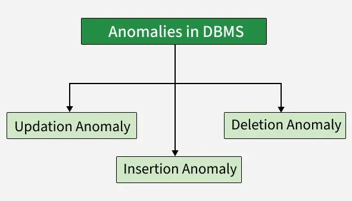

# Anomalies in Relational Model
Anomalies in DBMS are caused by poor management of storing everything in the flat database, lack of normalization, data redundancy and improper use of primary or foreign keys. These issues result in inconsistencies during insert, update or delete operations, leading to data integrity problems.

These anomalies can be categorized into three types:

- Insertion Anomalies
- Deletion Anomalies
- Update Anomalies.

### Insertion Anomaly

An insertion anomaly occurs when it is not possible to insert data into a database because some required information is missing or incomplete.

Example:

If a database requires every record to have a primary key, and no value is provided for that key, the record cannot be inserted into the table.

### Deletion Anomaly

A deletion anomaly occurs when deleting a record unintentionally results in the loss of other important data.

Example:

If a database contains information about customers and their orders, deleting a customer record may also delete all the orders associated with that customer, leading to loss of valuable information.

### Update Anomaly

An update anomaly occurs when modifying data in a database leads to inconsistencies because the same data is stored in multiple places.

Example:

If a database contains employee salary information in multiple records, and the salary is updated in one record but not in others, it may result in incorrect calculations and reporting.

Note: These anomalies can be removed with the process of Normalization, which generally splits the database which results in reducing the anomalies in the database.

## Example:

STUDENT Table:

| STUD_NO | STUD_NAME | STUD_PHONE | STUD_STATE | STUD-COUNTRY | STUD_AGE |
| --- | --- | --- | --- | --- | --- |
| 1 | John | 2139716271 | Los Angeles | California | 20 |
| 2 | Robert | 7139898291 | Houston | Texas | 19 |
| 3 | Jack | 6027898291 | Phoenix | Arizona | 18 |
| 4 | David | 2069816543 | Seattle | Washington | 21 |

STUDENT_COURSE:

| STUD_NO | COURSE_NO | COURSE_NAME |
| --- | --- | --- |
| 1 | C1 | DBMS |
| 2 | C2 | [[1|Computer Networks]] |
| 1 | C2 | [[1|Computer Networks]] |

### 1. Insertion Anomaly

An insertion anomaly occurs when a record cannot be inserted into the referencing table because the corresponding value does not exist in the referenced table.

> Example: If we try to insert a record into the STUDENT_COURSE table with STUD_NO = 7, it will not be allowed because there is no corresponding STUD_NO = 7 in the STUDENT table.

Example: If we try to insert a record into the STUDENT_COURSE table with STUD_NO = 7, it will not be allowed because there is no corresponding STUD_NO = 7 in the STUDENT table.

### 2. Deletion and Updation Anomaly:

If a tuple is deleted or updated from referenced relation and the referenced attribute value is used by referencing attribute in referencing relation, it will not allow deleting the tuple from referenced relation.

Example: If we want to update a record from STUDENT_COURSE with STUD_NO =1, We have to update it in both rows of the table. If we try to delete a record from the STUDENT table with STUD_NO = 1, it will not be allowed because there are corresponding records in the STUDENT_COURSE table referencing STUD_NO = 1. To avoid this, the following can be used in query:

- ON DELETE/UPDATE SET NULL: If a tuple is deleted or updated from referenced relation and the referenced attribute value is used by referencing attribute in referencing relation, it will delete/update the tuple from referenced relation and set the value of referencing attribute to NULL.
- ON DELETE/UPDATE CASCADE: If a tuple is deleted or updated from referenced relation and the referenced attribute value is used by referencing attribute in referencing relation, it will delete/update the tuple from referenced relation and referencing relation as well.

Note: Deleting the record would violate the foreign key constraint, which ensures data consistency between the two tables.

## Removal of Anomalies

Anomalies in DBMS are removed using normalization, which organizes data into well-structured tables to reduce redundancy and maintain data integrity.

According to E. F. Codd, normalization:

- Eliminates repeated data
- Removes insertion, deletion, and update anomalies
- Establishes proper relationships between tables

Note: After normalization, the database becomes more structured, reducing the likelihood of insertion, update and deletion anomalies.