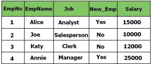
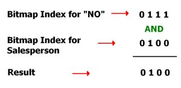

# Bitmap Indexing in DBMS
Bitmap Indexi[[canonical-cover-of-functional-dependencies-in-dbms]]ng is a powerful data indexing technique used in Database Management Systems (DBMS) to speed up queries- especially those involving large datasets and columns with only a few unique values (called low-cardinality columns).

In a database table, some columns only contain a few different values. For example:

- A column called New_Emp might only have "Yes" or "No".
- A column called Job might have just a few job roles: Analyst, Clerk, Salesperson, and Manager.

For such columns, Bitmap Indexing is a smart way to store data and quickly answer queries. Instead of storing full values repeatedly, Bitmap Indexing uses bitmaps (a series of 1s and 0s) to represent which rows contain which values.

## How Bitmap Indexing Works

1. Let’s use a sample Employee table:

There are 4 rows in the table, so we will represent values using 4-bit binary numbers.

2. Bitmap [[index|Index]] for the New_Emp Column

This column has only two values: Yes and No, and the length of the bit-maps will four as we have four rows in our Employee Table:

Here,

- Yes = 1001 means rows 1 and 4 are "Yes".
- No = 0110 means rows 2 and 3 are "No".

3. Bitmap [[index|Index]] for the Job Column

Each unique job title gets its own bitmap:

In the above table, each "1" marks the row where the job appears. For e.g:

- Analyst = 1000 means that Analyst is in first row
- Clerk = 0010 means that Salesperson is in third row, and so on.

## How Queries Use Bitmap Indexing

Let’s say you want to find: Employees who are NOT new (New_Emp = No) AND have the Job = Salesperson

Query for that will be:

> SELECT * FROM Employee WHERE New_Emp = "No" and Job = "Salesperson";

SELECT * FROM Employee WHERE New_Emp = "No" and Job = "Salesperson";

For this query, the DBMS will search the bitmap [[index]] of both columns and perform logical AND operation on those bits and find out the actual result:

Here the result 0100 represents that the second row has to be retrieved as a result.

## Creating a Bitmap Index in SQL

The syntax for creating a bitmap [[index]] in SQL is given below.

> CREATE BITMAP [[index|INDEX]] Index_Name ON Table_Name (Column_Name);

CREATE BITMAP [[index|INDEX]] Index_Name ON Table_Name (Column_Name);

For the above example of the employee table, the bitmap [[index]] on column New_Emp will be created as follows:

> CREATE BITMAP [[index|INDEX]] index_New_Emp ON Employee (New_Emp);

CREATE BITMAP [[index|INDEX]] index_New_Emp ON Employee (New_Emp);

## Advantages of Bitmap Indexing

- Efficiency in terms of insertion deletion and updation.
- Faster retrieval of records

## Disadvantages of Bitmap Indexing

- Only suitable for large tables
- Bitmap Indexing is time-consuming