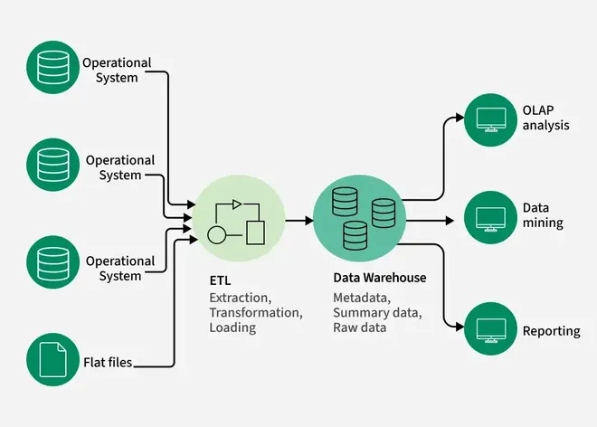

# Data Warehousing
Data warehousing is the process of collecting, integrating, storing and managing data from multiple sources in a central repository. It enables organizations to organize large volumes of current and historical data for efficient querying, analysis and reporting.

> Note: The main goal of data warehousing is to support decision-making by providing clean, consistent and timely access to data. It ensures fast data retrieval even when working with massive datasets.

Note: The main goal of data warehousing is to support decision-making by providing clean, consistent and timely access to data. It ensures fast data retrieval even when working with massive datasets.

## Need for Data Warehousing

- Handling Large Data Volumes: Traditional databases store limited data (MBs to GBs), while data warehouses are built to handle huge datasets (up to TBs), making it easier to store and analyze long-term historical data.
- Enhanced Analytics: Databases handle transactions; data warehouses are optimized for complex analysis and historical insights.
- Centralized Data Storage: A data warehouse combines data from multiple sources, giving a single, unified view for better decision-making.
- Trend Analysis: By storing historical data, a data warehouse allows businesses to analyze trends over time, enabling them to make strategic decisions based on past performance and predict future outcomes.
- Business Intelligence Support: Data warehouses work with BI tools to give quick access to insights, helping in data-driven decisions and improving efficiency.

## Components of Data Warehouse

- Data Sources: These are the various operational systems, databases and external data feeds that provide raw data to be stored in the warehouse.
- ETL (Extract, Transform, Load) Process: The ETL process is responsible for extracting data from different sources, transforming it into a suitable format and loading it into the data warehouse.
- Data Warehouse Database: This is the central repository where cleaned and transformed data is stored. It is typically organized in a multidimensional format for efficient querying and reporting.
- Metadata: Metadata describes the structure, source and usage of data within the warehouse, making it easier for users and systems to understand and work with the data.
- [[data-marts|Data Marts]]: These are smaller, more focused data repositories derived from the data warehouse, designed to meet the needs of specific business departments or functions.
- OLAP (Online Analytical Processing) Tools: OLAP tools allow users to analyze data in multiple dimensions, providing deeper insights and supporting complex analytical queries.
- End-User Access Tools: These are reporting and analysis tools, such as dashboards or Business Intelligence (BI) tools, that enable business users to query the data warehouse and generate reports.

## Types of Data Warehouses

The different types of Data Warehouses are:

1. Enterprise Data Warehouse (EDW): A centralized warehouse that stores data from across the organization for analysis and reporting.
2. Operational Data Store (ODS): Stores real-time operational data used for day-to-day operations, not for deep analytics.
3. Data Mart: A subset of a data warehouse, focusing on a specific business area or department.
4. Cloud Data Warehouse: A data warehouse hosted in the cloud, offering scalability and flexibility.
5. Big Data Warehouse: Designed to store vast amounts of unstructured and structured data for big data analysis.
6. Virtual Data Warehouse: Provides access to data from multiple sources without physically storing it.
7. Hybrid Data Warehouse: Combines on-premises and cloud-based storage to offer flexibility.
8. Real-time Data Warehouse: Designed to handle real-time data streaming and analysis for immediate insights.

## Data Warehouse vs DBMS

| Database | Data Warehouse |
| --- | --- |
| A common Database is based on operational or transactional processing. Each operation is an indivisible transaction. | A data Warehouse is based on analytical processing. |
| Generally, a Database stores current and up-to-date data which is used for daily operations. | A Data Warehouse maintains historical data over time. Historical data is the data kept over years and can used for trend analysis, make future predictions and decision support. |
| A database is generally application specific. | A Data Warehouse is integrated generally at the organization level, by combining data from different databases |
| Example: A database stores related data, such as the student details in a school. | Example: A data warehouse integrates the data from one or more databases , so that analysis can be done to get results , such as the best performing school in a city. |
| Constructing a Database is not so expensive. | Constructing a Data Warehouse can be expensive. |

Database

Data Warehouse

A common Database is based on operational or transactional processing. Each operation is an indivisible transaction.

A data Warehouse is based on analytical processing.

Generally, a Database stores current and up-to-date data which is used for daily operations.

A Data Warehouse maintains historical data over time. Historical data is the data kept over years and can used for trend analysis, make future predictions and decision support.

A database is generally application specific.

A Data Warehouse is integrated generally at the organization level, by combining data from different databases

Example: A database stores related data, such as the student details in a school.

Example: A data warehouse integrates the data from one or more databases , so that analysis can be done to get results , such as the best performing school in a city.

Constructing a Database is not so expensive.

Constructing a Data Warehouse can be expensive.

## Issues Occur while Building the Warehouse

### 1. When and How to Gather Data?

- Source-driven: Data sources push updates to the warehouse periodically or continuously.
- Destination-driven: The warehouse pulls data on a fixed schedule.
- Perfect sync is costly, so data is slightly outdated - acceptable for analysis.

### 2. What Schema to Use?

- Sources have varied formats.
- The warehouse stores a cleaned, unified version - not a direct copy, but a consistent snapshot for analysis.

### 3. Data Transformation and Cleansing

- Fixes errors like typos or invalid codes using reference data.
- Fuzzy lookup helps match similar but not identical values.

### 4. How to Propagate Updates?

- If warehouse schema = source schema -> easy sync.
- If not -> it becomes a view maintenance challenge.

### 5. What Data to Summarize?

- Raw data is large; store summaries (e.g., total sales by category).
- Aggregates support efficient querying without full details.

> Read more about Difficulties of Implementing Data Warehouses

Read more about Difficulties of Implementing Data Warehouses

## Real world Example of Data warehousing

Data Warehousing can be applied anywhere where we have a huge amount of data and we want to see statistical results that help in decision making.

### 1. E-commerce: Flipkart

- Data Gathering: Orders, returns, payments, user clicks, delivery updates.
- Schema: Combines source data into a structured star schema for analysis.
- Cleansing: Standardizes customer names, locations and product categories.
- Updates: Near real-time or scheduled loads for fresh insights.
- Summarization: Bestsellers by category, regional demand trends, logistics performance.

### 2. Banking: HDFC Bank

- Data Gathering: ATM transactions, online banking, credit card usage, loan records.
- Schema: Integrates data from core banking, CRM and fraud detection systems.
- Cleansing: Fixes inconsistencies in account info, transaction logs and addresses.
- Updates: Transaction data is batched and uploaded nightly.
- Summarization: Daily cash flow reports, high-risk account flags and customer profitability analysis.

## Advantages and Disadvantages of Data Warehousing

| Advantages | Disadvantages |
| --- | --- |
| Better Decisions: Centralized data supports faster, smarter decisions. | High Cost: Setup requires major investment. |
| Business Intelligence: Enables strong operational insights. | Complexity: Needs skilled professionals to manage. |
| High Data Quality: Ensures consistency and reliability. | Time-Consuming: Long setup and [[integration]] time. |
| Scalable: Handles large and growing datasets. | [[integration|Integration]] Issues: Combining data from sources can be challenging. |

Advantages

Disadvantages

Better Decisions: Centralized data supports faster, smarter decisions.

High Cost: Setup requires major investment.

Business Intelligence: Enables strong operational insights.

Complexity: Needs skilled professionals to manage.

High Data Quality: Ensures consistency and reliability.

Time-Consuming: Long setup and [[integration]] time.

Scalable: Handles large and growing datasets.

[[integration|Integration]] Issues: Combining data from sources can be challenging.