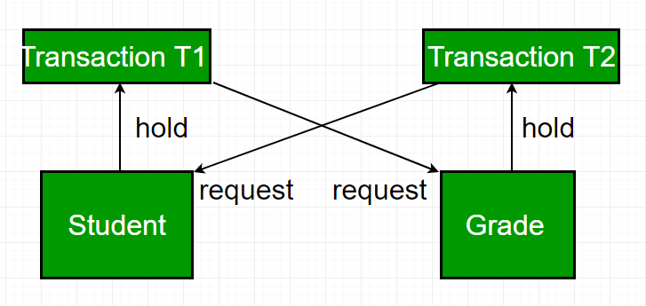
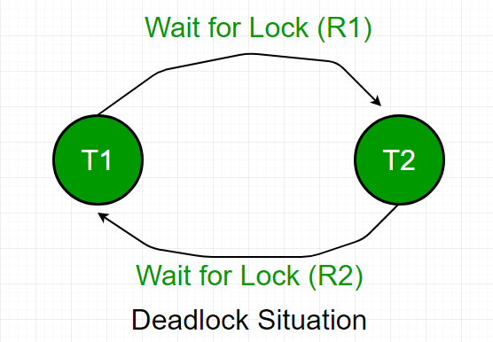

# Deadlock in DBMS
A deadlock occurs in a multi-user database environment when two or more transactions block each other indefinitely by each holding a resource the other needs. This results in a cycle of dependencies (circular wait) where no transaction can proceed.

For Example: Consider the image below

In the above image, we can see that:

- T1 locks Resource "Student" and needs Resource "Grade"
- T2 locks Resource "Grade" and needs Resource "Student"
- T1 waits for T2, T2 waits for T1, hence resulting in a deadlock

## Necessary Conditions of Deadlock

For a deadlock to occur, all four of these conditions must be true:

- Mutual Exclusion: Only one transaction can hold a particular resource at a time.
- Hold and Wait: The Transactions holding resources may request additional resources held by others.
- No Preemption: The Resources cannot be forcibly taken from the transaction holding them.
- Circular Wait: A cycle of transactions exists where each transaction is waiting for the resource held by the next transaction in the cycle.

## Why Deadlocks Are a Problem?

- Transactions are stuck indefinitely.
- System throughput decreases as transactions remain blocked.
- Resources are held unnecessarily, preventing other operations.
- Can lead to performance bottlenecks or even system-wide standstill if not handled.

## Real-Life Example

### Transaction T1:

- Locks rows in Students
- Wants to update rows in Grades

### Transaction T2:

- Locks rows in Grades
- Wants to update rows in Students

Both wait on each other and this results in deadlock, and all database activity comes to a standstill.

## How to Handle Deadlocks

There are some approaches and by ensuring them, we can handle deadlocks. They are discussed below:

### 1. Deadlock Avoidance

Plan transactions in a way that prevents deadlock from occurring.

Methods:

- Access resources in the same order. For e.g., always access Students first, then Grades
- Use row-level locking and READ COMMITTED isolation level. It reduces chances, but doesn’t eliminate deadlocks.completely

### 2. Deadlock Detection

If a transaction waits too long, the DBMS checks if it’s part of a deadlock.

Method: Wait-For Graph

- Nodes: Transactions
- Edges: Waiting relationships
- If there’s a cycle, a deadlock exists. It's mostly suitable for small to medium databases

### 3. Deadlock Prevention

For a large database, the [[deadlock-prevention|deadlock prevention]] method is suitable. A deadlock can be prevented if the resources are allocated in such a way that a deadlock never occurs. The DBMS analyzes the operations whether they can create a deadlock situation or not, If they do, that transaction is never allowed to be executed.

[[deadlock-prevention|Deadlock prevention]] mechanism proposes two schemes:

1. Wait-Die Scheme (Non-preemptive)

- Older transactions are allowed to wait.
- Younger transactions are killed (aborted and restarted) if they request a resource held by an older one

For example:

- Consider two transaction- T1 = 10 and T2 = 20
- If T1 (older) wants a resource held by T2 → T1 waits
- If T2 (younger) wants a resource held by T1 → T2 dies and restarts

Prevents deadlock by not allowing a younger transaction to wait and form a wait cycle.

2. Wound-Wait Scheme (Preemptive)

- Older transactions are aggressive (preemptive) and can force younger ones to abort.
- Younger transactions must wait if they want a resource held by an older one.

For example:

- Consider two transaction- T1 = 10 and T2 = 20
- If T1 (older) wants a resource held by T2 → T2 is killed, T1 proceeds.
- If T2 (younger) wants a resource held by T1 → T2 waits

Prevents deadlock by not allowing younger transactions to block older ones.

The following table lists the differences between Wait-Die and Wound-Wait scheme prevention schemes:

| Wait - Die | Wound -Wait |
| --- | --- |
| It is based on a non-preemptive technique. | It is based on a preemptive technique. |
| In this, older transactions must wait for the younger one to release its data items. | In this, older transactions never wait for younger transactions. |
| The number of aborts and rollbacks is higher in these techniques. | In this, the number of aborts and rollback is lesser. |

## Applications Affected by Deadlock

1. Delayed Transactions: blocked indefinitely
2. Lost Transactions: may get aborted or rolled back
3. Reduced Concurrency: fewer simultaneous operations
4. Increased Resource Usage: idle but locked resources
5. Poor User Experience: slow response or system freeze