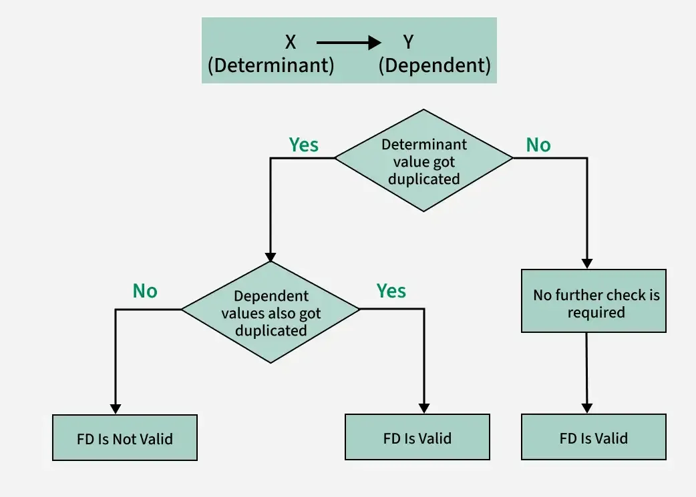

# Functional Dependency in DBMS
A functional dependency occurs when the value of one attribute (or a set of attributes) uniquely determines the value of another attribute. This relationship is denoted as:

X → Y

Here, X is the determinant, and Y is the dependent attribute. This means that for each unique value of X, there is precisely one corresponding value of Y.

Consider a table named Students with the following attributes:

| StudentID | StudentName | StudentAge |
| --- | --- | --- |
| 101 | Rahul | 23 |
| 102 | Ankit | 22 |
| 103 | Aditya | 22 |
| 104 | Sahil | 24 |
| 105 | Ankit | 23 |

StudentID

StudentName

StudentAge

101

Rahul

102

Ankit

103

Aditya

104

Sahil

105

Ankit

The above table has the following functional dependencies

> StudentID -> StudentNameStudentID -> StudentAge

StudentID -> StudentNameStudentID -> StudentAge

Note that the functional dependencies StudentName -> StudentAge or StudentAge -> StudentName Do not hold.

## How to represent functional dependency in DBMS?

- Functional dependency is expressed in the form of equations. For example, if we have an employee record with fields "EmployeeID", "FirstName" and "LastName" we can specify the function as follows:

> EmployeeID -> FirstName, LastName

EmployeeID -> FirstName, LastName

- To represent functional dependency in DBMS has two main features: left (LHS) and right (RHS) of the arrow (->).
- For example, if we have a table with attributes "X", "Y" and "Z" and the attribute "X" can determine the value of the attributes "Y" and "Z".

> X -> Y, Z

X -> Y, Z

- This symbol indicates that the value in property "X" determines the values in property "Y" and "Z". So if you know the value of "X", you can also determine the value of "Y" and "Z".

## Benefits of Functional Dependency in DBMS

The concept of normalization is based on functional dependencies. Using functional dependencies, we break a table in multiple tables that helps us in preventing duplicate data and hence Improves Data Quality, less errors and better database design.

## Related Topics :

- Types of functional dependencies
- Armstrong’s Axioms in Functional Dependency in DBMS.