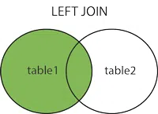
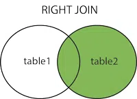
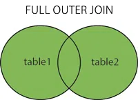

# Inner Join vs Outer Join
A Join in SQL is used to combine rows from two or more tables based on a related column between them. It allows you to fetch meaningful information by linking data stored across multiple tables in a relational database. The two types of joins are Inner Join and Outer Join.

Let's proceed with an example demonstrating the process of Inner Join and Outer Join.

Student Table

| EnrollNo | StudentName | Address |
| --- | --- | --- |
| 1001 | geek1 | geeksquiz1 |
| 1002 | geek2 | geeksquiz2 |
| 1003 | geek3 | geeksquiz3 |
| 1004 | geek4 | geeksquiz4 |

StudentCourse Table

| CourseID | EnrollNo |
| --- | --- |
| 1 | 1001 |
| 2 | 1001 |
| 3 | 1001 |
| 1 | 1002 |
| 2 | 1003 |

## Inner Join/Simple Join

In an INNER join, it allows retrieving data from two tables with the same ID.

An Inner Join returns only the matching rows between the two tables based on a specified condition. It combines data from two tables based on a common column between them, which is specified using the ON keyword in SQL. If a row in one table does not have a matching row in the other table, that row will not be included in the result set.

Syntax:

> SELECT COLUMN1, COLUMN2 FROM [TABLE 1] INNER JOIN [TABLE 2] ON Condition;

SELECT COLUMN1, COLUMN2 FROM

[TABLE 1] INNER JOIN [TABLE 2]

ON Condition;

The following is a join query that shows the names of students enrolled in different courses.

Query:

> SELECT StudentCourse.CourseID,Student.StudentNameFROM StudentINNER JOIN StudentCourse ON StudentCourse.EnrollNo = Student.EnrollNoORDER BY StudentCourse.CourseID;

SELECT StudentCourse.CourseID,Student.StudentNameFROM StudentINNER JOIN StudentCourse ON StudentCourse.EnrollNo = Student.EnrollNoORDER BY StudentCourse.CourseID;

Note: Inner is optional above. Simple JOIN is also considered as INNER JOIN The above query would produce the following result.

| CourseID | StudentName |
| --- | --- |
| 1 | geek1 |
| 1 | geek2 |
| 2 | geek1 |
| 2 | geek3 |
| 3 | geek1 |

Example:

For example, let's say we have two tables, Table1 and Table2, with the following data:

Table 1

| ID | Name |
| --- | --- |
| 1 | John |
| 2 | Sarah |
| 3 | David |

Table 2

| ID | Address |
| --- | --- |
| 1 | 123 Main St. |
| 2 | 456 Elm St. |
| 4 | 789 Oak St. |

If we perform an Inner Join on these tables using the ID column, the result set would only include the matching rows from both tables, which are the rows with ID values of 1 and 2:

Query:

> SELECT Table1.ID, Table 1. Name, Table 2.AddressFROM Table1INNER JOIN Table2ON Table1.ID = Table2.ID

SELECT Table1.ID, Table 1. Name, Table 2.AddressFROM Table1INNER JOIN Table2ON Table1.ID = Table2.ID

Output:

| ID | Name | Address |
| --- | --- | --- |
| 1 | John | 123 Main St. |
| 2 | Sarah | 456 Elm St. |

## How To Use Inner Join?

Inner Join is basically performed by just selecting the records having the common values or the matching values in both tables. In case of no common values, no data is shown in the output.

Syntax:

> Select Table1.Col_Name, Table2.Col_Name....From Table1Inner Join Table2on Table1.Common_Col = Table2.Common_Col;

Select Table1.Col_Name, Table2.Col_Name....From Table1Inner Join Table2on Table1.Common_Col = Table2.Common_Col;

If there are 3 Tables present in the database, then the Inner Join works as follows:

> Select Table1.Col_Name, Table2.Col_Name, Table3.Col_Name....From ((Table1Inner Join Table2on Table1.Common_Col = Table2.Common_Col)Inner Join Table3on Table1.Common_Col = Table3.Common_Col);

Select Table1.Col_Name, Table2.Col_Name, Table3.Col_Name....From ((Table1Inner Join Table2on Table1.Common_Col = Table2.Common_Col)Inner Join Table3on Table1.Common_Col = Table3.Common_Col);

| Advantage | Disadvantage |
| --- | --- |
| Less Duplicate Data: Returns only matching rows, reducing redundancy. | Possible Data Loss: Ignores rows without matches. |
| Faster Execution: Works on matched rows only, so it's quicker. | Complex Queries: Can be hard to write with many tables. |
| More Accurate Results: Excludes unmatched or irrelevant data. | Overlapping Data: May return repeated or similar data. |

Advantage

Disadvantage

Less Duplicate Data: Returns only matching rows, reducing redundancy.

Possible Data Loss: Ignores rows without matches.

Faster Execution: Works on matched rows only, so it's quicker.

Complex Queries: Can be hard to write with many tables.

More Accurate Results: Excludes unmatched or irrelevant data.

Overlapping Data: May return repeated or similar data.

## Outer Join

An Outer Join returns all the rows from one table and matching rows from the other table based on a specified condition. It combines data from two tables based on a common column between them, which is also specified using the ON keyword in SQL. In addition to the matching rows, it also includes rows from one table that do not have matching rows in the other table.

Outer Join is of three types:

1. Left outer join
2. Right outer join
3. Full Join

### 1. Left Outer join

Left Outer Join returns all rows of a table on the left side of the join. For the rows for which there is no matching row on the right side, the result contains NULL on the right side.

Left Outer Join returns all the rows from the left table and matching rows from the right table. If a row in the left table does not have a matching row in the right table, the result set will include NULL values for the columns in the right table.

Syntax:

> SELECT T1.C1, T2.C2FROM TABLE T1 LEFT JOIN TABLE T2 ON T1.C1= T2.C1;

SELECT T1.C1, T2.C2FROM TABLE T1 LEFT JOIN TABLE T2 ON T1.C1= T2.C1;

Query:

> SELECT Student.StudentName,StudentCourse.CourseIDFROM StudentLEFT OUTER JOIN StudentCourse ON StudentCourse.EnrollNo = Student.EnrollNoORDER BY StudentCourse.CourseID;

SELECT Student.StudentName,StudentCourse.CourseIDFROM StudentLEFT OUTER JOIN StudentCourse ON StudentCourse.EnrollNo = Student.EnrollNoORDER BY StudentCourse.CourseID;

Note: OUTER is optional above. Simple LEFT JOIN is also considered as LEFT OUTER JOIN

| StudentName | CourseID |
| --- | --- |
| geek4 | NULL |
| geek2 | 1 |
| geek1 | 1 |
| geek1 | 2 |
| geek3 | 2 |
| geek1 | 3 |

### 2. Right Outer Join

Right Outer Join is similar to Left Outer Join (Right replaces Left everywhere). Right Outer Join returns all the rows from the right table and matching rows from the left table. If a row in the right table does not have a matching row in the left table, the result set will include NULL values for the columns in the left table.

Syntax:

> SELECT T1.C1, T2.C2 FROM TABLE T1 RIGHT JOIN TABLE T2 ON T1.C1= T2.C1;

SELECT T1.C1, T2.C2 FROM TABLE T1

RIGHT JOIN TABLE T2 ON T1.C1= T2.C1;

Example:

Table Record

| Roll_Number | Name | Age |
| --- | --- | --- |
| 1 | Harsh | 18 |
| 2 | Ankesh | 19 |
| 3 | Rupesh | 18 |
| 4 | Vaibhav | 15 |
| 5 | Naveen | 13 |
| 6 | Shubham | 15 |
| 7 | Ankit | 19 |
| 8 | Bhupesh | 18 |

Table Course

| Course_ID | Roll_Number |
| --- | --- |
| 1 | 1 |
| 2 | 2 |
| 2 | 3 |
| 3 | 4 |
| 1 | 5 |
| 4 | 9 |
| 5 | 10 |
| 4 | 11 |

Query:

> SELECT Record.NAME,Course.COURSE_ID FROM RecordRIGHT JOIN Course ON Course.Roll_Number = Record.Roll_Number;

SELECT Record.NAME,Course.COURSE_ID FROM RecordRIGHT JOIN Course ON Course.Roll_Number = Record.Roll_Number;

Output:

| Name | Course_ID |
| --- | --- |
| Harsh | 1 |
| Ankesh | 2 |
| Rupesh | 2 |
| Vaibhav | 3 |
| Naveen | 1 |
| NULL | 4 |
| NULL | 5 |
| NULL | 4 |

### 3. Full Outer Join

Full Outer Join contains the results of both the Left and Right outer joins. It is also known as cross-join. It will provide a mixture of two tables.

Full Outer Join returns all the rows from both tables, including matching and non-matching rows. If a row in one table does not have a matching row in the other table, the result set will include NULL values for the columns in the table that do not have a match.

Syntax:

> SELECT * FROM T1 CROSS-JOIN T2;

SELECT * FROM T1

CROSS-JOIN T2;

Query:

> SELECT Record.NAME,Course.COURSE_ID FROM RecordFULL JOIN Course ON Course.Roll_Number = Record.Roll_Number;

SELECT Record.NAME,Course.COURSE_ID FROM RecordFULL JOIN Course ON Course.Roll_Number = Record.Roll_Number;

Output:

| Name | Course_ID |
| --- | --- |
| Harsh | 1 |
| Ankesh | 2 |
| Rupesh | 2 |
| Vaibhav | 3 |
| Naveen | 1 |
| Shubham | NULL |
| Ankit | NULL |
| Bhupesh | NULL |
| NULL | 4 |
| NULL | 5 |
| NULL | 4 |

## How To Use Outer Join?

Outer Join is performed by the selection of the records from all the tables given there. Left Outer Join works by selecting all records from the left table and matching records from the right table. Similarly, Right Outer Join works by selecting all records from the right table and matching records from the left table and the Full Outer Join returns all records if a match occurs in the left or the right table.

## Advantages of Outer Join

- Increased Data Retrieval: Outer joins can retrieve more data than inner joins since they include non-matching rows in the result set.
- Data Integrity: Outer joins can help maintain data integrity by ensuring that all records in the primary table are returned, even if there are no corresponding records in the secondary table.
- Data Analysis: Outer joins can be useful for data analysis, especially when exploring relationships between data sets and identifying trends and patterns.

## Disadvantages of Outer Join

- Slow Query Execution: Outer joins can be slower to execute than inner joins, especially when dealing with large data sets.
- Data Duplication: Outer joins can return duplicate data when the secondary table has multiple matching records.
- Data Quality: Outer joins may return inaccurate or incomplete data if the tables being joined have incomplete or inconsistent data.

## Inner Join vs Outer Join (Difference Table)

| Feature | Inner Join | Outer Join |
| --- | --- | --- |
| Defination | Returns rows with matching values in both tables by filtering out. | It is directly opposite of Inner join returns rows but return all of them including the unmatched also. |
| Use cases | Used when we want matching data. | when we need all data without concerning about match and unmatched. |
| Types | Single Type. | Three different Types: Left Outer Join, Right Outer Join, Full Outer Join. |
| ExampleResult | Only the common data between one or more tables. | All data from one or both tables, with giving NULLs for non-matching rows or the unmatched ones. |

Feature

Inner Join

Outer Join

Defination

Returns rows with matching values in both tables by filtering out.

It is directly opposite of Inner join returns rows but return all of them including the unmatched also.

Use cases

Used when we want matching data.

when we need all data without concerning about match and unmatched.

Types

Single Type.

Three different Types: Left Outer Join, Right Outer Join, Full Outer Join.

Example

Result

Only the common data between one or more tables.

All data from one or both tables, with giving NULLs for non-matching rows or the unmatched ones.