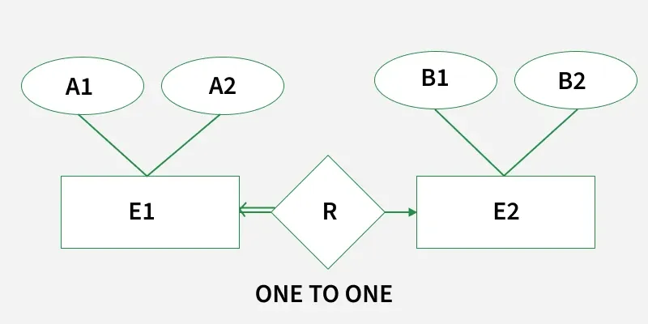
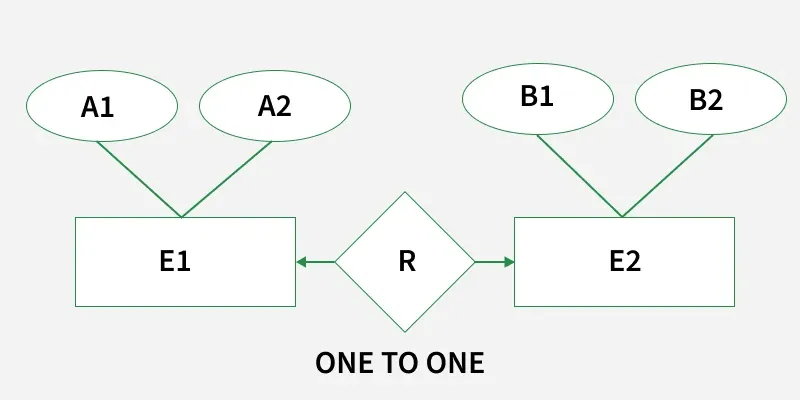
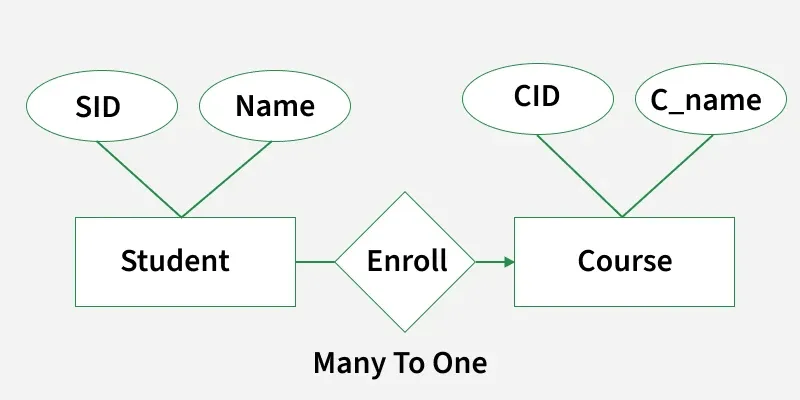
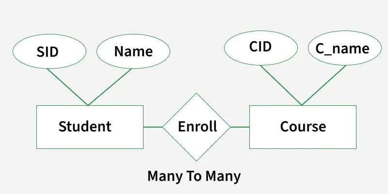

# Minimization of ER Diagrams
Minimization of an ER Diagram refers to reducing the number of tables or entities in the diagram to simplify its structure. When an ER diagram contains too many tables, it becomes complex, difficult to read, and harder for administrators to manage. Minimizing the diagram enhances clarity and efficiency by merging or simplifying entities based on cardinality and relationship analysis.

Benefits of Minimization:

- Improved Readability: Fewer tables mean easier visualization.
- Better Understandability: Simple relationships are easier to understand and manage.
- Efficient Storage and Maintenance: Reduces redundancy and complexity.
- Faster Query Processing: Optimized structure helps in better performance.

## Cardinality

Cardinality means that what is the number of relationships between the two entity sets in any relationship model. There are four types of cardinality which are mentioned below:

- One-to-One (1:1): Each entity in set A is related to at most one entity in set B and vice versa.
- One-to-Many (1:N): An entity in set A can be related to many entities in set B, but each entity in B is related to only one entity in A.
- Many-to-One (N:1): Opposite of One-to-Many.
- Many-to-Many (M:N): Entities in both sets A and B can be related to multiple entities in the other set.

### 1. One-to-One Cardinality

A one-to-one cardinality means one record in a table is related to only one record in another table, and vice versa. One to One Cardinality has two possible cases where we have the case of either total participation or no participation at one end. There are two possibilities:

1.0 Case A: Total Participation on Both Ends (Perfect 1:1 Relationship):In some one-to-one relationships, both entities participate totally, meaning:

- Each entity in E1 is related to exactly one entity in E2
- Each entity in E2 is related to exactly one entity in E1

This is called a Perfect 1:1 Relationship.

#### Example

Each Student receives at most one Scholarship. Each Scholarship is awarded to exactly one Student.

Since the mapping is strictly one-to-one and total on both sides:

- No NULL values will appear after merging
- No redundancy will be created
- Every row corresponds exactly to one row in the other table

Therefore, both tables can safely be merged into a single table.

> A single table is sufficient for this relationship.

A single table is sufficient for this relationship.

1.1 Case A: Total Participation at One End: All entities in one table must participate. Merge the two tables into one single table.

- A1 and B1 are the primary keys of E1 and E2 respectively. In the above diagram, we have total participation at the E1 ends.
- Only a single table is required in this case having the primary key of E2 as its primary key.
- Since E2 is in partial participation, atleast one entry in E2 does not participate in relationship set, but all entries in E1 are related to an entry in E2.
- Therefore E2 cannot be null for any value of E1, but E1 will be null for atleast one value of E2. To refer Case-1 click Here

> Note: Only 1 table is required.

Note: Only 1 table is required.

1.2 Case B: Partial Participation: One entity does not fully participate. Avoid merging all entities into one table to prevent NULL values.

1. A1 and B1 are the primary keys of E1 and E2 respectively.
2. The primary key of R can be A1 or B1, but we can't still combine all three tables into one. if we do so, some entries in the combined table may have NULL entries.
3. So the idea of merging all three tables into one is not good. But we can merge R into E1 or E2. So a minimum of 2 tables is required.

> Note: 2 table is required (Entity + merged relationship).

Note: 2 table is required (Entity + merged relationship).

### 2. Many-to-One or One-to-Many Cardinality

A one-to-many (1:N) or many-to-one (N:1) relationship in DBMS describes how records in two entities are associated. In a one-to-many relationship, a single record in one table (the "one" side) can be linked to multiple records in another table (the "many" side).

Example: A student can be enrolled only in one course, but a course can be enrolled by many students. For Student(SID, Name), SID is the primary key. For Course(CID, C_name ), CID is the primary key.

Table Student:

| SID | Name |
| --- | --- |
| 1 | A |
| 2 | B |
| 3 | C |
| 4 | D |

Table Course:

| CID | C_name |
| --- | --- |
| c1 | Z |
| c2 | Y |
| c3 | X |

Table Enroll:

| SID | CID |
| --- | --- |
| 1 | C1 |
| 2 | C1 |
| 3 | C3 |
| 4 | C2 |

- Now the question is, what should be the primary key for Enroll? Should it be SID or CID or both combined into one? We can't have CID as the primary key because a CID can have multiple SIDs.
- (SID, CID) can distinguish table uniquely, but it is not minimum.
- So SID is the primary key for the relation enrollment. For the above ER diagram, we considered three tables in the database, these are:

| Student |
| --- |
| Enroll |
| Course |

But we can combine the Student and the Enroll table renamed as Student_enroll.

Table Student_Enroll:

| SID | Name | CID |
| --- | --- | --- |
| 1 | A | C1 |
| 2 | B | C1 |
| 3 | C | C3 |
| 4 | D | C2 |

Student and enroll tables are merged now. So require a minimum of two DBMS tables for Student_enroll and Course.

> Note: In One to Many relationships we can have a minimum of two tables.

Note: In One to Many relationships we can have a minimum of two tables.

### 3. Many to Many Cardinality

- A many-to-many cardinality means that multiple records in one table can be related to multiple records in another table.
- This type of relationship requires a separate table to store the combinations of both entities.
- It helps avoid data duplication and maintains proper structure.et Let us consider the above example with the change that now a student can enroll in more than 1 course.

Table Student:

| SID | Name |
| --- | --- |
| 1 | A |
| 2 | B |
| 3 | C |
| 4 | D |

Table Course:

| CID | C_Name |
| --- | --- |
| C1 | Z |
| C2 | Y |
| C3 | X |

Table Enroll:

| SID | CID |
| --- | --- |
| 1 | C1 |
| 1 | C2 |
| 2 | C1 |
| 2 | C2 |
| 3 | C3 |
| 4 | C2 |

Now, the same question arises. What is the primary key to Enroll relation? If we carefully analyze, the primary key for Enroll table is ( SID, CID ). But in this case, we can't merge Enroll table with any of the Student and Course. If we try to merge Enroll with any one of the Student and Course it will create redundant data.

> Note: A minimum of three tables are required in the Many to Many relationships.

Note: A minimum of three tables are required in the Many to Many relationships.