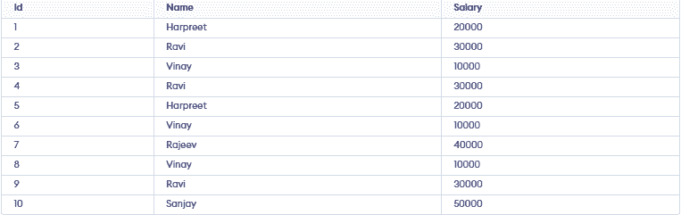
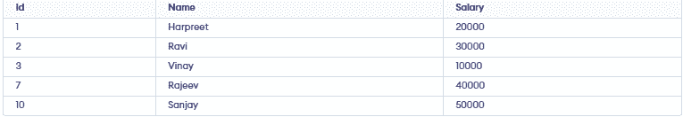
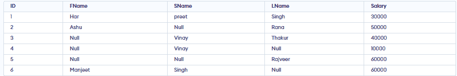
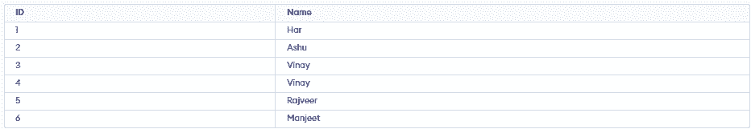
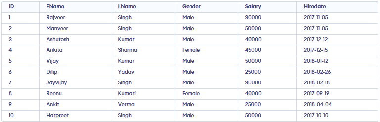

# SQL Interview Questions - DBMS
A database is an organized collection of electronic data managed by a DBMS, which handles storage, access, security, and maintenance (e.g., tables with rows and columns in relational systems).

SQL (Structured Query Language) is the standard language used with relational DBMSs to define schemas (DDL), manipulate and query data (DML/DQL), and optimize access—so it’s a core skill for developers, data analysts, and DBAs and a frequent interview focus. SQL covers:

- Data definition (defining schemas/structures)
- Data manipulation (inserting, updating, deleting data)
- Querying (retrieving data as needed)
- Optimization (tuning access/performance)
- Together, these enable efficient storage, retrieval, and management of data in relational database systems.

### 1. What is the difference between CHAR and VARCHAR2?

- CHAR stores fixed-length data and pads extra spaces.
- VARCHAR2 stores variable-length data, saving storage space.

### 2. What is a view in SQL?

A view is a virtual table created by a SELECT query. It does not store data itself, but presents data from one or more tables in a structured way. Views simplify complex queries, improve readability, and enhance security by restricting access to specific rows or columns.

### 3. What is the purpose of the UNIQUE constraint?

The UNIQUE constraint ensures that all values in a column (or combination of columns) are distinct. This prevents duplicate values and helps maintain data integrity.

### 4. What is a composite primary key?

A composite primary key uses two or more columns together to uniquely identify each row when one column alone isn’t sufficient.

### 5. Explain the difference between the WHERE and HAVING clauses

`WHERE`

`HAVING`

WHERE filters individual rows before grouping or aggregation, so it can’t use aggregate functions like SUM or COUNT; it’s best for narrowing raw data early (e.g., a date range or status).

`WHERE`

`SUM`

`COUNT`

HAVING filters the resulting groups after GROUP BY, so it’s meant for conditions on aggregates (e.g., groups with totals above a threshold).

`HAVING`

`GROUP BY`

Example

```
SELECT customer_id, COUNT(*) AS orders_2025FROM ordersWHERE order_date >= '2025-01-01' AND order_date < '2026-01-01'      GROUP BY customer_idHAVING COUNT(*) > 5;                                            
```

### 6. What are SQL joins, and what are the differences between INNER, LEFT, RIGHT, and FULL joins?

SQL joins combine rows from two tables based on a matching condition (typically keys) to answer questions that span both tables.

- An INNER JOIN returns only matches that exist in both tables (the intersection).
- A LEFT JOIN returns all rows from the left table and the matching rows from the right; when there’s no match, right-side columns are NULL.
- A RIGHT JOIN is the mirror image: all rows from the right table plus matches from the left, NULL when absent.
- A FULL (OUTER) JOIN returns all rows from either table, filling in NULL where a counterpart is missing.

`NULL.`

`NULL`

`NULL `

### 7. Describe a PRIMARY KEY and how it differs from a UNIQUE key

`PRIMARY KEY`

`UNIQUE`

A PRIMARY KEY uniquely identifies each row in a table: it combines UNIQUE + NOT NULL, there can be only one per table (though it can be composite across multiple columns), and it’s the default target for foreign keys.

A UNIQUE key also enforces uniqueness, but doesn’t require NOT NULL and you can have many UNIQUE constraints per table.

### 8. What is a CTE (Common Table Expression) and when would you use it?

A CTE (Common Table Expression) is a temporary, named result set defined with WITH that exists only for the duration of a single statement. You use CTEs to break complex logic into steps, avoid repeating the same subquery, improve readability/maintenance, enable recursion (e.g., org charts, folder trees), and make debugging easier.

`WITH`

### 9. Explain normalization and briefly describe the different normal forms

Normalization organizes relational data to minimize redundancy and prevent update/insert/delete anomalies by splitting tables based on dependencies while preserving meaning.

- 1NF requires each column to hold atomic values and no repeating groups.
- 2NF is 1NF plus no partial dependence on a composite key—every non-key must depend on the whole key.
- 3NF is 2NF plus no transitive dependencies—non-keys depend only on the key, not on other non-keys.
- BCNF strengthens 3NF: for every functional dependency X→Y, X must be a candidate key (fixes edge cases like overlapping keys)
- 4NF removes multi-valued dependencies .
- 5NF (PJNF) eliminates join dependencies, decomposing so tables can be losslessly recombined without spurious tuple.

### 10. What is the difference between UNION and UNION ALL?

`UNION`

`UNION ALL`

UNION combines results from two (or more) SELECTs and removes duplicates (it performs a DISTINCT across all columns), which adds sorting/hash work and can be slower.

`UNION`

UNION ALL keeps duplicates and usually runs faster because it simply appends result sets.

`UNION ALL`

Example:

```
SELECT Name FROM Customers  UNION  SELECT Name FROM Employees
```

Example:

```
SELECT Name FROM Customers  UNION ALL  SELECT Name FROM Employees;
```

### 11. How do clustered and non‑clustered indexes differ and when should each be used?

A clustered [[index]] stores table rows in the physical order of the [[index]] key (the data pages are the [[index]]), so you can have only one; it’s ideal for range scans and primary-key lookups.

- Key is narrow, stable, and increasing (e.g., order_id, order_date).
- Queries often do range scans or ORDER BY on that key.

`order_id`

`order_date`

A non-clustered [[index]] is a separate structure (key → row locator) and you can have many; it accelerates specific filters, joins, and sorts without changing the table’s row order.

- You need fast point lookups or high-selectivity filters (WHERE email=?).
- Columns are common JOIN/GROUP BY/ORDER BY targets.
- You can cover queries via INCLUDEd columns.

`WHERE email=?`

`INCLUDE`

### 12. How do you perform pattern matching in SQL

SQL supports pattern matching mainly with LIKE (and NOT LIKE) using wildcards—% for any-length string and _ for a single character.

`LIKE`

`NOT LIKE`

`%`

`_`

PostgreSQL has case-insensitive ILIKE, SIMILAR TO, and regex operators (~, ~*), MySQL/SQLite offer REGEXP/REGEXP_LIKE, and all allow an optional ESCAPE clause to treat % or _ as literals.

`ILIKE`

`SIMILAR TO`

`~`

`~*`

`REGEXP`

`REGEXP_LIKE`

`ESCAPE`

`%`

`_`

### 13. How would you calculate the running total of sales for each product?

Use a window (analytic) function: compute SUM(amount) over rows of the same product, ordered by time, accumulating from the start up to the current row. This keeps row detail while adding a running total.

`SUM(amount)`

```
SELECT  product_id,  sale_date,  amount,  SUM(amount) OVER (    PARTITION BY product_id    ORDER BY sale_date, sale_id            ROWS BETWEEN UNBOUNDED PRECEDING AND CURRENT ROW  ) AS running_totalFROM sales;
```

### 14. Explain correlated subqueries and provide an example use case

A correlated subquery is a subquery that depends on the current row of the outer query—i.e., it references columns from the outer query and is re-evaluated for each outer row.

Example use case employees paid above their own department’s average:

```
SELECT e.employee_id, e.name, e.salary, e.department_idFROM employees eWHERE e.salary >      (SELECT AVG(e2.salary)       FROM employees e2       WHERE e2.department_id = e.department_id);
```

### 15. What are EXISTS and NOT EXISTS and how do they differ from IN

EXISTS checks whether a correlated subquery returns at least one row; NOT EXISTS checks that it returns none. They return boolean and stop at the first match, ignoring what the subquery selects. IN compares a value against a list/set (literal list or subquery output).

`EXISTS`

`NOT EXISTS`

`IN`

- EXISTS/NOT EXISTS use a correlated subquery and are robust with NULLs
- NOT IN is NULL-sensitive if the subquery can yield NULL, NOT IN may return no rows (unknown comparison), so prefer NOT EXISTS
- Performance varies EXISTS often wins for large subqueries with indexes; IN is fine for small, deduplicated lists.

`EXISTS/NOT EXISTS`

`NULL`

`NOT IN`

`NULL`

`NOT IN`

`NOT EXISTS`

`EXISTS`

`IN`

### 16. Explain anti‑joins

An anti-join returns rows from one table (the “left”) that have no matching rows in another table (the “right”) based on a join condition—i.e., “in A but not in B.” It’s commonly expressed as a LEFT JOIN followed by WHERE right.pk IS NULL, or with a semi-join style predicate like NOT EXISTS.

`LEFT JOIN`

`WHERE right.pk IS NULL`

`NOT EXISTS`

### 17. Explain the difference between RANK(), DENSE_RANK() and ROW_NUMBER()

ROW_NUMBER() assigns a unique sequential number to each row within a partition based on the order—no ties share a number (ties are broken arbitrarily by the ORDER BY). RANK() assigns the same rank to tied rows but leaves gaps after ties (1,1,3…). DENSE_RANK() also assigns the same rank to ties but doesn’t leave gaps (1,1,2…).

`ROW_NUMBER()`

`RANK()`

`DENSE_RANK()`

### 18. Explain the purpose of LAG and LEAD functions

LAG and LEAD are window functions that let you look at values from previous (LAG) or next (LEAD) rows in the same result set without self-joins. They’re used for comparisons across rows e.g., changes from yesterday to today, detecting trends, or filling forward/backward values

`LAG`

`LEAD`

`LAG`

`LEAD`

### 19. What is a cross join and how does it differ from an inner join?

A CROSS JOIN returns the cartesian product of two tables—every row from A paired with every row from B so the result size is rows(A) × rows(B), and it doesn’t use a join condition

`rows(A) × rows(B)`

An INNER JOIN returns only the rows where the specified join condition matches between the two tables (e.g., matching keys), so its result is a filtered subset, not every combination

- Use a cross join for generating combinations (dates × products, sizes × colors) .
- When you intentionally need all pairings; use an inner join to combine related records.

### 20. Explain foreign keys and how they enforce referential integrity

A foreign key (FK) is a column (or set of columns) in a child table that references a primary/unique key in a parent table to ensure the child’s values actually exist in the parent. This enforces referential integrity by preventing actions that would create “orphan” rows.

### 21. Describe set operations like UNION, INTERSECT and EXCEPT and when each is useful

UNION, INTERSECT, and EXCEPT are SQL set operations that combine results from two queries with the same number of columns and compatible data types. UNION returns the distinct union of both result sets (removes duplicates).

`UNION`

`INTERSECT`

`EXCEPT`

- Use it to merge similar data from multiple sources
- INTERSECT returns only rows common to both queries—ideal for finding overlap.
- EXCEPT (called MINUS in Oracle) returns rows in the first query that aren’t in the second.

`MINUS`

### 22. How would you optimize a slow query?

To optimize a slow query,

- First measure: reproduce the issue, capture timings, and run EXPLAIN/EXPLAIN ANALYZE to see the plan, row estimates, and bottlenecks
- Next, fix fundamentals: ensure current statistics, right indexes
- sargable predicates (avoid functions on columns, leading % wildcards, or expressions that prevent
- Reduce data early with selective WHERE filters, fetch only needed columns (no SELECT *), and prefer EXISTS over IN for semi-joins
- Tame row explosion by checking JOIN selectivity, de-duplicating before joins, and pre-aggregating where helpful.
- Rewrite problematic patterns (split wide ORs into UNION ALL, replace correlated subqueries with joins, consider window functions carefully)
- For large sets, use keyset pagination (seek method) instead of OFFSET, and consider materialized views, caching, or partitioning for heavy, recurring analytics.

`EXPLAIN/EXPLAIN ANALYZE`

`%`

`WHERE`

`SELECT *`

`EXISTS`

`IN`

`OR`

`UNION ALL`

`OFFSET`

### 23. What is a query in SQL?

A query is a SQL statement used to retrieve, update, or manipulate data in a database. The most common type of query is a SELECT statement, which fetches data from one or more tables based on specified conditions.

### 24. What is a subquery?

A subquery is a query nested within another query. It is often used in the WHERE clause to filter data based on the results of another query, making it easier to handle complex conditions.

### 25. Explain database partitioning

Database partitioning is the practice of splitting a large table (and its indexes) into smaller, more manageable pieces called partitions while keeping it logically a single table.This improves query performance (partition pruning scans only relevant partitions), eases maintenance (backup/reindex/archiving per partition), and enhances availability.

### 26. What strategies can protect a web application from SQL injection?

The primary defense against SQL injection is to use parameterized queries (prepared statements) everywhere never build SQL with string concatenation. Combine this with allow-list input validation (e.g., only digits for IDs), least-privilege DB accounts (no DROP, limited schema access), and safe stored procedures that don’t assemble dynamic SQL.

`DROP`

### 27. What are the main types of SQL commands?

SQL commands are broadly classified into:

- DDL (Data Definition Language): CREATE, ALTER, DROP, TRUNCATE.
- DML (Data Manipulation Language): SELECT, INSERT, UPDATE, DELETE.
- DCL (Data Control Language): GRANT, REVOKE.
- TCL (Transaction Control Language): COMMIT, ROLLBACK, SAVEPOINT.

### 28. What is the purpose of the DEFAULT constraint?

The DEFAULT constraint assigns a default value to a column when no value is provided during an INSERT operation. This helps maintain consistent data and simplifies data entry.

### 29. What is denormalizationdenormalization, and when is it used?

Denormalization is the process of combining normalized tables into larger tables for performance reasons. It is used when complex queries and joins slow down data retrieval, and the performance benefits outweigh the drawbacks of redundancy.

### 30. What are the different operators available in SQL?

- Arithmetic Operators: +, -, *, /, %
- Comparison Operators: =, !=, <>, >, <, >=, <=
- Logical Operators: AND, OR, NOT
- Set Operators: UNION, INTERSECT, EXCEPT
- Special Operators: BETWEEN, IN, LIKE, IS NULL
- Concatenation Operators:|| (Oracle, PostgreSQL) or + (SQL Server) to combine strings.

`||`

`+`

### 31. What are the different types of joins in SQL?

- INNER JOIN: Returns rows that have matching values in both tables.
- LEFT JOIN (LEFT OUTER JOIN): Returns all rows from the left table, and matching rows from the right table.
- RIGHT JOIN (RIGHT OUTER JOIN): Returns all rows from the right table, and matching rows from the left table.
- FULL JOIN (FULL OUTER JOIN): Returns all rows when there is a match in either table.
- CROSS JOIN: Produces the Cartesian product of two tables.
- SELF JOIN: A table joined with itself, often used for hierarchical data.

### 32. What is the purpose of the GROUP BY clause?

The GROUP BY clause is used to arrange identical data into groups. It is typically used with aggregate functions (such as COUNT, SUM, AVG) to perform calculations on each group rather than on the entire dataset.

### 33. What are aggregate functions in SQL?

Aggregate functions perform calculations on a set of values and return a single value. Common aggregate functions include:

- COUNT(): Returns the number of rows.
- SUM(): Returns the total sum of values.
- AVG(): Returns the average of values.
- MIN(): Returns the smallest value.
- MAX(): Returns the largest value.

### 34. What are indexes, and why are they used?

Indexes are database objects that improve query performance by allowing faster retrieval of rows. They function like a book’s index, making it quicker to find specific data without scanning the entire table. However, indexes require additional storage and can slightly slow down data modification operations. Types of Indexes:

- Clustered Index: Sorts and stores data rows in order of the key (only one per table).
- Non-Clustered Index: Separate structure with pointers to data rows (can be many per table).
- Unique Index: Ensures no duplicate values.
- Composite Index: Index on multiple columns.

### 35. What is the difference between DELETE and TRUNCATE commands?

TRUNCATE is a DDL command, while DELETE is a DML command, which is why they differ in speed and logging behavior.

- DELETE: Removes rows one at a time and records each deletion in the transaction log, allowing rollback. It can have a WHERE clause.
- TRUNCATE: Removes all rows at once without logging individual row deletions. It cannot have a WHERE clause and is faster than DELETE for large data sets.

### 36. What are the differences between SQL and NoSQL databases?

SQL is best for structured, reliable transactions, while NoSQL shines in handling massive, fast-changing, and unstructured data.

SQL Databases:

- Use structured tables with rows and columns.
- Rely on a fixed schema.
- Offer ACID properties.

NoSQL Databases:

- Use flexible, schema-less structures (e.g., key-value pairs, document stores).
- Are designed for horizontal scaling.
- Often focus on performance and scalability over strict consistency.

### 37. What are the types of constraints in SQL?

Common constraints include:

- NOT NULL: Ensures a column cannot have NULL values.
- UNIQUE: Ensures all values in a column are distinct.
- PRIMARY KEY: Uniquely identifies each row in a table.
- FOREIGN KEY: Ensures referential integrity by linking to a primary key in another table.
- CHECK: Ensures that all values in a column satisfy a specific condition.
- DEFAULT: Sets a default value for a column when no value is specified.

### 38. What is a cursor in SQL?

A cursor is a database object used to retrieve, manipulate, and traverse through rows in a result set one row at a time. Cursors are helpful when performing operations that must be processed sequentially rather than in a set-based manner.

Types of Cursors (SQL Server):

- STATIC: Snapshot of result set, does not reflect changes.
- DYNAMIC: Reflects all changes made while the cursor is open.
- FORWARD_ONLY: Can only move forward through the result set.
- KEYSET: Uses a key to fetch rows; changes to non-key columns are visible.

### 39. What is a trigger in SQL?

A trigger is a set of SQL statements that automatically execute in response to certain events on a table, such as INSERT, UPDATE, or DELETE. Triggers help maintain data consistency, enforce business rules, and implement complex integrity constraints.

- Types: BEFORE or AFTER triggers (depending on DB).
- Uses: Enforce business rules, maintain audit logs, check data consistency.

### 40. What is the purpose of the SQL SELECT statement?

The SELECT statement retrieves data from one or more tables. It is the most commonly used command in SQL, allowing users to filter, sort, and display data based on specific criteria.

### 41. What is the purpose of the ORDER BY clause?

ORDER BY sorts the result set of a query in ascending or descending order based on one or more columns.

### 42. What is a table in SQL?

A table is a structured collection of related data organized into rows and columns. Columns define the type of data stored, while rows contain individual records.

### 43. What are NULL values in SQL?

NULL represents a missing or unknown value. It is different from zero or an empty string. NULL values indicate that the data is not available or applicable.

### 44. What is a stored procedure?

A stored procedure is a precompiled set of SQL statements stored in the database. It can take input parameters, perform logic and queries, and return output values or result sets. Stored procedures improve performance and maintainability by centralizing business logic.

### 45. What is the difference between DDL and DML commands?

1. DDL (Data Definition Language):

These commands are used to define and modify the structure of database objects such as tables, indexes, and views. For example, the CREATE command creates a new table, the ALTER command modifies an existing table, and the DROP command removes a table entirely. DDL commands primarily focus on the schema or structure of the database.

Example:

```
CREATE TABLE Employees (    ID INT PRIMARY KEY,    Name VARCHAR(50));
```

2. DML (Data Manipulation Language):

These commands deal with the actual data stored within database objects. For instance, the INSERT command adds rows of data to a table, the UPDATE command modifies existing data, and the DELETE command removes rows from a table. In short, DML commands allow you to query and manipulate the data itself rather than the structure.

Example:

```
INSERT INTO Employees (ID, Name) VALUES (1, 'Alice');
```

### 46. What is the purpose of the ALTER command in SQL?

The ALTER command is used to modify the structure of an existing database object. This command is essential for adapting our database schema as requirements evolve.

- Add or drop a column in a table.
- Change a column’s data type.
- Add or remove constraints.
- Rename columns or tables.
- Adjust indexing or storage settings.

### 47. How is data integrity maintained in SQL databases?

Data integrity refers to the accuracy, consistency, and reliability of the data stored in the database. SQL databases maintain data integrity through several mechanisms:

- Constraints: Ensuring that certain conditions are always met. For example, NOT NULL ensures a column cannot have missing values, FOREIGN KEY ensures a valid relationship between tables, and UNIQUE ensures no duplicate values.
- Transactions: Ensuring that a series of operations either all succeed or all fail, preserving data consistency.
- Triggers: Automatically enforcing rules or validations before or after changes to data.
- Normalization: Organizing data into multiple related tables to minimize redundancy and prevent anomalies.
- Cascading actions: Foreign keys can enforce integrity with ON DELETE CASCADE and ON UPDATE CASCADE, automatically updating or removing related rows.
- These measures collectively ensure that the data remains reliable and meaningful over time.

`NOT NULL`

`FOREIGN KEY`

`UNIQUE`

`ON DELETE CASCADE`

`ON UPDATE CASCADE`

### 48. How does the CASE statement work in SQL?

The CASE statement is SQL’s way of implementing conditional logic in queries. It evaluates conditions and returns a value based on the first condition that evaluates to true. If no condition is met, it can return a default value using the ELSE clause.

Example:

```
SELECT ID,         CASE             WHEN Salary > 100000 THEN 'High'             WHEN Salary BETWEEN 50000 AND 100000 THEN 'Medium'             ELSE 'Low'         END AS SalaryLevel  FROM Employees;
```

### 49. What is the purpose of the COALESCE function?

The COALESCE function returns the first non-NULL value from a list of expressions. It’s commonly used to provide default values or handle missing data gracefully.

Example:

```
SELECT COALESCE(NULL, NULL, 'Default Value') AS Result;
```

### 50. What are the differences between SQL’s COUNT() and SUM() functions?

1. COUNT(): Counts the number of rows or non-NULL values in a column.

Example:

```
SELECT COUNT(*) FROM Orders;
```

2. SUM(): Adds up all numeric values in a column.

Example:

```
SELECT SUM(TotalAmount) FROM Orders;
```

### 51. What is the difference between the NVL and NVL2 functions?

- NVL() replaces a NULL value with a specified replacement value (e.g., NVL(Salary, 0)).
- NVL2() returns one value if the expression is NOT NULL and another value if it is NULL.

`NULL`

`NVL(Salary, 0)`

Example:

```
SELECT NVL(Salary, 0) AS AdjustedSalary FROM Employees;  -- Replaces NULL with 0SELECT NVL2(Salary, Salary, 0) AS AdjustedSalary FROM Employees;  -- If Salary is NULL, returns 0; otherwise, returns Salary.
```

If two employees have the same salary, they get the same rank, but RANK() will skip a number for the next rank, while DENSE_RANK() will not.

`RANK()`

`DENSE_RANK()`

### 52. What are scalar functions in SQL?

Scalar functions operate on individual values and return a single value as a result. They are often used for formatting or converting data. Common examples include:

- LEN(): Returns the length of a string.
- ROUND(): Rounds a numeric value.
- CONVERT(): Converts a value from one data type to another.

### 53. What happens if you use COUNT() on NULLs?

- COUNT(column) ignores NULL values and only counts non-NULL entries.
- COUNT(*) counts all rows, including those with NULL values in columns.

`COUNT(column)`

`NULL`

`COUNT(*)`

`NULL`

Example:

```
SELECT Name, ROW_NUMBER() OVER (ORDER BY Salary DESC) AS RowNum  FROM Employees;
```

### 54. What are window functions, and how are they used?

Window functions allow you to perform calculations across a set of table rows that are related to the current row within a result set, without collapsing the result set into a single row. These functions can be used to compute running totals, moving averages, rank rows, etc.

#### Example: Calculating a running total

```
SELECT Name, Salary,     SUM(Salary) OVER (ORDER BY Salary) AS RunningTotal  FROM Employees;
```

### 55. What is the difference between an index and a key in SQL?

1. Index

- An index is a database object created to speed up data retrieval. It stores a sorted reference to table data, which helps the database engine find rows more quickly than scanning the entire table.
- Example: A non-unique index on a column like LastName allows quick lookups of rows where the last name matches a specific value.

2. Key

- A key is a logical concept that enforces rules for uniqueness or relationships in the data.
- For instance, a PRIMARY KEY uniquely identifies each row in a table and ensures that no duplicate or NULL values exist in the key column(s).
- A FOREIGN KEY maintains referential integrity by linking rows in one table to rows in another.

### 56. How does indexing improve query performance?

Indexing allows the database to locate and access the rows corresponding to a query condition much faster than scanning the entire table. Instead of reading each row sequentially, the database uses the index to jump directly to the relevant data pages. This reduces the number of disk I/O operations and speeds up query execution, especially for large tables.

Example:

```
CREATE [[index|INDEX]] idx_lastname ON Employees(LastName);SELECT * FROM Employees WHERE LastName = 'Smith';
```

The index on LastName lets the database quickly find all rows matching ‘Smith’ without scanning every record.

`LastName`

### 57. What are the trade-offs of using indexes in SQL databases?

Advantages

- Faster query performance, especially for SELECT queries with WHERE clauses, JOIN conditions, or ORDER BY clauses.
- Improved sorting and filtering efficiency.

Disadvantages:

- Increased storage space for the index structures.
- Additional overhead for write operations (INSERT, UPDATE, DELETE), as indexes must be updated whenever the underlying data changes.
- Potentially slower bulk data loads or batch inserts due to the need to maintain index integrity.In short, indexes make read operations faster but can slow down write operations and increase storage requirements.

### 58. What are temporary tables, and how are they used?

Temporary tables are tables that exist only for the duration of a session or a transaction. They are useful for storing intermediate results, simplifying complex queries, or performing operations on subsets of data without modifying the main tables.

1. Local Temporary Tables:

- Prefixed with # (e.g., #TempTable).
- Only visible to the session that created them.
- Automatically dropped when the session ends.

`#`

`#TempTable`

2. Global Temporary Tables:

- Prefixed with ## (e.g., ##GlobalTempTable).
- Visible to all sessions.
- Dropped when all sessions that reference them are closed.

`##`

`##GlobalTempTable`

Example:

```
CREATE TABLE #TempResults (ID INT, Value VARCHAR(50));INSERT INTO #TempResults VALUES (1, '[[test|Test]]');SELECT * FROM #TempResults;
```

### 59. What is a materialized view, and how does it differ from a standard view?

Standard View:

- A virtual table defined by a query.
- Does not store data; the underlying query is executed each time the view is referenced.
- A standard view shows real-time data.

Materialized View:

- A physical table that stores the result of the query.
- Data is precomputed and stored, making reads faster.
- Requires periodic refreshes to keep data up to date.
- materialized view is used to store aggregated sales data, updated nightly, for fast reporting.

In Oracle/Postgres, you use:

```
REFRESH MATERIALIZED VIEW my_view;
```

- They can also be set up with ON DEMAND or ON COMMIT refresh policies depending on DBMS.

### 60. What is a sequence in SQL?

A sequence is a database object that generates a series of unique numeric values. It’s often used to produce unique identifiers for primary keys or other columns requiring sequential values.

Example:

```
CREATE SEQUENCE seq_emp_id START WITH 1 INCREMENT BY 1;SELECT NEXT VALUE FOR seq_emp_id; -- Returns 1SELECT NEXT VALUE FOR seq_emp_id; -- Returns 2
```

### 61. What are the advantages of using sequences over identity columns?

1. Greater Flexibility:

- Can specify start values, increments, and maximum values.
- Can be easily reused for multiple tables.
- Sequences are independent objects that generate numbers.

2. Dynamic Adjustment: Can alter the sequence without modifying the table structure.

3. Cross-Table Consistency: Use a single sequence for multiple related tables to ensure unique identifiers across them.In short, sequences offer more control and reusability than identity columns.

### 62. How do constraints improve database integrity?

Constraints enforce rules that the data must follow, preventing invalid or inconsistent data from being entered:

- NOT NULL: Ensures that a column cannot contain NULL values.
- UNIQUE: Ensures that all values in a column are distinct.
- PRIMARY KEY: Combines NOT NULL and UNIQUE, guaranteeing that each row is uniquely identifiable.
- FOREIGN KEY: Ensures referential integrity by requiring values in one table to match primary key values in another.
- CHECK: Validates that values meet specific criteria (e.g., CHECK (Salary > 0)).By automatically enforcing these rules, constraints maintain data reliability and consistency.

`CHECK (Salary > 0)`

### 63. What is the difference between a local and a global temporary table?

Local Temporary Table:

- Prefixed with # (e.g., #TempTable).
- Exists only within the session that created it.
- Automatically dropped when the session ends.

`#`

`#TempTable`

Global Temporary Table:

- Prefixed with ## (e.g., ##GlobalTempTable).
- Visible to all sessions.
- Dropped only when all sessions referencing it are closed.

Example:

```
CREATE TABLE #LocalTemp (ID INT);CREATE TABLE ##GlobalTemp (ID INT);
```

### 64. What is the purpose of the SQL MERGE statement?

The MERGE statement combines multiple operations INSERT, UPDATE, and DELETE into one. It is used to synchronize two tables by:

- Inserting rows that don’t exist in the target table.
- Updating rows that already exist.
- Deleting rows from the target table based on conditions
- In SQL Server, MERGE can cause concurrency issues (race conditions or deadlocks).

Example:

```
MERGE INTO TargetTable T  USING SourceTable S  ON T.ID = S.ID  WHEN MATCHED THEN      UPDATE SET T.Value = S.Value  WHEN NOT MATCHED THEN      INSERT (ID, Value) VALUES (S.ID, S.Value);
```

### 65. How can you handle duplicates in a query without using DISTINCT?

1. GROUP BY: Aggregate rows to eliminate duplicates

```
SELECT Column1, MAX(Column2)  FROM TableName  GROUP BY Column1;
```

2. ROW_NUMBER(): Assign a unique number to each row and filter by that

```
WITH CTE AS (      SELECT Column1, Column2, ROW_NUMBER() OVER (PARTITION BY Column1 ORDER BY Column2) AS RowNum      FROM TableName  )  SELECT * FROM CTE WHERE RowNum = 1;
```

### 66. What are the ACID properties of a transaction?

ACID is an acronym that stands for Atomicity, Consistency, Isolation, and Durability, four key properties that ensure database transactions are processed reliably.

1. Atomicity:

- A transaction is treated as a single unit of work, meaning all operations must succeed or fail as a whole.
- If any part of the transaction fails, the entire transaction is rolled back.
- Example: In banking, transferring money must debit one account and credit another; if one fails, both roll back.

2. Consistency:

- A transaction must take the database from one valid state to another, maintaining all defined rules and constraints.
- This ensures data integrity is preserved throughout the transaction process.
- Example: Inventory count cannot drop below zero.

3. Isolation:

- Transactions should not interfere with each other.
- Even if multiple transactions occur simultaneously, each must operate as if it were the only one in the system until it is complete.
- Example: Two people booking the same seat won’t overwrite each other’s data.

4. Durability:

- Once a transaction is committed, its changes must persist, even in the event of a system failure.
- This ensures the data remains stable after the transaction is successfully completed.
- Example: A confirmed order stays in the system despite a server restart.

### 67. What are the differences between isolation levels in SQL?

Isolation levels define the extent to which the operations in one transaction are isolated from those in other transactions. They are critical for managing concurrency and ensuring data integrity. Common isolation levels include:

1. Read Uncommitted:

- Allows reading uncommitted changes from other transactions.
- Can result in dirty reads, where a transaction reads data that might later be rolled back.

2. Read Committed:

- Ensures a transaction can only read committed data.
- Prevents dirty reads but does not protect against non-repeatable reads or phantom reads.

3. Repeatable Read:

- Ensures that if a transaction reads a row, that row cannot change until the transaction is complete.
- Prevents dirty reads and non-repeatable reads but not phantom reads.

4. Serializable:

- The highest level of isolation.
- Ensures full isolation by effectively serializing transactions, meaning no other transaction can read or modify data that another transaction is using.
- Prevents dirty reads, non-repeatable reads, and phantom reads, but may introduce performance overhead due to locking and reduced concurrency.

### 68. What is the purpose of the WITH (NOLOCK) hint in SQL Server?

- The WITH (NOLOCK) hint allows a query to read data without acquiring shared locks, effectively reading uncommitted data.
- It can improve performance by reducing contention for locks, especially on large tables that are frequently updated.
- Results may be inconsistent or unreliable, as the data read might change or be rolled back.

Example:

```
SELECT *  FROM Orders WITH (NOLOCK);This query fetches data from the Orders table without waiting for other transactions to release their locks.
```

### 69. How do you handle deadlocks in SQL databases?

Deadlocks occur when two or more transactions hold resources that the other transactions need, resulting in a cycle of dependency that prevents progress. Strategies to handle deadlocks include:

1. Deadlock detection and retry:

- Many database systems have mechanisms to detect deadlocks and terminate one of the transactions to break the cycle.
- The terminated transaction can be retried after the other transactions complete.

2. Reducing lock contention:

- Use indexes and optimized queries to minimize the duration and scope of locks.
- Break transactions into smaller steps to reduce the likelihood of conflicts.

3. Using proper isolation levels:

- In some cases, lower isolation levels can help reduce locking.
- Conversely, higher isolation levels (like Serializable) may ensure a predictable order of operations, reducing deadlock risk.

4. Consistent ordering of resource access:

- Ensure that transactions acquire resources in the same order to prevent cyclical dependencies.

### 70. What is a database snapshot, and how is it used?

A database snapshot is a read-only, static view of a database at a specific point in time.

- Reporting: Allowing users to query a consistent dataset without affecting live operations.
- Backup and recovery: Snapshots can serve as a point-in-time recovery source if changes need to be reversed.
- Testing: Providing a stable dataset for testing purposes without the risk of modifying the original data.

Example:

```
CREATE DATABASE MySnapshot ON  (      NAME = MyDatabase_Data,      FILENAME = 'C:\Snapshots\MyDatabase_Snapshot.ss'  )  AS SNAPSHOT OF MyDatabase;
```

### 71. What are the differences between OLTP and OLAP systems?

1. OLTP (Online Transaction Processing)

- Handles large volumes of simple transactions (e.g., order entry, inventory updates).
- Optimized for fast, frequent reads and writes.
- Normalized schema to ensure data integrity and consistency.
- Examples: e-commerce sites, banking systems.

2. OLAP (Online Analytical Processing)

- Handles complex queries and analysis on large datasets.
- Optimized for read-heavy workloads and data aggregation.
- Denormalized schema (e.g., star or snowflake schemas) to support faster querying.
- Examples: Business intelligence reporting, data warehousing.

### 72. What is a live lock, and how does it differ from a deadlock?

1. Live Lock

- Occurs when two or more transactions keep responding to each other’s changes, but no progress is made.
- Unlike a deadlock, the transactions are not blocked; they are actively running, but they cannot complete.

2. Deadlock

- A deadlock occurs when two or more transactions are waiting on each other’s resources indefinitely, blocking all progress.
- No progress can be made unless one of the transactions is terminated

### 61. What is the purpose of the SQL EXCEPT operator?

The EXCEPT operator is used to return rows from one query’s result set that are not present in another query’s result set. It effectively performs a set difference, showing only the data that is unique to the first query.

Example:

```
SELECT ProductID FROM ProductsSoldEXCEPTSELECT ProductID FROM ProductsReturned;
```

Use Case:

- To find discrepancies between datasets.
- To verify that certain data exists in one dataset but not in another.

Performance Considerations:

- EXCEPT works best when the datasets involved have appropriate indexing and when the result sets are relatively small.
- Large datasets without indexes may cause slower performance because the database has to compare each row.

### 73. How do you implement dynamic SQL, and what are its advantages and risks?

Dynamic SQL is SQL code that is constructed and executed at runtime rather than being fully defined and static. In SQL Server: Use sp_executesql or EXEC. In other databases: Concatenate query strings and execute them using the respective command for the database platform.

Syntax:

```
DECLARE @sql NVARCHAR(MAX)SET @sql = 'SELECT * FROM ' + @TableNameEXEC sp_executesql @sql;
```

Advantages:

- Flexibility: Dynamic SQL can adapt to different conditions, tables, or columns that are only known at runtime.
- Simplifies Complex Logic: Instead of writing multiple queries, a single dynamically constructed query can handle multiple scenarios.

Risks:

- SQL Injection Vulnerabilities: If user input is not sanitized, attackers can inject malicious SQL code.
- Performance Overhead: Because dynamic SQL is constructed at runtime, it may not benefit from cached execution plans, leading to slower performance.
- Complexity in Debugging: Dynamic queries can be harder to read and troubleshoot.

### 74. What is the difference between horizontal and vertical partitioning?

Partitioning is a database technique used to divide data into smaller, more manageable pieces.

Horizontal Partitioning:

- Divides the rows of a table into multiple partitions based on values in a specific column.
- Example: Splitting a customer table into separate partitions by geographic region or by year.
- Use Case: When dealing with large datasets, horizontal partitioning can improve performance by limiting the number of rows scanned for a query.

Vertical Partitioning:

- Divides the columns of a table into multiple partitions.
- Example: Storing infrequently accessed columns (e.g., large text or binary fields) in a separate table or partition.
- Use Case: Helps in optimizing storage and query performance by separating commonly used columns from less frequently accessed data.

Key Difference:

- Horizontal partitioning is row-based, focusing on distributing the dataset’s rows across partitions.
- Vertical partitioning is column-based, aiming to separate less-used columns into different partitions or tables.

### 75. What are the considerations for indexing very large tables?

1. Indexing Strategy:

- Focus on the most frequently queried columns or those involved in JOIN and WHERE conditions.
- Avoid indexing every column, as it increases storage and maintenance costs.

2. Index Types:

- Use clustered indexes for primary key lookups and range queries.
- Use non-clustered indexes for filtering, ordering, and covering specific queries.

3. Partitioned Indexes:

- If the table is partitioned, consider creating local indexes for each partition. This improves manageability and can speed up queries targeting specific partitions.

4. Maintenance Overhead:

- Index rebuilding and updating can be resource-intensive. Plan for regular index maintenance during off-peak hours.
- Monitor index fragmentation and rebuild indexes as necessary to maintain performance.

5. Monitoring and Tuning:

- Continuously evaluate query performance using execution plans and statistics.
- Remove unused or rarely accessed indexes to reduce maintenance costs.

## 76. What is the difference between database sharding and partitioning?

1. Sharding

- Sharding involves splitting a database into multiple smaller, independent databases (shards). Each shard operates on a subset of the overall data and can be hosted on separate servers.
- Sharding is a horizontal scaling strategy that distributes data across multiple databases, typically to handle massive data volumes and high traffic.
- Purpose: Horizontal scaling to handle large volumes of data and high query loads.
- Example: A global user database might be divided into shards by region, such as a shard for North America, Europe, and Asia.
- Key Benefit: Each shard can be queried independently, reducing the load on any single server.

2. Partitioning

- Partitioning splits a single table into smaller, logical pieces, usually within the same database.
- Partitioning is a logical organization of data within a single database to optimize performance and manageability.
- Purpose: Improve query performance by reducing the amount of data scanned, and simplify maintenance tasks such as archiving or purging old data.
- Example: A sales table could be partitioned by year so that queries targeting recent sales do not need to scan historical data.

### 77. What are the best practices for writing optimized SQL queries?

1. Write Simple, Clear Queries:

- Avoid overly complex joins and subqueries.
- Use straightforward, well-structured SQL that is easy to read and maintain.

2. Filter Data Early:

- Apply WHERE clauses as early as possible to reduce the amount of data processed.
- Consider using indexed columns in WHERE clauses for faster lookups.

3. **Avoid SELECT *:

- Retrieve only the columns needed. This reduces I/O and improves performance.

4. Use Indexes Wisely:

- Create indexes on columns that are frequently used in WHERE clauses, JOIN conditions, and ORDER BY clauses.
- Regularly review index usage and remove unused indexes.

5. Leverage Query Execution Plans:

- Use execution plans to identify bottlenecks, missing indexes, or inefficient query patterns.

6. Use Appropriate Join Types:

- Choose INNER JOIN, LEFT JOIN, or OUTER JOIN based on the data relationships and performance requirements.

7. Break Down Complex Queries:

- Instead of a single monolithic query, use temporary tables or CTEs to process data in stages.

8. Optimize Aggregations:

- Use GROUP BY and aggregate functions efficiently.
- Consider pre-aggregating data if queries frequently require the same computations.

9. Monitor Performance Regularly:

- Continuously analyze query performance and fine-tune as data volumes grow or usage patterns change.

### 78. How can you monitor query performance in a production database?

1. Use Execution Plans:

Review the execution plan of queries to understand how the database is retrieving data, which indexes are being used, and where potential bottlenecks exist.

2. Analyze Wait Statistics:

Identify where queries are waiting, such as on locks, I/O, or CPU, to pinpoint the cause of slowdowns.

3. Leverage Built-in Monitoring Tools:

- SQL Server: Use Query Store, DMVs (Dynamic Management Views), and performance dashboards.
- MySQL: Use EXPLAIN, SHOW PROFILE, and the Performance Schema.
- PostgreSQL: Use EXPLAIN (ANALYZE), pg_stat_statements, and log-based monitoring.

`EXPLAIN`

`SHOW PROFILE`

`EXPLAIN (ANALYZE)`

`pg_stat_statements`

4. Set Up Alerts and Baselines:

- Monitor key performance metrics (query duration, IOPS, CPU usage) and set thresholds.
- Establish baselines to quickly identify when performance degrades.

5. Continuous Query Tuning:

- Regularly revisit and tune queries as data grows or application requirements change.
- Remove unused or inefficient indexes and re-evaluate the indexing strategy.

### 79. What are the trade-offs of using indexing versus denormalization?

1. Indexing

- Advantages:

- Speeds up read operations and improves query performance without changing the data structure.
- Can be applied incrementally and is reversible if not effective.
- Consider indexing when you need faster lookups without altering the data model.

- Disadvantages:

- Slows down write operations as indexes need to be maintained.
- Requires additional storage.

2. Denormalization

Advantages:

- Simplifies query logic by storing pre-joined or aggregated data.
- Can improve performance for read-heavy workloads where complex joins are frequent.
- Consider denormalization when complex joins or repeated aggregations significantly slow down queries

Disadvantages:

- Introduces data redundancy, which can lead to inconsistencies.
- Increases storage requirements.
- Makes updates more complex, as redundant data must be synchronized.

### 80. How does SQL handle recursive queries?

SQL handles recursive queries using Common Table Expressions (CTEs). A recursive CTE repeatedly references itself to process hierarchical or tree-structured data.

Key Components:

- Anchor Member: The initial query that starts the recursion.
- Recursive Member: A query that references the CTE to continue building the result set.
- Termination Condition: Ensures that recursion stops after a certain depth or condition is met.

Example:

```
WITH RecursiveCTE (ID, ParentID, Depth) AS (      SELECT ID, ParentID, 1 AS Depth      FROM Categories      WHERE ParentID IS NULL      UNION ALL      SELECT c.ID, c.ParentID, r.Depth + 1      FROM Categories c      INNER JOIN RecursiveCTE r      ON c.ParentID = r.ID  )  SELECT * FROM RecursiveCTE;
```

### 81. What are the differences between transactional and analytical queries?

1. Transactional Queries:

- Focus on individual, short-term operations such as inserts, updates, and deletes.
- Optimize for high-throughput and low-latency.
- Often used in OLTP (Online Transaction Processing) systems.

2. Analytical Queries:

- Involve complex aggregations, multi-dimensional analysis, and data transformations.
- Typically read-heavy, processing large amounts of historical or aggregated data.
- Often used in OLAP (Online Analytical Processing) systems.

3. Key Differences:

- Transactional queries support day-to-day operations and maintain data integrity.
- Analytical queries support decision-making by providing insights from large datasets

### 82. How can you ensure data consistency across distributed databases?

1. Use Distributed Transactions: Implement two-phase commit (2PC) to ensure all participating databases commit changes simultaneously or roll back if any part fails.

2. Implement Eventual Consistency: If strong consistency isn’t required, allow data to become consistent over time. This approach is common in distributed systems where high availability is a priority.

3. Conflict Resolution Mechanisms: Use versioning, timestamps, or conflict detection rules to resolve inconsistencies.

4. Data Replication and Synchronization: Use reliable replication strategies to ensure that changes made in one database are propagated to others.

5. Regular Audits and Validation: Periodically verify that data remains consistent across databases and fix discrepancies as needed.

### 83. What is the purpose of the SQL PIVOT operator?

The PIVOT operator transforms rows into columns, making it easier to summarize or rearrange data for reporting.

Example:

Converting a dataset that lists monthly sales into a format that displays each month as a separate column.

```
SELECT ProductID, [2021], [2022]  FROM (      SELECT ProductID, YEAR(SaleDate) AS SaleYear, Amount      FROM Sales  ) AS Source  PIVOT (      SUM(Amount)      FOR SaleYear IN ([2021], [2022])  ) AS PivotTable;
```

### 84. What is a bitmap index, and how does it differ from a B-tree index?

1. Bitmap Index:

- Represents data with bitmaps (arrays of bits) to indicate the presence or absence of a value in each row.
- Efficient for low-cardinality columns, such as “gender” or “yes/no” fields.
- Can perform fast logical operations (AND, OR, NOT) on multiple columns simultaneously.

2. B-tree Index:

- Uses a balanced tree structure to store indexed data in a sorted order.
- Suitable for high-cardinality columns (e.g., unique identifiers, large ranges of values).
- Supports range-based queries efficiently.

3. Key Difference:

- Bitmap indexes excel with low-cardinality data and complex boolean conditions.
- B-tree indexes are better for unique or high-cardinality data and range queries.

### 85: Difference between blocking and deadlocking.

- Blocking: Blocking occurs is a transaction tries to acquire an incompatible lock on a resource that another transaction has already locked. The blocked transaction remain blocked until the blocking transaction releases the lock.
- Deadlocking: Deadlocking occurs when two or more transactions have a resource locked, and each transaction requests a lock on the resource that another transaction has already locked. Neither of the transactions here can more forward, as each one is waiting for the other to release the lock.

### 86: Delete duplicate data from table only first data remains constant.

Managers -



Query:

```
DELETE M1 From managers M1, managers M2 Where M2.Name = M1.Name AND M1.Id>M2.Id; 
```



### 86 : Find the employee name using COALESCE() when First_Name, Second_Name, or Last_Name may contain NULL values.

Employee Table:



Query:

```
SELECT ID, COALESCE(FName, SName, LName) as Name FROM employees; 
```



### 87: Find employees hired in the last n months using the TIMESTAMPDIFF() function.

`TIMESTAMPDIFF()`



Query -

```
Select *, TIMESTAMPDIFF (month, Hiredate, current_date()) as DiffMonth From employeesWhere TIMESTAMPDIFF (month, Hiredate, current_date()) Between 1 and 5 Order by Hiredate desc; 
```

### Topic-wise Interview Questions:

- Data Definition and Control (DDL + DCL + TCL)
- Data Manipulation and Querying (DML + Query Processing)
- Advanced SQL and Optimization

## Relevant Resources

To do well in interviews, you need to understand core concepts, Database Languages, DDL, DML, DQL, Joins, etc.

1. Core Concepts: Data Types, Operators, Commands, CREATE Database, SELECT Database, CREATE TABLE, WHERE Clause, ORDER By Clause, Aggregate Function, Constraints.

2. Advanced Topics: TRUNCATE TABLE, Group By Clause, FETCH, INTERSECT Operator, EXISTS Operator, CASE OperatorJOIN, JSON Functions, Indexes, Subquery, Wildcards Operators, Stored Procedures, Trigger, Regular Expressions, Database Tuning.