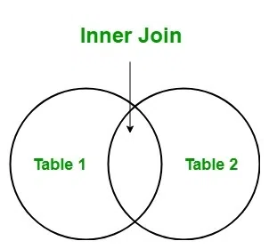
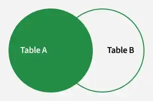
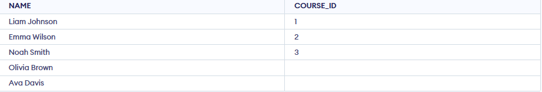
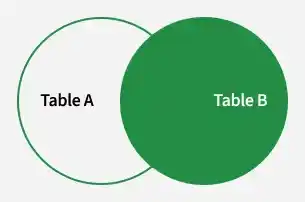
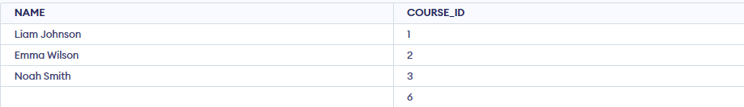
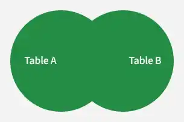
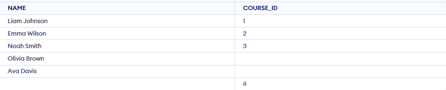

# SQL Joins (Inner, Left, Right and Full Join)
SQL Joins are used to combine data from two or more tables based on a related column. They help in:

- Retrieving connected data stored across multiple tables.
- Matching records using common columns.
- Improving data analysis by combining related information.
- Creating meaningful result sets from separate tables.

## Types of SQL Joins

SQL joins are categorized into different types based on how rows from two tables are matched and combined.

### 1. SQL INNER JOIN

INNER JOIN is used to retrieve rows where matching values exist in both tables.It helps in:

`INNER JOIN`

- Combining records based on a related column.
- Returning only matching rows from both tables.
- Excluding non-matching data from the result set.
- Ensuring accurate data relationships between tables.

Syntax:

```
SELECT table1.column1,table1.column2,table2.column1,.... FROM table1  INNER JOIN table2 ON  table1.matching_column = table2.matching_column; 
```



> Note: We can also write JOIN instead of INNER JOIN. JOIN is same as INNER JOIN.

Note: We can also write JOIN instead of INNER JOIN. JOIN is same as INNER JOIN.

Example of INNER JOIN:

Consider the two tables, Student and StudentCourse, which share a common column ROLL_NO. Using SQL JOINS, we can combine data from these tables based on their relationship, allowing us to retrieve meaningful information like student details along with their enrolled courses.

Student Table:


StudentCourse Table:


Let's look at the example of INNER JOIN clause, and understand it's working. This query will show the names and age of students enrolled in different courses.

Query:

```
SELECT StudentCourse.COURSE_ID, Student.NAME, Student.AGE FROM Student INNER JOIN StudentCourse ON Student.ROLL_NO = StudentCourse.ROLL_NO;
```

Output:


### 2. SQL LEFT JOIN

LEFT JOIN is used to retrieve all rows from the left table and matching rows from the right table.It helps in:

`LEFT JOIN`

- Returning all records from the left table.
- Showing matching data from the right table.
- Displaying NULL values where no match exists in the right table.
- Performing outer joins, also known as LEFT OUTER JOIN.

`LEFT OUTER JOIN`

Syntax:

```
SELECT table1.column1,table1.column2,table2.column1,....FROM table1 LEFT JOIN table2ON table1.matching_column = table2.matching_column;
```



Note: We can also use LEFT OUTER JOIN instead of LEFT JOIN, both are the same.

Example: In this example, the LEFT JOIN retrieves all rows from the Student table and the matching rows from the StudentCourse table based on the ROLL_NO column.

Query:

```
SELECT Student.NAME,StudentCourse.COURSE_ID FROM StudentLEFT JOIN StudentCourse ON StudentCourse.ROLL_NO = Student.ROLL_NO;
```

Output:



### 3. SQL RIGHT JOIN

RIGHT JOIN is used to retrieve all rows from the right table and the matching rows from the left table.It helps in:

`RIGHT JOIN`

- Returning all records from the right-side table.
- Showing matching data from the left-side table.
- Displaying NULL values where no match exists in the left table.
- Performing outer joins, also known as RIGHT OUTER JOIN.

`RIGHT OUTER JOIN`

Syntax

```
SELECT table1.column1,table1.column2,table2.column1,....FROM table1 RIGHT JOIN table2ON table1.matching_column = table2.matching_column;
```



> Note: We can also use RIGHT OUTER JOIN instead of RIGHT JOIN, both are the same

Note: We can also use RIGHT OUTER JOIN instead of RIGHT JOIN, both are the same

Example: In this example, the RIGHT JOIN retrieves all rows from the StudentCourse table and the matching rows from the Student table based on the ROLL_NO column.

`ROLL_NO`

Query:

```
SELECT Student.NAME,StudentCourse.COURSE_ID FROM StudentRIGHT JOIN StudentCourse ON StudentCourse.ROLL_NO = Student.ROLL_NO;
```

Output:



### 4. SQL FULL JOIN

FULL JOIN is used to combine the results of both LEFT JOIN and RIGHT JOIN. It helps in:

`FULL JOIN`

- Returning all rows from both tables.
- Showing matching records from each table.
- Displaying NULL values where no match exists in either table.
- Providing complete data from both sides of the join.

Syntax

```
SELECT table1.column1,table1.column2,table2.column1,....FROM table1 FULL JOIN table2ON table1.matching_column = table2.matching_column; 
```



Example: This example uses a FULL JOIN to return all rows from both tables. Matching records appear together, while non-matching records still show up with NULL values for the missing fields.

Query:

```
SELECT Student.NAME,StudentCourse.COURSE_ID FROM StudentFULL JOIN StudentCourse ON StudentCourse.ROLL_NO = Student.ROLL_NO;
```

Output :



### 5. SQL Natural Join

A Natural Join is a type of INNER JOIN that automatically joins two tables based on columns with the same name and data type. It returns only the rows where the values in the common columns match.

- It joins tables using common columns with the same name.
- It returns only rows where values in those columns match.
- The common column appears only once in the result.

Example: Look at the two tables below:

Employee Table:


Department Table:


Example: Find all Employees and their respective departments.

```
SELECT     Emp_name,    Dept_nameFROM EmployeeNATURAL JOIN Department;
```

Output:

