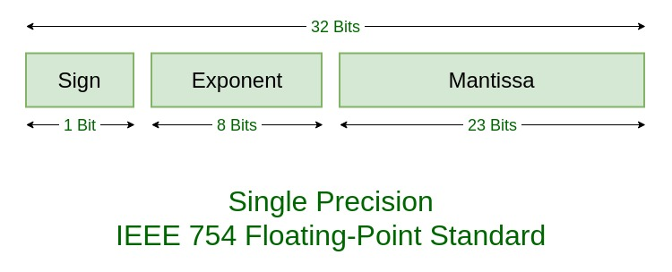
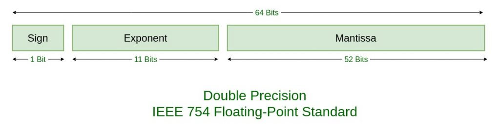

# IEEE Standard 754 Floating Point Numbers
1. The Sign of Mantissa - This is as simple as the name. 0 represents a positive number while 1 represents a negative number.
2. The Biased exponent - The exponent field needs to represent both positive and negative exponents. A bias is added to the actual exponent in order to get the stored exponent.
3. The Normalised Mantissa - The mantissa is part of a number in scientific notation or a floating-point number, consisting of its significant digits. Here we have only 2 digits, i.e. O and 1. So a normalised mantissa is one with only one 1 to the left of the decimal.





| TYPES | SIGN | BIASED EXPONENT | NORMALISED MANTISA | BIAS |
| --- | --- | --- | --- | --- |
| Single precision | 1(31st bit) | 8(30-23) | 23(22-0) | 127 |
| Double precision | 1(63rd bit) 11(62-52) 52(51-0) 1023 | 11(62-52) | 52(51-0) | 1023 |

```
85.125
85 = 1010101
0.125 = 001
85.125 = 1010101.001
       =1.010101001 x 2^6 
sign = 0 

1. Single precision:
biased exponent 127+6=133
133 = 10000101
Normalised mantisa = 010101001
we will add 0's to complete the 23 bits

The IEEE 754 Single precision is:
= 0 10000101 01010100100000000000000
This can be written in hexadecimal form 42AA4000

2. Double precision:
biased exponent 1023+6=1029
1029 = 10000000101
Normalised mantisa = 010101001
we will add 0's to complete the 52 bits

The IEEE 754 Double precision is:
= 0 10000000101 0101010010000000000000000000000000000000000000000000
This can be written in hexadecimal form 4055480000000000 
```

- Zero - Zero is a special value denoted with an exponent and mantissa of 0. -0 and +0 are distinct values, though they both are equal.
- Denormalised - If the exponent is all zeros, but the mantissa is not then the value is a denormalized number. This means this number does not have an assumed leading one before the binary point.
- Infinity - The values +infinity and -infinity are denoted with an exponent of all ones and a mantissa of all zeros. The sign bit distinguishes between negative infinity and positive infinity. Operations with infinite values are well defined in IEEE.
- Not A Number (NAN) - The value NAN is used to represent a value that is an error. This is represented when exponent field is all ones with a zero sign bit or a mantissa that it not 1 followed by zeros. This is a special value that might be used to denote a variable that doesn't yet hold a value.

| EXPONENT | MANTISA | VALUE |
| --- | --- | --- |
| 0 | 0 | exact 0 |
| 255 | 0 Infinity | Infinity |
| 0 | not 0 | denormalised |
| 255 | not 0 Not a number (NAN) | Not a number (NAN) |

|  | Denormalized | Normalized | Approximate Decimal |
| --- | --- | --- | --- |
| Single Precision | ± 2-149 to (1 - 2-23)×2-126 | ± 2-126 to (2 - 2-23)×2127 | ± approximately 10-44.85 to approximately 1038.53 |
| Double Precision | ± 2-1074 to (1 - 2-52)×2-1022 | ± 2-1022 to (2 - 2-52)×21023 | ± approximately 10-323.3 to approximately 10308.3 |

1. Negative numbers less than - (2 - 2-23) × 2127 (negative overflow)
2. Negative numbers greater than - 2-149 (negative underflow)
3. Zero
4. Positive numbers less than 2-149 (positive underflow)
5. Positive numbers greater than (2 - 2-23) × 2127 (positive overflow)

|  | Binary | Decimal |
| --- | --- | --- |
| Single | ± (2 - 2-23) × 2127 | approximately ± 1038.53 |
| Double | ± (2 - 2-52) × 21023 | approximately ± 10308.25 |

| Operation | Result |  |  |  |  |  |  |
| --- | --- | --- | --- | --- | --- | --- | --- |
| n ÷ ±Infinity | 0 |  |  |  |  |  |  |
| ±Infinity × ±Infinity | ±Infinity |  |  |  |  |  |  |
| ±nonZero ÷ ±0 | ±Infinity |  |  |  |  |  |  |
| ±finite × ±Infinity | ±Infinity |  |  |  |  |  |  |
| Infinity + Infinity Infinity - -Infinity | +Infinity |  |  |  |  |  |  |
| -Infinity - Infinity -Infinity + - Infinity | - Infinity | ±0 ÷ ±0 | NaN | ±Infinity ÷ ±Infinity | NaN | ±Infinity × 0 | NaN |
| ±0 ÷ ±0 | NaN |  |  |  |  |  |  |
| ±Infinity ÷ ±Infinity | NaN |  |  |  |  |  |  |
| ±Infinity × 0 | NaN |  |  |  |  |  |  |
| NaN == NaN | False |  |  |  |  |  |  |