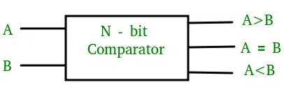
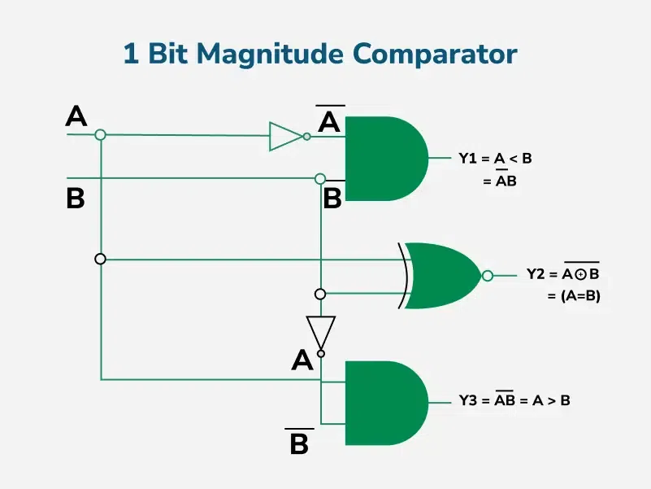
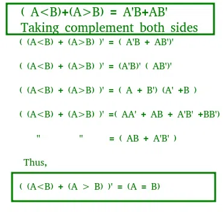
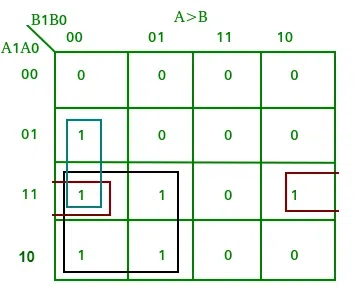
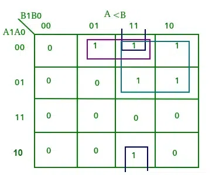
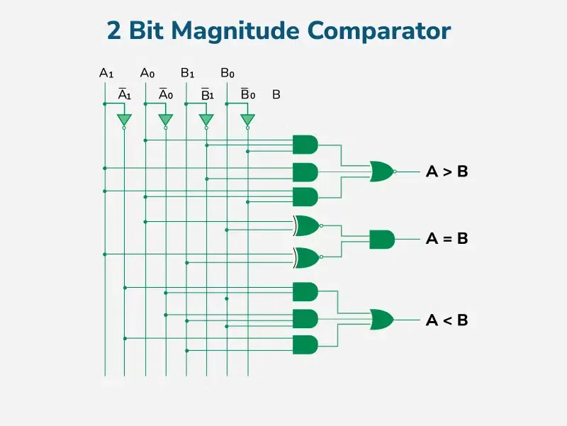
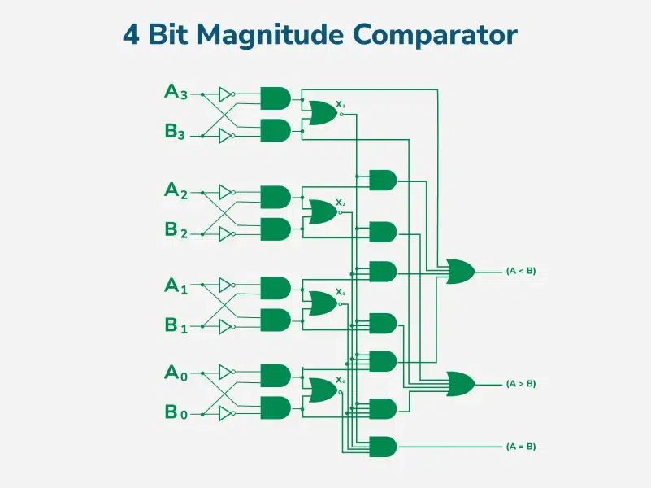
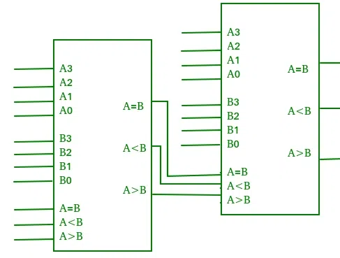

# Magnitude Comparator in Digital Logic
## What is Magnitude Comparator?

Magnitude comparator is a type of Combinational circuit, It Basically compares two binary numbers and determines their relative magnitude. It gives output whether one number is greater than the other, or less than or equal. These comparators are used in digital systems, such as for sorting networks, and decision-making circuits to handle numerical comparisons perfectly without any error.

The circuit works by comparing the bits of the two numbers starting from the most significant bit (MSB) and moving toward the least significant bit (LSB). At each bit position, the two corresponding bits of the numbers are compared. If the bit in the first number is greater than the corresponding bit in the second number, the A>B output is set to 1,and the circuit immediately determines that the first number is greater than the second. Similarly, if the bit in the second number is greater than the corresponding bit in the first number, the A<B output is set to 1, and the circuit immediately determines that the first number is less than the second.

If the two corresponding bits are equal, the circuit moves to the next bit position and compares the next pair of bits. This process continues until all the bits have been compared. If at any point in the comparison, the circuit determines that the first number is greater or less than the second number, the comparison is terminated, and the appropriate output is generated.

If all the bits are equal, the circuit generates an A=B output, indicating that the two numbers are equal.

There are different ways to implement a magnitude comparator, such as using a combination of XOR, AND, and OR gates, or by using a cascaded arrangement of full adders. The choice of implementation depends on factors such as speed, complexity, and power consumption.

### 1-Bit Magnitude Comparator

A comparator used to compare two bits is called a single-bit comparator. It consists of two inputs each for two single-bit numbers and three outputs to generate less than, equal to, and greater than between two binary numbers.

The truth table for a 1-bit comparator is given below.

From the above truth table logical expressions for each output can be expressed as follows.

> A>B: AB' A<B: A'B A=B: A'B' + AB

A>B: AB' A<B: A'B A=B: A'B' + AB

From the above expressions, we can derive the following formula.

By using these Boolean expressions, we can implement a logic circuit for this comparator as given below.

## 2-Bit Magnitude Comparator

A comparator used to compare two binary numbers each of two bits is called a 2-bit Magnitude comparator. It consists of four inputs and three outputs to generate less than, equal to, and greater than between two binary numbers.

The truth table for a 2-bit comparator is given below.

| INPUT | OUTPUT |  |  |  |  |  |
| --- | --- | --- | --- | --- | --- | --- |
| A1 | A0 | B1 | B0 | A<B | A=B | A>B |
| 0 | 0 | 0 | 0 | 0 | 1 | 0 |
| 0 | 0 | 0 | 1 | 1 | 0 | 0 |
| 0 | 0 | 1 | 0 | 1 | 0 | 0 |
| 0 | 0 | 1 | 1 | 1 | 0 | 0 |
| 0 | 1 | 0 | 0 | 0 | 0 | 1 |
| 0 | 1 | 0 | 1 | 0 | 1 | 0 |
| 0 | 1 | 1 | 0 | 1 | 0 | 0 |
| 0 | 1 | 1 | 1 | 1 | 0 | 0 |
| 1 | 0 | 0 | 0 | 0 | 0 | 1 |
| 1 | 0 | 0 | 1 | 0 | 0 | 1 |
| 1 | 0 | 1 | 0 | 0 | 1 | 0 |
| 1 | 0 | 1 | 1 | 1 | 0 | 0 |
| 1 | 1 | 0 | 0 | 0 | 0 | 1 |
| 1 | 1 | 0 | 1 | 0 | 0 | 1 |
| 1 | 1 | 1 | 0 | 0 | 0 | 1 |
| 1 | 1 | 1 | 1 | 0 | 1 | 0 |

From the above truth table, K-map for each output can be drawn as follows.

Truth Table of Output A>B

Truth Table of Output A=B

Truth Table of Output A<B

From the above K-maps logical expressions for each output can be expressed as follows.

> A>B:A1B1’ + A0B1’B0’ + A1A0B0’A=B: A1’A0’B1’B0’ + A1’A0B1’B0 + A1A0B1B0 + A1A0’B1B0’ : A1’B1’ (A0’B0’ + A0B0) + A1B1 (A0B0 + A0’B0’) : (A0B0 + A0’B0’) (A1B1 + A1’B1’) : (A0 Ex-Nor B0) (A1 Ex-Nor B1)A<B:A1’B1 + A0’B1B0 + A1’A0’B0

A>B:A1B1’ + A0B1’B0’ + A1A0B0’A=B: A1’A0’B1’B0’ + A1’A0B1’B0 + A1A0B1B0 + A1A0’B1B0’ : A1’B1’ (A0’B0’ + A0B0) + A1B1 (A0B0 + A0’B0’) : (A0B0 + A0’B0’) (A1B1 + A1’B1’) : (A0 Ex-Nor B0) (A1 Ex-Nor B1)A<B:A1’B1 + A0’B1B0 + A1’A0’B0

By using these Boolean expressions, we can implement a logic circuit for this comparator as given below.

### 4-Bit Magnitude Comparator

A comparator used to compare two binary numbers each of four bits is called a 4-bit magnitude comparator. It consists of eight inputs each for two four-bit numbers and three outputs to generate less than, equal to, and greater than between two binary numbers. In a 4-bit comparator, the condition of A>B can be possible in the following four cases.

1. If A3 = 1 and B3 = 0
2. If A3 = B3 and A2 = 1 and B2 = 0
3. If A3 = B3, A2 = B2 and A1 = 1 and B1 = 0
4. If A3 = B3, A2 = B2, A1 = B1 and A0 = 1 and B0 = 0

Similarly, the condition for A<B can be possible in the following four cases.

1. If A3 = 0 and B3 = 1
2. If A3 = B3 and A2 = 0 and B2 = 1
3. If A3 = B3, A2 = B2 and A1 = 0 and B1 = 1
4. If A3 = B3, A2 = B2, A1 = B1 and A0 = 0 and B0 = 1

The condition of A=B is possible only when all the individual bits of one number exactly coincide with the corresponding bits of another number.

From the above statements, logical expressions for each output can be expressed as follows.

AA, 831331 r: (A3 Ex-Nor 33)A2132' a (A3 Ex-Nor 133) (A2 Ex-Nor 132)A131' a (A3 Ex-Nor 33) (A2 ENor132) (Al Ex-Nor 31)A01301 ,13: A3'03 a (A3 Ex-Nor 33)A211:12 a (A3 Ex-Nor 83) (A2 Ex-Nor 132)Ar131 a (A3 Ex-Nor 33) (A2 Ex-Nor32) (Al Ex-Nor 131)A0N30 A=B: (A3 Ex-Nor B3) (A2 Ex-Nor 82) (Al Ex-Nor BI) (AO Ex-Nor BO)

By using these Boolean expressions, we can implement a logic circuit for this comparator as given below.

> NOTE: For n- the bit comparator then, the number of combinations for which Total combination=22n Equal combination(A = B) = 2n, Unequal Combination=22n - 2n Greater(A > B) =Less( A < B)combination = (22n - 2n)/2

NOTE: For n- the bit comparator then, the number of combinations for which Total combination=22n Equal combination(A = B) = 2n, Unequal Combination=22n - 2n Greater(A > B) =Less( A < B)combination = (22n - 2n)/2

## Cascading Comparator

A comparator performing the comparison operation to more than four bits by cascading two or more 4-bit comparators is called a cascading comparator. When two comparators are to be cascaded, the outputs of the lower-order comparator are connected to the corresponding inputs of the higher-order comparator.

## Applications of Comparators

- Comparators are used in central processing units (CPU s) and microcontrollers (MCUs).
- These are used in control applications in which the binary numbers representing physical variables such as temperature, position, etc. are compared with a reference value.
- Comparators are also used as process controllers and for Servo motor control.
- Used in password verification and biometric applications.

## Advantage of Comparator

- Comparators are simple and efficient for comparison of binary values.

- Fast decision-making in Digital Circuits.

- This comparator can be easily integrated in to complex systems like processors and arithmetic units.

- Design of comparator are modular, which allow them to scale solutions for comparing multi-bit numbers

## Disadvantages of Comparator

- Comparators have limit of bits for comparison.

- It requires more complex circuit for large bits.

- Power consumption increase with increase in the complexity of the circuit.