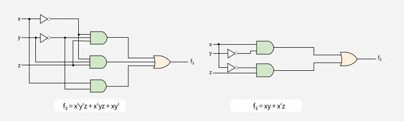
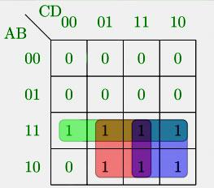

# Minimization of Boolean Functions
Boolean functions are used to represent logical expressions in terms of sum of minterms or product of maxterms. Number of these literals (minterms or maxterms) increases as the complexity of the digital circuit increases. This can lead to large and inefficient circuits.

By minimizing Boolean functions, we can reduce the number of [[logic-gates|logic gates]], simplify circuit design, and improve performance in terms of speed, cost, and power consumption.

For example, let the Boolean function:

> F2 = x’y’z + x’yz + xy’

F2 = x’y’z + x’yz + xy’

This function can be further minimized by

- Grouping first two terms: x’y’z + x’yz = x’(y’z + yz)
- Simplify inside: y’z + yz = z, so it becomes x’z
- Add the remaining term: x’z + xy’

The minimized Boolean function will be:

> F2 = xy' + x’z

F2 = xy' + x’z

In the diagram below we can see the implementation of the Boolean function:

Instead of building a circuit with 3 big parts (one for each term), the minimized version needs only 2.

> Read more about Representation of Boolean Functions

Read more about Representation of Boolean Functions

Various methods and techniques, such as Karnaugh maps, Quine-McCluskey algorithm, and the use of [[boolean-algebra|Boolean algebra]], help achieve this simplification.

## Main Methods for Minimizing Boolean Expressions

The two main methods for minimizing Boolean expressions are:

### 1. Boolean Algebra

[[boolean-algebra|Boolean algebra]] involves using a set of rules and laws (like distributive, associative, and complement laws) to simplify Boolean expressions. This method focuses on applying algebraic manipulations to reduce the complexity of the expression by eliminating redundant terms.

| Law/Rule | Expression |
| --- | --- |
| Identity Law | A ⋅ 1 = A, A + 0 = A |
| Null Law | A ⋅ 0 = 0, A + 1 = 1 |
| Idempotent Law | A ⋅ A = A, A + A = A |
| Complement Law | A ⋅ A′ = 0, A + A' = 1 |
| Domination Law | A ⋅ 0 = 0, A + 1 = 1 |
| Double Negation Law | (A′)′ = A |
| Distributive Law | A ⋅ (B + C) = A ⋅ B + A ⋅ C |
| De Morgan’s Law | (A ⋅ B)′ = A′ + B', (A + B)′ = A′ ⋅ B′ |
| Absorption Law | A ⋅ (A + B) = A, A + (A ⋅ B) = A |
| Complementation Law | A ⋅ A′ = 0, A + A′ = 1 |
| Consensus Theorem | AB + A'C + BC = AB + A'C |

> Read more about Boolean Algebraic Theorems

Read more about Boolean Algebraic Theorems

Example: Simplify the Boolean function F = AB + (AC)′ + AB′C(AB + C).

Solution: F = AB + (AC)′ + AB′C(AB + C)

= AB + A′ + C′+ AB′C.AB + AB′C.C

= AB + A′ + C′ + 0 + AB′C (B.B′ = 0 and C.C = C)

= ABC + ABC′ + A′ + C′ + AB′C (AB = AB(C + C′) = ABC + ABC′)

= AC(B + B′) + C′(AB + 1) + A′

= AC + C′+A′ (B + B′ = 1 and AB + 1 = 1)

= AC + (AC)′ = 1

### 2. K-Map

The Karnaugh Map is a graphical technique used to simplify Boolean expressions by grouping adjacent cells containing 1s (minterms). This visual method makes it easier to identify patterns and minimize the expression by combining terms that can be grouped together. It is especially useful for functions with 4 or fewer variables.

## Questions Based on Minimization of Boolean Functions

Example: Minimize the following Boolean function using algebraic manipulation

> F = ABC'D' + ABC'D + AB'C'D + ABCD + AB'CD + ABCD' AB'CD'

F = ABC'D' + ABC'D + AB'C'D + ABCD + AB'CD + ABCD' AB'CD'

Solution:

1. Using Boolean Laws

F = ABC'(D' + D) + AB'C'D + ACD(B + B') ACD'(B + B')= ABC' + AB'C'D + ACD + ACD'= ABC' + AB'C'D + AC(D + D') = ABC' + AB'C'D + AC = A(BC' + C) + AB'C'D = A(B + C) + AB'C'D = AB + AC + AB'C'D = AB + AC + AC'D = AB + AC + AD

2. Using K-Map

The above figure highlights the prime implicants in green, red and blue.

- The green one spans the whole third row, which gives us – AB
- The red one spans 4 squares, which gives us – AD
- The blue one spans 4 squares, which gives us – AC

So, the minimized Boolean expression is - AB + AC + AD

GATE CS Corner Questions:

> 1. GATE CS 2012, Question 302. GATE CS 2007, Question 323. GATE CS 2014 Set-3, Question 174. GATE CS 2005, Question 185. GATE CS 2004, Question 176. GATE CS 2003, Question 457. GATE CS 2002, Question 12

1. GATE CS 2012, Question 302. GATE CS 2007, Question 323. GATE CS 2014 Set-3, Question 174. GATE CS 2005, Question 185. GATE CS 2004, Question 176. GATE CS 2003, Question 457. GATE CS 2002, Question 12