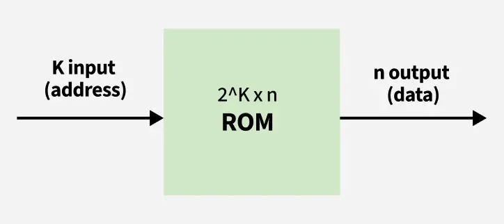
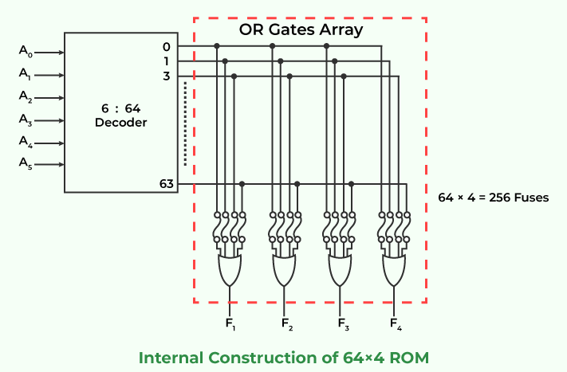

# Read Only Memory (ROM)
Memory plays a crucial role in how devices operate, and one of the most important types is Read-Only Memory (ROM). Unlike RAM (Random Access Memory), which loses its data when the power is turned off, ROM is designed to store essential information permanently.

Here, we’ll explore what ROM is, how it works, its various types, and why it remains an essential component in modern technology. Whether you’re a tech enthusiast or just curious about how your devices operate, understanding ROM is key to grasping the fundamentals of computing.

## What is Read-Only Memory (ROM)?

ROM stands for Read-Only Memory. It is a non-volatile memory was used to operate the system. As its name refers to read-only memory, we can only read the stored programs and data.

- Information stored in ROM is permanent.
- Information and programs are stored on ROM in binary format (0s and 1s).
- It is used in the start-up process of the computer.

## Evolution of ROM Technology

The development of ROM has seen key advancements over the years:

| Year | Type | Key Advancement | Use Cases |
| --- | --- | --- | --- |
| 1956 | Mask ROM (MROM) | Hardwired during manufacturing | Early calculators, embedded systems |
| 1956 | PROM | One-time programmable by users | Custom firmware |
| 1971 | EPROM | Erasable with UV light, reprogrammable | Legacy computer BIOS |
| 1983 | EEPROM | Electrically erasable, reusable | Microcontrollers, car key fobs |
| 1984 | Flash Memory | Block-level erasure, high speed | USB drives, SSDs, smartphones |

## Block Diagram of ROM

The main purpose of the ROM block diagram is to represent how ROM (Read-Only Memory) works within a computer system. It helps illustrate the flow of data and how the system accesses the stored information.

In a Read-Only Memory (ROM) system, there are k input lines and n output lines. The input address from which we wish to retrieve the ROM content is taken using the k input lines. Since each of the k input lines can have a value of 0 or 1, there are a total of 2 k addresses that can be referred to by these input lines, and each of these addresses contains n bits of information that is output from the ROM.

A ROM of this type is designated as a 2k x n ROM.

## Internal Structure of ROM

The internal structure of ROM has two basic components:

1. Decoder
2. OR Gates

A circuit known as a decoder converts an encoded form, such as binary coded decimal, or BCD, into a decimal form. As a result, the output is the binary equivalent of the input. The outputs of the decoder will be the output of every OR gate in the ROM. Let’s use a 64 x 4 ROM as an example. This read-only memory has 64 words with a 4 bit length. As a result, there would be four output lines.

Since there are only six input lines and there are 64 words in this ROM, we can specify 64 addresses or minimum terms by choosing one of the 64 words that are available on the output lines from the six input lines. Each address entered has a unique selected word.

## Working of ROM

A small, long-lasting battery within the computer powers the ROM, which is made up of two primary components: the OR [[logic-gates|logic gates]] and the decoder. In ROM, the decoder receives binary input and produces decimal output. The decoder’s decimal output serves as the input for ROM’s OR gates. ROM chips have a grid of columns and rows that may be switched on and off. If they are turned on, the value is 1, and the lines are connected by a diode. When the value is 0, the lines are not connected.

Each element in the arrangement represents one storage element on the memory chip. The diodes allow only one direction of flow, with a specific threshold known as forward break over. This determines the current required before the diode passes the flow on. Silicon-based circuitry typically has a forward break-over voltage of 0.6 V. ROM chips sometimes transmit a charge that exceeds the forward break over to the column with a specified row that is grounded to a specific cell. When a diode is present in the cell, the charge transforms to the binary system, and the cell is “on” with a value of 1.

## Types of Read-Only Memory (ROM)

| ROM Type | Erasure Method | Reprogrammable | Use Cases/Examples |
| --- | --- | --- | --- |
| Mask ROM (MROM) | Hardwired during manufacturing | No | Early embedded systems, firmware |
| PROM | One-time programming | No | Custom firmware for specific applications |
| EPROM | UV light | Yes (with UV) | Firmware updates, legacy computer systems |
| EEPROM | Electrical signals | Yes | Microcontrollers, BIOS, small firmware updates |
| Flash Memory | Block-level electrical erasure | Yes | USB drives, SSDs, memory cards, smartphones |
| PLD-ROM | Configurable logic | Yes | FPGA, CPLD, custom hardware logic |

Lets discuss some main type of ROM in details one-by-one:

1. MROM (Masked read-only memory): We know that ROM is as old as semiconductor technology. MROM was the very first ROM that consisted of a grid of word lines and bit lines joined together by transistor switches. This type of ROM data is physically encoded in the circuit and only be programmed during fabrication. It was not so expensive.
2. PROM (Programmable read-only memory): PROM is a form of digital memory. In this type of ROM, each bit is locked by a fuse or anti-fuse. The data stored in it are permanently stored and can not be changed or erasable. It is used in low-level programs such as firmware or microcode.
3. EPROM (Erasable programmable read-only memory): EPROM also called EROM, is a type of PROM but it can be reprogrammed. The data stored in EPROM can be erased and reprogrammed again by ultraviolet light. Reprogrammed it is limited. Before the era of EEPROM and flash memory, EPROM was used in microcontrollers.
4. EEPROM (Electrically erasable programmable read-only memory): As its name refers, it can be programmed and erased electrically. The data and program of this ROM can be erased and programmed about ten thousand times. The duration of erasing and programming of the EEPROM is about 4ms to 10ms. It is used in microcontrollers and remote keyless systems.

## Advantages of ROM

- Non-Volatile – Retains data without power.
- Security – Prevents unauthorized changes.
- Reliable – Data remains intact over time.
- Cost-Effective – Cheap for large-scale production.
- Fast Access – Quick retrieval of stored data.

## Disadvantages of ROM

- Limited Modifiability – Data can’t be easily changed.
- Low Storage Capacity – Not suitable for large data storage.
- Slow Write Speeds – Writing data is slow.
- Physical Wear – Can wear out after many write cycles (EEPROM/EPROM).
- High Initial Cost – Expensive to manufacture in small quantities (Mask ROM).

## Difference Between RAM and ROM

Here are some key difference between RAM and ROM.

| RAM | ROM |
| --- | --- |
| RAM stands for Random Access Memory. | ROM stands for Read Only Memory. |
| You can modify , edit or erase data in RAM. | Data in ROM can not modified or erased, you can only read data of ROM. |
| RAM is a volatile memory that stores data as long as power supply is given. | ROM is a non-volatile memory that retian data even after the power is turned off. |
| Speed of RAM is more then speed of ROM. | ROM is slower then RAM. |
| RAM is costly as compared to ROM. | ROM is cheap as compared to RAM. |
| A RAM chip can store only a few gigabytes (GB) of data. | A ROM chip can store multiple megabytes (MB) of data. |
| CPU can easily access data stored in RAM. | CPU cannot easily access data stored in ROM. |
| RAM is used for the temporary storage of data currently being processed by the CPU. | ROM is used to store firmware, BIOS, and other data that needs to be retained. |

RAM

ROM

RAM stands for Random Access Memory.

ROM stands for Read Only Memory.

You can modify , edit or erase data in RAM.

Data in ROM can not modified or erased, you can only read data of ROM.

RAM is a volatile memory that stores data as long as power supply is given.

ROM is a non-volatile memory that retian data even after the power is turned off.

Speed of RAM is more then speed of ROM.

ROM is slower then RAM.

RAM is costly as compared to ROM.

ROM is cheap as compared to RAM.

A RAM chip can store only a few gigabytes (GB) of data.

A ROM chip can store multiple megabytes (MB) of data.

CPU can easily access data stored in RAM.

CPU cannot easily access data stored in ROM.

RAM is used for the temporary storage of data currently being processed by the CPU.

ROM is used to store firmware, BIOS, and other data that needs to be retained.

## ROM Vs Hard Drive

Here's a comparison table between ROM and Hard Drive:

| Feature | ROM | Hard Drive |
| --- | --- | --- |
| Definition | Non-volatile memory for system instructions. | A storage device for large amounts of data. |
| Data Type | Stores firmware and boot instructions. | Stores user data, applications, and OS. |
| Volatility | Non-volatile (retains data without power). | Non-volatile (retains data without power). |
| Modifiability | Read-only, data cannot be easily modified. | Writable, data can be freely added or removed. |
| Speed | Fast access, especially during booting. | Slower read/write speeds compared to ROM. |
| Capacity | Typically smaller in size (measured in MBs). | Much larger in size (measured in GBs or TBs). |
| Function | Provides essential startup instructions. | Stores operating system, software, and files. |
| Common Use | Embedded in devices like computers and phones. | Used in computers, laptops, and external storage. |