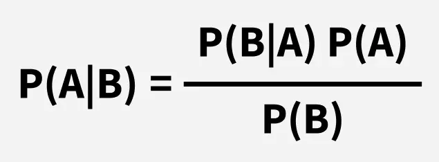

# Bayes' Theorem
Bayes' Theorem is a mathematical formula used to determine the [[conditional-probability|conditional probability]] of an event based on prior knowledge and new evidence.

It adjusts probabilities when new information comes in and helps make better decisions in uncertain situations.

> Bayes' Theorem helps us update probabilities based on prior knowledge and new evidence. In this case, knowing that the pet is quiet (new information), we can use Bayes' Theorem to calculate the updated probability of the pet being a cat or a dog, based on how likely each animal is to be quiet.

Bayes' Theorem helps us update probabilities based on prior knowledge and new evidence. In this case, knowing that the pet is quiet (new information), we can use Bayes' Theorem to calculate the updated probability of the pet being a cat or a dog, based on how likely each animal is to be quiet.

## Bayes Theorem and Conditional Probability

Bayes' theorem (also known as the Bayes Rule or Bayes Law) is used to determine the [[conditional-probability|conditional probability]] of event A when event B has already occurred.

The general statement of Bayes’ theorem is “The [[conditional-probability|conditional probability]] of an event A, given the occurrence of another event B, is equal to the product of the probability of B, given A, and the probability of A divided by the probability of event B.” i.e.

> For example, if we want to find the probability that a white marble drawn at random came from the first bag, given that a white marble has already been drawn, and there are three bags each containing some white and black marbles, then we can use Bayes’ Theorem.

For example, if we want to find the probability that a white marble drawn at random came from the first bag, given that a white marble has already been drawn, and there are three bags each containing some white and black marbles, then we can use Bayes’ Theorem.

### Also Check

> Bayes’ Theorem for [[conditional-probability|Conditional Probability]]

Bayes’ Theorem for [[conditional-probability|Conditional Probability]]

## Bayes Theorem Formula

For any two events A and B, Bayes's formula for the Bayes theorem is given by:

Where,

- P(A) and P(B) are the probabilities of events A and B; also, P(B) is never equal to zero.
- P(A|B) is the probability of event A when event B happens,
- P(B|A) is the probability of event B when A happens.

## Bayes Theorem Statement

Bayes' Theorem for n sets of events is defined as,

Let E1, E2,…, En be a set of events associated with the sample space S, in which all the events E1, E2,…, En have a non-zero probability of occurrence. All the events E1, E2,…, E form a partition of S. Let A be an event in space S for which we have to find the probability, then according to Bayes theorem,

> P(E_i \mid A) = \frac{P(E_i) \cdot P(A \mid E_i)}{\sum_{k=1}^{n} P(E_k) \cdot P(A \mid E_k)}for k = 1, 2, 3, …., n

P(E_i \mid A) = \frac{P(E_i) \cdot P(A \mid E_i)}{\sum_{k=1}^{n} P(E_k) \cdot P(A \mid E_k)}

for k = 1, 2, 3, …., n

## Bayes Theorem Derivation

The proof of Bayes' Theorem is given as, according to the [[conditional-probability|conditional probability]] formula,P(E_i \mid A) = \frac{P(E_i \cap A)}{P(A)}.....(i)

Then, by using the multiplication rule of probability, we getP(E_i \cap A) = P(E_i) \cdot P(A \mid E_i)......(ii)

Now, by the total probability theorem,P(A) = \sum_{k=1}^{n} P(E_k) \cdot P(A \mid E_k).....(iii)

Substituting the value of P(Ei∩A) and P(A) from eq (ii) and eq(iii) in eq(i) we get,

> P(E_i \mid A) = \frac{P(E_i) \cdot P(A \mid E_i)}{\sum_{k=1}^{n} P(E_k) \cdot P(A \mid E_k)}

P(E_i \mid A) = \frac{P(E_i) \cdot P(A \mid E_i)}{\sum_{k=1}^{n} P(E_k) \cdot P(A \mid E_k)}

Bayes’ theorem is also known as the formula for the probability of “causes”. As we know, the Ei‘s are a partition of the sample space S, and at any given time, only one of the events Ei occurs. Thus, we conclude that the Bayes theorem formula gives the probability of a particular Ei, given that event A has occurred.

## Terms Related to Bayes' Theorem

After learning about Bayes theorem in detail, let us understand some important terms related to the concepts we covered in the formula and derivation.

Hypotheses

- Hypotheses refer to possible events or outcomes in the sample space; they are denoted as E1, E2, …, En.
- Each hypothesis represents a distinct scenario that could explain an observed event.

Priori Probability

- Priori Probability P(Ei) is the initial probability of an event occurring before any new data is taken into account.
- It reflects existing knowledge or assumptions about the event.
- Example: The probability of a person having a disease before taking a [[test]].

Posterior Probability

- Posterior probability (P(Ei∣A) is the updated probability of an event after considering new information.
- It is derived using the Bayes Theorem.
- Example: The probability of having a disease given a positive [[test]] result.

[[conditional-probability|Conditional Probability]]

- The probability of an event A based on the occurrence of another event B is termed [[conditional-probability|conditional Probability]].
- It is denoted as P(A|B) and represents the probability of A when event B has already happened.

Joint Probability

- When the probability of two or more events occurring together and at the same time is measured, it is marked as Joint Probability.
- For two events A and B, it is denoted by joint probability is denoted as P(A∩B).

Random Variables

- Real-valued variables whose possible values are determined by random experiments are called random variables.
- The probability of finding such variables is the experimental probability.

## Bayes Theorem Applications

Bayesian inference is very important and has found application in various activities, including medicine, science, philosophy, engineering, sports, law, etc., and Bayesian inference is directly derived from Bayes theorem.

Some of the Key Applications are:

- AI & Machine Learning → Used in Naïve Bayes classifiers to predict outcomes.
- Medical Testing → Finding the real probability of having a disease after a positive [[test]].
- Spam Filters → Checking if an email is spam based on keywords.
- Weather Prediction → Updating the chance of rain based on new data.

### Also Check

> Bayes' Theorem Real Life Applications of Bayes Theorem

Bayes' Theorem Real Life Applications of Bayes Theorem

## Difference Between Conditional Probability and Bayes Theorem

The difference between [[conditional-probability|Conditional Probability]] and Bayes's theorem can be understood with the help of the table given below.

| Bayes Theorem | [[conditional-probability|Conditional Probability]] |
| --- | --- |
| Bayes's Theorem is derived using the definition of [[conditional-probability|conditional probability]]. It is used to find the reverse probability. | [[conditional-probability|Conditional Probability]] is the probability of event A when event B has already occurred. |
| Formula: P(A|B) = [P(B|A)P(A)] / P(B) | Formula: P(A|B) = P(A∩B) / P(B) |
| Purpose: To update the probability of an event based on new evidence. | Purpose: To find the probability of one event based on the occurrence of another. |
| Focus: Uses prior knowledge and evidence to compute a revised probability. | Focus: Direct relationship between two events. |

Purpose: To update the probability of an event based on new evidence.

Purpose: To find the probability of one event based on the occurrence of another.

Focus: Uses prior knowledge and evidence to compute a revised probability.

Focus: Direct relationship between two events.

## Theorem of Total Probability

Let E1, E2,…., En be mutually exclusive and exhaustive events of a sample space S, and let E be any event that occurs with some Ei. Then, prove that :

> P(E) = n∑i=1P(E/Ei) . P(Ei)

P(E) = n∑i=1P(E/Ei) . P(Ei)

Proof:

> Let S be the sample space. Since the events E1, E2,…,En are mutually exclusive and exhaustive, we have:S = E1 ∪ E2 ∪ E3 ∪ . . . ∪ En and Ei ∩ Ej = ∅ for i ≠ j.Now, consider the event E: E = E ∩ S Substituting S with the union of Ei's:⇒ E = E ∩ (E1 ∪ E2 ∪ E3 ∪ . . . ∪ En) Using distributive law:⇒ E = (E ∩ E1) ∪ (E ∩ E2) ∪ . . . ∪ (E ∩ En)Since the events Ei are mutually exclusive, the intersections E∩Ei are also mutually exclusive. Therefore:P(E) = P{(E ∩ E1) ∪ (E ∩ E2)∪ . . . ∪(E ∩ En)}⇒ P(E) = P(E ∩ E1) + P(E ∩ E2) + . . . + P(E ∩ En){Therefore, (E ∩ E1), (E ∩ E2), . . . ,(E ∩ En)} are pairwise disjoint}⇒ P(E) = P(E/E1) . P(E1) + P(E/E2) . P(E2) + . . . + P(E/En) . P(En) [by multiplication theorem]⇒ P(E) = n∑i=1P(E/Ei) . P(Ei)

Let S be the sample space. Since the events E1, E2,…,En are mutually exclusive and exhaustive, we have:

S = E1 ∪ E2 ∪ E3 ∪ . . . ∪ En and Ei ∩ Ej = ∅ for i ≠ j.Now, consider the event E: E = E ∩ S Substituting S with the union of Ei's:⇒ E = E ∩ (E1 ∪ E2 ∪ E3 ∪ . . . ∪ En) Using distributive law:⇒ E = (E ∩ E1) ∪ (E ∩ E2) ∪ . . . ∪ (E ∩ En)Since the events Ei are mutually exclusive, the intersections E∩Ei are also mutually exclusive. Therefore:

P(E) = P{(E ∩ E1) ∪ (E ∩ E2)∪ . . . ∪(E ∩ En)}⇒ P(E) = P(E ∩ E1) + P(E ∩ E2) + . . . + P(E ∩ En){Therefore, (E ∩ E1), (E ∩ E2), . . . ,(E ∩ En)} are pairwise disjoint}

⇒ P(E) = P(E/E1) . P(E1) + P(E/E2) . P(E2) + . . . + P(E/En) . P(En) [by multiplication theorem]⇒ P(E) = n∑i=1P(E/Ei) . P(Ei)

### Also Check

> Bayes Theorem for Programmers-Bayes Theorem in Artificial Intelligence Bayes Theorem in Machine LearningBayes’ Theorem in Data Mining

Bayes Theorem for Programmers-

- Bayes Theorem in Artificial Intelligence
- Bayes Theorem in Machine Learning
- Bayes’ Theorem in Data Mining

## Solved Examples of Bayes' Theorem

Example 1: A person has undertaken a job. The probability of completing the job on time if it rains is 0.44, and the probability of completing the job on time if it does not rain is 0.95. If the probability that it will rain is 0.45, then determine the probability that the job will be completed on time.

> Let:R: event that it rainsR^c: event that it does not rainC: event that the job is completed on timeWe are given:P(R)=0.45,P(Rc)=1−0.45=0.55P(C∣R)=0.44,P(C∣Rc)=0.95By the law of total probability:P(C)=P(R)P(C∣R)+P(Rc)P(C∣Rc)Substitute values:P(C)=(0.45)(0.44)+(0.55)(0.95)P(C)=0.198+0.5225=0.7205

Let:

- R: event that it rains
- R^c: event that it does not rain
- C: event that the job is completed on time

We are given:

P(R)=0.45,P(Rc)=1−0.45=0.55

P(C∣R)=0.44,P(C∣Rc)=0.95

By the law of total probability:

P(C)=P(R)P(C∣R)+P(Rc)P(C∣Rc)

Substitute values:

P(C)=(0.45)(0.44)+(0.55)(0.95)

P(C)=0.198+0.5225=0.7205

Example 2: There are three urns containing 3 white and 2 black balls, 2 white and 3 black balls, and 1 black and 4 white balls, respectively. There is an equal probability of each urn being chosen. One ball is equal probability chosen at random. What is the probability that a white ball will be drawn?

Solution:

> Let E1, E2, and E3 be the events of choosing the first, second, and third urn respectively. Then,P(E1) = P(E2) = P(E3) = 1/3Let E be the event that a white ball is drawn. Then,P(E/E1) = 3/5, P(E/E2) = 2/5, P(E/E3) = 4/5By theorem of total probability, we haveP(E) = P(E/E1) . P(E1) + P(E/E2) . P(E2) + P(E/E3) . P(E3)⇒ P(E) = (3/5 × 1/3) + (2/5 × 1/3) + (4/5 × 1/3)⇒ P(E) = 9/15 = 3/5

Let E1, E2, and E3 be the events of choosing the first, second, and third urn respectively. Then,P(E1) = P(E2) = P(E3) = 1/3

Let E be the event that a white ball is drawn. Then,P(E/E1) = 3/5, P(E/E2) = 2/5, P(E/E3) = 4/5

By theorem of total probability, we haveP(E) = P(E/E1) . P(E1) + P(E/E2) . P(E2) + P(E/E3) . P(E3)⇒ P(E) = (3/5 × 1/3) + (2/5 × 1/3) + (4/5 × 1/3)⇒ P(E) = 9/15 = 3/5

Example 3: A card from a pack of 52 cards is lost. From the remaining cards of the pack, two cards are drawn and are found to be both hearts. Find the probability of the lost card being a heart.

Solution:

> Let E1, E2, E3, and E4 be the events of losing a card of hearts, clubs, spades, and diamonds respectively.Then P(E1) = P(E2) = P(E3) = P(E4) = 13/52 = 1/4.Let E be the event of drawing 2 hearts from the remaining 51 cards. Then,P(E|E1) = probability of drawing 2 hearts, given that a card of hearts is missing⇒ P(E|E1) = 12C2 / 51C2 = (12 × 11)/2! × 2!/(51 × 50) = 22/425P(E|E2) = probability of drawing 2 clubs ,given that a card of clubs is missing⇒ P(E|E2) = 13C2 / 51C2 = (13 × 12)/2! × 2!/(51 × 50) = 26/425P(E|E3) = probability of drawing 2 spades ,given that a card of hearts is missing⇒ P(E|E3) = 13C2 / 51C2 = 26/425P(E|E4) = probability of drawing 2 diamonds ,given that a card of diamonds is missing⇒ P(E|E4) = 13C2 / 51C2 = 26/425Therefore,P(E1|E) = probability of the lost card is being a heart, given the 2 hearts are drawn from the remaining 51 cards⇒ P(E1|E) = P(E1) . P(E|E1)/P(E1) . P(E|E1) + P(E2) . P(E|E2) + P(E3) . P(E|E3) + P(E4) . P(E|E4)⇒ P(E1|E) = (1/4 × 22/425) / {(1/4 × 22/425) + (1/4 × 26/425) + (1/4 × 26/425) + (1/4 × 26/425)}⇒ P(E1|E) = 22/100 = 0.22Hence, The required probability is 0.22.

Let E1, E2, E3, and E4 be the events of losing a card of hearts, clubs, spades, and diamonds respectively.Then P(E1) = P(E2) = P(E3) = P(E4) = 13/52 = 1/4.

Let E be the event of drawing 2 hearts from the remaining 51 cards. Then,

P(E|E1) = probability of drawing 2 hearts, given that a card of hearts is missing⇒ P(E|E1) = 12C2 / 51C2 = (12 × 11)/2! × 2!/(51 × 50) = 22/425

P(E|E2) = probability of drawing 2 clubs ,given that a card of clubs is missing⇒ P(E|E2) = 13C2 / 51C2 = (13 × 12)/2! × 2!/(51 × 50) = 26/425

P(E|E3) = probability of drawing 2 spades ,given that a card of hearts is missing⇒ P(E|E3) = 13C2 / 51C2 = 26/425

P(E|E4) = probability of drawing 2 diamonds ,given that a card of diamonds is missing⇒ P(E|E4) = 13C2 / 51C2 = 26/425

Therefore,

P(E1|E) = probability of the lost card is being a heart, given the 2 hearts are drawn from the remaining 51 cards

⇒ P(E1|E) = P(E1) . P(E|E1)/P(E1) . P(E|E1) + P(E2) . P(E|E2) + P(E3) . P(E|E3) + P(E4) . P(E|E4)⇒ P(E1|E) = (1/4 × 22/425) / {(1/4 × 22/425) + (1/4 × 26/425) + (1/4 × 26/425) + (1/4 × 26/425)}⇒ P(E1|E) = 22/100 = 0.22

Hence, The required probability is 0.22.

Example 4: Suppose 15 men out of 300 men and 25 women out of 1000 are good orators. An orator is chosen at random. Find the probability that a male person is selected.

Solution:

> Given,Total Men = 300Total Women = 1000Good Orators among Men = 15Good Orators among Women = 25Total number of good orators = 15 (from men) + 25 (from women) = 40Probability of selecting a male orator:P(Male Orator) = Numbers of male orators / total no of orators = 15/40 = 3/8

Given,

- Total Men = 300
- Total Women = 1000
- Good Orators among Men = 15
- Good Orators among Women = 25

Total number of good orators = 15 (from men) + 25 (from women) = 40Probability of selecting a male orator:P(Male Orator) = Numbers of male orators / total no of orators = 15/40 = 3/8

Example 5: A man is known to speak the lies 1 out of 4 times. He throws a die and reports that it is a six. Find the probability that it is actually a six.

Solution:

> In a throw of a die, letE1 = event of getting a six,E2 = event of not getting a six andE = event that the man reports that it is a six.Then, P(E1) = 1/6, and P(E2) = (1 - 1/6) = 5/6P(E|E1) = probability that the man reports that six occurs when six has actually occurred ⇒ P(E|E1) = probability that the man speaks the truth⇒ P(E|E1) = 3/4P(E|E2) = probability that the man reports that six occurs when six has not actually occurred⇒ P(E|E2) = probability that the man does not speak the truth⇒ P(E|E2) = (1 - 3/4) = 1/4Probability of getting a six ,given that the man reports it to be six P(E1|E) = P(E|E1) × P(E1)/P(E|E1) × P(E1) + P(E|E2) × P(E2) [by Bayes theorem]⇒ P(E1|E) = (3/4 × 1/6)/{(3/4 × 1/6) + (1/4 × 5/6)}⇒ P(E1|E) = (1/8 × 3) = 3/8Hence the probability required is 3/8.

In a throw of a die, letE1 = event of getting a six,E2 = event of not getting a six andE = event that the man reports that it is a six.

Then, P(E1) = 1/6, and P(E2) = (1 - 1/6) = 5/6

P(E|E1) = probability that the man reports that six occurs when six has actually occurred ⇒ P(E|E1) = probability that the man speaks the truth⇒ P(E|E1) = 3/4

P(E|E2) = probability that the man reports that six occurs when six has not actually occurred

⇒ P(E|E2) = probability that the man does not speak the truth⇒ P(E|E2) = (1 - 3/4) = 1/4

Probability of getting a six ,given that the man reports it to be six

P(E1|E) = P(E|E1) × P(E1)/P(E|E1) × P(E1) + P(E|E2) × P(E2) [by Bayes theorem]⇒ P(E1|E) = (3/4 × 1/6)/{(3/4 × 1/6) + (1/4 × 5/6)}⇒ P(E1|E) = (1/8 × 3) = 3/8

Hence the probability required is 3/8.

## Practice Problem Based on Bayes' Theorem

Question 1: A medical [[test]] for a disease is 95% accurate in detecting the disease (True Positive Rate). The probability of a person having the disease is 0.01 (1%). If a person tests positive for the disease, what is the probability that they actually have the disease? (Assume that the false positive rate is 5%).

Question 2: A bag contains 4 red balls and 6 blue balls. Two balls are drawn at random, and one of them is red. What is the probability that the second ball drawn is also red, given that the first ball was red?

Question 3: In a factory, 80% of the products are produced by Machine A and 20% by Machine B. Machine A produces 2% defective items, while Machine B produces 5% defective items. If a product is found to be defective, what is the probability that it was produced by Machine A?

Question 4: A survey shows that 70% of people like ice cream, and 40% of people like both ice cream and chocolate. What is the probability that a person likes chocolate, given that they like ice cream?

Answer:-

> 16.1%.33.33%.61.5%.57.1%.

1. 16.1%.
2. 33.33%.
3. 61.5%.
4. 57.1%.