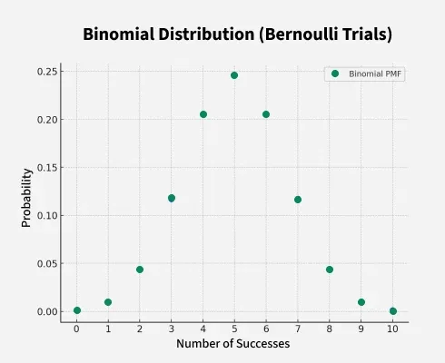
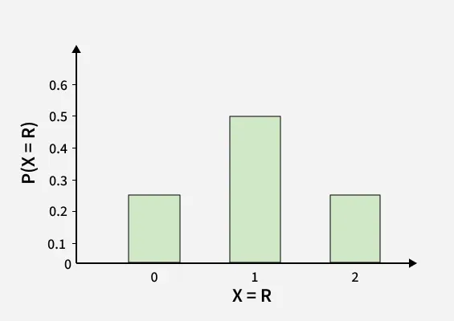

# Binomial Distribution in Probability
Binomial Distribution is a probability distribution used to model the number of successes in a fixed number of independent trials, where each trial has only two possible outcomes: success or failure. This distribution is useful for calculating the probability of a specific number of successes in scenarios like flipping coins, quality control, or survey predictions.

> Example: Imagine we toss a coin 5 times. Each toss can only give us a head or a tail, and the chance of getting a head stays the same every time. Also, what happens in one toss doesn’t affect the next one. Now, if we want to know the chance of getting exactly 3 heads out of these 5 tosses, this is a situation where we use the binomial distribution.

Example: Imagine we toss a coin 5 times. Each toss can only give us a head or a tail, and the chance of getting a head stays the same every time. Also, what happens in one toss doesn’t affect the next one. Now, if we want to know the chance of getting exactly 3 heads out of these 5 tosses, this is a situation where we use the binomial distribution.

Binomial Distribution is based on Bernoulli trials, where each trial has an independent and identical chance of success.

## Conditions for Binomial Distribution

The Binomial distribution can be used in scenarios where the following conditions are satisfied:

1. Fixed Number of Trials: There is a set number of trials or experiments (denoted by n), such as flipping a coin 10 times.
2. Two Possible Outcomes: Each trial has only two possible outcomes, often labeled as "success" and "failure." For example, getting heads or tails in a coin flip.
3. Independent Trials: The outcome of each trial is independent of the others, meaning the result of one trial does not affect the result of another.
4. Constant Probability: The probability of success (denoted by p) remains the same for each trial. For example, if you’re flipping a fair coin, the probability of getting heads is always 0.5.

The Binomial distribution is an appropriate model to use for calculating the probabilities of obtaining a certain number of successes in the given trials.

## Binomial Distribution Formula

The Binomial Distribution Formula, which is used to calculate the probability, for a random variable X = 0, 1, 2, 3,....,n is given as

> P(X = r) = nCr pr (1-p) n-r, r = 0, 1, 2, 3....

P(X = r) = nCr pr (1-p) n-r, r = 0, 1, 2, 3....

Where,

- n = Total number of trials
- r = Number of successes
- p = Probability of success

Example : A fair coin is tossed 3 times. Find the probability of getting exactly 2 heads.

Solution :

> Number of trials, n = 3Probability of getting head (success), p = 0.5 ; Probability of getting tail (failure), q = 1 − p = 0.5Required number of successes, r = 2P(X = r) = nCr pr (1-p) n-rP(X = 2) = 3C2 (0.5) 2 (0.5) 1 = 3 x 0.25 x 0.5 = 0.375 or 37.5 %

Number of trials, n = 3

Probability of getting head (success), p = 0.5 ; Probability of getting tail (failure), q = 1 − p = 0.5

Required number of successes, r = 2

P(X = r) = nCr pr (1-p) n-r

P(X = 2) = 3C2 (0.5) 2 (0.5) 1 = 3 x 0.25 x 0.5 = 0.375 or 37.5 %

### Binomial Random Variable

A binomial random variable X counts the number of "successes" in n independent trials, with two outcomes in each trial: success (with probability p) or failure (with probability 1−p) and constant probability p across all trials.

Example:

> A fair coin is flipped 20 times; Success: "Heads" (p=0.5).Random variable X: Number of heads observed in 20 flips.Distribution: X∼Binomial (n=20,p=0.5).Probability of Getting exacly 10 heads is given by, (r=10)P(X=10)=^{10}C_{20} (0.5)^{10}(0.5)^{10} ≈ 0.176(17.6\%)

A fair coin is flipped 20 times; Success: "Heads" (p=0.5).Random variable X: Number of heads observed in 20 flips.Distribution: X∼Binomial (n=20,p=0.5).

Probability of Getting exacly 10 heads is given by, (r=10)

P(X=10)=^{10}C_{20} (0.5)^{10}(0.5)^{10} ≈ 0.176(17.6\%)

## Negative Binomial Distribution

The Negative Binomial Distribution is used to model the number of trials needed to achieve a certain number of successes in a sequence of independent trials, where the probability of success in each trial is constant.

For example, consider a situation where getting 6 is the success of throwing a die. Now if we throw the die and not get 6 then it is a failure. Now we throw again and do not get 6. Let's say we don't get 6 for three successive attempts and 6 is obtained in the fourth attempt and onwards then the binomial distribution of the number of getting 6 is called the Negative Binomial Distribution.

### Negative Binomial Distribution Formula

The formula for Negative Binomial Distribution is given as

> P(x) = n+r-1Cr-1 pr(1-p) n

P(x) = n+r-1Cr-1 pr(1-p) n

Where,

- n = Total Number of Trials.
- r = Number of Trials in which we get the first success.
- p = Probability of Success in Each Trial.
- (1-p) = Probability of Failure in Each Trial.

## Bernoulli Trials in Binomial Distribution

Bernoulli Trial are a sequence of independent experiments, where each experiment (or trial) results in exactly two possible outcomes:

- Success (with probability p)
- Failure (with probability 1−p)

A random experiment is called Bernoulli Trial if it satisfies the following conditions:

- Trials are finite in number
- Trials are independent of each other
- Each trial has only two possible outcomes
- The probability of success and failure in each trial is the same.

The binomial distribution models the number of successes in a fixed number of Bernoulli trials.

## Binomial Distribution Calculation

Binomial Distribution in statistics is used to compute the probability of likelihood of an event using the above formula. To calculate the probability using binomial distribution we need to follow the following steps:

> Step 1: Find the number of trials and assign it as 'n'.Step 2: Find the probability of success in each trial and assign it as 'p'Step 3: Find the probability of failure and assign it as q where q = 1-pStep 4: Find the random variable X = r for which we have to calculate the binomial distributionStep 5: Calculate the probability of Binomial Distribution for X = r using the Binomial Distribution Formula.

- Step 1: Find the number of trials and assign it as 'n'.
- Step 2: Find the probability of success in each trial and assign it as 'p'
- Step 3: Find the probability of failure and assign it as q where q = 1-p
- Step 4: Find the random variable X = r for which we have to calculate the binomial distribution
- Step 5: Calculate the probability of Binomial Distribution for X = r using the Binomial Distribution Formula.

The use of the above steps has been illustrated using an example below:

## Binomial Distribution Examples

- Finding the probability of getting exactly 6 heads when a fair coin is flipped 10 times.
- Finding the probability of exactly 3 bulbs being defective when a batch of 100 bulbs is tested and each bulb has a 2% chance of being defective.
- To find the Probability of exactly 7 patients responding positively to the treatment when the drug is tested on 8 patients and has a 90% success rate.

Let's say we toss a coin twice, and getting head is a success we have to calculate the probability of success and failure then, in this case, we will calculate the probability distribution as follows:

In each trial getting a head that is a success, its probability is given as:

- p = 1/2
- n = 2 as we throw a coin twice
- r = 0 for no success, r = 1 for getting head once and r = 2 for getting head twice

> Probability of failure q = 1 - p = 1 - 1/2 = 1/2.P(Getting 1 head) = P(X = 1) = ncrprqn-r = 2c1 (1/2)1(1/2)1 = 2 ⨯ 1/2 ⨯ 1/2 = 1/2P(Getting 2 heads) = P(X = 2) = 2c2(1/2)2(1/2)0 = 1/4P(Getting 0 heads) = P(X = 0) = 2c0(1/2)0(1/2)2 = 1/4

Probability of failure q = 1 - p = 1 - 1/2 = 1/2.P(Getting 1 head) = P(X = 1) = ncrprqn-r = 2c1 (1/2)1(1/2)1 = 2 ⨯ 1/2 ⨯ 1/2 = 1/2P(Getting 2 heads) = P(X = 2) = 2c2(1/2)2(1/2)0 = 1/4P(Getting 0 heads) = P(X = 0) = 2c0(1/2)0(1/2)2 = 1/4

| Random Variable (X = r) | P(X = r) |
| --- | --- |
| X = 0 (Getting 0 Head) | 1/4 |
| X = 1 (Getting 1 Head) | 1/2 |
| X = 2 (Getting 2 Head) | 1/4 |

Random Variable (X = r)

P(X = r)

X = 0 (Getting 0 Head)

1/4

X = 1 (Getting 1 Head)

1/2

X = 2 (Getting 2 Head)

1/4

As of now, we know that Binomial Distribution is calculated for the Random Variables obtained in Bernoulli Trials. Hence, we should understand these terms.

## Binomial Distribution Visualization

Binomial Distribution Graph is plotted for X and P(X). We will plot a Binomial Distribution Graph for tossing a coin twice where getting the head is a success. If we toss a coin twice, the possible outcomes are {HH, HT, TH, TT}.

The Binomial Distribution Table for this is given below:

| X (Random Variable) | P(X) |
| --- | --- |
| X = 0 (Getting no head) {TT} | P(X = 0) = 1/4 = 0.25 |
| X = 1 (Getting 1 head) {HT, TH} | P(X = 1) = 2/4 = 1/2 = 0.5 |
| X = 2 (Getting two heads) {HH} | P(X = 2) = 1/4 = 0.25 |

X (Random Variable)

P(X)

X = 0 (Getting no head) {TT}

P(X = 0) = 1/4 = 0.25

X = 1 (Getting 1 head) {HT, TH}

P(X = 1) = 2/4 = 1/2 = 0.5

X = 2 (Getting two heads) {HH}

P(X = 2) = 1/4 = 0.25

Binomial Distribution Graph for the above table is given below:

## Binomial Distribution in Statistics

Measures of central tendency, specifically the mean, provide insights into the distribution's central or typical value for the number of successes in a series of independent trials. For a binomial distribution defined by parameters n (number of trials) and p (probability of success on each trial), the measures of central tendency are characterized as follows:

- Binomial Distribution Mean
- Binomial Distribution Variance
- Binomial Distribution Standard Deviation

## Measure of Central Tendency for Binomial Distribution

The formulas for Mean, Variance, and Standard Deviation of Binomial Distribution are listed below:

### Binomial Distribution Mean

The Mean of Binomial Distribution is the measurement of average success that would be obtained in the 'n' number of trials. The Mean of Binomial Distribution is also called Binomial Distribution Expectation(Expected Value or Expectation). The formula for Binomial Distribution Expectation is given as:

> μ = n.p

μ = n.p

where,

- μ is the Mean or Expectation
- n is the Total Number of Trials
- p is the Probability of Success in Each Trial

Example: If we toss a coin 20 times and getting head is the success then what is the mean of success?

Solution:

> Total Number of Trials n = 20Probability of getting head in each trial, p = 1/2 = 0.5Mean = n.p = 20 ⨯ 0.5It means on average we would get head 10 times on tossing a coin 20 times.

Total Number of Trials n = 20Probability of getting head in each trial, p = 1/2 = 0.5Mean = n.p = 20 ⨯ 0.5

It means on average we would get head 10 times on tossing a coin 20 times.

### Binomial Distribution Variance

Varianceof Binomial Distribution tells about the dispersion or spread of the distribution. It is given by the product of the number of trials, probability of success, and probability of failure. The formula for Variance is given as follows:

> σ2 = n.p.q

σ2 = n.p.q

where

- σ2is Variance
- n is the Total Number of Trials
- p is the Probability of Success in Each Trial
- q is the Probability of Failure in Each Trial

Example: If we toss a coin 20 times and getting head is the success then what is the variance of the distribution?

Solution:

> We have, n = 20Probability of Success in each trial (p) = 0.5Probability of Failure in each trial (q) = 0.5Variance of the Binomial Distribution, σ = n.p.q = (20 ⨯ 0.5 ⨯ 0.5) = 5

We have, n = 20

Probability of Success in each trial (p) = 0.5Probability of Failure in each trial (q) = 0.5Variance of the Binomial Distribution, σ = n.p.q = (20 ⨯ 0.5 ⨯ 0.5) = 5

### Binomial Distribution Standard Deviation

Standard Deviation of Binomial Distribution tells about the deviation of the data from the mean. Mathematically, Standard Deviation is the square root of the variance. The formula for the Standard Deviation of Binomial Distribution is given as

> σ = \sqrt {n\cdot p \cdot q}

σ = \sqrt {n\cdot p \cdot q}

where,

- σ is the Standard Deviation
- n is the Total Number of Trials
- p is the Probability of Success in Each Trial
- q is the Probability of Failure in Each Trial

Example: If we toss a coin 20 times and getting head is the success then what is the standard deviation?

Solution:

> We have, n = 20Probability of Success in each trial (p) = 0.5Probability of Failure in each trial (q) = 0.5Standard Deviation of the Binomial Distribution, σ = √n.p.q ⇒ σ = √(20 ⨯ 0.5 ⨯ 0.5) ⇒ σ = √5 = 2.23

We have, n = 20

Probability of Success in each trial (p) = 0.5Probability of Failure in each trial (q) = 0.5

Standard Deviation of the Binomial Distribution, σ = √n.p.q ⇒ σ = √(20 ⨯ 0.5 ⨯ 0.5) ⇒ σ = √5 = 2.23

## Binomial Distribution Applications

Binomial Distribution is used where we have only two possible outcomes. Let's see some of the areas where Binomial Distribution can be used.

- To find the number of male and female students in an institute.
- To find the likeability of something in Yes or No.
- To find defective or good products manufactured in a factor.
- To find positive and negative reviews on a product.
- Votes are collected in the form of 0 or 1.

## Binomial Distribution vs Normal Distribution

Binomial Distribution differs from the [[normal-distribution|Normal Distribution]] in many aspects. The key differences and characteristics of the Binomial and Normal distributions are highlighted in the following table:

| Binomial Distribution | [[normal-distribution|Normal Distribution]] |
| --- | --- |
| Discrete probability distribution | Continuous probability distribution |
| Two possible outcomes per trial (success or failure) | Infinite possible outcomes within a continuous range |
| Varies depending on n and p; typically skewed unless p=0.5 and n is large | Bell-shaped curve (symmetric) |
| x can take integer values from 0 to n | x can take any real number (from −∞ to +∞) |
| μ = np(n = number of trials, p = success probability) | μ (mean; center of the curve, given directly) |
| 𝝈2 = np(1 -p) | 𝝈2 (variance; spread, given directly) |
| Used for modeling the number of successes in a fixed number of independent trials | Used for modeling continuous data that cluster around a mean |
| Flipping coins, quality control (defective items) | Heights of people, [[test]] scores, measurement errors |
| Approximates [[normal-distribution|Normal distribution]] for large n and p not too close to 0 or 1 | Considered the limit of the Binomial Distribution as n becomes large and p is near 0.5 |

𝝈2 = np(1 -p)

𝝈2 (variance; spread, given directly)

### Related Articles

> Probability TheoryProbability Distribution FunctionBaye's TheoremBinomial Distribution in Business Statistics

- Probability Theory
- Probability Distribution Function
- Baye's Theorem
- Binomial Distribution in Business Statistics

## Binomial Distribution in Probability Examples

Example 1: A die is thrown 6 times and if getting an even number is a success what is the probability of getting (i) 4 Successes (ii) No success

Solution:

> Given: n = 6, p = 3/6 = 1/2, and q = 1 - 1/2 = 1/2P(X = r) = nCrprqn-r(i) P(X = 4) = 6C4(1/2)4(1/2)2 = 15/64(ii) P(X = 0) = 6C0(1/2)0(1/2)6 = 1/64

Given: n = 6, p = 3/6 = 1/2, and q = 1 - 1/2 = 1/2

P(X = r) = nCrprqn-r

(i) P(X = 4) = 6C4(1/2)4(1/2)2 = 15/64(ii) P(X = 0) = 6C0(1/2)0(1/2)6 = 1/64

Example 2: A coin is tossed 4 times what is the probability of getting at least 2 heads?

Solution:

> Given: n = 4Probability of getting head in each trial, p = 1/2 ⇒ q = 1 - 1/2 = 1/2P(X = r) = 4Cr(1/2)r(1/2)4-r⇒ P(X = r) = 4Cr(1/2)4 {Using the laws of Exaponents}And we know, Probability of getting at least 2 heads = P(X ≥ 2) ⇒ Probability of getting at least 2 heads = P(X = 2) + P(X = 3) + P(X = 4)⇒ Probability of getting at least 2 heads = 4C2(1/2)4 + 4C3(1/2)4 + 4C4(1/2)4⇒ Probability of getting at least 2 heads = (4C2 + 4C3 + 4C4)(1/2)4⇒ Probability of getting at least 2 heads = 11(1/2)4 = 11/16

Given: n = 4Probability of getting head in each trial, p = 1/2 ⇒ q = 1 - 1/2 = 1/2

P(X = r) = 4Cr(1/2)r(1/2)4-r⇒ P(X = r) = 4Cr(1/2)4 {Using the laws of Exaponents}

And we know, Probability of getting at least 2 heads = P(X ≥ 2)

⇒ Probability of getting at least 2 heads = P(X = 2) + P(X = 3) + P(X = 4)⇒ Probability of getting at least 2 heads = 4C2(1/2)4 + 4C3(1/2)4 + 4C4(1/2)4⇒ Probability of getting at least 2 heads = (4C2 + 4C3 + 4C4)(1/2)4⇒ Probability of getting at least 2 heads = 11(1/2)4 = 11/16

Example 3: A pair ofdice is thrown 6 times and getting sum 5 is a success then what is the probability of getting (i) no success (ii) two success (iii) at most two success

Solution:

> Given: n = 65 can be obtained in 4 ways (1, 4) (4, 1) (2, 3) (3, 2)Probability of getting the sum 5 in each trial, p = 4/36 = 1/9Probability of not getting sum 5 = 1 - 1/9 = 8/9(i) Probability of getting no success, P(X = 0) = 6C0(1/9)0(8/9)6 = (8/9)6(ii) Probability of getting two success, P(X = 2) = 6C2(1/9)2(8/9)4 = 15(84/96)(iii) Probability of getting at most two successes, P(X ≤ 2) = P(X = 0) + P(X = 1) + P(X = 2)⇒ P(X ≤ 2) = (8/9)6 + 6(85/96) + 15(84/96)

Given: n = 6

5 can be obtained in 4 ways (1, 4) (4, 1) (2, 3) (3, 2)

Probability of getting the sum 5 in each trial, p = 4/36 = 1/9Probability of not getting sum 5 = 1 - 1/9 = 8/9

(i) Probability of getting no success, P(X = 0) = 6C0(1/9)0(8/9)6 = (8/9)6(ii) Probability of getting two success, P(X = 2) = 6C2(1/9)2(8/9)4 = 15(84/96)(iii) Probability of getting at most two successes, P(X ≤ 2) = P(X = 0) + P(X = 1) + P(X = 2)

⇒ P(X ≤ 2) = (8/9)6 + 6(85/96) + 15(84/96)

## Practice Problems on Binomial Distribution in Probability

1. A box has 5 red, 7 black,? and 8 white balls. If three balls are drawn one by one with replacement what is the probability that all,

i) all are white ii) all are red iii) all are black

2. What is the probability distribution of the number of tails when three coins are tossed together?

3. A die is thrown three times what is the probability distribution of getting six?

4. A coin is tossed 4 times then what is the probability distribution of getting head.