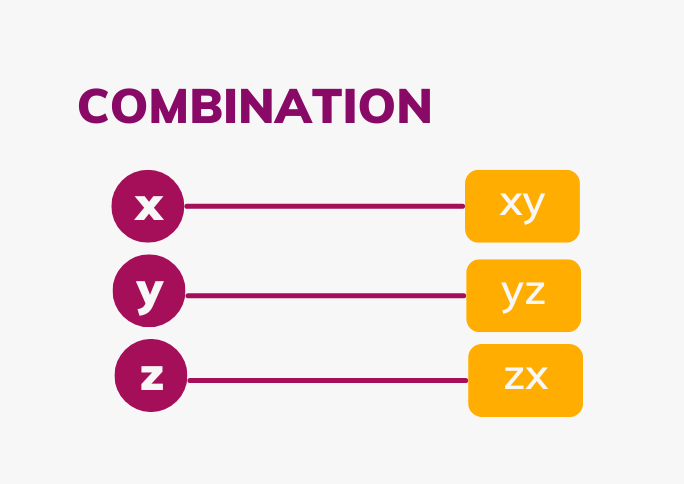
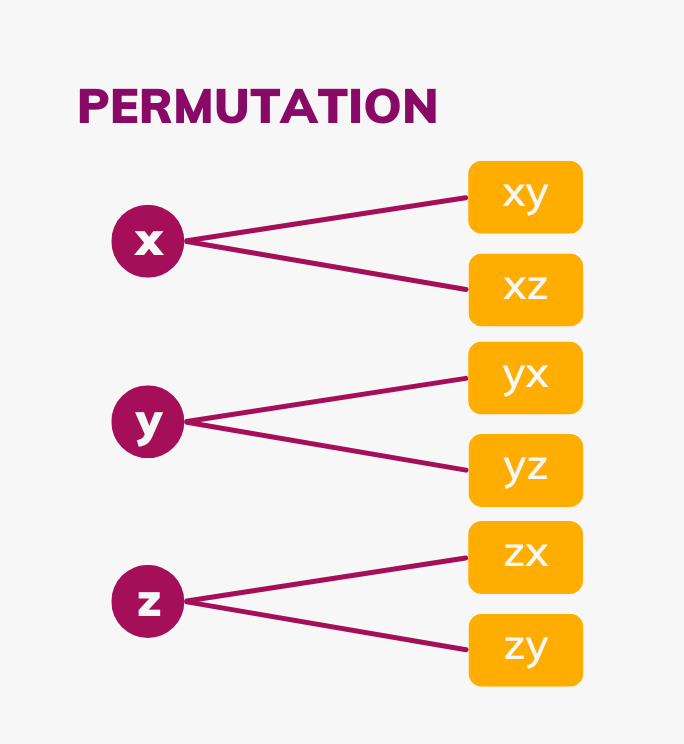

# Combinatorics
Combinatorics is a branch of mathematics that focuses on studying the selection, arrangement, and operation of countable discrete structures. This is essential in computer science because it can be used to solve problems regarding statistics and probability. Moreover, combinatorics also plays a big role in the optimization of various applications. Combination and Permutation are two terms that are often used to solve problems in combinatorics.

Table of Content

- Combinatorics Definition
- Permutation and Combination under Combinatorics
- Properties of Combinatorics
- Uses of Combinatorics

- Combination
- Permutation

- Addition Principle
- Multiplication Principle

## Combinatorics Definition

Combinatorics is a branch of mathematics focused on counting, arranging, and analyzing finite sets. It deals with the study of combinations, permutations, and the structures that arise from these arrangements.

## Permutation and Combination under Combinatorics

Combinatorics is a branch of mathematics that deals with counting, arranging, and analyzing sets of elements. Within combinatorics, [[permutations-and-combinations|permutations and combinations]] are two fundamental concepts used to calculate the number of ways to arrange or select items.

### Combination

Combination is selections of objects where the order does not matter. The formula for number of combinations of 'n' objects taken 'r' at a time is:

> nCr = C(n, r) = n!/r!(n - r)!

nCr = C(n, r) = n!/r!(n - r)!

### Permutation

Permutation is arrangements of objects where the order matters. The formula for number of permutations of 'n' objects taken 'r' at a time is:

> nPr = P(n, r) = n!/(n - r)!

nPr = P(n, r) = n!/(n - r)!

Example of Permutation and Combination: Suppose we have 3 variables named x, y, and z. Find the combination and the permutation of two variables from the given variables.

Solution:

Combination: xy, yz, and zx

Permutation: xy, yx, yz, zy, zx, and xz

From the example above, we can see that in the permutation both the xy and yx are written because the order of arrangement matters. However, in the combination, only one of them is written because both are the same things since the order of arrangement does not matter.

## Properties of Combinatorics

Combinatorics is the branch of mathematics that deals with counting, arrangement, and combination of objects. Here are some fundamental properties and principles of combinatorics:

### Addition Principle

If there are n ways to perform task A and m ways to perform task B, and these tasks cannot be done simultaneously, then there are n + m ways to choose one of these tasks.

> Example: If you have 3 shirts and 4 pants, there are 3+4 = 7 ways to choose either a shirt or a pant.

Example: If you have 3 shirts and 4 pants, there are 3+4 = 7 ways to choose either a shirt or a pant.

### Multiplication Principle

If there are n ways to perform task A and m ways to perform task B, and these tasks are independent (i.e., performing one does not affect the other), then there are n×m ways to perform both tasks.

> Example: If you have 3 shirts and 4 pants, there are 3×4 = 12 ways to choose a shirt and a pant.

Example: If you have 3 shirts and 4 pants, there are 3×4 = 12 ways to choose a shirt and a pant.

## Uses of Combinatorics

Combinatorics, the branch of mathematics dealing with counting, arrangement, and combination of objects, has numerous applications across various fields. Here are some key areas where combinatorics is used:

- Probability Theory: Combinatorics helps in calculating probabilities by counting the number of favorable outcomes over the total possible outcomes.

- Graph Theory: Used to study graphs, which are structures made up of nodes connected by edges.

- Design and Analysis of Experiments: Combinatorial designs help in planning experiments to ensure that the data collected is statistically valid and can be analyzed effectively.

- Algorithms and Data Structures: Combinatorial algorithms are used in sorting, searching, and optimization problems.

Articles Related to Combinatorics:

> Permutation and CombinationBinomial TheoremPegionhole PrincipleFundamental Principle of Counting

- Permutation and Combination
- Binomial Theorem
- Pegionhole Principle
- Fundamental Principle of Counting

## Combinatorics Solved Examples

Example 1: How Many Words with 2 Different Vowels and 2 Different Consonants can be Formed from Alphabet?

Solution:

> To solve this problem, we have to know that the alphabet contains 26 letters including 5 vowels and 21 consonants.Step 1: Ways of selecting 2 different vowels out of 5 vowelsC(5, 2) = 5! / (2! × (5 – 2)!)= 5! / (2! × 3!) = 10Step 2: Ways of selecting 2 different consonants out of 21 consonantsC(21, 3) = 21! / (2! × (21 – 2)!)= 21! / (3! × 19!) = 210Hence, combinations of 2 different vowels and 3 different consonants is 10 × 210 = 2100Step 3: Ways arranging or forming 2 vowels and 2 consonants out of 4 lettersP(4, 4) = 4! / (4 – 4)! = 4! / 0! = 4! = 24Therefore, the total number of ways is 2100 × 24 = 54000Answer: 54000 words

To solve this problem, we have to know that the alphabet contains 26 letters including 5 vowels and 21 consonants.

Step 1: Ways of selecting 2 different vowels out of 5 vowels

C(5, 2) = 5! / (2! × (5 – 2)!)

= 5! / (2! × 3!) = 10

Step 2: Ways of selecting 2 different consonants out of 21 consonants

C(21, 3) = 21! / (2! × (21 – 2)!)

= 21! / (3! × 19!) = 210

Hence, combinations of 2 different vowels and 3 different consonants is 10 × 210 = 2100

Step 3: Ways arranging or forming 2 vowels and 2 consonants out of 4 letters

P(4, 4) = 4! / (4 – 4)!

= 4! / 0! = 4! = 24

Therefore, the total number of ways is 2100 × 24 = 54000

Answer: 54000 words

Example 2: How many distinct ways are there to arrange 10 people in a row if exactly 3 people must be together in one block?

Solution:

> To solve this problem, we need to treat the block of 3 people who must be together as a single unit.The 3 people within this block can be arranged among themselves in 3! ways. [3! = 6]Since the 3 people are treated as one unit, we now have 8 units to arrange (the block plus the other 7 individual people).The 8 units can be arranged in (8!) ways. [8! = 40320]To find the total number of distinct ways to arrange the 10 people with the block treated as a single unit, multiply the number of ways to arrange the units by the number of ways to arrange the people within the block.[8! × 3! = 40320 × 6 = 241920]Therefore, there are (241,920) distinct ways to arrange 10 people in a row if exactly 3 of them must be together in one block.

To solve this problem, we need to treat the block of 3 people who must be together as a single unit.

The 3 people within this block can be arranged among themselves in 3! ways. [3! = 6]

Since the 3 people are treated as one unit, we now have 8 units to arrange (the block plus the other 7 individual people).

The 8 units can be arranged in (8!) ways. [8! = 40320]

To find the total number of distinct ways to arrange the 10 people with the block treated as a single unit, multiply the number of ways to arrange the units by the number of ways to arrange the people within the block.

[8! × 3! = 40320 × 6 = 241920]

Therefore, there are (241,920) distinct ways to arrange 10 people in a row if exactly 3 of them must be together in one block.

Problem 3: How many 5-digit numbers can be formed such that the digit 3 appears exactly twice?

Solution:

> To determine how many 5-digit numbers can be formed such that the digit 3 appears exactly twice, we can break down the problem as follows:Choose the positions for the two 3's:We need to choose 2 positions out of 5 for the digit 3. The number of ways to choose 2 positions out of 5 is given by the combination formula 5C2 = 5!/2!(5-2)! = 10The remaining 3 positions can be filled with any digits from 0 to 9 except for 3. Since we are forming 5-digit numbers, the first digit cannot be 0. The first digit (one of the remaining three positions) can be any digit from 1 to 9 except 3. That gives us 8 choices for the first digit.The other two positions can be any digit from 0 to 9 except 3. That gives us 9 choices for each of these two positions.For the first position (not 0 and not 3), we have 8 choices.For the second position (can be 0 but not 3), we have 9 choices.For the third position (can be 0 but not 3), we have 9 choices.Therefore, the number of ways to fill these remaining three positions is: 8 × 9 × 9 = 648We now combine the number of ways to choose the positions for the 3's and the number of ways to fill the remaining positions.10 × 648 = 6480Therefore, there are (6,480) different 5-digit numbers where the digit 3 appears exactly twice.

To determine how many 5-digit numbers can be formed such that the digit 3 appears exactly twice, we can break down the problem as follows:

Choose the positions for the two 3's:

We need to choose 2 positions out of 5 for the digit 3. The number of ways to choose 2 positions out of 5 is given by the combination formula

5C2 = 5!/2!(5-2)! = 10

The remaining 3 positions can be filled with any digits from 0 to 9 except for 3. Since we are forming 5-digit numbers, the first digit cannot be 0.

The first digit (one of the remaining three positions) can be any digit from 1 to 9 except 3. That gives us 8 choices for the first digit.

The other two positions can be any digit from 0 to 9 except 3. That gives us 9 choices for each of these two positions.

For the first position (not 0 and not 3), we have 8 choices.

For the second position (can be 0 but not 3), we have 9 choices.

For the third position (can be 0 but not 3), we have 9 choices.

Therefore, the number of ways to fill these remaining three positions is: 8 × 9 × 9 = 648

We now combine the number of ways to choose the positions for the 3's and the number of ways to fill the remaining positions.

10 × 648 = 6480

Therefore, there are (6,480) different 5-digit numbers where the digit 3 appears exactly twice.

Problem 4: How many ways can you arrange the letters in the word "MATHEMATICS" such that the two 'M's are next to each other?

Solution:

> Treat two 'M's as a single unit:This reduces the problem to arranging the units: "MM", A, T, H, E, A, T, I, C, S (10 units).Count permutations of these units:Frequencies:A: 2T: 2Other letters appear once.Use the formula: 10!/2!×2!Calculate: 3628800/4=907200

Treat two 'M's as a single unit:

This reduces the problem to arranging the units: "MM", A, T, H, E, A, T, I, C, S (10 units).

Count permutations of these units:

Frequencies:

A: 2

T: 2

Other letters appear once.

Use the formula: 10!/2!×2!

Calculate: 3628800/4=907200

Problem 5: Problem: In how many ways can you choose 4 books from a shelf of 12 books?

Solution:

> 4 Books from the shelf of 12 books can be choose in 4C12 number of ways.Use the combination formula 12C4 = 12!//4!(12−4)!Calculate = (12×11×10×9)/(4×3×2×1) = 495There are 495 ways to choose 4 books from 12.

4 Books from the shelf of 12 books can be choose in 4C12 number of ways.

Use the combination formula

12C4 = 12!//4!(12−4)!

Calculate = (12×11×10×9)/(4×3×2×1) = 495

There are 495 ways to choose 4 books from 12.

## Practice Problems Combinatorics

Problem 1: How many distinct ways can you arrange 7 people around a circular table?

Problem 2: How many ways can you distribute 5 identical candies into 3 distinct boxes?

Problem 3: In how many ways can you arrange 4 items so that none of them is in its original position?

Problem 4: How many ways can you arrange 6 people around a circular table?

Problem 5: How many ways can you distribute 5 identical candies to 3 children?

Problem 6: How many 4-digit numbers can be formed using the digits 1, 2, and 3, with repetition allowed?

Problem 7: How many subsets can be formed from a set of 8 elements?

Problem 8: Find the number of ways to select 4 students from a class of 20 where at least 1 student must be from a specific group of 5 students.

Problem 9: How many different paths are there from the bottom-left corner to the top-right corner of a 3x3 grid, moving only right or up?

Problem 10: How many 5-digit numbers can be formed using the digits 1, 2, 3, 4, 5, if no digit is repeated?