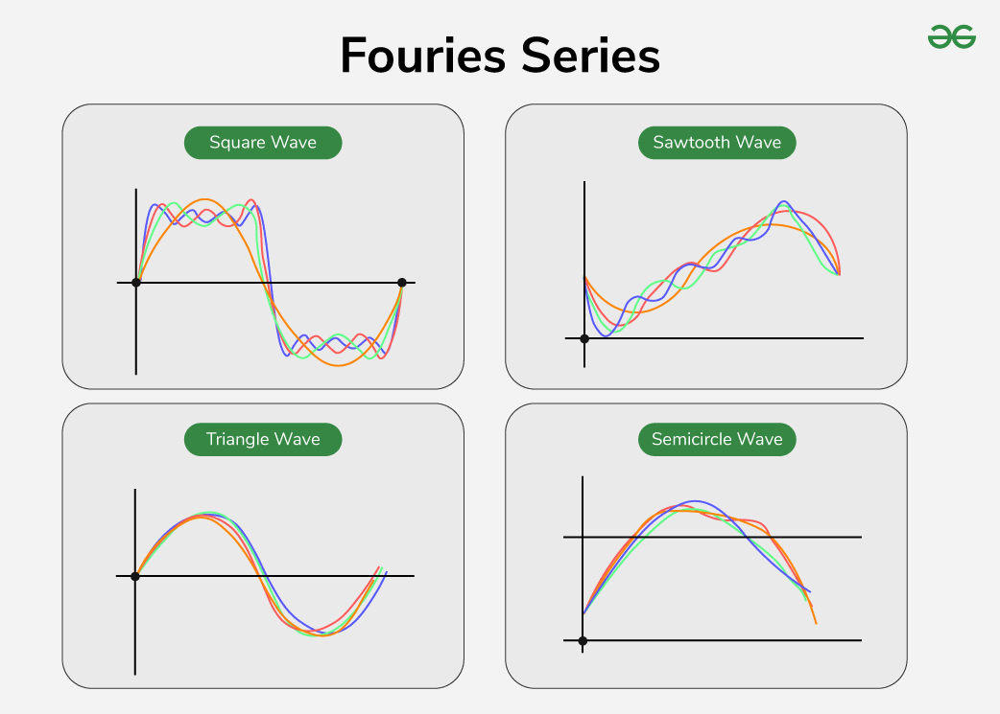
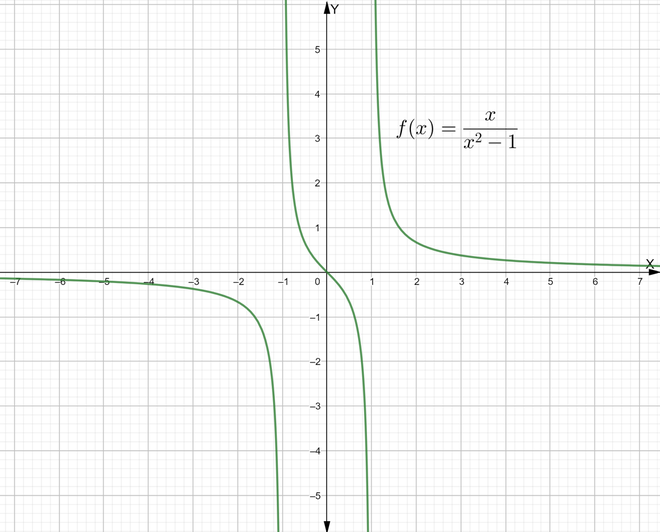
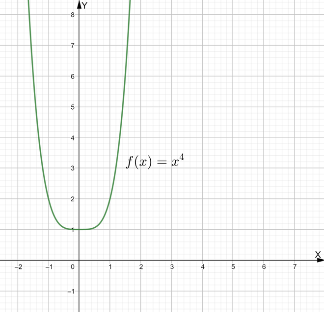
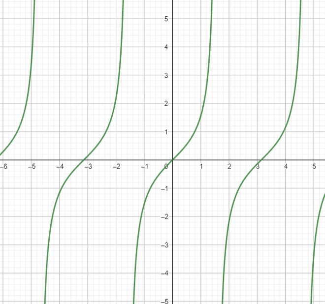

# Fourier Series
Fourier Series is a sum of sine and cosine waves that represents a periodic function. Each wave in the sum, or harmonic, has a frequency that is an integer multiple of the periodic function’s fundamental frequency.

Even though a Fourier series has infinitely many harmonics, the first few harmonics often give a good approximation of the original function. For example, a square wave can be closely recreated by adding the first few sine waves.

In short, the Fourier Series lets us break down complex repeating patterns into simple wave components. It is also a particularly useful tool for solving problems in higher mathematics, including partial differential equations.

## Fourier Series Mathematical Definition

A Fourier series is a way to represent a periodic function as a sum of sine and cosine functions, or equivalently, as a sum of complex exponentials, each with different frequencies and amplitudes.

> Suppose we are given a periodic function f(x). Now as the original function is periodic therefore,c1f1(x) + … + cnfn(x)Next consider the infinite series,f(x) = \frac{a_0}{2} + \sum_{n=1}^{\infty} \Big(a_n \cos \frac{n\pi x}{L} + b_n \sin \frac{n\pi x}{L} \Big)Consisting of 2L-periodic functions converges for all x, then the function to which it converges will be periodic of period 2L. Now as seen above we need to represent the function f(x) in such a way that the periodic function f(x) is replaced by functions like sine and cosine. For this the Fourier series is given by, Here,a_0=\frac{1}{\pi} \int_{- \pi}^{\pi} f(x) dx a_n=\frac{1}{\pi} \int_{-\pi}^{\pi} f(x)cos\;nx\;dx .b_n=\frac{1}{\pi} \int_{-\pi}^{\pi}f(x)sin\;nx\;dx .n = 1,2,3....

Suppose we are given a periodic function f(x). Now as the original function is periodic therefore,

c1f1(x) + … + cnfn(x)

Next consider the infinite series,

f(x) = \frac{a_0}{2} + \sum_{n=1}^{\infty} \Big(a_n \cos \frac{n\pi x}{L} + b_n \sin \frac{n\pi x}{L} \Big)

Consisting of 2L-periodic functions converges for all x, then the function to which it converges will be periodic of period 2L. Now as seen above we need to represent the function f(x) in such a way that the periodic function f(x) is replaced by functions like sine and cosine. For this the Fourier series is given by,

Here,

a_0=\frac{1}{\pi} \int_{- \pi}^{\pi} f(x) dx

a_n=\frac{1}{\pi} \int_{-\pi}^{\pi} f(x)cos\;nx\;dx .

b_n=\frac{1}{\pi} \int_{-\pi}^{\pi}f(x)sin\;nx\;dx .

n = 1,2,3....

## Fourier Series Formula

For any function f(x) with period 2L, the formula of the Fourier Series is given as,

> f(x) = \frac{1}{2} a_0 + \sum_{n=1}^{\infty} a_n \cos(nx) + \sum_{n=1}^{\infty} b_n \sin(nx) .where,a0 = \frac{1}{\pi }\int_{-\Pi }^{\Pi }f(x)dxan = \frac{1}{\pi }\int_{-\Pi }^{\Pi }f(x)cos~nx ~dxbn = \frac{1}{\pi }\int_{-\Pi }^{\Pi }f(x)sin~nx ~dx

f(x) = \frac{1}{2} a_0 + \sum_{n=1}^{\infty} a_n \cos(nx) + \sum_{n=1}^{\infty} b_n \sin(nx) .

where,

- a0 = \frac{1}{\pi }\int_{-\Pi }^{\Pi }f(x)dx
- an = \frac{1}{\pi }\int_{-\Pi }^{\Pi }f(x)cos~nx ~dx
- bn = \frac{1}{\pi }\int_{-\Pi }^{\Pi }f(x)sin~nx ~dx

### Coefficient of Fourier Series

In the above formula of the Fourier Series, the terms a0, an, and bn are called coefficients of the Fourier series. The value of these coefficients defines the Fourier series of a given periodic function. The value of a0 represents the average value of the function, and an and bn represent the amplitude of the sinusoidal functions.

## Exponential form of Fourier Series

> From the equation above,f(x) = \frac{1}{2} a_0 + \sum_{n=1}^{\infty} \left( a_n \cos \frac{n \pi x}{L} + b_n \sin \frac{n \pi x}{L} \right) .Now according to Euler's formula,eiθ= cosθ +isinθUsing thisf(x) = \sum_{n=-\infty}^{\infty} Cneinx.Here Cn is called decomposition coefficient and is calculated as,C_n = \frac{1}{2T} \int_{-T}^{T}e^{{-in}\frac{\pi t}{T} }f(t) .

From the equation above,

f(x) = \frac{1}{2} a_0 + \sum_{n=1}^{\infty} \left( a_n \cos \frac{n \pi x}{L} + b_n \sin \frac{n \pi x}{L} \right) .

Now according to Euler's formula,

eiθ= cosθ +isinθ

Using this

f(x) = \sum_{n=-\infty}^{\infty} Cneinx.

Here Cn is called decomposition coefficient and is calculated as,

C_n = \frac{1}{2T} \int_{-T}^{T}e^{{-in}\frac{\pi t}{T} }f(t) .

## Conditions for Fourier series

Suppose a function f(x) has a period of 2π and is integrable in a period [-π, π]. Now, there are two conditions.

1. The function f(x) with period 2π is absolutely integrable on [-π, π], so that the following Dirichlet integral of this function is finite:\int\limits_{ - \pi }^\pi {\left| {f\left( x \right)} \right|dx} \lt \infty ;
2. Next condition is that the function is a single-valued, piecewise continuous (must have a finite number of jump discontinuities), and piecewise monotonic (must have a finite number of [[maxima-and-minima|maxima and minima]]).

If certain conditions are met, the Fourier series of a function exists and converges to the function itself, reconstructing the original function. To fully understand the Fourier series, it's important to first grasp the concepts of odd and even functions and periodic functions, as they are fundamental to how the series is formed.

- Odd function: Suppose we are given a function y = f(x).

> f(-x) = -f(x) = -yThen the function is said to be odd.

f(-x) = -f(x) = -y

Then the function is said to be odd.

- Even function: Again, consider a function f(x) = y.

> If f(-x) = f(x) = yThen the function is even in nature.

If f(-x) = f(x) = y

Then the function is even in nature.

- Periodic functions: Let a function f(x) be periodic with an interval λ. Now consider an element x as a part of the domain of this function. This means that,

> f(x) = f(x + λ)

f(x) = f(x + λ)

Hence, periodic functions are those functions that repeat themselves throughout values(λ as shown above). The smallest possible positive value of λ is called the period of this function.

## Applications of Fourier Series

Fourier Series has many applications in mathematical analysis. It is one of the most important series that is used to find the expansion of the periodic function in a closed interval. Some of its applications are,

- Fourier Series is used to solve various functions and find their integrals and derivatives.
- Fourier Series is used in 3-D Graph Modeling
- The Fourier series is used to draw graphs of various functions.
- Fourier series is used in the study of Complex functions in Statistics, Astronomy, Biology, and other etc.

### Related Articles

> Taylor SeriesMaclaurin series

- Taylor Series
- Maclaurin series

## Solved Examples of Fourier Series

Example 1: Find the Fourier series expansion of the function f(x) = x, within the limits [– 1, 1].

Solution:

> From Fourier series expansion. Here,A_{0}=\frac{1}{2 } \cdot \int_{-1}^{1} x d x .A_{n}=\frac{1}{1} \cdot \int_{-1}^{1} x \cos \left(\frac{n \pi x}{1}\right) d x, \quad n>0 .B_{n}=\frac{1}{1} \cdot \int_{-1}^{1} x \sin \left(\frac{n \pi x}{1}\right) d x, \quad n>0 .f(x)=A_{0}+\sum_{n=1}^{\infty} A_{n} \cdot \cos \left(\frac{n \pi x}{L}\right)+\sum_{n=1}^{\infty} B_{n} \cdot \sin \left(\frac{n \pi x}{L}\right) .\mathrm{f}(\mathrm{x})=\frac{1}{2 \cdot 1} \cdot \int_{-1}^{1}\left(x\right) d x+\sum_{n=1}^{\infty} \frac{1}{1} \cdot \int_{-1}^{1}\left(x\right) \cos \left(\frac{n \pi x}{1}\right) d x \cdot \cos \left(\frac{n \pi x}{1}\right)+\sum_{n=1}^{\infty} \frac{1}{1} \cdot \int_{-1}^{1}\left(x\right) \sin \left(\frac{n \pi x}{1}\right) d x \cdot \sin \left(\frac{n \pi x}{1}\right) .Om solving the integrals we get even functions and one odd function. Therefore,f(x) = x = \sum_{n=1}^\infty \frac{2(-1)^{n+1}}{n\pi} \sin(n\pi x).

From Fourier series expansion. Here,

A_{0}=\frac{1}{2 } \cdot \int_{-1}^{1} x d x .

A_{n}=\frac{1}{1} \cdot \int_{-1}^{1} x \cos \left(\frac{n \pi x}{1}\right) d x, \quad n>0 .

B_{n}=\frac{1}{1} \cdot \int_{-1}^{1} x \sin \left(\frac{n \pi x}{1}\right) d x, \quad n>0 .

f(x)=A_{0}+\sum_{n=1}^{\infty} A_{n} \cdot \cos \left(\frac{n \pi x}{L}\right)+\sum_{n=1}^{\infty} B_{n} \cdot \sin \left(\frac{n \pi x}{L}\right) .

\mathrm{f}(\mathrm{x})=\frac{1}{2 \cdot 1} \cdot \int_{-1}^{1}\left(x\right) d x+\sum_{n=1}^{\infty} \frac{1}{1} \cdot \int_{-1}^{1}\left(x\right) \cos \left(\frac{n \pi x}{1}\right) d x \cdot \cos \left(\frac{n \pi x}{1}\right)+\sum_{n=1}^{\infty} \frac{1}{1} \cdot \int_{-1}^{1}\left(x\right) \sin \left(\frac{n \pi x}{1}\right) d x \cdot \sin \left(\frac{n \pi x}{1}\right) .

Om solving the integrals we get even functions and one odd function. Therefore,

f(x) = x = \sum_{n=1}^\infty \frac{2(-1)^{n+1}}{n\pi} \sin(n\pi x).

Example 2: Find the Fourier sine series of the function f(x)=tan⁡x on the interval (0,π/2).

Solution:

> Fourier sine series for f(x) = tan⁡x on the interval (0,π/2)General Fourier Sine Series FormulaFor a function f(x) defined on (0, L) , the Fourier sine series is:f(x) = \sum_{n=1}^{\infty} b_n \sin\left( \frac{n\pi x}{L} \right)where,b_n = \frac{2}{L} \int_0^L f(x) \sin\left( \frac{n\pi x}{L} \right) dxApply tof(x) = tanxL = π/2we substitute into the formula:b_n = \frac{2}{\frac{\pi}{2}} \int_0^{\frac{\pi}{2}} \tan x \cdot \sin\left( \frac{2n x}{\pi} \right) dx= \frac{4}{\pi} \int_0^{\frac{\pi}{2}} \tan x \cdot \sin\left( \frac{2n x}{\pi} \right) dxThe Fourier sine series is:f(x) = \sum_{n=1}^{\infty} \left[ \frac{4}{\pi} \int_0^{\frac{\pi}{2}} \tan x \cdot \sin\left( \frac{2n x}{\pi} \right) dx \right] \cdot \sin\left( \frac{2n x}{\pi} \right)

Fourier sine series for f(x) = tan⁡x on the interval (0,π/2)

General Fourier Sine Series Formula

For a function f(x) defined on (0, L) , the Fourier sine series is:

f(x) = \sum_{n=1}^{\infty} b_n \sin\left( \frac{n\pi x}{L} \right)

where,

b_n = \frac{2}{L} \int_0^L f(x) \sin\left( \frac{n\pi x}{L} \right) dx

Apply to

- f(x) = tanx
- L = π/2

we substitute into the formula:

b_n = \frac{2}{\frac{\pi}{2}} \int_0^{\frac{\pi}{2}} \tan x \cdot \sin\left( \frac{2n x}{\pi} \right) dx= \frac{4}{\pi} \int_0^{\frac{\pi}{2}} \tan x \cdot \sin\left( \frac{2n x}{\pi} \right) dx

The Fourier sine series is:

f(x) = \sum_{n=1}^{\infty} \left[ \frac{4}{\pi} \int_0^{\frac{\pi}{2}} \tan x \cdot \sin\left( \frac{2n x}{\pi} \right) dx \right] \cdot \sin\left( \frac{2n x}{\pi} \right)

Example 3: Find the Fourier series of the function f(x) = 1 for limits [– π, π].

Solution:

> Comparing with general Fourier series expansion we get,f(x) = \frac{a_0}{2} + \sum_{n=1}^{\infty} \left[ a_n \cos(nx) + b_n \sin(nx) \right]Calculate a0 a_0 = \dfrac{1}{\pi}\int_{- \pi}^{\pi}1 dx = \frac{1}{\pi} \cdot (2\pi) = 2= a0/2Calculate ana_n = \frac{1}{\pi} \int_{-\pi}^{\pi} 1 \cdot cos \ nx \ dx b_n = \frac{1}{\pi} \int_{-\pi}^{\pi} 1 \cdot sin \ nx \ dx .\\ \large f(x)=\frac{1}{2}a_{0}+\sum_{n=1}^{\infty}a_{n}cos\;nx+\sum_{n=1}^{\infty}b_{n}sin\;nx f(x) = 1

Comparing with general Fourier series expansion we get,

f(x) = \frac{a_0}{2} + \sum_{n=1}^{\infty} \left[ a_n \cos(nx) + b_n \sin(nx) \right]

Calculate a0

a_0 = \dfrac{1}{\pi}\int_{- \pi}^{\pi}1 dx

= \frac{1}{\pi} \cdot (2\pi) = 2= a0/2

Calculate an

a_n = \frac{1}{\pi} \int_{-\pi}^{\pi} 1 \cdot cos \ nx \ dx

b_n = \frac{1}{\pi} \int_{-\pi}^{\pi} 1 \cdot sin \ nx \ dx .\\ \large f(x)=\frac{1}{2}a_{0}+\sum_{n=1}^{\infty}a_{n}cos\;nx+\sum_{n=1}^{\infty}b_{n}sin\;nx

f(x) = 1

Example 4: Consider a function f(x) = x2 for the limits [– π, π]. Find its Fourier series expansion.

Solution:

> Since f(x) = x2 is an even function, all bn = 0Comparing with general Fourier series expansion we get,Calculate a0:a_0 = \frac{1}{\pi} \int_{-\pi}^{\pi} x^2 \, dx = \frac{2}{\pi} \int_{0}^{\pi} x^2 \, dx = \frac{2}{\pi} \cdot \left[ \frac{x^3}{3} \right]_0^{\pi} = \frac{2}{\pi} \cdot \frac{\pi^3}{3} = \frac{2\pi^2}{3}\frac{a_0}{2} = \frac{\pi^2}{3}Calculate an:a_n = \frac{1}{\pi} \int_{-\pi}^{\pi} x^2 \cos(nx) \, dxAgain, since x2cos⁡(nx) is even, we can simplify:a_n = \frac{2}{\pi} \int_{0}^{\pi} x^2 \cos(nx) \, dxan = 4(-1)nCalculate bn:b_n = \frac{1}{\pi} \int_{-\pi}^{\pi} x^2 \sin(nx) \, dx = 0Since x2sin⁡(nx) is an odd function, the integral of an odd function over a symmetric interval [−π,π] is zero. Hence:bn = 0Final Fourier Series Expansionf(x) = \frac{\pi^2}{3} + \sum_{n=1}^{\infty} \frac{4(-1)^n}{n^2} \cos(nx)

Since f(x) = x2 is an even function, all bn = 0

Comparing with general Fourier series expansion we get,

Calculate a0:a_0 = \frac{1}{\pi} \int_{-\pi}^{\pi} x^2 \, dx = \frac{2}{\pi} \int_{0}^{\pi} x^2 \, dx = \frac{2}{\pi} \cdot \left[ \frac{x^3}{3} \right]_0^{\pi} = \frac{2}{\pi} \cdot \frac{\pi^3}{3} = \frac{2\pi^2}{3}\frac{a_0}{2} = \frac{\pi^2}{3}Calculate an:a_n = \frac{1}{\pi} \int_{-\pi}^{\pi} x^2 \cos(nx) \, dxAgain, since x2cos⁡(nx) is even, we can simplify:a_n = \frac{2}{\pi} \int_{0}^{\pi} x^2 \cos(nx) \, dxan = 4(-1)nCalculate bn:b_n = \frac{1}{\pi} \int_{-\pi}^{\pi} x^2 \sin(nx) \, dx = 0Since x2sin⁡(nx) is an odd function, the integral of an odd function over a symmetric interval [−π,π] is zero. Hence:bn = 0Final Fourier Series Expansionf(x) = \frac{\pi^2}{3} + \sum_{n=1}^{\infty} \frac{4(-1)^n}{n^2} \cos(nx)

Example 5: Find the Fourier series expansion of the function f(x) = 4-3x for the limits [– 1, 1].

Solution:

> Fourier Series Expansion off(x) = 4 - 3x ,[-1, 1] The general form of the Fourier series for a function defined on the interval [-1,1] is:f(x) = \frac{a_0}{2} + \sum_{n=1}^{\infty} \left( a_n \cos(n\pi x) + b_n \sin(n\pi x) \right)Calculation of a0:a_0 = \int_{-1}^{1} (4 - 3x) \, dx = \left[4x - \frac{3x^2}{2} \right]_{-1}^{1} = (4 - \frac{3}{2}) - (-4 - \frac{3}{2}) = 10\Rightarrow \frac{a_0}{2} = 5Calculation of an:a_n = \int_{-1}^{1} (4 - 3x) \cos(n\pi x) \, dxThe first term \int_{-1}^{1} 4 \cos(n\pi x) \, dx = 0 The second term \int_{-1}^{1} x \cos(n\pi x) \, dx = 0 an = 0Calculation of bn:b_n = \int_{-1}^{1} (4 - 3x) \sin(n\pi x) \, dx = \int_{-1}^{1} 4\sin(n\pi x) \, dx - 3 \int_{-1}^{1} x \sin(n\pi x) \, dxThe first integral is zero (odd function)The second is a standard integral:\int_{-1}^{1} x \sin(n\pi x) \, dx = \frac{2 (-1)^n}{n\pi}\Rightarrow b_n = -3 \cdot \frac{2 (-1)^n}{n\pi} = \frac{6 (-1)^n}{n\pi}Final Fourier Series:f(x) = 5 + \sum_{n=1}^{\infty} \frac{6 (-1)^n}{n\pi} \sin(n\pi x)

Fourier Series Expansion off(x) = 4 - 3x ,[-1, 1] The general form of the Fourier series for a function defined on the interval [-1,1] is:f(x) = \frac{a_0}{2} + \sum_{n=1}^{\infty} \left( a_n \cos(n\pi x) + b_n \sin(n\pi x) \right)Calculation of a0:a_0 = \int_{-1}^{1} (4 - 3x) \, dx = \left[4x - \frac{3x^2}{2} \right]_{-1}^{1} = (4 - \frac{3}{2}) - (-4 - \frac{3}{2}) = 10\Rightarrow \frac{a_0}{2} = 5Calculation of an:a_n = \int_{-1}^{1} (4 - 3x) \cos(n\pi x) \, dxThe first term \int_{-1}^{1} 4 \cos(n\pi x) \, dx = 0 The second term \int_{-1}^{1} x \cos(n\pi x) \, dx = 0 an = 0Calculation of bn:b_n = \int_{-1}^{1} (4 - 3x) \sin(n\pi x) \, dx = \int_{-1}^{1} 4\sin(n\pi x) \, dx - 3 \int_{-1}^{1} x \sin(n\pi x) \, dxThe first integral is zero (odd function)The second is a standard integral:\int_{-1}^{1} x \sin(n\pi x) \, dx = \frac{2 (-1)^n}{n\pi}\Rightarrow b_n = -3 \cdot \frac{2 (-1)^n}{n\pi} = \frac{6 (-1)^n}{n\pi}Final Fourier Series:f(x) = 5 + \sum_{n=1}^{\infty} \frac{6 (-1)^n}{n\pi} \sin(n\pi x)

Example 6: Find the expansion of the function1- \frac{x}{\pi}. For the limits [– π, π].

Solution:

> The Fourier series expansion of the function f(x) = 1 - \frac{x}{\pi}, [-\pi, \pi] The general form of the Fourier series is:f(x) = \frac{a_0}{2} + \sum_{n=1}^{\infty} \left( a_n \cos(nx) + b_n \sin(nx) \right) Calculation of a0:a_0 = \frac{1}{\pi} \int_{-\pi}^{\pi} \left( 1 - \frac{x}{\pi} \right) dx = \frac{1}{\pi} \left( \int_{-\pi}^{\pi} 1 \, dx - \int_{-\pi}^{\pi} \frac{x}{\pi} \, dx \right)= \frac{1}{\pi} (2\pi - 0) = 2 Calculation of an:a_n = \frac{1}{\pi} \int_{-\pi}^{\pi} \left( 1 - \frac{x}{\pi} \right) \cos(nx) \, dxSince both integrals involve an even function and the second term is an odd function:a_n = 0Calculation of bn:b_n = \frac{1}{\pi} \int_{-\pi}^{\pi} \left( 1 - \frac{x}{\pi} \right) \sin(nx) \, dxThe first integral is zero, and the second is:b_n = \frac{1}{\pi} \times \frac{2\pi (-1)^n}{n} = \frac{2 (-1)^n}{n}Final Fourier Series Expansionf(x) = 1 + \sum_{n=1}^{\infty} \frac{2 (-1)^n}{n} \sin(nx)

The Fourier series expansion of the function f(x) = 1 - \frac{x}{\pi}, [-\pi, \pi] The general form of the Fourier series is:f(x) = \frac{a_0}{2} + \sum_{n=1}^{\infty} \left( a_n \cos(nx) + b_n \sin(nx) \right) Calculation of a0:a_0 = \frac{1}{\pi} \int_{-\pi}^{\pi} \left( 1 - \frac{x}{\pi} \right) dx = \frac{1}{\pi} \left( \int_{-\pi}^{\pi} 1 \, dx - \int_{-\pi}^{\pi} \frac{x}{\pi} \, dx \right)= \frac{1}{\pi} (2\pi - 0) = 2 Calculation of an:a_n = \frac{1}{\pi} \int_{-\pi}^{\pi} \left( 1 - \frac{x}{\pi} \right) \cos(nx) \, dxSince both integrals involve an even function and the second term is an odd function:a_n = 0Calculation of bn:b_n = \frac{1}{\pi} \int_{-\pi}^{\pi} \left( 1 - \frac{x}{\pi} \right) \sin(nx) \, dxThe first integral is zero, and the second is:b_n = \frac{1}{\pi} \times \frac{2\pi (-1)^n}{n} = \frac{2 (-1)^n}{n}Final Fourier Series Expansionf(x) = 1 + \sum_{n=1}^{\infty} \frac{2 (-1)^n}{n} \sin(nx)

## Practice Problems on Fourier Series Formula

Example 1: Find the Fourier Series for f(x) = x, -π < x < π

Solution:

> Step 1: Calculate a₀a₀ = (1/π) ∫[-π to π] x dx = 0Step 2: Calculate aₙaₙ = (1/π) ∫[-π to π] x cos(nx) dx = (-2/n) sin(nπ) = 0 for all nStep 3: Calculate bₙbₙ = (1/π) ∫[-π to π] x sin(nx) dx = (2/n)(-1)ⁿ⁺¹Step 4: Substitute into the Fourier Series formulaf(x) = Σ(n=1 to ∞)[(2/n)(-1)ⁿ⁺¹ sin(nx)]

Step 1: Calculate a₀a₀ = (1/π) ∫[-π to π] x dx = 0

Step 2: Calculate aₙaₙ = (1/π) ∫[-π to π] x cos(nx) dx = (-2/n) sin(nπ) = 0 for all n

Step 3: Calculate bₙbₙ = (1/π) ∫[-π to π] x sin(nx) dx = (2/n)(-1)ⁿ⁺¹

Step 4: Substitute into the Fourier Series formulaf(x) = Σ(n=1 to ∞)[(2/n)(-1)ⁿ⁺¹ sin(nx)]

Example 2: Find the Fourier Series for f(x) = |x|, -π < x < π

Solution:

> Step 1: Calculate a₀a₀ = (1/π) ∫[-π to π] |x| dx = πStep 2: Calculate aₙaₙ = (1/π) ∫[-π to π] |x| cos(nx) dx = (2/n²)(-1)ⁿ⁺¹Step 3: Calculate bₙbₙ = (1/π) ∫[-π to π] |x| sin(nx) dx = 0 for all nStep 4: Substitute into the Fourier Series formulaf(x) = π/2 + Σ(n=1 to ∞)[(2/n²)(-1)ⁿ⁺¹ cos(nx)]

Step 1: Calculate a₀a₀ = (1/π) ∫[-π to π] |x| dx = π

Step 2: Calculate aₙaₙ = (1/π) ∫[-π to π] |x| cos(nx) dx = (2/n²)(-1)ⁿ⁺¹

Step 3: Calculate bₙbₙ = (1/π) ∫[-π to π] |x| sin(nx) dx = 0 for all n

Step 4: Substitute into the Fourier Series formulaf(x) = π/2 + Σ(n=1 to ∞)[(2/n²)(-1)ⁿ⁺¹ cos(nx)]

Example 3: Find the Fourier Series for f(x) = x², -π < x < π

Solution:

> Step 1: Calculate a₀a₀ = (1/π) ∫[-π to π] x² dx = (2π²)/3Step 2: Calculate aₙaₙ = (1/π) ∫[-π to π] x² cos(nx) dx = (4/n²)(-1)ⁿStep 3: Calculate bₙbₙ = (1/π) ∫[-π to π] x² sin(nx) dx = 0 for all nStep 4: Substitute into the Fourier Series formulaf(x) = π²/3 + Σ(n=1 to ∞)[(4/n²)(-1)ⁿ cos(nx)]

Step 1: Calculate a₀a₀ = (1/π) ∫[-π to π] x² dx = (2π²)/3

Step 2: Calculate aₙaₙ = (1/π) ∫[-π to π] x² cos(nx) dx = (4/n²)(-1)ⁿ

Step 3: Calculate bₙbₙ = (1/π) ∫[-π to π] x² sin(nx) dx = 0 for all n

Step 4: Substitute into the Fourier Series formulaf(x) = π²/3 + Σ(n=1 to ∞)[(4/n²)(-1)ⁿ cos(nx)]

Example 4: Find the Fourier Series for f(x) = x³, -π < x < π

Solution:

> a₀ = 0 (odd function)aₙ = 0 (odd function)bₙ = (6π/n)(-1)ⁿ⁺¹ - (6/n³)(-1)ⁿ⁺¹f(x) = \sum_{n=1}^{\infty} \frac{4(-1)^n}{n^3} \sin(nx)

- a₀ = 0 (odd function)
- aₙ = 0 (odd function)

bₙ = (6π/n)(-1)ⁿ⁺¹ - (6/n³)(-1)ⁿ⁺¹f(x) = \sum_{n=1}^{\infty} \frac{4(-1)^n}{n^3} \sin(nx)

Example 5 : Find the Fourier Series for f(x) = e^x, -π < x < π

Solution:

> a₀ = (2/π) sinh(π)aₙ = (2/π) [π sinh(π)/n² + cos(nπ) sinh(π)/n] / (1 + n²)bₙ = (2/π) [π cosh(π)/n - sin(nπ) sinh(π)/n] / (1 + n²)f(x) = \frac{1}{2\pi}(e^\pi - e^{-\pi}) + \sum_{n=1}^{\infty} \left[ \frac{2(-1)^n \sinh(\pi)}{\pi(1+n^2)} \cos(nx) + \frac{2n(-1)^n \cosh(\pi)}{\pi(1+n^2)} \sin(nx) \right]

- a₀ = (2/π) sinh(π)
- aₙ = (2/π) [π sinh(π)/n² + cos(nπ) sinh(π)/n] / (1 + n²)
- bₙ = (2/π) [π cosh(π)/n - sin(nπ) sinh(π)/n] / (1 + n²)

f(x) = \frac{1}{2\pi}(e^\pi - e^{-\pi}) + \sum_{n=1}^{\infty} \left[ \frac{2(-1)^n \sinh(\pi)}{\pi(1+n^2)} \cos(nx) + \frac{2n(-1)^n \cosh(\pi)}{\pi(1+n^2)} \sin(nx) \right]

Example 6: Find the Fourier Series for f(x) = {1, 0 < x < π; -1, -π < x < 0}

Solution:

> a₀ = 0aₙ = 0bₙ = 4/(nπ) for odd n, 0 for even nf(x) = \sum_{n=1}^{\infty} \frac{2(-1)^n}{\pi n} \sin(nx)

- a₀ = 0
- aₙ = 0
- bₙ = 4/(nπ) for odd n, 0 for even n

f(x) = \sum_{n=1}^{\infty} \frac{2(-1)^n}{\pi n} \sin(nx)

Example 7: Find the Fourier Series for f(x) = x + x², -π < x < π

Solution:

> a₀ = 2π²/3a_n = \frac{2\pi (-1)^n}{n^2}b_n = 0f(x) = \frac{2\pi^2}{3} + \sum_{n=1}^{\infty} \frac{2\pi (-1)^n}{n^2} \cos(nx)

a₀ = 2π²/3

a_n = \frac{2\pi (-1)^n}{n^2}

b_n = 0

f(x) = \frac{2\pi^2}{3} + \sum_{n=1}^{\infty} \frac{2\pi (-1)^n}{n^2} \cos(nx)

Example 8: Find the Fourier Series for f(x) = cos(x/2), -π < x < π

Solution:

> a₀ = (2/π)a_n = \frac{1}{2\pi} \int_{-\pi}^{\pi} \left[ \cos\left(\left(\frac{1}{2} - n\right)x \right) + \cos\left(\left(\frac{1}{2} + n\right)x \right) \right] \, dxbₙ = 0f(x) = \frac{2}{\pi} + \sum_{n=1}^{\infty} \frac{2(-1)^n}{4n^2 - 1} \cos(nx)

a₀ = (2/π)

a_n = \frac{1}{2\pi} \int_{-\pi}^{\pi} \left[ \cos\left(\left(\frac{1}{2} - n\right)x \right) + \cos\left(\left(\frac{1}{2} + n\right)x \right) \right] \, dxbₙ = 0f(x) = \frac{2}{\pi} + \sum_{n=1}^{\infty} \frac{2(-1)^n}{4n^2 - 1} \cos(nx)

Example 9: Find the Fourier Series for f(x) = {x, 0 < x < π; 0, -π < x < 0}

Solution:

> a₀ = π/2a_n = \frac{2}{\pi n^2} \quad \text{for even values of } nb_n = \frac{(-1)^{n+1}}{n}f(x) = \frac{\pi}{2} + \sum_{n=1}^{\infty} \frac{2}{\pi n^2} \cos(nx) + \sum_{n=1}^{\infty} \frac{(-1)^{n+1}}{n} \sin(nx)

a₀ = π/2a_n = \frac{2}{\pi n^2} \quad \text{for even values of } nb_n = \frac{(-1)^{n+1}}{n}f(x) = \frac{\pi}{2} + \sum_{n=1}^{\infty} \frac{2}{\pi n^2} \cos(nx) + \sum_{n=1}^{\infty} \frac{(-1)^{n+1}}{n} \sin(nx)

Example 10: Find the Fourier Series for f(x) = sin²(x), -π < x < π

Solution:

> a₀ = 1a₁ = 0 for all naₙ = 0 for all nbₙ = 0 for all nf(x) = 1/2 - 1/2 cos(2x)

- a₀ = 1
- a₁ = 0 for all n
- aₙ = 0 for all n
- bₙ = 0 for all n

f(x) = 1/2 - 1/2 cos(2x)

### Related Articles:

> Fourier Series Practice ProblemsFourier Series Formula

- Fourier Series Practice Problems
- Fourier Series Formula

## Unsolved Practice Problems of Fourier Series Formula

Question 1. Find the Fourier Series for f(x) = x², 0 < x < 2π.

Question 2. Determine the Fourier Series for f(x) = |sin(x)|, -π < x < π.

Question 3. Calculate the Fourier Series for the periodic function f(x) = {1, 0 < x < π; 0, -π < x < 0}.

Question 4. Find the Fourier Series for f(x) = e^(-|x|), -π < x < π.

Question 5. Determine the Fourier Series for f(x) = x³, -π < x < π.

Question 6. Calculate the Fourier Series for the sawtooth wave: f(x) = x, -π < x < π.

Question 7. Find the Fourier Series for f(x) = cos²(x), -π < x < π.

Question 8. Determine the Fourier Series for the periodic function f(x) = {x, 0 < x < π; 0, -π < x < 0}.

Question 9. Calculate the Fourier Series for f(x) = sin(x/2), -π < x < π.

Question 10. Find the Fourier Series for the triangular wave: f(x) = {x, 0 < x < π; 2π - x, π < x < 2π}, extended periodically.