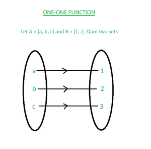
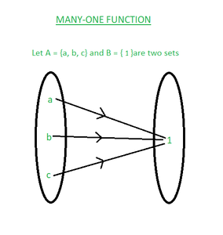
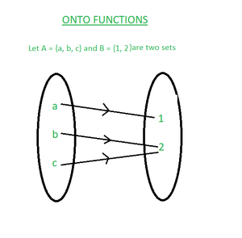
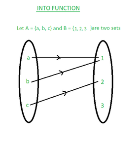
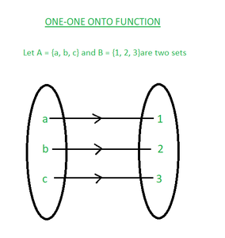
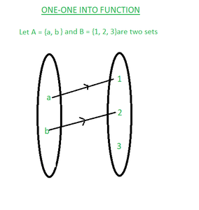
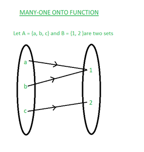
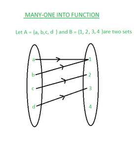

# Functions in Discrete Mathematics
Functions are an important part of discrete mathematics. This article is all about functions, their types, and other details of functions. A function assigns exactly one element of a set to each element of the other set. Functions are the rules that assign one input to one output. The function can be represented as f: A ⇢ B. A is called the domain of the function and B is called the codomain function.

Table of Content

- What is Function?
- Types of Function
- Inverse of a Function
- Composition of Functions
- Summary: Functions in Discrete Mathematics
- Sample Questions on Functions in Discrete Mathematics

- Pre-Image and Image of a Function
- Domain of a Function
- Codomain (Range) of a Function

## What is Function?

- A function assigns exactly one element of one set to each element of other sets.
- A function is a rule that assigns each input exactly one output.
- A function f from A to B is an assignment of exactly one element of B to each element of A (where A and B are non-empty sets).
- A function f from set A to set B is represented as f: A ⇢ B where A is called the domain of f and B is called as codomain of f.
- If b is a unique element of B to element a of A assigned by function F then, it is written as f(a) = b.
- Function f maps A to B means f is a function from A to B i.e. f: A ⇢ B

### Pre-Image and Image of a Function

A function f: A ⇢ B such that for each a ∈ A, there exists a unique b ∈ B such that (a, b) ∈ R then, a is called the pre-image of f and b is called the image of f.

### Domain of a Function

- If f is a function from set A to set B then, A is called the domain of function f.
- The set of all inputs for a function is called its domain.

### Codomain (Range) of a Function

- If f is a function from set A to set B then, B is called the codomain of function f.
- The set of all allowable outputs for a function is called its codomain.

Read More about Domain and Range of Function.

## Types of Function

Some of the common types of functions are:

- One-One Function
- Many-One Function
- Onto Function
- Into Function
- One-One Correspondent Function
- One-One Into Function
- Many-One Onto Function
- Many-One Into Function

Let's discuss these in detail.

### One-One Function ( or Injective Function):

A function in which one element of the domain is connected to one element of the codomain.

A function f: A ⇢ B is said to be a one-one (injective) function if different elements of A have different images in B.

f: A ⇢ B is one-one

⇒ a ≠ b ⇒ f(a) ≠ f(b) for all a, b ∈ A

⇒ f(a) = f(b) ⇒ a = b for all a, b ∈ A

### Many-One Function

A function f: A ⇢ B is said to be a many-one function if two or more elements of set A have the same image in B.

A function f: A ⇢ B is a many-one function if it is not a one-one function.

f: A ⇢ B is many-one.

⇒ a ≠ b but f(a) = f(b) for all a, b ∈ A

### Onto Function( or Surjective Function)

A function f: A ⇢ B is said to be onto (surjective) function if every element of B is an image of some element of A i.e. f(A) = B or range of f is the codomain of f.

A function in which every element of the codomain has one pre-image.

f: A ⇢ B is onto if for each b∈ B, there exists a∈ A such that f(a) = b.

### Into Function

A function f: A ⇢ B is said to be an into a function if there exists an element in B with no pre-image in A.

A function f: A⇢ B is into function when it is not onto.

### One-One Correspondent Function (or Bijective Function or One-One Onto Function)

A function which is both one-one and onto (both injective and surjective) is called one-one correspondent(bijective) function.

f : A ⇢ B is one-one correspondent (bijective) if:

- one-one i.e. f(a) = f(b) ⇒ a = b for all a, b ∈ A
- onto i.e. for each b ∈ B, there existsa ∈ A such that f(a) = b.

- ⇒ a = b for all a, b ∈ A

- a ∈ A such that f(a) = b.

### One-One Into Function

A function that is both one-one and into is called one-one into function.

### Many-One Onto Function

A function that is both many-one and onto is called many-one onto function.

### Many-One Into Function

A function that is both many-one and into is called many-one into function.

## Inverse of a Function

Let f: A ⇢ B be a bijection then, a function g: B ⇢ A which associates each element b ∈ B to a different element a ∈ A such that f(a) = b is called the inverse of f.

> f(a) = b ↔︎ g(b) = a

f(a) = b ↔︎ g(b) = a

Read More about Inverse Function.

## Composition of Functions

Let f: A ⇢ B and g: B ⇢ C be two functions then, a function gof: A ⇢ C is defined by

> (gof)(x) = g(f(x)), for all x ∈ A

(gof)(x) = g(f(x)), for all x ∈ A

Here, (gof)(x) is called the composition of f and g.

Read More about Composition of Function.

## Summary: Functions in Discrete Mathematics

Let X and Y be two sets with m and n elements and a function is defined as f : X⇢Y then,

- Total number of functions = nm
- Total number of one-one function = nPm
- Total number of onto functions = nm - nC1(n-1)m + nC2(n-2)m - . . . + (-1)n-1nCn-11m if m ≥ n.

For the composition of functions f and g be two functions :

- fog ≠ gof
- If f and g both are one-one function then fog is also one-one.
- If f and g both are onto function then fog is also onto.
- If f and fog both are one-one function then g is also one-one.
- If f and fog both are onto function then it is not necessary that g is also onto.
- (fog)-1 = g-1o f-1
- f-1o f = f-1(f(a)) = f-1(b) = a
- fof-1 = f(f-1(b)) = f(a) = b

## Sample Questions on Functions in Discrete Mathematics

Question 1: Show that the function f : R ⇢ R, given by f(x) = 2x, is one-one and onto.

Solution:

> For one-one:Let a, b ∈ R such that f(a) = f(b) then,f(a) = f(b) ⇒ 2a = 2b ⇒ a = bTherefore, f: R ⇢ R is one-one.For onto:Let p be any real number in R (co-domain). f(x) = p⇒ 2x = p ⇒ x = p/2p/2 ∈ R for p ∈ R such that f(p/2) = 2(p/2) = p For each p∈ R (codomain) there exists x = p/2 ∈ R (domain) such that f(x) = yFor each element in codomain has its pre-image in domain.So, f: R ⇢ R is onto.Since f: R ⇢ R is both one-one and onto.f : R ⇢ R is one-one correspondent (bijective function).

For one-one:

Let a, b ∈ R such that f(a) = f(b) then,

f(a) = f(b)

⇒ 2a = 2b

⇒ a = b

Therefore, f: R ⇢ R is one-one.

For onto:

Let p be any real number in R (co-domain). f(x) = p

⇒ 2x = p

⇒ x = p/2

p/2 ∈ R for p ∈ R such that f(p/2) = 2(p/2) = p

For each p∈ R (codomain) there exists x = p/2 ∈ R (domain) such that f(x) = y

For each element in codomain has its pre-image in domain.

So, f: R ⇢ R is onto.

Since f: R ⇢ R is both one-one and onto.

f : R ⇢ R is one-one correspondent (bijective function).

Question 2: Let f : R ⇢ R ; f(x) = cos x and g : R ⇢ R ; g(x) = x3 . Find fog and gof.

Solution:

> Since the range of f is a subset of the domain of g and the range of g is a subset of the domain of f. So, fog and gof both exist. gof (x) = g(f(x)) = g(cos x) = (cos x)3 = cos3xfog (x) = f(g(x)) = f(x3) = cos x3

Since the range of f is a subset of the domain of g and the range of g is a subset of the domain of f. So, fog and gof both exist.

gof (x) = g(f(x)) = g(cos x) = (cos x)3 = cos3x

fog (x) = f(g(x)) = f(x3) = cos x3

Question 3: If f : Q ⇢ Q is given by f(x) = x2 , then find f-1(16).

Solution:

> Let f-1(16) = xf(x) = 16⇒ x2 = 16⇒ x = ± 4Thus, f-1(16) = {-4, 4}

Let f-1(16) = x

f(x) = 16

⇒ x2 = 16

⇒ x = ± 4

Thus, f-1(16) = {-4, 4}

Question 4: If f : R ⇢ R; f(x) = 2x + 7 is a bijective function then, find the inverse of f.

Solution:

> Let x ∈ R (domain), y ∈ R (codomain) such that f(a) = bf(x) = y⇒ 2x + 7 = y⇒ x = (y -7)/2⇒ f-1(y) = (y -7)/2 Thus, f-1 : R ⇢ R is defined as f-1(x) = (x -7)/2 for all x∈ R.

Let x ∈ R (domain), y ∈ R (codomain) such that f(a) = b

f(x) = y

⇒ 2x + 7 = y

⇒ x = (y -7)/2

⇒ f-1(y) = (y -7)/2

Thus, f-1 : R ⇢ R is defined as f-1(x) = (x -7)/2 for all x∈ R.

Question 5: If f : A ⇢ B and |A| = 5 and |B| = 3 then find total number of functions.

Solution:

> Total number of functions = 35 = 243

Total number of functions = 35 = 243

### Related Articles:

- Discrete Mathematics Tutorial
- Discrete Mathematics | Hasse Diagrams