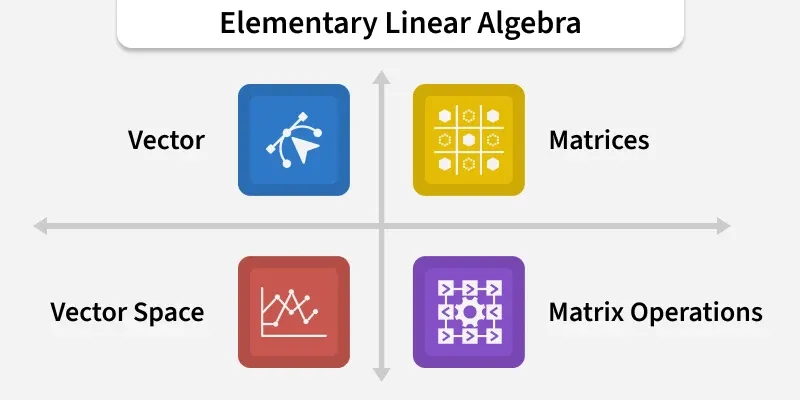
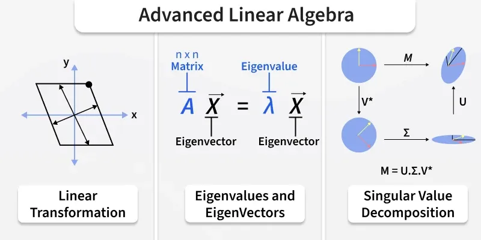
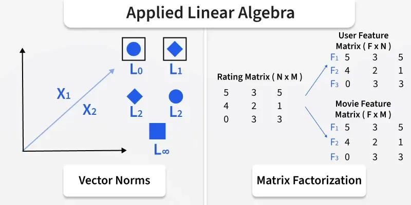

# Linear Algebra
Linear Algebra is the branch of mathematics that focuses on the study of vectors, vector spaces, [[matrices]], and linear transformations. It deals with linear equations, linear functions, and their representatio[[probability-solved-questions-and-answers]]ns through [[matrices]] and determinants. It has a wide range of applications in Physics and Mathematics. It is the basic concept for machine learning and data science.

Some applications of Linear Algebra are:

Linear Algebra Equations

> The general linear equation is represented as u1x1 + u2x2 + ..... unxn = v

The general linear equation is represented as u1x1 + u2x2 + ..... unxn = v

Where,

- u’s – represents the coefficients
- x’s – represents the unknowns
- v – represents the constant

There is a collection of equations called a System of linear algebraic equations. It obeys the linear function such as -

> (x1,……..xn) → u1x1 + ………. + unxn

(x1,……..xn) → u1x1 + ………. + unxn

## Types of Linear Algebra Study

Linear Algebra is divided into different branches based on the difficulty level of topics, which are,

- Elementary Linear Algebra
- Advanced Linear Algebra
- Applied Linear Algebra

## Foundations of Linear Algebra

Elementary linear algebra introduces the foundational concepts that form the building blocks of the subject. It covers basic operations on [[matrices]], solving systems of equations, and understanding vectors.

- Scalars – Quantities with magnitude only (e.g., real numbers).
- Vectors – Quantities with both direction and magnitude, elements of a vector space.
- Vector Space – A collection of vectors that can be added and scaled by scalars.
- Matrix – A rectangular array of numbers arranged in rows and columns.
- Matrix Operations – Arithmetic operations like addition, multiplication, and transposition.

## Abstract Linear Algebra

Advanced/Abstract linear algebra mostly covers all the advanced topics related to linear algebra, such as Linear function, Linear transformation, Eigenvectors, and Eigenvalues.

### Linear Transformations

A linear transformation is a special kind of function between vector spaces that preserves the operations of:

1. Vector addition
2. Scalar multiplication

In other words, if T is a linear transformation, then for any vectors u, v, and scalar c:

> T(u + v) = T(u) + T(v)T(cu) = cT(u)

T(u + v) = T(u) + T(v)

T(cu) = cT(u)

Examples:

- Rotation in 2D or 3D: Rotating a vector around the origin is a linear transformation.
- Scaling: Stretching or shrinking a vector by multiplying it by a scalar.

### Eigenvalues and Eigenvectors

Eigenvalues and eigenvectors are fundamental concepts in linear algebra. It offers deep insights into the properties of linear transformations. An eigenvector of a square matrix is a non-zero vector that, when the matrix multiplies it, results in a scalar multiple of itself. This scalar is known as the eigenvalue associated with the eigenvector. They are essential in various applications, including stability analysis, quantum mechanics, and the study of dynamical systems.

Consider a transformation that changes the direction or length of vectors, except for some special vectors that only get stretched or shrunk. These special vectors are eigenvectors, and the factor by which they are stretched or shrunk is the eigenvalue.

> Example: For the matrix A = [2, 0, 0, 3], the vector v = 1, 0 is an eigenvector because Av = 2v, and 2 is the eigenvalue.

Example: For the matrix A = [2, 0, 0, 3], the vector v = 1, 0 is an eigenvector because Av = 2v, and 2 is the eigenvalue.

### Singular Value Decomposition

Singular Value Decomposition (SVD) is a powerful mathematical technique used in signal processing, statistics, and machine learning. It decomposes a matrix into three other [[matrices]], where one represents the rotation, another the scaling, and the third the final rotation. It's essential for identifying the intrinsic geometric structure of data.

### Positive Definite Matrices

A positive definite matrix is a symmetric matrix where all its eigenvalues are positive. These [[matrices]] are significant in optimisation problems, as they ensure the existence of a unique minimum in quadratic forms.

> Example: The matrix A = [2, 0, 0, 2] is positive definite because it always produces positive values for any non-zero vector.

Example: The matrix A = [2, 0, 0, 2] is positive definite because it always produces positive values for any non-zero vector.

### Matrix Exponential

The matrix exponential is a function on square [[matrices]] analogous to the exponential function for real numbers. It is used in solving systems of linear differential equations, among other applications in physics and engineering.

Matrix exponentials stretch or compress spaces in ways that depend smoothly on time, much like how interest grows continuously in a bank account.

> Example: The exponential of the matrix A = [0, −1, 1, 0] represents rotations, where the amount of rotation depends on the "time" parameter.

Example: The exponential of the matrix A = [0, −1, 1, 0] represents rotations, where the amount of rotation depends on the "time" parameter.

### Linear Computations

Linear computations involve numerical methods for solving linear algebra problems, including systems of linear equations, eigenvalues, and eigenvectors calculations. These computations are essential in computer simulations, optimisations, and modelling.

These are techniques for crunching numbers in linear algebra problems, like finding the best-fit line through a set of points or solving systems of equations quickly and accurately.

### Linear Independence

A set of vectors is linearly independent if no vector in the set is a linear combination of the others. The concept of linear independence is central to the study of vector spaces, as it helps define bases and dimension.

Vectors are linearly independent if none of them can be made by combining the others. It's like saying each vector brings something unique to the table that the others don't.

> Example: 1,0 and 0,1 are linearly independent in 2D space because you can't create one of these vectors by scaling or adding the other.

Example: 1,0 and 0,1 are linearly independent in 2D space because you can't create one of these vectors by scaling or adding the other.

### Linear Subspace

A linear subspace (or simply subspace) is a subset of a vector space that is closed under vector addition and scalar multiplication. A subspace is a smaller space that lies within a larger vector space, following the same rules of vector addition and scalar multiplication.

> Example: The set of all vectors of the form a, 0 in 2D space is a subspace, representing all points along the x-axis.

Example: The set of all vectors of the form a, 0 in 2D space is a subspace, representing all points along the x-axis.

## Practical Linear Algebra

In Applied Linear Algebra, the topics covered are generally the practical implications of Elementary and advanced linear Algebra topics such as the Complement of a matrix, matrix factorization and norm of vectors, etc.

### Linear Programming

Linear programming is a method to achieve the best outcome in a mathematical model whose requirements are represented by linear relationships. It is widely used in business and economics to maximize profit or minimize cost while considering constraints.

This is a technique for optimizing (maximizing or minimizing) a linear objective function, subject to linear equality and inequality constraints. It's like planning the best outcome under given restrictions.

> Example: Maximizing profit in a business while considering constraints like budget, material costs, and labor.

Example: Maximizing profit in a business while considering constraints like budget, material costs, and labor.

### Linear Equation Systems

Systems of linear equations involve multiple linear equations that share the same set of variables. The solution to these systems is the set of values that satisfy all equations simultaneously, which can be found using various methods, including substitution, elimination, and matrix operations.

> Example: Finding the intersection point of two lines represented by two equations.

Example: Finding the intersection point of two lines represented by two equations.

### Gaussian Elimination

Gaussian elimination is a systematic method for solving systems of linear equations. It involves applying a series of operations to transform the system's matrix into its row echelon form or reduced row echelon form, making it easier to solve for the variables. It is a step-by-step procedure to simplify a system of linear equations into a form that's easier to solve.

> Example: Systematically eliminating variables in a system of equations until each equation has only one variable left to solve for.

Example: Systematically eliminating variables in a system of equations until each equation has only one variable left to solve for.

## Important Linear Algebra Topics

Below is the list of important topics in Linear Algebra.

- Matrix Inverses and Determinants
- Linear Transformations
- Singular Value Decomposition
- Orthogonal [[matrices|Matrices]]
- Vector Projection
- Solving systems of equations with [[matrices]]

## Linear Algebra Applications

Linear algebra, with its concepts of vectors, [[matrices]], and linear transformations, serves as a foundational tool in numerous fields, enabling the solving of complex problems across science, engineering, computer science, economics, and more.

Following are some specific applications of linear algebra in real-world.

1. Computer Graphics and Animation

Linear algebra is indispensable in computer graphics, gaming, and animation. It helps in transforming the shapes of objects and their positions in scenes through rotations, translations, scaling, and more. For instance, when animating a character, linear transformations are used to rotate limbs, scale objects, or shift positions within the virtual world.

2. Machine Learning and Data Science

In machine learning, linear algebra is at the heart of algorithms used for classifying information, making predictions, and understanding the structures within data. It's crucial for operations in high-dimensional data spaces, optimizing algorithms, and even in the training of neural networks where matrix and tensor operations define the efficiency and effectiveness of learning.

3. Quantum Mechanics

The state of quantum systems is described using vectors in a complex vector space. Linear algebra enables the manipulation and prediction of these states through operations such as unitary transformations (evolution of quantum states) and eigenvalue problems (energy levels of quantum systems).

4. [[17_Cryptography|Cryptography]]

Linear algebraic concepts are used in [[17_Cryptography|cryptography]] for encoding messages and ensuring secure communication. Public key cryptosystems, such as RSA, rely on operations that are easy to perform but extremely difficult to reverse without the key, many of which involve linear algebraic computations.

5. Network Analysis

Linear algebra is used to analyze and optimize networks, including internet traffic, social networks, and logistical networks. Google's PageRank algorithm, which ranks web pages based on their links to and from other sites, is a famous example that uses the eigenvectors of a large matrix representing the web.

6. Image and Signal Processing

Techniques from linear algebra are used to compress, enhance, and reconstruct images and signals. Singular value decomposition (SVD), for example, is a method to compress images by identifying and eliminating redundant information, significantly reducing the size of image files without substantially reducing quality.

## Solved Examples on Linear Algebra

Example 1: Find the sum of the two vectors \overrightarrow{\rm A} = 2i + 3j + 5k and \overrightarrow{\rm B} = -i + 2j + k

Solution:

> \overrightarrow{\rm A} + \overrightarrow{\rm B} = (2-1)i + (2 + 3)j + (5 + 1)k = i + 5j + 6k

\overrightarrow{\rm A} + \overrightarrow{\rm B} = (2-1)i + (2 + 3)j + (5 + 1)k = i + 5j + 6k

Example 2: Find the dot product of \overrightarrow{\rm P} = -2i + j + 3k and \overrightarrow{\rm Q} = i - 2j + k

Solution:

> \overrightarrow{\rm P}.\overrightarrow{\rm Q} = -2i(i - 2j + k) + j(i - 2j + k) + 3k(i - 2j + k)= -2i -2j + 3k

\overrightarrow{\rm P}.\overrightarrow{\rm Q} = -2i(i - 2j + k) + j(i - 2j + k) + 3k(i - 2j + k)

= -2i -2j + 3k

Example 3: Find the solution of x + 2y = 3 and 3x + y = 5

Solution:

> From x + 2y = 3 we get x = 3 - 2yPutting this value of x in the second equation we get3(3 - 2y) + y = 5⇒ 9 - 6y + y = 5⇒ 9 - 5y = 5⇒ -5y = -4⇒ y = 4/5Putting this value of y in 1st equation we getx + 2(4/5) = 3⇒ x = 3 - 8/5⇒ x = 7/5

From x + 2y = 3 we get x = 3 - 2y

Putting this value of x in the second equation we get

3(3 - 2y) + y = 5⇒ 9 - 6y + y = 5⇒ 9 - 5y = 5⇒ -5y = -4⇒ y = 4/5

Putting this value of y in 1st equation we get

x + 2(4/5) = 3⇒ x = 3 - 8/5⇒ x = 7/5

Example 4: Matrix Multiplication, Find the product of the [[matrices]]:

\:A=\left(\begin{matrix}\mathbf{1}&\mathbf{2}\\\mathbf{3}&\mathbf{4}\\\end{matrix}\right),\ \ \ \ B=\left(\begin{matrix}\mathbf{5}&\mathbf{6}\\\mathbf{7}&\mathbf{8}\\\end{matrix}\right)

Solution:

> AB=\left(\begin{matrix}1\bullet5+2\bullet7&1\bullet6+2\bullet8\\3\bullet5+4\bullet7&3\bullet6+4\bullet8\\\end{matrix}\right)=\left(\begin{matrix}5+14&6+16\\15+28&18+32\\\end{matrix}\right)=\left(\begin{matrix}19&22\\43&50\\\end{matrix}\right)

AB=\left(\begin{matrix}1\bullet5+2\bullet7&1\bullet6+2\bullet8\\3\bullet5+4\bullet7&3\bullet6+4\bullet8\\\end{matrix}\right)=\left(\begin{matrix}5+14&6+16\\15+28&18+32\\\end{matrix}\right)=\left(\begin{matrix}19&22\\43&50\\\end{matrix}\right)

Example 5: Eigenvalues of a Matrix, Find the eigenvalues of the matrix:

A=\left(\begin{matrix}\mathbf{3}&\mathbf{8}\\\mathbf{0}&\mathbf{6}\\\end{matrix}\right)

Solution:

> 1. Write the characteristic equation:A\ -\ \lambda I2. Find the determinant (det) of characteristic equation:\left|A - \lambda I\right|=\left|\begin{matrix}\mathbf{3}-\lambda&\mathbf{8}\\\mathbf{0}&\mathbf{6}-\lambda\\\end{matrix}\right|=(\mathbf{3}-\lambda)(\mathbf{6}-\lambda)-\mathbf{8}\bullet\mathbf{0}=(\mathbf{3}-\lambda)(\mathbf{6}-\lambda) 3. Equate the determinant with Zero "0":(\mathbf{3}-\lambda)(\mathbf{6}-\lambda)=0 \Rightarrow \lambda=3,6 Therefore, the eigenvalues are 3, 6.

1. Write the characteristic equation:

A\ -\ \lambda I

2. Find the determinant (det) of characteristic equation:

\left|A - \lambda I\right|=\left|\begin{matrix}\mathbf{3}-\lambda&\mathbf{8}\\\mathbf{0}&\mathbf{6}-\lambda\\\end{matrix}\right|=(\mathbf{3}-\lambda)(\mathbf{6}-\lambda)-\mathbf{8}\bullet\mathbf{0}=(\mathbf{3}-\lambda)(\mathbf{6}-\lambda)

3. Equate the determinant with Zero "0":

(\mathbf{3}-\lambda)(\mathbf{6}-\lambda)=0 \Rightarrow \lambda=3,6

Therefore, the eigenvalues are 3, 6.

## Practice Problems - Linear Algebra

Question 1: Solve the system of equations:

- x + y + z = 6
- 2x + 3y + 5z = 4
- 4x + 3y + z = 2

Question 2: Find the eigenvalues and eigenvectors of the matrix:

\left(\begin{matrix}\mathbf{5}&\mathbf{0}\\\mathbf{7}&\mathbf{8}\\\end{matrix}\right)

Question 3: Find the determinant of the matrix:

\left(\begin{matrix}\mathbf{3}&\mathbf{6}\\\mathbf{4}&\mathbf{8}\\\end{matrix}\right)

Question 4: Find the product of the [[matrices]]:

A=\left(\begin{matrix}\mathbf{1}&\mathbf{2}\\\mathbf{6}&\mathbf{4}\\\end{matrix}\right),\ \ \ \ B=\left(\begin{matrix}\mathbf{5}&\mathbf{4}\\\mathbf{0}&\mathbf{2}\\\end{matrix}\right)

Question 5: Solve a System of Linear Equations:

- 2x + 3y = 5
- 4x - y = 11

Question 6: Determine the characteristic equation of the matrix:

A=\left(\begin{matrix}\mathbf{1}&\mathbf{2}&\mathbf{3}\\\mathbf{0}&-\mathbf{1}&\mathbf{4}\\-\mathbf{2}&\mathbf{1}&\mathbf{0}\\\end{matrix}\right)

Question 7: Find the trace of the matrix:

A=\left(\begin{matrix}\mathbf{1}&\mathbf{2}&\mathbf{3}\\\mathbf{0}&-\mathbf{1}&\mathbf{4}\\-\mathbf{2}&\mathbf{1}&\mathbf{0}\\\end{matrix}\right)

Question 8: Compute the eigenvalues of the matrix:

A=\left(\begin{matrix}\mathbf{1}&\mathbf{2}&\mathbf{3}\\\mathbf{0}&-\mathbf{1}&\mathbf{4}\\-\mathbf{2}&\mathbf{1}&\mathbf{0}\\\end{matrix}\right)

Question 9: Compute the eigenvalues of the matrix:

A=\left(\begin{matrix}\mathbf{1}&\mathbf{2}\\\mathbf{6}&\mathbf{4}\\\end{matrix}\right)

Question 10: Verify if the vectors u=\left(\begin{matrix}\mathbf{1}\\\mathbf{0}\\\mathbf{1}\\\end{matrix}\right)\ and\ v=\left(\begin{matrix}\mathbf{0}\\\mathbf{1}\\\mathbf{1}\\\end{matrix}\right) are orthogonal.