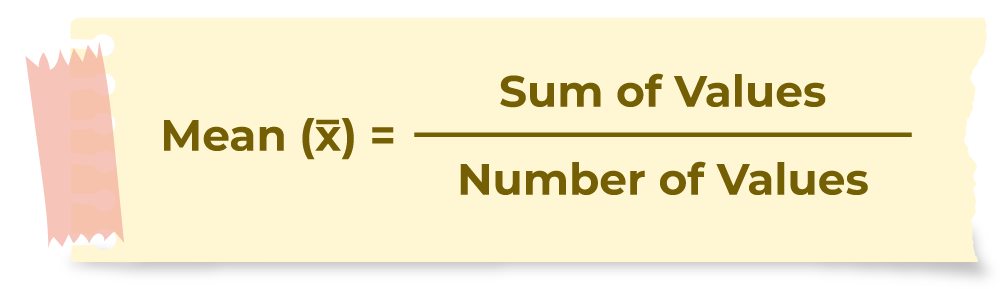
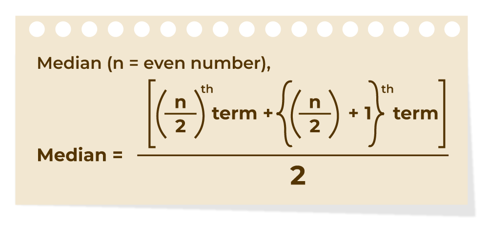
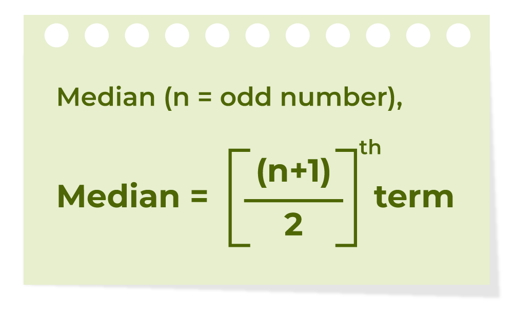
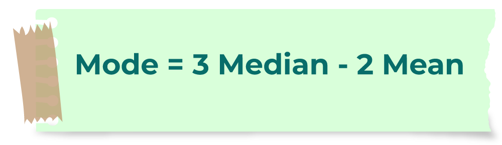
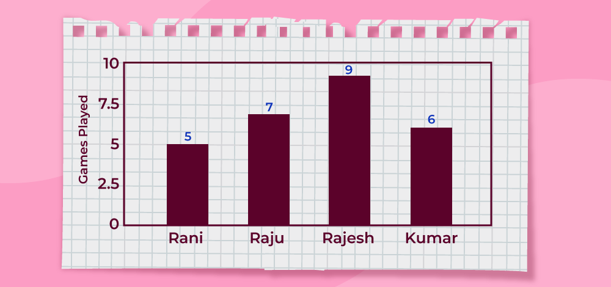

# Mean, Median and Mode
Mean, median, and mode are measures of central tendency that help describe the characteristics of a data set. They provide useful insights into the data by identifying its average value (mean), middle value (median), and most frequent value (mode).

These measures are used in all kinds of real-life situations, such as finding the average salary of employees, determining the median age of a class, or identifying the most popular sport played in a club.

## Mean

Mean is the sum of all the values in the data set divided by the number of values in the data set. It is also called the Arithmetic Average. The Mean is denoted as x̅.

### Mean Formula

The formula to calculate the mean is: Mean (x̅) = Σxi/ n



If x1, x2, x3,......, xn are the values of a data set then the mean is calculated as:

> x̅ = (x1 + x2 + x3 + . . . + xn) / n

x̅ = (x1 + x2 + x3 + . . . + xn) / n

For Example: Find the mean of data sets 10, 30, 40, 20, and 50.

Solution:

> Mean of the data 10, 30, 40, 20, 50 isMean = (sum of all values) / (number of values)Mean = (10 + 30 + 40 + 20+ 50) / 5 = (150)/5 = 30

Mean of the data 10, 30, 40, 20, 50 isMean = (sum of all values) / (number of values)Mean = (10 + 30 + 40 + 20+ 50) / 5 = (150)/5 = 30

### Mean of Grouped Data

The mean for the grouped data can be calculated by using various methods. The most common methods used are discussed in the table below:

| Direct Method | Assumed Mean Method | Step Deviation Method |
| --- | --- | --- |
| x̅ = ∑ fixi / ∑ fiWhere,∑fi is the sum of all frequencies | x̅ = a + ∑ fixi / ∑ fiWhere,a is the Assumed meandi is equal to xi – a∑fi the sum of all frequencies | x̅ = a + h∑ fixi / ∑ fiWhere,a is the Assumed meanui = (xi – a)/hh is Class size∑fi the sum of all frequencies |

x̅ = ∑ fixi / ∑ fi

Where,∑fi is the sum of all frequencies

x̅ = a + ∑ fixi / ∑ fi

Where,

- a is the Assumed mean
- di is equal to xi – a
- ∑fi the sum of all frequencies

x̅ = a + h∑ fixi / ∑ fi

Where,

- a is the Assumed mean
- ui = (xi – a)/h
- h is Class size
- ∑fi the sum of all frequencies

> Read More about Mean, Median and Mode of Grouped Data.

Read More about Mean, Median and Mode of Grouped Data.

## Median

A median is a middle value for sorted data. The sorting of the data can be done either in ascending order or descending order. A median divides the data into two halves.

### Median Formula

1) If the number of values (n value) in the data set is even, then the formula to calculate the median is: Median = [(n/2)th term + {(n/2) + 1}th term] / 2



2) If the number of values (n value) in the data set is even, then the formula to calculate the median is: Median = [(n/2)th term + {(n/2) + 1}th term] / 2



Example: Find the median of the the given data set 30, 40, 10, 20, and 50.

Solution:

> Median of the data 30, 40, 10, 20, 50 is,Step 1: Order the given data in ascending order as:10, 20, 30, 40, 50Step 2: Check n (number of terms of data set) is even or odd and find the median of the data with respective 'n' value.Step 3: Here, n = 5 (odd)Median = [(n + 1)/2]th termMedian = [(5 + 1)/2]th term= 30

Median of the data 30, 40, 10, 20, 50 is,

Step 1: Order the given data in ascending order as:10, 20, 30, 40, 50

Step 2: Check n (number of terms of data set) is even or odd and find the median of the data with respective 'n' value.

Step 3: Here, n = 5 (odd)

Median = [(n + 1)/2]th termMedian = [(5 + 1)/2]th term= 30

### Median of Grouped Data

The median of grouped data median is calculated using the formula,

> Median = l + [(n/2 - cf) / f]×h

Median = l + [(n/2 - cf) / f]×h

where

- l is the lower limit of the median class
- n is the number of observations
- f is the frequency of the median class
- h is class size
- cf is the cumulative frequency of the class preceding the median class.

## Mode

A mode is the most frequent value or item of the data set. A data set can generally have one or more than one mode values. If the data set has one mode then it is called "Uni-modal". Similarly, if the data set contains 2 modes, then it is called "Bimodal" and if the data set contains 3 modes then it is known as "Trimodal". If the data set consists of more than one mode then it is known as "multi-modal"(can be bimodal or trimodal). There is no mode for a data set if every number appears only once.

The formula to calculate the mode is shown in the image below:


### Symbol of Mode

In statistical notation, the symbol "Z" is commonly used to represent the mode of a dataset. It indicates the value or values that occur most frequently within the dataset. This symbol is widely utilized in statistical discourse to signify the mode, enhancing clarity and precision in statistical discussions and analyses.

### Mode Formula

> Mode = Highest Frequency Term

Mode = Highest Frequency Term

Example: Find the mode of the given data set 1, 2, 2, 2, 3, 3, 4, 5.

Solution:

> Given set is {1, 2, 2, 2, 3, 3, 4, 5}As the above data set is arranged in ascending order.By observing the above data set we can say that,Using the formulaMode = Highest Frequency TermMode = 2As, it has highest frequency (3)

Given set is {1, 2, 2, 2, 3, 3, 4, 5}

As the above data set is arranged in ascending order.

By observing the above data set we can say that,

Using the formulaMode = Highest Frequency Term

Mode = 2

As, it has highest frequency (3)

### Mode of Grouped Data

The mode of grouped data is calculated using the following formula:

> Mode = l + [(f1 - f0) / (2f1 - f0 - f2)] × h

Mode = l + [(f1 - f0) / (2f1 - f0 - f2)] × h

where,

- f1 is the frequency of the modal class,
- f0 is the frequency of the class preceding the modal class,
- f2 is the frequency of the class succeeding the modal class,
- h is the size of class intervals, and
- l is the lower limit of the modal class.

## Relation between Mean, Median, And Mode

For any group of data, the relation between the three central tendencies mean, median, and mode is shown in the image below:

> Mode = 3 Median – 2 Mean

Mode = 3 Median – 2 Mean



Mean, Median,the and Mode: Another name for this relationship is an empirical relationship. When we know the other two measures for a given set of data, this is used to find one of the measures. The LHS and RHS can be switched to rewrite this relationship in various ways.

Example: Find the range of the given data set 12, 19, 6, 2, 15, 4.

Solution:

> Given set is {12, 19, 6, 2, 15, 4} Here, Lowest Value = 2Highest Value = 19Range = 19 − 2 = 17

Given set is {12, 19, 6, 2, 15, 4}

Here,

- Lowest Value = 2
- Highest Value = 19
- Range = 19 − 2 = 17

## Mean vs Median vs Mode

Mean, median, and mode are measures of central tendency in statistics.

| Mean | Median | Mode |
| --- | --- | --- |
| Mean is the average of all values. | The median is the middle value when data is sorted. | Mode is the most frequently occurring value in the dataset. |
| The mean is sensitive to outliers. | The median is not sensitive to outliers. | The mode is not sensitive to outliers. |
| Calculated by adding up all values of a dataset and dividing them by the total number of values in the dataset. | Calculated by finding the middle value in a list of data. | Calculated by finding which value occurs more number of times in a dataset. |
| The value of the mean may or may not be in the dataset. | The Value of the median may or may not be in the dataset. | The value of the mode is also always a value from the dataset. |
| Always exactly one value. | Always exactly one value. | Can have no mode, one mode, or multiple modes (bimodal, multimodal). |
| Changing even one value affects the mean. | Only affected if the new value crosses the midpoint of the dataset. | Only affected if the new value changes the frequency pattern. |

Mean

Median

Mode

Mean is the average of all values.

The median is the middle value when data is sorted.

Mode is the most frequently occurring value in the dataset.

The mean is sensitive to outliers.

The median is not sensitive to outliers.

The mode is not sensitive to outliers.

Calculated by adding up all values of a dataset and dividing them by the total number of values in the dataset.

Calculated by finding the middle value in a list of data.

Calculated by finding which value occurs more number of times in a dataset.

The value of the mean may or may not be in the dataset.

The Value of the median may or may not be in the dataset.

The value of the mode is also always a value from the dataset.

Always exactly one value.

Always exactly one value.

Can have no mode, one mode, or multiple modes (bimodal, multimodal).

Changing even one value affects the mean.

Only affected if the new value crosses the midpoint of the dataset.

Only affected if the new value changes the frequency pattern.

```
Note: Mean gets easily affected by extreme values.
```

Let's look at the following example to understand the difference.

> Difference between Mean and Median is understood by the following example. In a school, there are 8 teachers whose salaries are 20000 rupees, a principal with a salary of 35000, find their mean salary and median salary.Mean = (20000 + 20000 + 20000 + 20000 + 20000 + 20000 + 20000 + 20000 + 35000)/9 = 195000/9 = 21666.67Therefore, the mean salary is ₹21,666.67.For median, in ascending order: 20000, 20000, 20000, 20000, 20000, 20000, 20000, 20000, 35000.n = 9,Thus, (9 + 1)/2 = 5Thus, the median is 5th observation.Median = 20000Therefore, the median is ₹20,000.Mode is the data with maximum frequency Mode = 20,000.

Difference between Mean and Median is understood by the following example. In a school, there are 8 teachers whose salaries are 20000 rupees, a principal with a salary of 35000, find their mean salary and median salary.

Mean = (20000 + 20000 + 20000 + 20000 + 20000 + 20000 + 20000 + 20000 + 35000)/9 = 195000/9 = 21666.67

Therefore, the mean salary is ₹21,666.67.

For median, in ascending order: 20000, 20000, 20000, 20000, 20000, 20000, 20000, 20000, 35000.n = 9,Thus, (9 + 1)/2 = 5Thus, the median is 5th observation.

Median = 20000Therefore, the median is ₹20,000.

Mode is the data with maximum frequency Mode = 20,000.

Read More: Difference between Mean and Average.

## How does Mean Median Mode link to Real Life?

In our daily lives, we come across various instances where we have to use the concepts of mean, median and mode. There are various applications of mean, median, and mode, here’s how they link to real life:

- Mean: Mean, or average, is used in everyday situations to understand typical values. For example, if you want to know the average income of people in a city, you would calculate the mean income.

- Median: Median is in household income data, the median income provides a better representation of the typical income than the mean when there are extreme values. In real estate, the median house price is often used to gauge the affordability of homes in a particular area.

- Mode: Mode represents the most frequently occurring value in a dataset and is used in scenarios where identifying the most common value is important. For example, in manufacturing, the mode may be used to identify the most common defect in a production line to prioritize quality control efforts

### Also Check

> Statistics FormulasShortcut method for Arithmetic MeanCalculation of Median of Discrete SeriesCalculation of Mode in Discrete Series

- Statistics Formulas
- Shortcut method for Arithmetic Mean
- Calculation of Median of Discrete Series
- Calculation of Mode in Discrete Series

## Solved Questions on Mean, Median, and Mode

Question 1: Study the bar graph given below and find the mean, median, and mode of the given data set.



Solution:

> Mean = (sum of all data values) / (number of values)Mean = (5 + 7 + 9 + 6) / 4 = 27 / 2 = 6.75Median = Order the given data in ascending order as: 5, 6, 7, 9Here, n = 4 (which is even)Median = [(n/2)th term + {(n/2) + 1}th term] / 2Median = (6 + 7) / 2 = 6.5Mode = Most frequent value = 9 (highest value)Range = Highest value - Lowest value Range = 9 - 5 = 4

Mean = (sum of all data values) / (number of values)

Mean = (5 + 7 + 9 + 6) / 4 = 27 / 2 = 6.75

Median = Order the given data in ascending order as: 5, 6, 7, 9

Here, n = 4 (which is even)

Median = [(n/2)th term + {(n/2) + 1}th term] / 2

Median = (6 + 7) / 2 = 6.5

Mode = Most frequent value = 9 (highest value)

Range = Highest value - Lowest value

Range = 9 - 5 = 4

Question 2: Find the mean, median, mode, and range for the given data

190, 153, 168, 179, 194, 153, 165, 187, 190, 170, 165, 189, 185, 153, 147, 161, 127, 180

Solution:

> For Mean:190, 153, 168, 179, 194, 153, 165, 187, 190, 170, 165, 189, 185, 153, 147, 161, 127, 180Number of observations = 18Mean = (Sum of observations) / (Number of observations) = (190+153+168+179+194+153+165+187+190+170+165+189+185+153+147 +161+127+180) / 18 = 2871/18 = 159.5Therefore, the mean is 159.5For Median:The ascending order of given observations is,127, 147, 153, 153, 153, 161, 165, 165, 168, 170, 179, 180, 185, 187, 189, 190, 190, 194Here, n = 18Median = 1/2 [(n/2) + (n/2 + 1)]th observation = 1/2 [9 + 10]th observation = 1/2 (168 + 170) = 338/2 = 169Thus, the median is 169For Mode:The number with the highest frequency = 153Thus, mode = 153For Range:Range = Highest value – Lowest value = 194 – 127 = 67

For Mean:

190, 153, 168, 179, 194, 153, 165, 187, 190, 170, 165, 189, 185, 153, 147, 161, 127, 180

Number of observations = 18

Mean = (Sum of observations) / (Number of observations)

= (190+153+168+179+194+153+165+187+190+170+165+189+185+153+147 +161+127+180) / 18 = 2871/18 = 159.5

Therefore, the mean is 159.5

For Median:

The ascending order of given observations is,127, 147, 153, 153, 153, 161, 165, 165, 168, 170, 179, 180, 185, 187, 189, 190, 190, 194Here, n = 18

Median = 1/2 [(n/2) + (n/2 + 1)]th observation = 1/2 [9 + 10]th observation = 1/2 (168 + 170) = 338/2 = 169

Thus, the median is 169

For Mode:The number with the highest frequency = 153Thus, mode = 153

For Range:Range = Highest value – Lowest value = 194 – 127 = 67

Question 3: Find the Median of the data 25, 12, 5, 24, 15, 22, 23, 25

Solution:

> 25, 12, 5, 24, 15, 22, 23, 25Step 1: Order the given data in ascending order as: 5, 12, 15, 22, 23, 24, 25, 25 Step 2: Check n (number of terms of data set) is even or odd and find the median of the data with respective 'n' value.Step 3: Here, n = 8 (even) then,Median = [(n/2)th term + {(n/2) + 1)th term] / 2Median = [(8/2)th term + {(8/2) + 1}th term] / 2 = (22+23) / 2 = 22.5

25, 12, 5, 24, 15, 22, 23, 25

Step 1: Order the given data in ascending order as: 5, 12, 15, 22, 23, 24, 25, 25

Step 2: Check n (number of terms of data set) is even or odd and find the median of the data with respective 'n' value.

Step 3: Here, n = 8 (even) then,

Median = [(n/2)th term + {(n/2) + 1)th term] / 2Median = [(8/2)th term + {(8/2) + 1}th term] / 2 = (22+23) / 2 = 22.5

Question 4: Find the mode of the given data 15, 42, 65, 65, 95.

Solution:

> Given data set 15, 42, 65, 65, 95The number with highest frequency = 65Mode = 65

Given data set 15, 42, 65, 65, 95The number with highest frequency = 65Mode = 65

## Unsolved Practice Questions on Mean, Median, and Mode

Question 1: A company recorded the weekly sales (in dollars) of five salespersons as follows: $450, $520, $480, $510, and $490, Find the mean sales value for this group?

Question 2: Find the median of the following data set: 12, 15, 20, 9, 17, 25, 10.

Question 3: A survey collected the number of books read by a group of 10 people last year: 5, 7, 6, 5, 9, 7, 8, 5, 10, 6. What is the mode of the data set?

Question 4: In a classroom, the scores (out of 100) for a [[test]] are: 56, 78, 67, 45, 56, 90, 56, 67, 78, and,82. Find the mean, median, and mode of the scores.

Question 5: In a skewed distribution the mean of the data is 40 and median of the data is 35. Calculate the mode of the data set.

### Answer to Practice Questions

> Ans 1: Mean = $490Ans 2: Median = 15Ans 3: Mode = 5Ans 4: Mean = 67.5, Median = 67, Mode = 56Ans 5: Mode = 25

Ans 1: Mean = $490

Ans 2: Median = 15

Ans 3: Mode = 5

Ans 4: Mean = 67.5, Median = 67, Mode = 56

Ans 5: Mode = 25