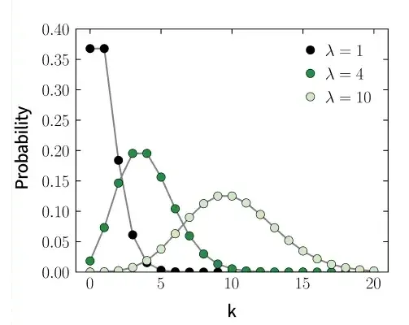
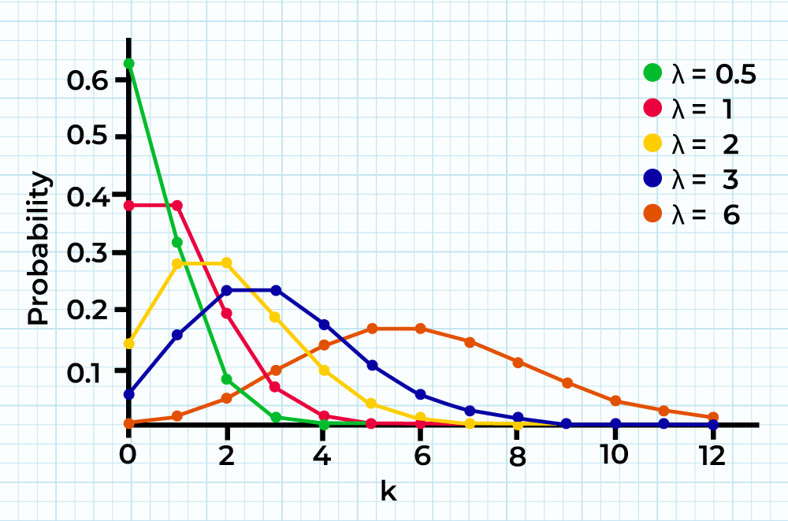

# Poisson Distribution
The Poisson distribution is a discrete probability distribution that calculates the likelihood of a certain number of events occurring within a fixed interval of time, assuming the events occur independently.

> Example: Emails er HourIf you receive emails randomly at an average rate of 5 per hour (λ = 5), the Poisson distribution can tell you the probability of receiving 0 emails, exactly 3 emails, and so on.

Example: Emails er Hour

If you receive emails randomly at an average rate of 5 per hour (λ = 5), the Poisson distribution can tell you the probability of receiving 0 emails, exactly 3 emails, and so on.

To model this, the interval is imagined as divided into tiny subintervals where:

- No more than one event can occur.
- The probability of one event is proportional to the subinterval’s length.
- Events in different subintervals are independent.

It is characterized by a single parameter, λ (lambda), which represents the event's average occurrence rate in an interval(not a subinterval).

### Shape of the Poisson Distribution

The shape of the Poisson distribution depends on the value of λ. As λ increases, the distribution shifts to the right and becomes more spread out.

### Key Assumptions:

> 1. Events occur independently of each other.2. The average rate of occurrence (λ) is constant over the given interval.3. The number of events can be any non-negative integer.

1. Events occur independently of each other.2. The average rate of occurrence (λ) is constant over the given interval.3. The number of events can be any non-negative integer.

## Poisson Distribution Formula

Poisson distribution is characterized by a single parameter, lambda (λ), which represents the average rate of occurrence of the events. The probability mass function of the Poisson distribution is given by:

> P (X = r) = \frac {e^{−λ}λ^r}{r!}

P (X = r) = \frac {e^{−λ}λ^r}{r!}

Where,

- P(X = r) is the Probability of observing k Events
- e is the Base of the Natural Logarithm (approximately 2.71828)
- λ is the Average Rate of Occurrence of Events
- r is the Number of Events that occur

## Recurrence Relation for Poisson Probabilities

In the Poisson distribution, there is a special recursive relationship that allows you to compute the probability of getting r events based on the probability of getting r−1 events. This relation is given by:

P(X = r) =\frac{\lambda}{r}P(X = r − 1) \: for \: r \ge 1

Example:

> Calculate the value for P(X = 8) using the recurrence relation and the value for P(X = 7), where P(X = 7) = 0.0346, λ = 3 and r = 6. Solution:P(X = 7) =\frac{\lambda}{r}P(6) = \frac{3}{6} 0.345 = 0.1725

Calculate the value for P(X = 8) using the recurrence relation and the value for P(X = 7), where P(X = 7) = 0.0346, λ = 3 and r = 6.

Solution:P(X = 7) =\frac{\lambda}{r}P(6) = \frac{3}{6} 0.345 = 0.1725

## Poisson Distribution Characteristics

Let's discuss some characteristics of Poisson Distributions here.

### Expectation and Variance

In the Poisson distribution, both the Expectation(mean) and variance are equal and are denoted by the parameter λ (lambda). This property of equal mean and variance is a distinctive characteristic of the Poisson distribution and simplifies its statistical analysis.

> Expectation(mean), E(X) = λ and Variance, V(X) = λ

Expectation(mean), E(X) = λ and

Variance, V(X) = λ

where

- λ = np, (n is the Number of Trials, p is the Probability of Success)

### Standard Deviation of Poisson Distribution

Standard Deviation of a Poisson distribution is a measure of the amount of variability or dispersion in the distribution. Mathematically, it is given by:

> σ = \sqrt {\lambda}

σ = \sqrt {\lambda}

where,

- λ (lambda) is the Average Rate of Occurrence of Events
- σ (sigma) is the Standard Deviation of the Distribution

### Probability Mass Function and Cumulative Distribution Function

Probability Mass Function (PMF) describes the likelihood of observing a specific number of events in a fixed interval. It is given by:

> PMF = \frac{(e^{-λ} × λ^{r})} {r!} , r=0,1,2,…

PMF = \frac{(e^{-λ} × λ^{r})} {r!} , r=0,1,2,…

where,

- e is the Base of the Natural Logarithm (approximately 2.71828)
- λ is the Parameter, which is also equal to the Mean, and Variance
- r is the Number of times an event occurs

Some properties of PMF are:

- P ( X = k ) ≥ 0 for all k.
- The sum of all probabilities over possible values of k is 1.

Example:

> Suppose a hospital receives an average of λ = 4 emergency cases per hour. What is the probability that exactly 2 cases occur in an hour? Solution: Using the Poisson formula:P (X = 2) = e-4 42 /2! = e-4 ✕ 16/2 = 0.0183 ✕ 16 /2 = 0.1465

Suppose a hospital receives an average of λ = 4 emergency cases per hour. What is the probability that exactly 2 cases occur in an hour? Solution:

Using the Poisson formula:

P (X = 2) = e-4 42 /2! = e-4 ✕ 16/2 = 0.0183 ✕ 16 /2 = 0.1465

Cumulative Distribution Function (CDF): gives the probability that the random variable is less than or equal to a certain value. It is expressed as:F(x) = \sum^{k=0}_{⌊x⌋}\frac{ (e^{-λ} × λ^k) }{ k!}where ⌊x⌋ denotes the greatest integer less than or equal to x.

## Poisson Distribution Graph

The following illustration shows the Graph of the Poisson Distribution or the Poisson Distribution Curve.

The Poisson distribution is positively skewed (Skewness > 0) and leptokurtic (Kurtosis > 0), meaning it has a longer tail on the right side and heavier tails than the [[normal-distribution|normal distribution]]. However, for large values of λ, it becomes increasingly symmetric and bell-shaped, resembling a [[normal-distribution|normal distribution]].

> Note: Leptokurtic refers to a distribution that has a higher kurtosis than the [[normal-distribution|normal distribution]]. Kurtosis measures the "tailedness" or sharpness of the peak of a frequency distribution curve.

Note: Leptokurtic refers to a distribution that has a higher kurtosis than the [[normal-distribution|normal distribution]]. Kurtosis measures the "tailedness" or sharpness of the peak of a frequency distribution curve.

The event with the highest probability is represented by the peak of the distribution—the mode.

- When λ is a non-integer, the mode is the closest integer smaller than λ.
- When λ is an integer, there are two modes: λ and λ−1.

When λ is low, the distribution is much more distributed on the right side of its peak than on its left (right-skewed).

As λ increases, the distribution starts to appear more and more similar to a [[normal-distribution|normal distribution]]. When λ is 10 or greater, a [[normal-distribution|normal distribution]] is a good approximation of the Poisson distribution.

## Binomial Distribution vs Poisson Distribution

The key differences between the Poisson Distribution and the Binomial Distribution are listed in the following table:

| Binomial Distribution | Poisson Distribution |
| --- | --- |
| Number of Trials: Fixed (n) | Number of Trials: Unlimited |
| Outcomes are Success or Failure | Outcomes are Rare Events |
| P(X = x) = \mathrm{^nC_x}\, p^x \, (1 - p)^{n - x} Probability of Success (p), Number of trials(n), Number of successes (x) | P (X = r) = \frac {e^{−λ}λ^r}{r!} Average Event Rate (λ),r is the Number of Events that occur |
| Mean μ = n ⨉ p | Mean μ = λ |
| Variance σ2 = n ⨉ p ⨉ (1 - p) | Variance σ2 = λ |
| Assumptions: Fixed number of trials, two possible outcomes, independent trials, constant probability | Assumptions: Probability of success is small, number of trials is large, mean remains constant. |
| Example: Tossing a coin 5 times: Probability of getting exactly 2 heads | Example: A call center receives 3 calls/min: Probability of exactly 2 calls in a minute |

Binomial Distribution

Poisson Distribution

Number of Trials: Fixed (n)

Number of Trials: Unlimited

Outcomes are Success or Failure

Outcomes are Rare Events

P(X = x) = \mathrm{^nC_x}\, p^x \, (1 - p)^{n - x}

Probability of Success (p), Number of trials(n), Number of successes (x)

P (X = r) = \frac {e^{−λ}λ^r}{r!}

Average Event Rate (λ),r is the Number of Events that occur

Mean μ = n ⨉ p

Mean μ = λ

Variance σ2 = n ⨉ p ⨉ (1 - p)

Variance σ2 = λ

Assumptions: Fixed number of trials, two possible outcomes, independent trials, constant probability

Assumptions: Probability of success is small, number of trials is large, mean remains constant.

Example: Tossing a coin 5 times: Probability of getting exactly 2 heads

Example: A call center receives 3 calls/min: Probability of exactly 2 calls in a minute

## Poisson Distribution Solved Examples

Example 1: If 4% of the total items made by a factory are defective. Find the probability that less than 2 items are defective in the sample of 50 items.

Solution:

> Here we have, n = 50, p = (4/100) = 0.04, q = (1-p) = 0.96, λ = 2Using Poisson's Distribution,P(X = 0) = \frac{2^0e^{-2}}{0!} = 1/e2 = 0.13534P(X = 1) = \frac{2^1e^{-2}}{1!} = 2/e2 = 0.27068Hence the probability that less than 2 items are defective in sample of 50 items is given by:P( X > 2 ) = P( X = 0 ) + P( X = 1 ) = 0.13534 + 0.27068 = 0.40602

Here we have, n = 50, p = (4/100) = 0.04, q = (1-p) = 0.96, λ = 2

Using Poisson's Distribution,P(X = 0) = \frac{2^0e^{-2}}{0!} = 1/e2 = 0.13534P(X = 1) = \frac{2^1e^{-2}}{1!} = 2/e2 = 0.27068

Hence the probability that less than 2 items are defective in sample of 50 items is given by:P( X > 2 ) = P( X = 0 ) + P( X = 1 ) = 0.13534 + 0.27068 = 0.40602

Example 2: If the probability of a bad reaction from medicine is 0.002, determine the chance that out of 1000 persons, more than 3 will suffer a bad reaction from medicine.

Solution:

> Here we have, n = 1000, p = 0.002, λ = np = 2X = Number of person suffer a bad reaction Using Poisson's DistributionP(X > 3) = 1 - {P(X = 0) + P(X = 1) + P(X = 2) + P(X = 3)} P(X = 0) = \frac{2^0e^{-2}}{0!} = 1/e2P(X = 1) = \frac{2^1e^{-2}}{1!} = 2/e2 P(X = 2) = \frac{2^2e^{-2}}{2!} = 2/e2P(X = 3) = \frac{2^3e^{-2}}{3!} = 4/3e2P(X > 3) = 1 - [19/3e2] = 1 - 0.85712 = 0.1428

Here we have, n = 1000, p = 0.002, λ = np = 2X = Number of person suffer a bad reaction

Using Poisson's Distribution

P(X > 3) = 1 - {P(X = 0) + P(X = 1) + P(X = 2) + P(X = 3)} P(X = 0) = \frac{2^0e^{-2}}{0!} = 1/e2P(X = 1) = \frac{2^1e^{-2}}{1!} = 2/e2 P(X = 2) = \frac{2^2e^{-2}}{2!} = 2/e2P(X = 3) = \frac{2^3e^{-2}}{3!} = 4/3e2P(X > 3) = 1 - [19/3e2] = 1 - 0.85712 = 0.1428

Example 3: If 1% of the total screws made by a factory are defective. Find the probability that less than 3 screws are defective in a sample of 100 screws.

Solution:

> Here we have, n = 100, p = 0.01, λ = np = 1X = Number of defective screwsUsing Poisson's DistributionP(X < 3) = P(X = 0) + P(X = 1) + P(X = 2) P(X = 0) = \frac{1^0e^{-1}}{0!} = 1/eP(X = 1) = \frac{1^1e^{-1}}{1!} =1/eP(X = 2) = \frac{1^2e^{-1}}{2!} =1/2eThus, P(X < 3) = 1/e + 1/e +1/2e = 2.5/e = 0.919698

Here we have, n = 100, p = 0.01, λ = np = 1X = Number of defective screws

Using Poisson's Distribution

P(X < 3) = P(X = 0) + P(X = 1) + P(X = 2) P(X = 0) = \frac{1^0e^{-1}}{0!} = 1/eP(X = 1) = \frac{1^1e^{-1}}{1!} =1/eP(X = 2) = \frac{1^2e^{-1}}{2!} =1/2e

Thus, P(X < 3) = 1/e + 1/e +1/2e = 2.5/e = 0.919698

Example 4: If in an industry there is a chance that 5% of the employees will suffer from coronavirus. What is the probability that in a group of 20 employees, more than 3 employees will suffer from coronavirus?

Solution:

> Here we have, n = 20, p = 0.05, λ = np = 1X = Number of employees who will suffer coronaUsing Poisson's DistributionP(X > 3) = 1-[P(X = 0) + P(X = 1) + P(X = 2) + P(X = 3)]P(X = 0) = \frac{1^0e^{-1}}{0!} = 1/eP(X = 1) = \frac{1^1e^{-1}}{1!} = 1/eP(X = 2) =\frac{1^2e^{-1}}{2!} =1/2eP(X = 3) =\frac{1^3e^{-1}}{3!} =1/6eP(X > 3) = 1 - [1/e + 1/e + 1/2e + 1/6e]⇒ P(X > 3) = 1 - [ 8/3e] = 0.018988

Here we have, n = 20, p = 0.05, λ = np = 1X = Number of employees who will suffer corona

Using Poisson's Distribution

P(X > 3) = 1-[P(X = 0) + P(X = 1) + P(X = 2) + P(X = 3)]P(X = 0) = \frac{1^0e^{-1}}{0!} = 1/eP(X = 1) = \frac{1^1e^{-1}}{1!} = 1/eP(X = 2) =\frac{1^2e^{-1}}{2!} =1/2eP(X = 3) =\frac{1^3e^{-1}}{3!} =1/6eP(X > 3) = 1 - [1/e + 1/e + 1/2e + 1/6e]

⇒ P(X > 3) = 1 - [ 8/3e] = 0.018988

### Related Articles:

> Poisson Distribution MeaningTypes of Frequency DistributionProbability DistributionBinomial Distribution

- Poisson Distribution Meaning
- Types of Frequency Distribution
- Probability Distribution
- Binomial Distribution