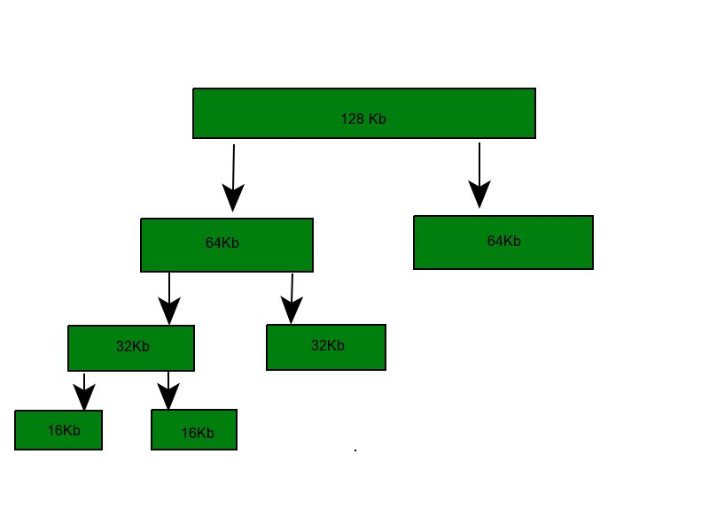
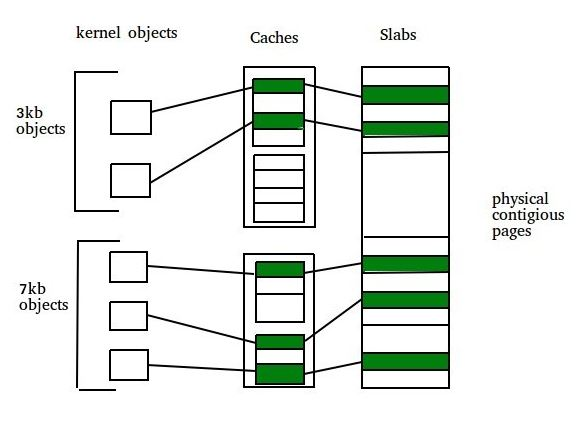

# Allocating kernel memory (buddy system and slab system)
Allocating kernel memory is the process of managing memory used by the operating system’s kernel. Since the kernel runs critical tasks and needs memory frequently, allocation must be fast, efficient, and minimize fragmentation. Common strategies include the Buddy System (general-purpose block allocation) and the Slab System (object-based allocation).

### 1. Buddy system -

Buddy Allocation System divides a large memory block into smaller power-of-two blocks called buddies to satisfy a request. If needed, a block keeps splitting until the required size is reached. When freed, buddies can merge back into larger blocks, making memory reuse efficient.

Example - If the request of 25Kb is made then block of size 32Kb is allocated.

## Four Types of Buddy System -

1. Binary buddy system
2. Fibonacci buddy system
3. Weighted buddy system
4. Tertiary buddy system

### Binary buddy system

- Memory is split into blocks of size power of two.
- On request, the nearest larger block is chosen and split repeatedly into equal halves (buddies) until the required size is reached.
- Freed buddies can merge back to form larger blocks (coalescing).

Example:If total memory = 256KB and request = 25KB nearest power of two is 32KB.

- 256KB split into 128KB + 128KB
- 128KB split into 64KB + 64KB
- 64KB split into 32KB + 32KB
- One 32KB block is allocated (25KB fits inside).

### Fibonacci buddy system

- A variation of the buddy system where memory blocks are divided into sizes based on Fibonacci numbers instead of powers of two.
- Block sizes follow the relation:

> Zi = Z(i-1)+Z(i-2)

Zi = Z(i-1)+Z(i-2)

- Example sequence: 1, 2, 3, 5, 8, 13, 21, 34 …
- On a memory request, the system finds the smallest Fibonacci block that can satisfy it.
- Like binary buddies, free blocks can be merged (coalesced) into larger Fibonacci-sized blocks.

What is coalescing? It is defined as how quickly adjacent buddies can be combined to form larger segments this is known as coalescing. For example, when the kernel releases the C1 unit it was allocated, the system can coalesce C1 and C2 into a 64kb segment. This segment B1 can in turn be coalesced with its buddy B2 to form a 128kb segment. Ultimately we can end up with the original 256kb segment. Drawback - The main drawback in buddy system is internal fragmentation as larger block of memory is acquired then required. For example if a 36 kb request is made then it can only be satisfied by 64 kb segment and remaining memory is wasted.

### 2. Slab Allocation -

A second strategy for allocating kernel memory is known as slab allocation. It eliminates fragmentation caused by allocations and deallocations. This method is used to retain allocated memory that contains a data object of a certain type for reuse upon subsequent allocations of objects of the same type. In slab allocation memory chunks suitable to fit data objects of certain type or size are preallocated. Cache does not free the space immediately after use although it keeps track of data which are required frequently so that whenever request is made the data will reach very fast. Two terms required are:

- Slab - A slab is made up of one or more physically contiguous pages. The slab is the actual container of data associated with objects of the specific kind of the containing cache.
- Cache - Cache represents a small amount of very fast memory. A cache consists of one or more slabs. There is a single cache for each unique kernel data structure.

Example -

- A separate cache for a data structure representing processes descriptors
- Separate cache for file objects
- Separate cache for semaphores etc.

Each cache is populated with objects that are instantiations of the kernel data structure the cache represents. For example the cache representing semaphores stores instances of semaphore objects, the cache representing process descriptors stores instances of process descriptor objects. Implementation - The slab allocation algorithm uses caches to store kernel objects. When a cache is created a number of objects which are initially marked as free are allocated to the cache. The number of objects in the cache depends on size of the associated slab. Example - A 12 kb slab (made up of three contiguous 4 kb pages) could store six 2 kb objects. Initially all objects in the cache are marked as free. When a new object for a kernel data structure is needed, the allocator can assign any free object from the cache to satisfy the request. The object assigned from the cache is marked as used. In linux, a slab may in one of three possible states:

1. Full - All objects in the slab are marked as used
2. Empty - All objects in the slab are marked as free
3. Partial - The slab consists of both

The slab allocator first attempts to satisfy the request with a free object in a partial slab. If none exists, a free object is assigned from an empty slab. If no empty slabs are available, a new slab is allocated from contiguous physical pages and assigned to a cache. Benefits of slab allocator -

- No memory is wasted due to fragmentation because each unique kernel data structure has an associated cache.
- Memory request can be satisfied quickly.
- The slab allocating scheme is particularly effective for managing when objects are frequently allocated or deallocated. The act of allocating and releasing memory can be a time consuming process. However, objects are created in advance and thus can be quickly allocated from the cache. When the kernel has finished with an object and releases it, it is marked as free and return to its cache, thus making it immediately available for subsequent request from the kernel.

- Weighted Buddy System: In a weighted peer system, each memory block is associated with a weight, which represents its size relative to other blocks. When a memory allocation request occurs, the system searches for the appropriate block considering the size of the requested memory and the weight of the available blocks.

- Tertiary Buddy System : In a traditional buddy system, memory is divided into blocks of fixed size, usually a power of 2, and allocated to these blocks but the tertiary buddy system introduces a third memory structure, which allows flexibility large in memory allocation.