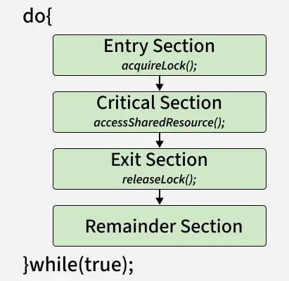

# Critical Section in Synchronization
A critical section is a part of a program where shared resources (like memory, files, or variables) are accessed by multiple processes or threads. To avoid problems such as race conditions and data inconsistency, only one process/thread should execute the critical section at a time using synchronization techniques. This ensures that operations on shared resources are performed safely and predictably.

## Structure of a Critical Section

1. Entry Section

- The process requests permission to enter the critical section.
- Synchronization tools (e.g., mutex, semaphore) are used to control access.

2. Critical Section: The actual code where shared resources are accessed or modified.

3. Exit Section: The process releases the lock or semaphore, allowing other processes to enter the critical section.

4. Remainder Section: The rest of the program that does not involve shared resource access.

## Critical Section Problem

### Shared Resources and Race Conditions

- Shared resources include memory, global variables, files, and databases.
- A [[race-condition|race condition]] occurs when two or more processes attempt to update shared data at the same time, leading to unexpected results. Example: Two bank transactions modifying the same account balance simultaneously without synchronization may lead to incorrect final balance.

It could be visualized using the pseudo-code below

> do{ flag=1; while(flag); // (entry section) // critical section if (!flag) // remainder section} while(true);

do{ flag=1; while(flag); // (entry section) // critical section if (!flag) // remainder section} while(true);

### Requirements of a Solution

A good critical section solution must ensure:

1. Correctness - Shared data should remain consistent.
2. Efficiency - Should minimize waiting and maximize CPU utilization.
3. Fairness - No process should be unfairly delayed or starved.

## Requirements of Critical Section Solutions

### 1. Mutual Exclusion

- At most one process can be inside the critical section at a time.
- Prevents conflicts by ensuring no two processes update the shared resource simultaneously.

### 2. Progress

- If no process is in the critical section, and some processes want to enter, the choice of who enters next should not be postponed indefinitely.
- Ensures that the system continues to make progress rather than getting stuck.

### 3. Bounded Waiting

- There must be a limit on how long a process waits before it gets a chance to enter the critical section.
- Prevents starvation, where one process is repeatedly bypassed while others get to execute.

Example Use Case: Older operating systems or embedded systems where simplicity and reliability outweigh responsiveness.

### Solution to Critical Section Problem :

A simple solution to the critical section can be thought of as shown below,

> acquireLock();Process Critical SectionreleaseLock();

acquireLock();Process Critical SectionreleaseLock();

A thread must acquire a lock prior to executing a critical section. The lock can be acquired by only one thread. There are various ways to implement locks in the above pseudo-code.

## Examples of critical sections in real-world applications

Banking System (ATM or Online Banking)

- Critical Section: Updating an account balance during a deposit or withdrawal.
- Issue if not handled: Two simultaneous withdrawals could result in an incorrect final balance due to race conditions.

Ticket Booking System (Airlines, Movies, Trains)

- Critical Section: Reserving the last available seat.
- Issue if not handled: Two users may be shown the same available seat and both may book it, leading to overbooking.

Print Spooler in a Networked Printer

- Critical Section: Sending print jobs to the printer queue.
- Issue if not handled: Print jobs may get mixed up or skipped if multiple users send jobs simultaneously.

File Editing in Shared Documents (e.g., Google Docs, MS Word with shared access)

- Critical Section: Saving or writing to the shared document.
- Issue if not handled: Simultaneous edits could lead to conflicting versions or data loss.