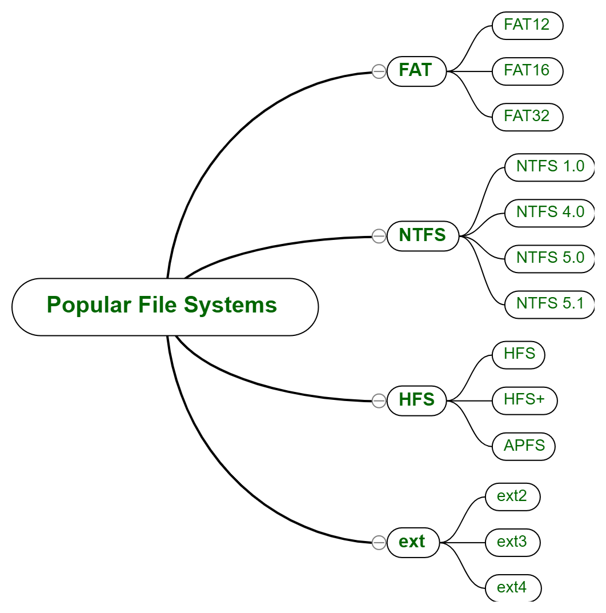
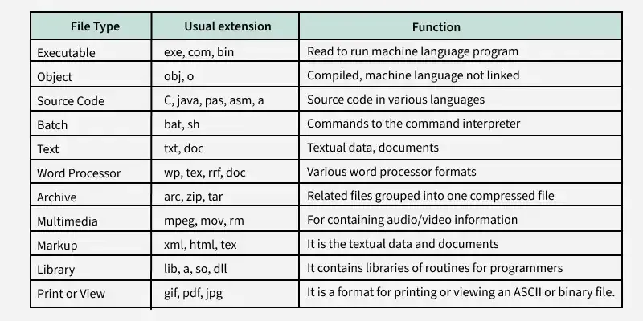

# File Systems in Operating System
File systems are a crucial part of any operating system, providing a structured way to store, organize and manage data on storage devices such as hard drives, SSDs and USB drives.

- User Application: The programs or software that request file operations like read, write, or delete.
- Logical File System: Manages metadata, file names, directories, and access permissions.
- Virtual File System (VFS): Acts as a bridge, allowing different file systems to work under a single interface.
- Physical File System: Handles the actual storage of data blocks on the disk.
- Partition 1, Partition 2, Partition 3: Divisions of the storage device where files are stored physically.

> Note: It acts as a bridge between the operating system and the physical storage hardware, allowing users and applications to perform CRUD Operations on files in an organized and efficient manner.

Note: It acts as a bridge between the operating system and the physical storage hardware, allowing users and applications to perform CRUD Operations on files in an organized and efficient manner.

## Popular File Systems

Some common types of file systems include:

- FAT (File Allocation Table): An older file system used by older versions of Windows and other operating systems.
- NTFS (New Technology File System): A modern file system used by Windows. It supports features such as file and folder permissions, compression and encryption.
- ext (Extended File System): A file system commonly used on Linux and Unix-based operating systems.
- HFS (Hierarchical File System): A file system used by macOS.
- APFS (Apple File System): A new file system introduced by Apple for their Macs and iOS devices.

The name of the file is divided into two parts as shown below:

1. Name
2. Extension, separated by a period.

## Issues Handled By File System

- A free space is created on the hard drive whenever a file is deleted from it.
- To reallocate them to other files, many of these spaces may need to be recovered.
- Choosing where to store the files on the hard disc is the main issue with files one block may or may not be used to store a file.

## File Directories

The collection of files is a file directory and contains information about the files, including attributes, location, etc. Much of this information, is managed by the operating system.

> Note: The directory is itself a file, accessible by various file management routines.

Note: The directory is itself a file, accessible by various file management routines.

### File Types and Their Content

> Note: It may be kept in the disk's non-contiguous blocks. We must keep track of all the blocks where the files are partially located.

Note: It may be kept in the disk's non-contiguous blocks. We must keep track of all the blocks where the files are partially located.

### Advantages of Maintaining Directories

- Efficiency: A file can be located more quickly.
- Naming: It becomes convenient for users as two users can have same name for different files or may have different name for same file.
- Grouping: Logical grouping of files can be done by properties e.g. all java programs, all games etc.

## Structures of Directory

- Single-Level Directory: In this, a single directory is maintained for all the users.
- Two-Level Directory: In this separate directories for each user is maintained.
- Tree-Structured Directory: The directory is maintained in the form of a tree. Searching is efficient and also there is grouping capability. We have absolute or relative path name for a file.

> Read more about Structures of Directory

Read more about Structures of Directory

## File Allocation Methods

There are several types of [[file-allocation-methods|file allocation methods]]. These are mentioned below:

- Continuous Allocation
- Linked Allocation(Non-contiguous allocation)
- Indexed Allocation

> Read more about [[file-allocation-methods|File Allocation Methods]]

Read more about [[file-allocation-methods|File Allocation Methods]]

## Disk Free Space Management

To perform any of the file allocation techniques, it is necessary to know what blocks on the disk are available. Thus to manage unallocated disk space, two common methods are used:

- Bit Tables: This uses a vector containing one bit for each block on the disk. Each entry for a 0 corresponds to a free block and each 1 corresponds to a block in use.
- Free Block List: In this method, each block is assigned a number sequentially and the list of the numbers of all free blocks is maintained in a reserved block of the disk.
- Linked List: Free blocks are linked together in a list. Each free block stores the address of the next free block.
- Boundary Tags: Each block contains a boundary tag indicating its size and whether it is free or occupied.

> Read more about Disk Free Space Management

Read more about Disk Free Space Management