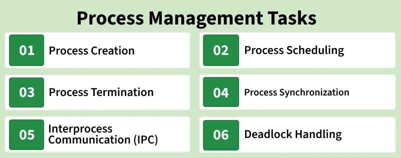

# Introduction of Process Management
Process management is a core function of an Operating System (OS). It deals with creating, scheduling, and coordinating processes to ensure efficient CPU utilization and smooth system performance.

- Single-tasking systems are easy to manage since only one process runs at a time.
- Multiprogramming/multitasking systems are more complex, as multiple processes need to share the CPU efficiently.
- Active processes may share memory and other resources, requiring careful management.
- Process synchronization is necessary when processes interact or communicate to avoid conflicts.

## CPU-Bound vs I/O-Bound Processes

A CPU-bound process requires more CPU time or spends more time in the running state. An I/O-bound process requires more I/O time and less CPU time. An I/O-bound process spends more time in the waiting state.

- CPU is much faster than IO devices, so if a process starts doing IO, the CPU should not be sitting idle and must be assigned to some other process if there are waiting processes.
- The goal of Process Scheduling is to maximize CPU utilization by assigning a process to it if the current running process is doing IO.

## Process Management Tasks

Process management is a key part in operating systems with multi-programming or multitasking.

- Process Creation and Termination: Process creation involves creating a Process ID, setting up Process Control Block, etc. A process can be terminated either by the operating system or by the parent process. Process termination involves clearing all resources allocated to it.
- CPU Scheduling: In a multiprogramming system, multiple processes need to get the CPU. It is the job of Operating System to ensure smooth and efficient execution of multiple processes.
- Deadlock Handling: Making sure that the system does not reach a state where two or more processes cannot proceed due to cyclic dependency on each other.
- Inter-Process Communication: Operating System provides facilities such as shared memory and message passing for cooperating processes to communicate.
- Process Synchronization: Process Synchronization is the coordination of execution of multiple processes in a multiprogramming system to ensure that they access shared resources (like memory) in a controlled and predictable manner.

A process goes through different states before termination and these state changes require different operations on processes by an operating system. After the process finishes its tasks, the operating system ends it and removes its Process Control Block (PCB).

## Context Switching of Process

The process of saving the context of one process and loading the context of another process is known as Context Switching. In simple terms, it is like loading and unloading the process from the running state to the ready state.

## GATE-CS-Questions on Process Management

### Q.1: Which of the following need not necessarily be saved on a context switch between processes? (GATE-CS-2000)

(A) General purpose registers

(B) Translation lookaside buffer

(C) Program counter

(D) All of the above

Answer: (B)

> During a process context switch, the state of the current process, including CPU registers and the program counter, is saved so it can be restored later. Since virtual-to-physical address mappings change between processes, some TLB entries become invalid. The simplest solution is to flush the TLB during a context switch.

During a process context switch, the state of the current process, including CPU registers and the program counter, is saved so it can be restored later. Since virtual-to-physical address mappings change between processes, some TLB entries become invalid. The simplest solution is to flush the TLB during a context switch.

### Q.2: The time taken to switch between user and kernel modes of execution is t1 while the time taken to switch between two processes is t2. Which of the following is TRUE? (GATE-CS-2011)

(A) t1 > t2

(B) t1 = t2

(C) t1 < t2

(D) nothing can be said about the relation between t1 and t2.

Answer: (C)

> Process switching involves a mode switch. Context switching can occur only in kernel mode.

Process switching involves a mode switch. Context switching can occur only in kernel mode.