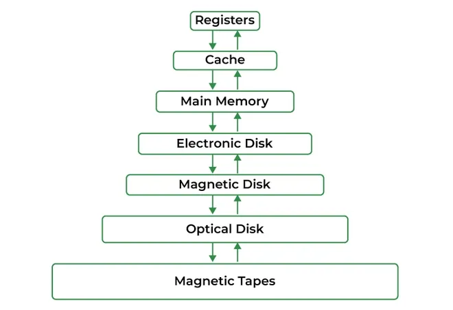
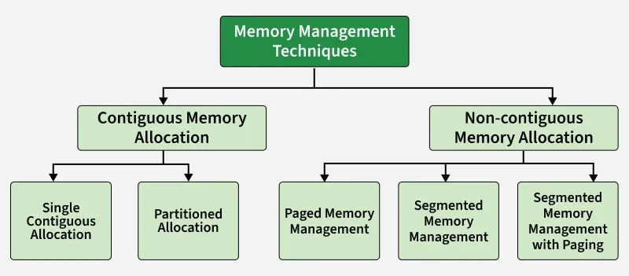

# Memory Management in Operating System
Memory management is the process of controlling and organising a computer’s memory by allocating portions, called blocks, to different executing programmes to improve the overall system performance.

- The most important function of an operating system is to manage primary memory.
- Supports multiple processes simultaneously in memory.
- Protects processes from unauthorised access.
- Enables swapping and virtual memory efficiently.

## Techniques in Memory Allocation

Used by an operating system to efficiently allocate, utilize, and manage memory resources for processes. Various techniques help the operating system manage memory effectively. They can be broadly categorized into:

### Swapping

Swapping is a memory management technique where processes are temporarily moved between main memory and secondary storage to free up memory for other processes.

- Allows multiple processes to run efficiently.
- Lower-priority processes can be swapped out for higher-priority ones.
- Swapped-out processes resume when loaded back into memory.
- Transfer time depends on the amount of data moved.

## Contiguous Memory Allocation

Each process is allocated a single continuous block of memory. All instructions and data of a process are stored in adjacent memory locations.

### Single Contiguous Memory Allocation

Simplest form of memory management. In this technique, the main memory is divided into two parts:

- One part is reserved for the Operating System
- The remaining part is allocated to a single user process

Characteristics

- Only one user process can reside in memory at a time
- The operating system occupies a fixed portion of memory
- No multiprogramming is possible
- Simple to implement and manage

Advantages

- Simple memory management
- No fragmentation issues

Disadvantages

- Poor memory utilization
- No support for multitasking or multiprogramming

### Partitioned Memory Allocation

Main memory is divided into multiple contiguous partitions, and each partition can hold one process. This technique supports multiprogramming.

Partitioned memory allocation is further classified into:

Fixed Partition Allocation

- Memory is divided into a fixed number of partitions
- Each partition has a fixed size
- Each partition can store only one process
- Leads to internal fragmentation
- Once partitions are defined operating system keeps track of the status of memory partitions it is done through a data structure called a partition table.

| Starting Address of Partition | Size of Partition | Status |
| --- | --- | --- |
| 0k | 200k | allocated |
| 200k | 100k | free |
| 300k | 150k | free |
| 450k | 250k | allocated |

Variable Partition Allocation

- Memory is divided into partitions dynamically based on process size
- Reduces internal fragmentation
- Suffers from external fragmentation

Advantages

- Supports multiprogramming
- Better memory utilization compared to single contiguous allocation

Disadvantages

- Fragmentation issues
- Complex memory management compared to single contiguous allocation

## Non-Contiguous Memory Allocation

Memory management technique in which a process is divided into smaller parts and these parts are stored in different, non-adjacent locations in main memory. Unlike contiguous allocation, the entire process does not need to be placed in a single continuous block of memory.

This technique is widely used in modern operating systems because it improves memory utilization and reduces fragmentation problems.

#### Features of Non-Contiguous Memory Allocation

- A process can be stored in multiple memory locations
- Improves utilization of available memory
- Reduces external fragmentation
- Requires address translation using hardware support (MMU)

#### Advantages

- Better memory utilization
- Supports large programs
- Eliminates the need for contiguous free memory

#### Disadvantages

- More complex than contiguous allocation
- Additional overhead for address translation
- Requires extra memory for tables (page table / segment table)

#### Techniques Used in Non-Contiguous Memory Allocation

1. [[paging|Paging]]: Divides a process into fixed-size pages and memory into frames of the same size
2. Segmentation: Divides a process into logical segments of variable size such as code, data, and stack
3. [[segmentation-with-paging|Segmentation with Paging]]: Combines logical [[segmentation-with-paging|segmentation with paging]] to reduce fragmentation

## Memory Management Mechanisms

### Virtual Memory

- Lets a program run even if it is larger than physical RAM.
- Uses disk as an extension of main memory.

### Page Replacement Algorithms(PRA)

- PRA Decide which page to remove from memory when it is full.
- FIFO: Remove the page that came first.
- LRU: Remove the page least recently used.
- Optimal: Remove the page not needed for the longest future time.
- LFU: Remove the page used least frequently.

### Demand Paging

- Demand [[paging|Paging]] loads only the pages a process actually needs into memory.
- Reduces unnecessary memory usage and I/O.

## Memory Management Problems

### Fragmentation

- Fragmentation Occurs when processes are loaded into and removed from memory, resulting in unused memory spaces that cannot be efficiently utilized.
- Internal Fragmentation: Occurs when a process is allocated more memory than it actually needs, leading to wasted space inside the allocated memory block.
- External Fragmentation: Occurs when free memory is divided into small, scattered blocks, making it impossible to allocate a large contiguous block even though enough total free memory exists.

### Thrashing

- [[thrashing|Thrashing]] occurs when the system spends most of its time swapping pages between memory and disk instead of executing processes, causing very low CPU utilization.

## Memory Allocation Strategies

Fixed Partition Allocation: Memory is divided into fixed-sized partitions, and each partition can hold only one process. The OS keeps track of free and occupied partitions using a partition table.

Dynamic Partition Allocation: Memory is divided into variable-sized partitions based on the size of the processes. This helps avoid wastage of memory but can result in fragmentation.

Placement Algorithms: When allocating memory, the OS uses placement algorithms to decide which free block should be assigned to a process:

- First Fit: Allocates the first available partition large enough to hold the process.
- Best Fit: Allocates the smallest available partition that fits the process, reducing wasted space.
- Worst Fit: Allocates the largest available partition, leaving the largest remaining space.
- Next Fit: Similar to First Fit but starts searching for free memory from the point of the last allocation.