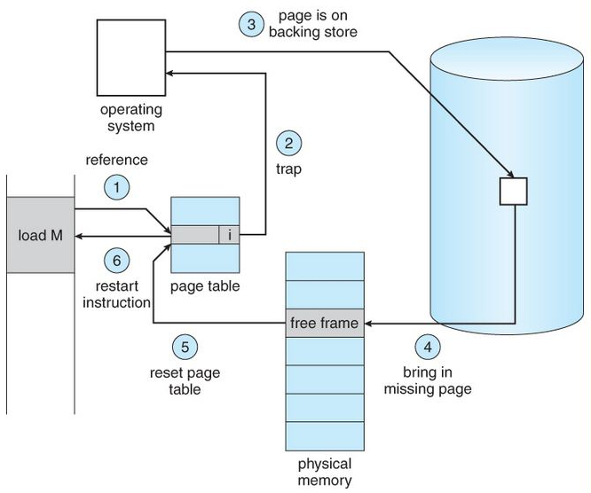

# Page Fault Handling in Operating System
A page fault occurs when a program attempts to access data or code that is in its address space but is not currently located in the system RAM. This triggers a sequence of events where the operating system must manage the fault by loading the required data from secondary storage into RAM.

> Note: Page faults are essential for implementing virtual memory systems that provide the illusion of a larger contiguous memory space.

Note: Page faults are essential for implementing virtual memory systems that provide the illusion of a larger contiguous memory space.

## Steps for Page Fault Handling

- Trap to Kernel: The computer hardware traps to the kernel and program counter (PC) is saved on the stack. Current instruction state information is saved in CPU registers. The hardware detects the page fault when the CPU attempts to access a virtual page that is not currently in physical memory (RAM).
- Save State Information: An assembly program is started to save the general registers and other volatile information to keep the OS from destroying it.
- Determine Cause of Fault: Operating system finds that a page fault has occurred and tries to find out which virtual page is needed. Sometimes hardware register contains this required information. If not, the operating system must retrieve PC, fetch instruction and find out what it was doing when the fault occurred.
- Validate Address: Once virtual address caused page fault is known, system checks to see if address is valid and checks if there is no protection access problem.
- Allocate Page Frame: If the virtual address is valid, the system checks to see if a page frame is free. If no frames are free, the page replacement algorithm is run to remove a page.
- Handle Dirty Pages: If frame selected is dirty, page is scheduled for transfer to disk, context switch takes place, fault process is suspended and another process is made to run until disk transfer is completed.
- Load Page into Memory: As soon as page frame is clean, operating system looks up disk address where needed page is, schedules disk operation to bring it in.
- Update Page Table: When disk interrupt indicates page has arrived, page tables are updated to reflect its position, and frame marked as being in normal state.
- Restore State and Continue Execution: Faulting instruction is backed up to state it had when it began, and PC is reset. Faulting is scheduled, operating system returns to routine that called it. Assembly Routine reloads register and other state information, returns to user space to continue execution.

## Causes of Page Faults

There are several reasons of causing Page faults:

- Demand [[paging|Paging]]: Accessing the page that is not currently loaded in the memory (RAM).
- Invalid Memory Access, it occurs when a program tries to access that memory which is it's beyond access boundaries or not allocated.
- Process Violation: when a process tries to write to a read-only page or otherwise violates memory protection rules.

## Types of Page Fault

- Minor Page Fault: Occurs when the required page is in memory but not in current process's page table.
- Major Page Fault: Occurs when the page is not in memory and must be fetched from disk.
- Invalid Page Fault: It happens when the process tries to access an invalid memory address.

## Impact of Page Faults or System Performance

Page Fault impact the system if it occurs frequently

- [[thrashing|Thrashing]]: If occurrence of page fault is frequent then the system spends more time to handle it than executing the processes, and because of which overall performance also degrades.
- Increased Latency: Fetching pages from disk takes more time than accessing them in memory, which causes to more delays.
- CPU Utilization: If the Page fault occur excessively than it can reduce CPU Utilization as the processor waits for for memory operations to complete or remain idle which is not efficient.