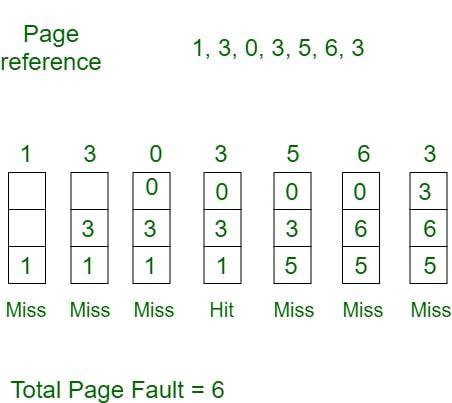
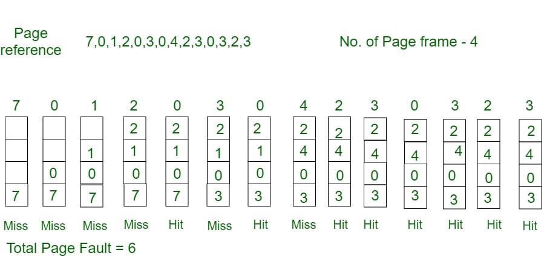
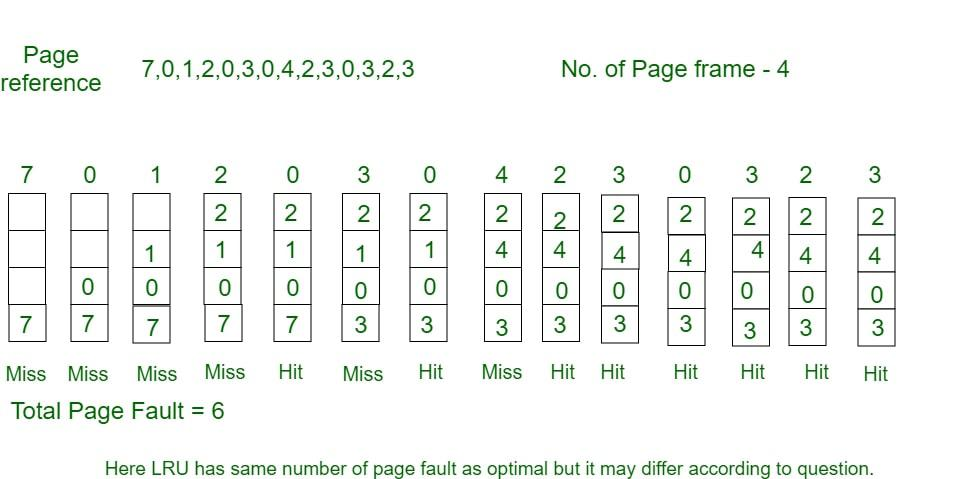
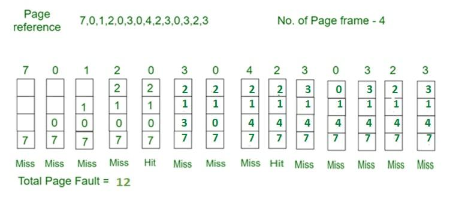

# Page Replacement Algorithms in Operating Systems
In an operating system that uses [[paging]], a page replacement algorithm is needed when a page fault occurs and no free page frame is available. In this case, one of the existing pages in memory must be replaced with the new page.

The virtual memory manager performs this by:

1. Selecting a victim page using a page replacement algorithm.
2. Marking its page table entry as “not present.”
3. If the page was modified (dirty), writing it back to disk before replacement.

The efficiency of a page replacement algorithm directly affects the page fault rate, which in turn impacts system performance.

## Common Page Replacement Techniques

- First In First Out (FIFO)
- Optimal Page replacement
- Least Recently Used (LRU)
- Most Recently Used (MRU)

## 1. First In First Out (FIFO)

This is the simplest page replacement algorithm. In this algorithm, the operating system keeps track of all pages in the memory in a queue, the oldest page is in the front of the queue. When a page needs to be replaced page in the front of the queue is selected for removal.

Example 1: Consider page reference string 1, 3, 0, 3, 5, 6, 3 with 3-page frames. Find the number of page faults using FIFO Page Replacement Algorithm.

- Initially, all slots are empty, so when 1, 3, 0 came they are allocated to the empty slots ---> 3 Page Faults.
- When 3 comes, it is already in memory so ---> 0 Page Faults.
- Then 5 comes, it is not available in memory, so it replaces the oldest page slot i.e 1. ---> 1 Page Fault.
- 6 comes, it is also not available in memory, so it replaces the oldest page slot i.e 3 ---> 1 Page Fault.
- Finally, when 3 come it is not available, so it replaces 0 1-page fault.

> Program for Page Replacement Algorithm (FIFO)

Program for Page Replacement Algorithm (FIFO)

## 2. Optimal Page Replacement

In this algorithm, pages are replaced which would not be used for the longest duration of time in the future.

Example: Consider the page references 7, 0, 1, 2, 0, 3, 0, 4, 2, 3, 0, 3, 2, 3 with 4-page frame. Find number of page fault using Optimal Page Replacement Algorithm.

- Initially, all slots are empty, so when 7 0 1 2 are allocated to the empty slots ---> 4 Page faults
- 0 is already there so ---> 0 Page fault. when 3 came it will take the place of 7 because it is not used for the longest duration of time in the future---> 1 Page fault.
- 0 is already there so ---> 0 Page fault. 4 will takes place of 1 ---> 1 Page Fault.

Now for the further page reference string ---> 0 Page fault because they are already available in the memory. Optimal page replacement is perfect, but not possible in practice as the operating system cannot know future requests. The use of Optimal Page replacement is to set up a benchmark so that other replacement algorithms can be analyzed against it.

## 3. Least Recently Used

In this algorithm, page will be replaced which is least recently used.

Example Consider the page reference string 7, 0, 1, 2, 0, 3, 0, 4, 2, 3, 0, 3, 2, 3 with 4-page frames. Find number of page faults using LRU Page Replacement Algorithm.

- Initially, all slots are empty, so when 7 0 1 2 are allocated to the empty slots ---> 4 Page faults.
- 0 is already there so ---> 0 Page fault. when 3 came it will take the place of 7 because it is least recently used ---> 1 Page fault.
- 0 is already in memory so ---> 0 Page fault.
- 4 will takes place of 1 ---> 1 Page Fault.
- Now for the further page reference string ---> 0 Page fault because they are already available in the memory.

> Program for Least Recently Used (LRU) Page Replacement algorithm

Program for Least Recently Used (LRU) Page Replacement algorithm

## 4. Most Recently Used (MRU)

In this algorithm, page will be replaced which has been used recently. Belady's anomaly can occur in this algorithm.

Example 4: Consider the page reference string 7, 0, 1, 2, 0, 3, 0, 4, 2, 3, 0, 3, 2, 3 with 4-page frames. Find number of page faults using MRU Page Replacement Algorithm.

- Initially, all slots are empty, so when 7 0 1 2 are allocated to the empty slots ---> 4 Page faults
- 0 is already their so--> 0 page fault
- when 3 comes it will take place of 0 because it is most recently used ---> 1 Page fault
- when 0 comes it will take place of 3 ---> 1 Page fault
- when 4 comes it will take place of 0 ---> 1 Page fault
- 2 is already in memory so ---> 0 Page fault
- when 3 comes it will take place of 2 ---> 1 Page fault
- when 0 comes it will take place of 3 ---> 1 Page fault
- when 3 comes it will take place of 0 ---> 1 Page fault
- when 2 comes it will take place of 3 ---> 1 Page fault
- when 3 comes it will take place of 2 ---> 1 Page fault

### Related Article

> [[second-chance-or-clock-page-replacement-policy|Second Chance (or Clock) Page Replacement Policy]]

[[second-chance-or-clock-page-replacement-policy|Second Chance (or Clock) Page Replacement Policy]]