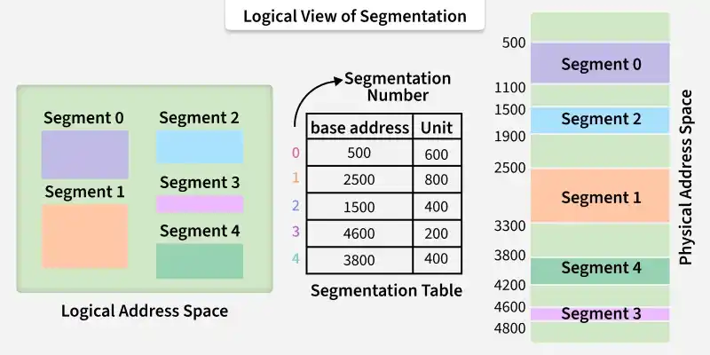
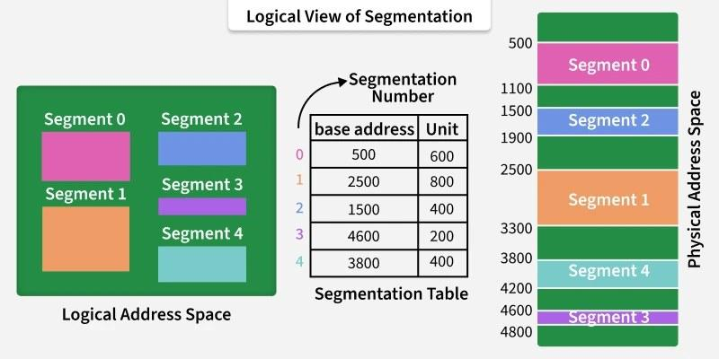
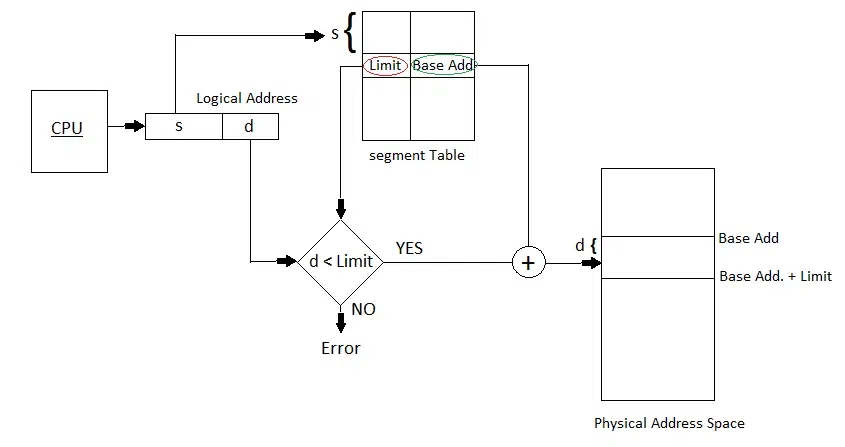

# Segmentation in Operating System
Segmentation is a memory management technique where a process is divided into variable-sized chunks called segments. Unlike [[paging]], segmentation matches the user’s logical view of a program (functions, arrays, modules) to physical memory.

It reflects the user’s view of memory rather than the computer’s physical organization, making it easier to manage and protect processes.

## Key Features of Segmentation

1. Variable-sized divisions: Segments can have different lengths, depending on the program’s requirements.2. Logical division of memory: Segments represent meaningful units like code, stack, data, or modules.3. Two-part address: A logical address consists of:

- Segment number (s): Identifies which segment is being referred to.
- Offset (d): Specifies the exact location within that segment. Logical Address = ⟨Segment number, Offset⟩

4. Protection and sharing: Different segments can have access rights (read, write, execute) and can be shared among processes.5. No internal fragmentation: Since segments are not fixed in size.6. External fragmentation: Can occur when free memory is divided into small scattered blocks.

## Types of Segmentation in Operating Systems

- Virtual Memory Segmentation: Each process is divided into a number of segments, but the segmentation is not done all at once. This segmentation may or may not take place at the run time of the program.
- Simple Segmentation: Each process is divided into a number of segments, all of which are loaded into memory at run time, though not necessarily contiguously.

There is no simple relationship between logical addresses and physical addresses in segmentation. A table stores the information about all such segments and is called Segment Table.

## What is Segment Table?

It maps a two-dimensional Logical address into a one-dimensional Physical address. It's each table entry has:

- Base Address: It contains the starting physical address where the segments reside in memory.
- Segment Limit: Also known as segment offset. It specifies the length of the segment.

Translation of Two-dimensional Logical Address to Dimensional Physical Address.

The address generated by the CPU is divided into:

- Segment number (s): Number of bits required to represent the segment.
- Segment offset (d): Number of bits required to represent the position of data within a segment.

## Advantages of Segmentation in Operating System

- Reduced Internal Fragmentation: Segments are sized as per program needs, minimizing wasted space.
- Smaller Segment Table: Requires less space compared to page tables.
- Better CPU Utilization: Entire modules are loaded at once, improving performance.
- Closer to User’s View: Programs can be divided into logical modules, matching how users think.
- User-Controlled Size: Segment size is defined by the user, unlike fixed page size in [[paging]].
- Security & Separation: Segments help isolate sensitive data and operations.

## Disadvantages of Segmentation in Operating System

- External Fragmentation: Free memory gets scattered, leading to wasted space.
- Overhead: Maintaining segment tables requires extra memory and management.
- Slower Access: Two memory lookups (segment table + main memory) increase access time.
- Complexity: Managing multiple variable-sized segments is harder than [[paging]].
- Segmentation Faults: Errors may occur if a program tries to access memory outside its segment.