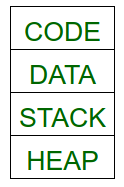
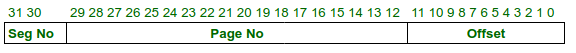
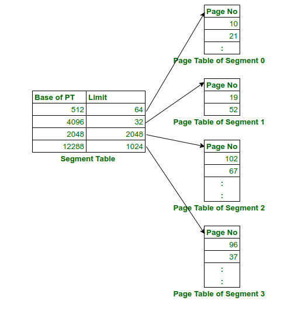
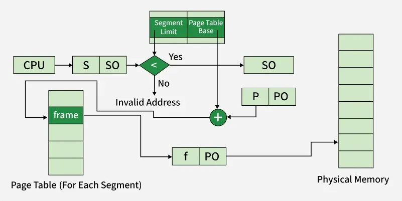

# Segmentation with Paging
Segmentation with Paging is a hybrid memory management technique that combines the advantages of both segmentation and [[paging]].

### How it Works

- A process is generally divided into four segments, namely - code, data, stack and heap.

- Each segment is then divided into fixed-size pages.
- Each segment has its own page table.
- The segment table stores the base address and limit of the segment’s page table.
- The CPU logical address is divided into:

- The memory management unit (MMU) first checks the segment table → finds the base of the page table → then uses the page number to locate the frame → finally combines with offset to form the physical address.

Below is a complete workflow diagram of Segmented [[paging|Paging]]:

Advantages of Segmented [[paging|Paging]]

1. The page table size is reduced as pages are present only for data of segments, hence reducing the memory requirements.
2. Gives a programmers view along with the advantages of [[paging]].
3. Reduces external fragmentation in comparison with segmentation.

Disadvantages of Segmented [[paging|Paging]]

1. Internal fragmentation still exists in pages.
2. Extra hardware is required
3. Translation becomes more sequential increasing the memory access time.
4. External fragmentation occurs because of varying sizes of page tables and varying sizes of segment tables in today's systems.