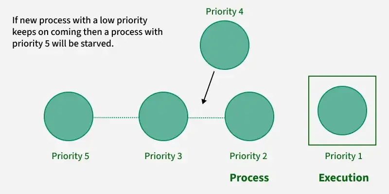
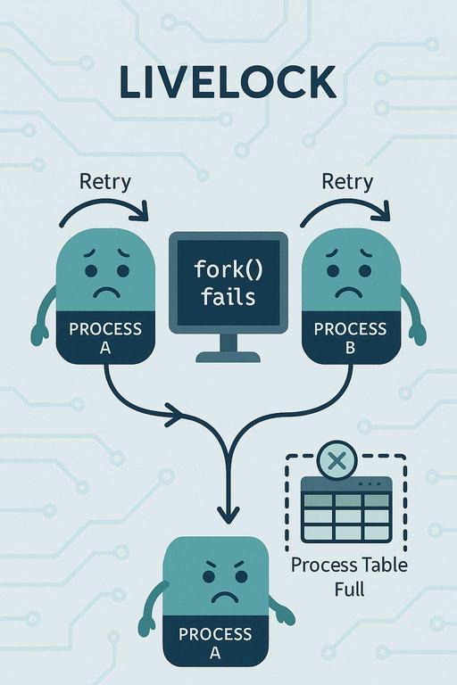

# Starvation and Livelock
Starvation, and livelock are problems that can occur in computer systems when multiple processes compete for resources.

- Starvation occurs when a process is repeatedly denied access to resources because others with higher priority keep getting them first.
- Livelock is when processes keep changing their states to avoid conflict but still fail to make progress, similar to two people constantly stepping aside for each other without passing.

## Starvation

Starvation is the problem that occurs when high priority processes keep executing and low priority processes get blocked for indefinite time. In heavily loaded computer system, a steady stream of higher-priority processes can prevent a low-priority process from ever getting the CPU.

Causes of Starvation :

- Priority Scheduling: If there are always higher-priority processes available, then the lower-priority processes may never be allowed to run.
- Resource Utilization: We see that resources are always used by more significant priority processes and leave a lesser priority process starved.

## Livelock

Livelock is a situation where processes are not blocked (like in deadlock) but they continuously change their state in response to each other, without making any real progress. In short-> In livelock, processes keep moving but never reach completion.

Example: Two processes repeatedly give way to each other while trying to access a resource, so neither proceeds.

> Note:The diagram illustrates a livelock scenario in an operating system where two processes (Process A and Process B) are actively trying to perform an action (fork()), but repeatedly fail because the process table is full.

Note:The diagram illustrates a livelock scenario in an operating system where two processes (Process A and Process B) are actively trying to perform an action (fork()), but repeatedly fail because the process table is full.

Causes of Livelock:

1. Excessive resource preemption : processes keep releasing and re-requesting resources but never acquire them fully.
2. Over-politeness (cooperation issue) : processes continuously yield or back off to let others proceed, but all do the same.
3. Improper scheduling : CPU repeatedly switches processes in a way that none makes real progress.
4. Faulty recovery mechanisms : algorithms designed to avoid deadlock (like automatic rollback/retry) can lead to livelock if retries happen endlessly.
5. Busy-waiting loops : processes actively check and respond to conditions but without advancing execution.

> Example: Imagine a pair of processes using two resources below

Example: Imagine a pair of processes using two resources below

## Difference between Starvation and Livelock

A livelock is similar to a deadlock, except that the states of the processes involved in the livelock constantly change with regard to one another, none progressing. Livelock is a special case of resource starvation.

| Feature | Starvation | Livelock |
| --- | --- | --- |
| Definition | A process waits indefinitely because it is always bypassed by others. | Processes keep executing but fail to make progress. |
| Cause | Unfair resource allocation or scheduling. | Processes continuously respond to each other, preventing progress. |
| Process State | Ready but not scheduled/executed. | Actively executing but not making progress. |
| System Progress | System progresses, but some processes do not. | System is busy, but no real work is done. |
| Example | A low-priority task never gets CPU time. | Two processes constantly yielding to each other. |
| Resolution | Use of fair scheduling (e.g., aging). | Needs better coordination or back-off strategies. |