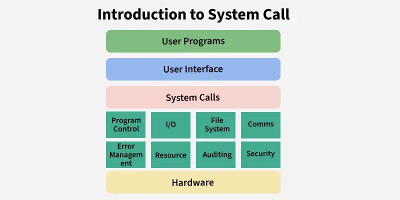

# System Call
User programs cannot directly access hardware or critical OS resources because it would make the system unstable and insecure. To maintain safety, the operating system provides system calls — controlled interfaces that allow user programs to request services from the kernel. These calls act as a gateway between user mode and kernel mode. System Calls are,

- A way for programs to interact with the operating system.
- Provide the services of the operating system to the user programs.
- Only entry points into the kernel are executed in kernel mode.

Example:

- Opening a file in C (fopen) internally uses system calls like open().
- Running a program in Linux uses fork() and exec() system calls.
- Printing on screen uses the write() system call.

## How do System Calls Work?

A system call is a controlled entry point that allows a user program to request a service from the operating system. Here's how it works:

- The user program executes a system call instruction (e.g., using syscall or int 0x80).
- The CPU switches from user mode → kernel mode for safe execution.
- The kernel identifies the system call number and performs the requested operation (file access, process creation, memory allocation, etc.).
- After completing the task, the kernel switches back to user mode.
- The result (success/failure/data) is returned to the program.
- Without system calls, every program would need its own way to access hardware, leading to inconsistent and insecure systems.

System calls do not always cause context switching. They primarily involve a mode switch from user mode to kernel mode. A context switch happens only when the calling process is blocked, not during every system call.

## Types of System Calls

Services provided by an OS are typically related to any kind of operation that a user program can perform like creation, termination, forking, moving, communication, etc. Similar types of operations are grouped into one single system call category. System calls are classified into the following categories:

> Read more about - Different Types of System Calls in OS

Read more about - Different Types of System Calls in OS

- File System: Used to create, open, read, write, and manage files and directories.
- Process Control: Used to create, execute, synchronize, and terminate processes.
- Memory Management: Used to allocate, deallocate, and manage memory for processes.
- Interprocess Communication (IPC): Used for data exchange and communication between different processes.
- Device Management: Used to request and release devices, and to perform read/write operations on them.