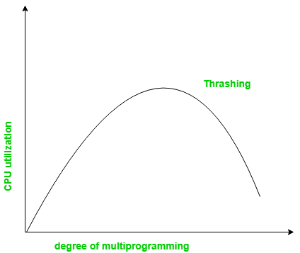
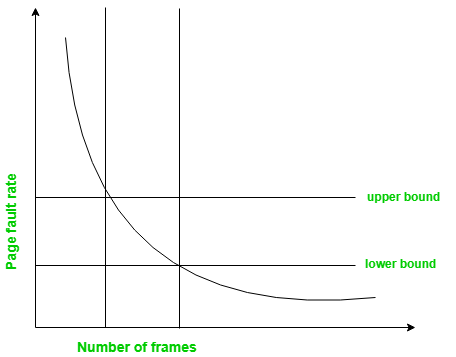

# Thrashing
Thrashing occurs when the operating system spends more time swapping pages between main memory and disk than executing processes. This leads to excessive page faults and a significant drop in CPU utilization.

The cycle works like this:

- High degree of multiprogramming: Too many processes are loaded into memory.
- Lack of frames: Each process gets fewer frames than needed.
- Page replacement policy: Frequent replacements increase page faults.

This repeated cycle of low CPU utilization → more processes → more page faults is called Thrashing.

### Locality Model

The concept of locality of reference helps explain thrashing:

- A locality is a set of pages that a program actively uses together.
- For example, when a function is called, instructions, local variables, and global references define a locality.
- If the number of frames allocated to a process covers its current locality → few page faults.
- If frames are fewer than the locality size → frequent page faults → thrashing.

Thrashing happens when active localities of multiple processes cannot fit into memory simultaneously.

## Techniques to Handle Thrashing

### 1. Working Set Model

Based on the Locality Model: a process uses a set of pages (locality) actively at a time.

- If enough frames are allocated to cover the current locality few page faults.
- If frames < locality size process will thrash.
- Working Set (WSSᵢ) = pages referenced in the last Δ references (window size).
- Total demand: D = Σ WSSᵢ

Cases:

1. If D > m (m = available frames) i.e Thrashing occurs.
2. If D ≤ m i.e No thrashing.

Accuracy depends on Δ:

- Large Δ, overlapping working sets.
- Small Δ, locality may not be fully captured.

### 2. Page Fault Frequency

PFF is a technique to control thrashing by directly monitoring the page fault rate of processes.

Working:

1. Define an upper limit and a lower limit for acceptable page fault rate.
2. If fault rate > upper limit, give more frames to the process.
3. If fault rate < lower limit, take away frames.
4. If no free frames are available suspend some processes and reallocate frames.