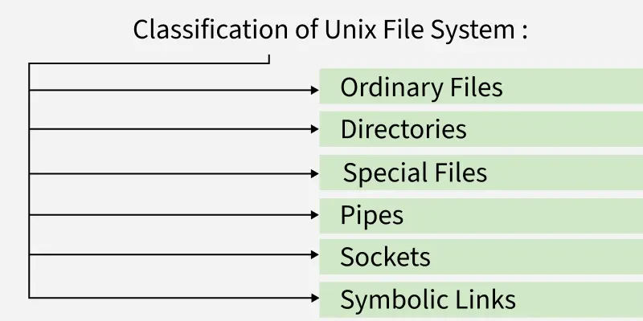

# Unix File System
Unix (UNiplexed Information Computing System) File System is a logical method of organizing and storing large amounts of information in a way that makes it easy to manage. A file is the smallest unit in which the information is stored. Unix file system has several important features.

- All data in Unix is organized into files. All files are organized into directories.
- These directories are organized into a tree-like structure called the file system.
- Files in Unix System are organized into multi-level hierarchy structure known as a directory tree.
- At the very top of the file system is a directory called "root" which is represented by a "/". All other files are "descendants" of root.
- Unix file system also uses a set of permissions to control access to files and directories.

> Note: The Unix file system uses a directory hierarchy that allows for easy navigation and organization of files. Directories can contain both files and other directories, and each file or directory has a unique name.

Note: The Unix file system uses a directory hierarchy that allows for easy navigation and organization of files. Directories can contain both files and other directories, and each file or directory has a unique name.

## File on Unix Operating System

In Unix everything is treated as a file, even devices are also treated as a special file. Every file on a Unix System has a Unique Inode. All devices are represented by files called special files that are located in/dev directory. These are access in the same way as regular file. Device files has two category:

- Block Special File: Here data gets transfer in terms of block.
- Character Special File: Here data gets transfer by stream of bits in sequential order like keyboard.

> Note: Processes access files by well defined set of [[system-call|system call]]. Files can be specifies by a character string called as path name. Each Pathname is unique and it is converted to an Inode.

Note: Processes access files by well defined set of [[system-call|system call]]. Files can be specifies by a character string called as path name. Each Pathname is unique and it is converted to an Inode.

## Directories or Files and their Description

| NAME | DESCRIPTION |
| --- | --- |
| / | The slash / character alone denotes the root of the filesystem tree. |
| /bin | Stands for "binaries" and contains certain fundamental utilities, such as ls or cp, which are generally needed by all users. |
| /boot | Contains all the files that are required for successful booting process. |
| /dev | Stands for "devices". Contains file representations of peripheral devices and pseudo-devices. |
| /etc | Contains system-wide configuration files and system databases. Originally also contained "dangerous maintenance utilities" such as init, but these have typically been moved to /sbin or elsewhere. |
| /home | Contains the home directories for the users. |
| /lib | Contains system libraries, and some critical files such as kernel modules or device drivers. |
| /media | Default mount point for removable devices, such as USB sticks, media players, etc. |
| /mnt | Stands for "mount". Contains filesystem mount points. These are used, for example, if the system uses multiple hard disks or hard disk partitions. It is also often used for remote (network) filesystems, CD-ROM/DVD drives, and so on. |
| /proc | procfs virtual filesystem showing information about processes as files. |
| /root | The home directory for the superuser "root" - that is, the system administrator. This account's home directory is usually on the initial filesystem, and hence not in /home (which may be a mount point for another filesystem) in case specific maintenance needs to be performed, during which other filesystems are not available. Such a case could occur, for example, if a hard disk drive suffers physical failures and cannot be properly mounted. |
| /tmp | A place for temporary files. Many systems clear this directory upon startup; it might have tmpfs mounted atop it, in which case its contents do not survive a reboot, or it might be explicitly cleared by a startup script at boot time. |
| /usr | Originally the directory holding user home directories, its use has changed. It now holds executables, libraries, and shared resources that are not system critical, like the X Window System, KDE, Perl, etc. However, on some Unix systems, some user accounts may still have a home directory that is a direct subdirectory of /usr, such as the default as in Minix. (on modern systems, these user accounts are often related to server or system use, and not directly used by a person). |
| /usr/bin | This directory stores all binary programs distributed with the operating system not residing in /bin, /sbin or (rarely) /etc. |
| /usr/include | Stores the development headers used throughout the system. Header files are mostly used by the #include directive in C/C++ programming language. |
| /usr/lib | Stores the required libraries and data files for programs stored within /usr or elsewhere. |
| /var | A short for "variable." A place for files that may change often - especially in size, for example e-mail sent to users on the system, or process-ID lock files. |
| /var/log | Contains system log files. |
| /var/mail | The place where all the incoming mails are stored. Users (other than root) can access their own mail only. Often, this directory is a symbolic link to /var/spool/mail. |
| /var/spool | Spool directory. Contains print jobs, mail spools and other queued tasks. |
| /var/tmp | A place for temporary files which should be preserved between system reboots. |

NAME

DESCRIPTION

The slash / character alone denotes the root of the filesystem tree.

/bin

Stands for "binaries" and contains certain fundamental utilities, such as ls or cp, which are generally needed by all users.

/boot

Contains all the files that are required for successful booting process.

/dev

Stands for "devices". Contains file representations of peripheral devices and pseudo-devices.

/etc

Contains system-wide configuration files and system databases. Originally also contained "dangerous maintenance utilities" such as init, but these have typically been moved to /sbin or elsewhere.

/home

Contains the home directories for the users.

/lib

Contains system libraries, and some critical files such as kernel modules or device drivers.

/media

Default mount point for removable devices, such as USB sticks, media players, etc.

/mnt

Stands for "mount". Contains filesystem mount points. These are used, for example, if the system uses multiple hard disks or hard disk partitions. It is also often used for remote (network) filesystems, CD-ROM/DVD drives, and so on.

/proc

procfs virtual filesystem showing information about processes as files.

/root

The home directory for the superuser "root" - that is, the system administrator. This account's home directory is usually on the initial filesystem, and hence not in /home (which may be a mount point for another filesystem) in case specific maintenance needs to be performed, during which other filesystems are not available. Such a case could occur, for example, if a hard disk drive suffers physical failures and cannot be properly mounted.

/tmp

A place for temporary files. Many systems clear this directory upon startup; it might have tmpfs mounted atop it, in which case its contents do not survive a reboot, or it might be explicitly cleared by a startup script at boot time.

/usr

Originally the directory holding user home directories, its use has changed. It now holds executables, libraries, and shared resources that are not system critical, like the X Window System, KDE, Perl, etc. However, on some Unix systems, some user accounts may still have a home directory that is a direct subdirectory of /usr, such as the default as in Minix. (on modern systems, these user accounts are often related to server or system use, and not directly used by a person).

/usr/bin

This directory stores all binary programs distributed with the operating system not residing in /bin, /sbin or (rarely) /etc.

/usr/include

Stores the development headers used throughout the system. Header files are mostly used by the #include directive in C/C++ programming language.

/usr/lib

Stores the required libraries and data files for programs stored within /usr or elsewhere.

/var

A short for "variable." A place for files that may change often - especially in size, for example e-mail sent to users on the system, or process-ID lock files.

/var/log

Contains system log files.

/var/mail

The place where all the incoming mails are stored. Users (other than root) can access their own mail only. Often, this directory is a symbolic link to /var/spool/mail.

/var/spool

Spool directory. Contains print jobs, mail spools and other queued tasks.

/var/tmp

A place for temporary files which should be preserved between system reboots.

## Types of Unix Files

The UNIX files system contains several different types of files

### 1. Ordinary Files

An ordinary file is a file on the system that contains data, text, or program instructions.

- Used to store your information, such as some text you have written or an image you have drawn. This is the type of file that you usually work with.
- Always located within/under a directory file.
- Do not contain other files.

> Note: In long-format output of ls -l, this type of file is specified by the "-" symbol.

Note: In long-format output of ls -l, this type of file is specified by the "-" symbol.

### 2. Directories

Directories store both special and ordinary files. For users familiar with Windows or Mac OS, UNIX directories are equivalent to folders. A directory file contains an entry for every file and subdirectory that it houses.

- Each entry has two components - The Filename & A unique identification number for the file or directory (called the inode number).
- Branching points in the hierarchical tree.
- Used to organize groups of files.
- May contain ordinary files, special files or other directories.
- Never contain "real" information which you would work with (such as text). Basically, just used for organizing files.
- All files are descendants of the root directory, ( named / ) located at the top of the tree.

> Note: In long-format output of ls -l , this type of file is specified by the "d" symbol.

Note: In long-format output of ls -l , this type of file is specified by the "d" symbol.

### 3. Special Files

Used to represent a real physical device such as a printer, tape drive or terminal, used for Input/Output (I/O) operations. On UNIX systems there are two flavors of special files for each device, character special files and block special files :

- When a character special file is used for device Input/Output(I/O), data is transferred one character at a time. This type of access is called raw device access.
- When a block special file is used for device Input/Output(I/O), data is transferred in large fixed-size blocks. This type of access is called block device access.
- For terminal devices, it's one character at a time.
- For disk devices though, raw access means reading or writing in whole chunks of data - blocks, which are native to your disk.

> Note: In long-format output of ls -l, character special files are marked by the "c" symbol and block special files are marked by the "b" symbol.

Note: In long-format output of ls -l, character special files are marked by the "c" symbol and block special files are marked by the "b" symbol.

### 4. Pipes

UNIX allows you to link commands together using a pipe. The pipe acts a temporary file which only exists to hold data from one command until it is read by another.

- A Unix pipe provides a one-way flow of data.
- The output or result of the first command sequence is used as the input to the second command sequence.
- To make a pipe, put a vertical bar (|) on the command line between two commands.

> Note: who | wc -l In long-format output of ls -l , named pipes are marked by the "p" symbol.

Note: who | wc -l In long-format output of ls -l , named pipes are marked by the "p" symbol.

### 5. Sockets

A Unix socket (or Inter-process communication socket) is a special file which allows for advanced inter-process communication.

- A Unix Socket is used in a client-server application framework.
- In essence, it is a stream of data, very similar to network stream (and network sockets), but all the transactions are local to the filesystem.

> Note: In long-format output of ls -l, Unix sockets are marked by "s" symbol.

Note: In long-format output of ls -l, Unix sockets are marked by "s" symbol.

### 6. Symbolic Link

Symbolic link is used for referencing some other file of the file system. Symbolic link is also known as Soft link. It contains a text form of the path to the file it references.

- To an end user, symbolic link will appear to have its own name, but when you try reading or writing data to this file, it will instead reference these operations to the file it points to.
- If we delete the soft link itself , the data file would still be there.
- If we delete the source file or move it to a different location, symbolic file will not function properly.

> Note: In long-format output of ls -l , Symbolic link are marked by the "l" symbol (that's a lower case L).

Note: In long-format output of ls -l , Symbolic link are marked by the "l" symbol (that's a lower case L).

## Advantages of the Unix file System

- Hierarchical organization: The hierarchical structure of the Unix file system makes it easy to organize and navigate files and directories.
- Robustness: The Unix file system is known for its stability and reliability. It can handle large amounts of data without becoming unstable or crashing.
- Security: The Unix file system uses a set of permissions that allows administrators to control who has access to files and directories.
- Compatibility: The Unix file system is widely used and supported, which means that files can be easily transferred between different Unix-based systems.

## Disadvantages of the Unix file System

- Complexity: The Unix file system can be complex to understand and manage, especially for users who are not familiar with the command line interface.
- Steep Learning Curve: Users who are not familiar with Unix-based systems may find it difficult to learn how to use the Unix file system.
- Lack of User-Friendly Interface: The Unix file system is primarily managed through the command line interface, which may not be as user-friendly as a graphical user interface.
- Limited Support for Certain File Systems: While the Unix file system is compatible with many file systems, there are some file systems that are not fully supported.