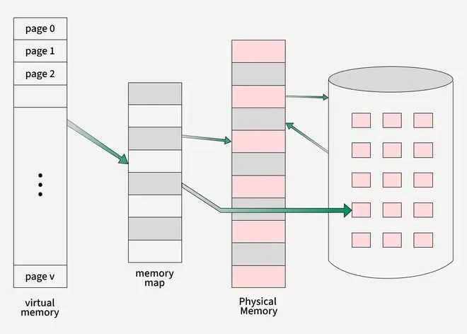

# Virtual Memory in Operating System
Virtual memory is a memory management technique used by operating systems to give the appearance of a large, continuous block of memory to applications, even if the physical memory (RAM) is limited and not necessarily allocated in contiguous manner. The main idea is to divide the process in pages, use disk space to move out the pages if space in main memory is required and bring back the pages when needed.

## Objectives of Virtual Memory

- A program doesn’t need to be fully loaded in memory to run. Only the needed parts are loaded.
- Programs can be bigger than the physical memory available in the system.
- Virtual memory creates the illusion of a large memory, even if the actual memory (RAM) is small.
- It uses both RAM and disk storage to manage memory, loading only parts of programs into RAM as needed.
- This allows the system to run more programs at once and manage memory more efficiently.

### How Virtual Memory Works

- Virtual memory uses both hardware and software to manage memory.
- When a program runs, it uses virtual addresses (not real memory locations).
- The computer system converts these virtual addresses into physical addresses (actual locations in RAM) while the program runs.

## Types of Virtual Memory

In a computer, virtual memory is managed by the Memory Management Unit (MMU), which is often built into the CPU. The CPU generates virtual addresses that the MMU translates into physical addresses. There are two main types of virtual memory:

1. [[paging|Paging]]
2. Segmentation

### 1. Paging

[[paging|Paging]] divides memory into small fixed-size blocks called pages. When the computer runs out of RAM, pages that aren't currently in use are moved to the hard drive, into an area called a swap file. Here,

- The swap file acts as an extension of RAM.
- When a page is needed again, it is swapped back into RAM, a process known as page swapping.
- This ensures that the operating system (OS) and applications have enough memory to run.

Page Fault Service Time: The time taken to service the page fault is called page fault service time. The page fault service time includes the time taken to perform all the above six steps.

- Let Main memory access time is: m
- Page fault service time is: s
- Page fault rate is : p
- Then, Effective memory access time = (p*s) + (1-p)*m

Page and Frame: Page is a fixed size block of data in virtual memory and a frame is a fixed size block of physical memory in RAM where these pages are loaded.

- Think of a page as a piece of a puzzle (virtual memory) While, a frame as the spot where it fits on the board (physical memory).
- When a program runs its pages are mapped to available frames so the program can run even if the program size is larger than physical memory.

### 2. Segmentation

Segmentation divides virtual memory into segments of different sizes. Segments that aren't currently needed can be moved to the hard drive. Here,

- The system uses a segment table to keep track of each segment's status, including whether it's in memory, if it's been modified and its physical address.
- Segments are mapped into a process's address space only when needed.

## Applications of Virtual memory

- Increased Effective Memory: It enables a computer to have more memory than the physical memory using the disk space. This allows for the running of larger applications.
- Memory Isolation: Virtual memory allocates a unique address space to each process, such separation increases safety and reliability based on the fact that one process cannot interact with another.
- Efficient Memory Management: Virtual memory also helps in better utilization of the physical memories through methods that include [[paging]] and segmentation.
- Simplified Program Development: For case of programmers, they can program ‘as if’ there is one big block of memory and this makes the programming easier and more efficient in delivering more complex applications.

## Management of Virtual Memory

Here are 5 key points on how to manage virtual memory:

### 1. Adjust the Page File Size

- Automatic Management: All contemporary OS including Windows contain the auto-configuration option for the size of the empirical page file. But depending on the size of the RAM, they are set automatically, although the user can manually adjust the page file size if required.
- Manual Configuration: For tuned up users, the setting of the custom size can sometimes boost up the performance of the system. The initial size is usually advised to be set to the minimum value of 1.

### 2. Place the Page File on a Fast Drive

- SSD Placement: If this is feasible, the page file should be stored in the SSD instead of the HDD as a storage device. It has better read and write times and the virtual memory may prove beneficial in an SSD.
- Separate Drive: Regarding systems having multiple drives involved, the page file needs to be placed on a different drive than the OS and that shall in turn improve its performance.

### 3. Monitor and Optimize Usage

- Performance Monitoring: Employ the software tools used in monitoring the performance of the system in tracking the amounts of virtual memory.
- Regular Maintenance: Make sure there is no toolbar or other application running in the background, take time and uninstall all the tool bars to free virtual memory.

### 4. Disable Virtual Memory for SSD

- Sufficient RAM: If for instance your system has a big physical memory,
- Example: 16GB and above then it would be advised to freeze the page file in order to minimize SSD usage. But it should be done, carefully and only if the additional signals that one decides to feed into his applications should not likely use all the available RAM.

### 5. Optimize System Settings

- System Configuration: Change some general properties of the system concerning virtual memory efficiency. This also involves enabling additional control options in Windows.
- Regular Updates: Ensure that your drivers are run in their newest version because new releases contain some enhancements and issues regarding memory management.

### Benefits of Using Virtual Memory

- Supports Multiprogramming & Larger Programs : Virtual memory allows multiple processes to reside in memory at once by using demand [[paging]]. Even programs larger than physical memory can be executed efficiently.
- Maximizes Application Capacity : With virtual memory, systems can run more applications simultaneously, including multiple large ones. It also allows only portions of programs to be loaded at a time, improving speed and reducing memory overhead.
- Eliminates Physical Memory Limitations : There's no immediate need to upgrade RAM as virtual memory compensates using disk space.
- Boosts Security & Isolation : By isolating the memory space for each process, virtual memory enhances system security. This prevents interference between applications and reduces the risk of data corruption or unauthorized access.
- Improves CPU & System Performance: Virtual memory helps the CPU by managing logical partitions and memory usage more effectively. It allows for cost-effective, flexible resource allocation, keeping CPU workloads optimized and ensuring smoother multitasking.
- Enhances Memory Management Efficiency : Virtual memory automates memory allocation, including moving data between RAM and disk without user intervention. It also avoids external fragmentation, using more of the available memory effectively and simplifying OS-level memory management.

### Limitation of Virtual Memory

- Slower Performance: Virtual memory can slow down the system, because it often needs to move data between RAM and the hard drive.
- Risk of Data Loss: There is a higher risk of losing data if something goes wrong, like a power failure or hard disk crash, while the system is moving data between RAM and the disk.
- More Complex System: Managing virtual memory makes the operating system more complex. It has to keep track of both real memory (RAM) and virtual memory and make sure everything is in the right place.

> Read more about - Virtual Memory Questions

Read more about - Virtual Memory Questions

## Virtual Memory vs Physical Memory

| Feature | Virtual Memory | Physical Memory (RAM) |
| --- | --- | --- |
| Definition | An abstraction that extends the available memory by using disk storage | The actual hardware (RAM) that stores data and instructions currently being used by the CPU |
| Location | On the hard drive or SSD | On the computer's motherboard |
| Speed | Slower (due to disk I/O operations) | Faster (accessed directly by the CPU) |
| Capacity | Larger, limited by disk space | Smaller, limited by the amount of RAM installed |
| Cost | Lower (cost of additional disk storage) | Higher (cost of RAM modules) |
| Data Access | Indirect (via [[paging]] and swapping) | Direct (CPU can access data directly) |
| Volatility | Non-volatile (data persists on disk) | Volatile (data is lost when power is off) |