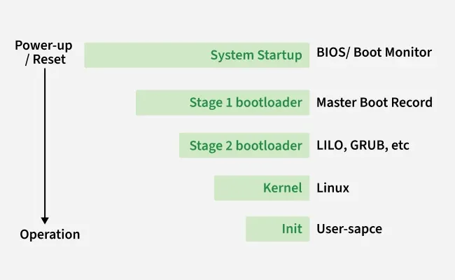
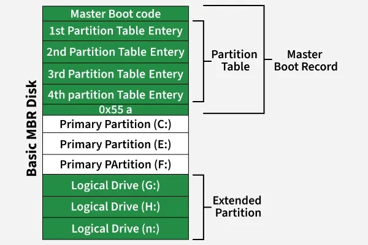

# What happens when we turn on computer?
A computer without a running program is nothing more than an inert collection of electronic components. The true magic begins the moment we press the power button, a chain reaction of events unfolds - from hardware checks to firmware initialization, boot loader execution, and operating system startup.

> Note: The boot process may be invisible to most users, but it is one of the most critical foundations of modern computing.

Note: The boot process may be invisible to most users, but it is one of the most critical foundations of modern computing.

## Steps of Boot Process

Behind the scenes, a series of well-defined steps take place that bring the system from an inactive state to a fully functional machine running its operating system (OS). This sequence is known as the boot process.

### 1. Power Supply Initialization

The process begins when the power supply unit (PSU) sends electricity to the computer’s essential components such as:

- Motherboard
- Processor (CPU)
- Memory (RAM)
- Hard drive or SSD
- Cooling fans

> Note: At this stage, the components receive stable power so they can operate correctly.

Note: At this stage, the components receive stable power so they can operate correctly.

### 2. BIOS/UEFI Startup and POST

Modern computers contain a BIOS (Basic Input/Output System) or UEFI (Unified Extensible Firmware Interface) firmware chip. This firmware is responsible for:

- Power-On Self-[[test|Test]] (POST): The POST checks whether critical hardware components like RAM, CPU, video card, and storage devices are functioning correctly.
- Error Handling: If an issue is detected, the system either displays an error message on the screen or emits a series of beeps called POST beep codes.
- Hardware Initialization: The BIOS/UEFI configures connected devices and prepares the system for the next stage of booting.

### 3. Loading the Boot Loader (MBR and UEFI Process)

Once POST completes successfully, the BIOS/UEFI looks for a bootable device based on the configured boot order (hard drive, USB, DVD, etc.).

- In traditional systems, the BIOS searches the Master Boot Record (MBR) located in the first sector of the boot disk.
- In modern systems, UEFI uses the GUID Partition Table (GPT) and locates the EFI System Partition (ESP).
- The boot sector contains a small program known as the boot loader.

Example:

- GRUB or LILO (Linux)
- Windows Boot Manager (Windows)

> Note: The job of the boot loader is to load the actual operating system kernel into memory.

Note: The job of the boot loader is to load the actual operating system kernel into memory.

### 4. Kernel and Init Process

After the boot loader runs, the OS kernel is loaded into RAM. The kernel is the core of the operating system and performs tasks such as:

- Managing CPU, memory, and hardware devices
- Initializing system drivers
- Preparing user space
- The final step of kernel initialization is to start the init process, which decides the system’s run level.

Example:

- Runlevel 3: Multiuser mode with networking (text-based)
- Runlevel 5: Multiuser mode with GUI and display manager

> Note: Modern systems often use systemd or upstart instead of the traditional SysV init.

Note: Modern systems often use systemd or upstart instead of the traditional SysV init.

### 5. Starting System Services and Daemons

The init/systemd process then launches background services known as daemons, such as:

- Networking services
- Printing services
- Security services
- Graphical display manager (X server or Wayland)

> Note: At this point, the system either displays a login screen (GUI) or a command-line login prompt.

Note: At this point, the system either displays a login screen (GUI) or a command-line login prompt.

### 6. User Login and Desktop Environment

Finally, after the user logs in, the OS loads the desktop environment (such as Windows Desktop, macOS Finder, or Linux GNOME/KDE). This gives the user a graphical interface to interact with applications and the underlying hardware.

## Functions of BIOS/UEFI During Boot

1. POST: Tests hardware devices to ensure they function properly.
2. MBR/GPT Handling: Locates and loads the boot loader from the storage device.
3. init: It is used to determine the initial run level of the system.
4. System Configuration: Allows users to set time/date, boot order, CPU and memory settings.
5. Security Features: Provides password protection, secure boot, and TPM (Trusted Platform Module) support.