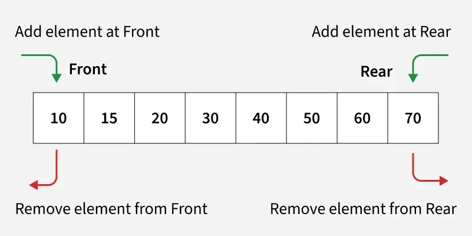
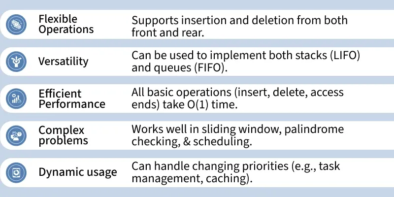

# Introduction of Deque
A Deque (Double-Ended Queue) is a linear data structure that allows insertion and deletion of elements from both ends. Unlike a stack or a queue, where operations are restricted to one end, a deque provides flexibility to add or remove elements at the front as well as the rear. This makes it useful for problems that require both FIFO (First In First Out) and LIFO (Last In First Out) behavior.

## Common Operations of Deque:

In order to make manipulations in a deque, there are certain operations provided to us.

1. insertFront(x) → Insert an element at the front end.
2. insertRear(x) → Insert an element at the rear end.
3. deleteFront() → Delete an element from the front end.
4. deleteRear() → Delete an element from the rear end.
5. getFront() → Retrieve (but don’t remove) the front element.
6. getRear() → Retrieve (but don’t remove) the rear element.
7. isEmpty() → Check if the deque is empty.
8. size() → Return the number of elements currently in the deque.

Refer to this article to know more about Operations on Deque.

## Implementation of Deque:

Deque can be implemented in Different Ways :-

- Implementation of Deque Using Array
- Implementation of Deque Using LinkedList

### Advantage of Deque:

