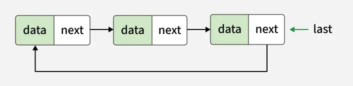
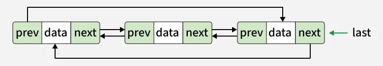
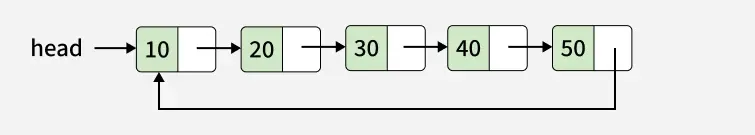

# Introduction to Circular Linked List
A circular linked list is a data structure where the last node points back to the first node, forming a closed loop.

- Structure: All nodes are connected in a circle, enabling continuous traversal without encountering NULL.
- Difference from Regular Linked List: In a regular linked list, the last node points to NULL, whereas in a circular linked list, it points to the first node.
- Uses: Ideal for tasks like scheduling and managing playlists, where smooth and repeated.

`NULL`

`NULL`

### Types of Circular Linked Lists

We can create a circular linked list from both singly linked lists and doubly linked lists. So, circular linked lists are basically of two types:

### 1. Circular Singly Linked List

In Circular Singly Linked List, each node has just one pointer called the "next" pointer. The next pointer of the last node points back to the first node and this results in forming a circle. In this type of Linked list, we can only move through the list in one direction.



### 2. Circular Doubly Linked List:

In circular doubly linked list, each node has two pointers prev and next, similar to doubly linked list. The prev pointer points to the previous node and the next points to the next node. Here, in addition to the last node storing the address of the first node, the first node will also store the address of the last node.



```
Note: Here, we will use the singly linked list to explain the working of circular linked lists.
```

### Representation of a Circular Singly Linked List

Let's take a look on the structure of a circular linked list.


### Create/Declare a Node of Circular Linked List

`class Node {
public:
    int data;
    Node* next;

    // Constructor
    Node(int value) {
        data = value;
        next = nullptr;
    }
};
`

```
class Node {
public:
    int data;
    Node* next;

    // Constructor
    Node(int value) {
        data = value;
        next = nullptr;
    }
};

```

`class Node {
    int data;
    Node next;

    Node(int data){
        this.data = data;
        this.next = null;
    }
}
`

```
class Node {
    int data;
    Node next;

    Node(int data){
        this.data = data;
        this.next = null;
    }
}

```

`class Node:
    def __init__(self, data):
        self.data = data
        self.next = None
`

```
class Node:
    def __init__(self, data):
        self.data = data
        self.next = None

```

`class Node {
    public int data;
    public Node next;

    public Node(int data){
        this.data = data;
        this.next = null;
    }
}
`

```
class Node {
    public int data;
    public Node next;

    public Node(int data){
        this.data = data;
        this.next = null;
    }
}

```

`class Node {
    constructor(data){
        this.data = data;
        this.next = null;
    }
}
`

```
class Node {
    constructor(data){
        this.data = data;
        this.next = null;
    }
}

```

In the code above, each node has data and a pointer to the next node. When we create multiple nodes for a circular linked list, we only need to connect the last node back to the first one.

### Example of Creating a Circular Linked List

Here’s an example of creating a circular linked list with three nodes (10, 20, 30, 40, 50):



### Why have we taken a pointer that points to the last node instead of the first node?

For the insertion of a node at the beginning, we need to traverse the whole list. Also, for insertion at the end, the whole list has to be traversed. If instead of the start pointer, we take a pointer to the last node, then in both cases there won't be any need to traverse the whole list. So insertion at the beginning or at the end takes constant time, irrespective of the length of the list.

### Application of Linked List

### Advantage of Circular Linked List

- Efficient Traversal
- No Null Pointers / References
- Useful for Repetitive Tasks
- Insertion at Beginning or End is O(1)
- Uniform Traversal
- Efficient Memory Utilization

### Disadvantage of Circular Linked List

- Complex Implementation
- Infinite Loop Risk
- Harder to Debug
- Deletion Complexity
- Memory Overhead (for Doubly Circular LL)
- Not Cache Friendly

### Operations on the Circular Linked List

- Insertion : At the Beginning, At the End and At a Specific Position
- Deletion : Removal from different positions